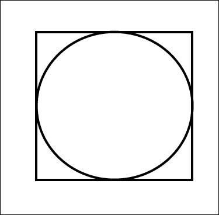
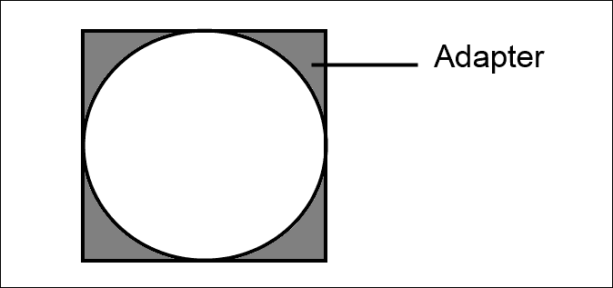

# 第四章：结构模式

在上一章中，我们探讨了多种创建对象的方法，以便优化重用。在本章中，我们将研究结构模式；这些模式关注于通过描述对象可以相互交互的简单方式来简化设计。

再次，我们将限制自己只研究 GoF 书中描述的模式。自 GoF 出版以来，已经确定了许多其他有趣的结构模式，我们将在本书的第二部分中进行研究。

我们将在这里研究的模式有：

+   适配器

+   桥接

+   组合

+   装饰器

+   外观

+   享元

+   代理

我们将再次讨论多年前描述的模式是否仍然适用于不同的语言和不同的时代。

# 适配器

有时需要将圆销子放入方孔中。如果你曾经玩过儿童的形状分类玩具，你可能会发现实际上可以把圆销子放入方孔中。孔并没有完全填满，把销子放进去可能会很困难：



为了改善销子的适配，可以使用适配器。这个适配器完全填满了孔，结果非常完美：



在软件中经常需要类似的方法。我们可能需要使用一个不完全符合所需接口的类。该类可能缺少方法，或者可能有我们希望隐藏的额外方法。在处理第三方代码时经常会出现这种情况。为了使其符合您代码中所需的接口，可能需要使用适配器。

适配器的类图非常简单，如下所示：


实现的接口看起来不符合我们在代码中想要的样子。通常的解决方法是简单地重构实现，使其看起来符合我们的要求。然而，有一些可能的原因无法这样做。也许实现存在于我们无法访问的第三方代码中。还有可能实现在应用程序的其他地方使用，接口正好符合我们的要求。

适配器类是一个薄薄的代码片段，实现所需的接口。它通常包装实现类的私有副本，并通过代理调用它。适配器模式经常用于改变代码的抽象级别。让我们来看一个快速的例子。

## 实施

在 Westeros 的土地上，许多贸易和旅行都是通过船只进行的。乘船旅行不仅比步行或骑马更危险，而且由于风暴和海盗的不断出现，也更加危险。这些船只不是皇家加勒比公司用来在加勒比海周游的那种船只；它们是粗糙的东西，看起来更像是 15 世纪欧洲探险家所驾驶的。

虽然我知道船只存在，但我对它们的工作原理或如何操纵船只几乎一无所知。我想很多人和我一样。如果我们看看 Westeros 的船只接口，它看起来很吓人：

```js
interface Ship{
  SetRudderAngleTo(angle: number);
  SetSailConfiguration(configuration: SailConfiguration);
  SetSailAngle(sailId: number, sailAngle: number);
  GetCurrentBearing(): number;
  GetCurrentSpeedEstimate(): number;
  ShiftCrewWeightTo(weightToShift: number, locationId: number);
}
```

我真的希望有一个更简单的接口，可以抽象掉所有繁琐的细节。理想情况下是这样的：

```js
interface SimpleShip{
  TurnLeft();
  TurnRight();
  GoForward();
}
```

这看起来像是我可能会弄清楚的东西，即使我住在离最近的海洋有 1000 公里远的城市。简而言之，我想要的是对船只进行更高级别的抽象。为了将船只转换为 SimpleShip，我们需要一个适配器。

适配器将具有 SimpleShip 的接口，但它将在 Ship 的包装实例上执行操作。代码可能看起来像这样：

```js
let ShipAdapter = (function () {
  function ShipAdapter() {
    this._ship = new Ship();
  }
  ShipAdapter.prototype.TurnLeft = function () {
    this._ship.SetRudderAngleTo(-30);
    this._ship.SetSailAngle(3, 12);
  };
  ShipAdapter.prototype.TurnRight = function () {
    this._ship.SetRudderAngleTo(30);
    this._ship.SetSailAngle(5, -9);
  };
  ShipAdapter.prototype.GoForward = function () {
    //do something else to the _ship
  };
  return ShipAdapter;
})();
```

实际上，这些功能会更加复杂，但这并不重要，因为我们有一个简单的接口来展示给世界。所呈现的接口也可以设置为限制对基础类型的某些方法的访问。在构建库代码时，适配器可用于隐藏内部方法，只向最终用户呈现所需的有限功能。

使用这种模式，代码可能看起来像这样：

```js
var ship = new ShipAdapter();
ship.GoForward();
ship.TurnLeft();
```

你可能不想在客户端类的名称中使用适配器，因为它泄露了一些关于底层实现的信息。客户端不应该知道它们正在与适配器交谈。

适配器本身可能会变得非常复杂，以调整一个接口到另一个接口。为了避免创建非常复杂的适配器，必须小心。构建几个适配器是完全可以想象的，一个在另一个之上。如果发现适配器变得太大，那么最好停下来检查适配器是否遵循单一责任原则。也就是说，确保每个类只负责一件事。一个从数据库中查找用户的类不应该包含向这些用户发送电子邮件的功能。这责任太大了。复杂的适配器可以被复合对象替换，这将在本章后面探讨。

从测试的角度来看，适配器可以用来完全包装第三方依赖。在这种情况下，它们提供了一个可以挂接测试的地方。单元测试应该避免测试库，但它们可以确保适配器代理了正确的调用。

适配器是简化代码接口的非常强大的模式。调整接口以更好地满足需求在无数地方都是有用的。这种模式在 JavaScript 中肯定很有用。用 JavaScript 编写的应用程序往往会使用大量的小型库。通过将这些库封装在适配器中，我能够限制我直接与库交互的地方的数量；这意味着可以轻松替换这些库。

适配器模式可以稍微修改，以在许多不同的实现上提供一致的接口。这通常被称为桥接模式。

# 桥接

桥梁模式将适配器模式提升到一个新的水平。给定一个接口，我们可以构建多个适配器，每个适配器都充当到不同实现的中介。

我遇到的一个很好的例子是，处理两个提供几乎相同功能并且在故障转移配置中使用的不同服务。两个服务都没有提供应用程序所需的确切接口，并且两个服务提供不同的 API。为了简化代码，编写适配器以提供一致的接口。适配器实现一致的接口并提供填充，以便可以一致地调用每个 API。再举一个形状分类器的比喻，我们可以想象我们有各种不同的销子，我们想用它们来填充方形孔。每个适配器填补了缺失的部分，并帮助我们得到一个良好的适配：


桥梁是一个非常有用的模式。让我们来看看如何实现它：


在前面的图表中显示的适配器位于实现和所需接口之间。它们修改实现以适应所需的接口。

## 实现

我们已经讨论过，在维斯特洛大陆上，人们信仰多种不同的宗教。每个宗教都有不同的祈祷和献祭方式。在正确的时间进行正确的祈祷有很多复杂性，我们希望避免暴露这种复杂性。相反，我们将编写一系列可以简化祈祷的适配器。

我们需要的第一件事是一些不同的神，我们可以向他们祈祷：

```js
class OldGods {
  prayTo(sacrifice) {
    console.log("We Old Gods hear your prayer");
  }
}
Religion.OldGods = OldGods;
class DrownedGod {
  prayTo(humanSacrifice) {
    console.log("*BUBBLE* GURGLE");
  }
}
Religion.DrownedGod = DrownedGod;
class SevenGods {
  prayTo(prayerPurpose) {
    console.log("Sorry there are a lot of us, it gets confusing here. Did you pray for something?");
  }
}
Religion.SevenGods = SevenGods;
```

这些类应该看起来很熟悉，因为它们基本上是在上一章中找到的相同类，它们被用作工厂方法的示例。但是，您可能会注意到，每种宗教的`prayTo`方法的签名略有不同。当构建像这里的伪代码中所示的一致接口时，这可能会成为一个问题：

```js
interface God
{
  prayTo():void;
}
```

那么让我们插入一些适配器，作为我们拥有的类和我们想要的签名之间的桥梁：

```js
class OldGodsAdapter {
  constructor() {
    this._oldGods = new OldGods();
  }
  prayTo() {
    let sacrifice = new Sacrifice();
    this._oldGods.prayTo(sacrifice);
  }
}
Religion.OldGodsAdapter = OldGodsAdapter;
class DrownedGodAdapter {
  constructor() {
    this._drownedGod = new DrownedGod();
  }
  prayTo() {
    let sacrifice = new HumanSacrifice();
    this._drownedGod.prayTo(sacrifice);
  }
}
Religion.DrownedGodAdapter = DrownedGodAdapter;
class SevenGodsAdapter {
  constructor() {
    this.prayerPurposeProvider = new PrayerPurposeProvider();
    this._sevenGods = new SevenGods();
  }
  prayTo() {
    this._sevenGods.prayTo(this.prayerPurposeProvider.GetPurpose());
  }
}
Religion.SevenGodsAdapter = SevenGodsAdapter;
class PrayerPurposeProvider {
  GetPurpose() { }
  }
Religion.PrayerPurposeProvider = PrayerPurposeProvider;
```

这些适配器中的每一个都实现了我们想要的`God`接口，并抽象了处理三种不同接口的复杂性，每种接口对应一个神。

要使用桥梁模式，我们可以编写如下代码：

```js
let god1 = new Religion.SevenGodsAdapter();
let god2 = new Religion.DrownedGodAdapter();
let god3 = new Religion.OldGodsAdapter();

let gods = [god1, god2, god3];
for(let i =0; i<gods.length; i++){
  gods[i].praryTo();
}
```

这段代码使用桥梁为众神提供一致的接口，以便它们可以被视为平等的。

在这种情况下，我们只是包装了单个神并通过代理方法调用它们。适配器可以包装多个对象，这是另一个有用的地方可以使用适配器。如果需要编排一系列复杂的对象，那么适配器可以承担一些责任，为其他类提供更简单的接口。

你可以想象桥梁模式是多么有用。它可以与上一章介绍的工厂方法模式很好地结合使用。

这种模式在 JavaScript 中仍然非常有用。正如我在本节开始时提到的，它对于以一致的方式处理不同的 API 非常有用。我已经用它来交换不同的第三方组件，比如不同的图形库或电话系统集成点。如果您正在使用 JavaScript 在移动平台上构建应用程序，那么桥梁模式将成为您的好朋友，可以帮助您清晰地分离通用代码和特定于平台的代码。因为 JavaScript 中没有接口，所以桥梁模式比其他语言中的适配器更接近 JavaScript。实际上，它基本上是一样的。

桥梁还可以使测试变得更容易。我们可以实现一个虚拟桥梁，并使用它来确保对桥梁的调用是正确的。

# 组合

在上一章中，我提到我们希望避免对象之间的紧密耦合。继承是一种非常强的耦合形式，我建议使用组合代替。组合模式是这种情况的一个特例，其中组合被视为可与组件互换。让我们探讨一下组合模式的工作原理。

以下类图包含了构建复合组件的两种不同方式：


在第一个中，复合组件由各种组件的固定数量构建。第二个组件是由一个不确定长度的集合构建的。在这两种情况下，父组合中包含的组件可以与组合的类型相同。因此，一个组合可以包含其自身类型的实例。

组合模式的关键特征是组件与其子组件的可互换性。因此，如果我们有一个实现了`IComponent`的组合，那么组合的所有组件也将实现`IComponent`。这可能最好通过一个例子来说明。

## 例子

树结构在计算中非常有用。事实证明，分层树可以表示许多事物。树由一系列节点和边组成，是循环的。在二叉树中，每个节点包含左右子节点，直到我们到达称为叶子的终端节点。

虽然维斯特洛的生活很艰难，但也有机会享受宗教节日或婚礼等事物。在这些活动中，通常会大量享用美味食物。这些食物的食谱与您自己的食谱一样。像烤苹果这样的简单菜肴包含一系列成分：

+   烘焙苹果

+   蜂蜜

+   黄油

+   坚果

这些成分中的每一个都实现了一个我们称之为`IIngredient`的接口。更复杂的食谱包含更多的成分，但除此之外，更复杂的食谱可能包含复杂的成分，这些成分本身是由其他成分制成的。

在维斯特洛南部，一道受欢迎的菜肴是一种甜点，与我们所说的提拉米苏非常相似。这是一个复杂的食谱，其中包含以下成分：

+   奶油

+   蛋糕

+   打发奶油

+   咖啡

当然，奶油本身是由以下成分制成的：

+   牛奶

+   糖

+   鸡蛋

+   香草

奶油是一个复合成分，咖啡和蛋糕也是。

组合对象上的操作通常会通过代理传递给所有包含的对象。

## 实现

这段代码展示了一个简单的成分，即叶子节点：

```js
class SimpleIngredient {
  constructor(name, calories, ironContent, vitaminCContent) {
    this.name = name;
    this.calories = calories;
    this.ironContent = ironContent;
    this.vitaminCContent = vitaminCContent;
  }
  GetName() {
    return this.name;
  }
  GetCalories() {
    return this.calories;
  }
  GetIronContent() {
    return this.ironContent;
  }
  GetVitaminCContent() {
    return this.vitaminCContent;
  }
}
```

它可以与具有成分列表的复合成分互换使用：

```js
class CompoundIngredient {
  constructor(name) {
    this.name = name;
    this.ingredients = new Array();
  }
  AddIngredient(ingredient) {
    this.ingredients.push(ingredient);
  }
  GetName() {
    return this.name;
  }
  GetCalories() {
    let total = 0;
    for (let i = 0; i < this.ingredients.length; i++) {
      total += this.ingredients[i].GetCalories();
    }
    return total;
  }
  GetIronContent() {
    let total = 0;
    for (let i = 0; i < this.ingredients.length; i++) {
      total += this.ingredients[i].GetIronContent();
    }
    return total;
  }
  GetVitaminCContent() {
    let total = 0;
    for (let i = 0; i < this.ingredients.length; i++) {
      total += this.ingredients[i].GetVitaminCContent();
    }
    return total;
  }
}
```

复合成分循环遍历其内部成分，并对每个成分执行相同的操作。当然，由于原型模型，无需定义接口。

要使用这种复合成分，我们可以这样做：

```js
let egg = new SimpleIngredient("Egg", 155, 6, 0);
let milk = new SimpleIngredient("Milk", 42, 0, 0);
let sugar = new SimpleIngredient("Sugar", 387, 0,0);
let rice = new SimpleIngredient("Rice", 370, 8, 0);

let ricePudding = new CompoundIngredient("Rice Pudding");
ricePudding.AddIngredient(egg);
ricePudding.AddIngredient(rice);
ricePudding.AddIngredient(milk);
ricePudding.AddIngredient(sugar);

console.log("A serving of rice pudding contains:");
console.log(ricePudding.GetCalories() + " calories");
```

当然，这只显示了模式的一部分。我们可以将米布丁用作更复杂食谱的成分：米布丁馅饼（在维斯特洛有一些奇怪的食物）。由于简单和复合版本的成分具有相同的接口，调用者不需要知道两种成分类型之间有任何区别。

组合是 JavaScript 代码中广泛使用的模式，用于处理 HTML 元素，因为它们是树结构。例如，jQuery 库提供了一个通用接口，如果您选择了单个元素或一组元素。当调用函数时，实际上是在所有子元素上调用，例如：

```js
$("a").hide()
```

这将隐藏页面上的所有链接，而不管调用`$("a")`实际找到多少元素。组合是 JavaScript 开发中非常有用的模式。

# 装饰者

装饰器模式用于包装和增强现有类。使用装饰器模式是对现有组件进行子类化的替代方法。子类化通常是一个编译时操作，是一种紧密耦合。这意味着一旦子类化完成，就无法在运行时进行更改。在存在许多可能的子类化可以组合的情况下，子类化的组合数量会激增。让我们看一个例子。

Westeros 骑士所穿的盔甲可以是非常可配置的。盔甲可以以多种不同的风格制作：鳞甲、板甲、锁子甲等等。除了盔甲的风格之外，还有各种不同的面罩、膝盖和肘部关节，当然还有颜色。由板甲和面罩组成的盔甲的行为与带有面罩的锁子甲是不同的。然而，你可以看到，存在大量可能的组合；明显太多的组合无法显式编码。

我们所做的是使用装饰器模式实现不同风格的盔甲。装饰器使用与适配器和桥接模式类似的理论，它包装另一个实例并通过代理调用。然而，装饰器模式通过将要包装的实例传递给它来在运行时执行重定向。通常，装饰器将作为一些方法的简单传递，对于其他方法，它将进行一些修改。这些修改可能仅限于在将调用传递给包装实例之前执行附加操作，也可能会改变传入的参数。装饰器模式的 UML 表示如下图所示：


这允许对装饰器修改哪些方法进行非常精细的控制，哪些方法保持为简单的传递。让我们来看一下 JavaScript 中该模式的实现。

## 实施

在这段代码中，我们有一个基类`BasicArmor`，然后由`ChainMail`类进行装饰：

```js
class BasicArmor {
  CalculateDamageFromHit(hit) {
    return hit.Strength * .2;
  }
  GetArmorIntegrity() {
    return 1;
  }
}

class ChainMail {
  constructor(decoratedArmor) {
    this.decoratedArmor = decoratedArmor;
  }
  CalculateDamageFromHit(hit) {
    hit.Strength = hit.Strength * .8;
    return this.decoratedArmor.CalculateDamageFromHit(hit);
  }
  GetArmorIntegrity() {
    return .9 * this.decoratedArmor.GetArmorIntegrity();
  }
}
```

`ChainMail`装甲接受符合接口的装甲实例，例如：

```js
export interface IArmor{
  CalculateDamageFromHit(hit: Hit):number;
  GetArmorIntegrity():number;
}
```

该实例被包装并通过代理调用。`GetArmorIntegiry`方法修改了基础类的结果，而`CalculateDamageFromHit`修改了传递给装饰类的参数。这个`ChainMail`类本身可以被装饰多层装饰器，直到实际为每个方法调用调用了一长串方法。当然，这种行为对外部调用者来说是不可见的。

要使用这个装甲装饰器，请看下面的代码：

```js
let armor = new ChainMail(new Westeros.Armor.BasicArmor());
console.log(armor.CalculateDamageFromHit({Location: "head", Weapon: "Sock filled with pennies", Strength: 12}));
```

利用 JavaScript 重写类的单个方法来实现这种模式是很诱人的。事实上，在本节的早期草案中，我本打算建议这样做。然而，这样做在语法上很混乱，不是一种常见的做法。编程时最重要的事情之一是要记住代码必须是可维护的，不仅是对你自己，也是对其他人。复杂性会导致混乱，混乱会导致错误。

装饰器模式是一种对继承过于限制的情况非常有价值的模式。这些情况在 JavaScript 中仍然存在，因此该模式仍然有用。

# Façade

Façade 模式是适配器模式的一种特殊情况，它在一组类上提供了简化的接口。我在适配器模式的部分提到过这样的情景，但只在`SimpleShip`类的上下文中。这个想法可以扩展到提供一个抽象，围绕一组类或整个子系统。Façade 模式在 UML 形式上看起来像下面的图表：


## 实施

如果我们将之前的`SimpleShip`扩展为整个舰队，我们就有了一个创建外观的绝佳示例。如果操纵一艘单独的船很困难，那么指挥整个舰队将更加困难。需要大量微妙的操作，必须对单独的船只下达命令。除了单独的船只外，还必须有一位舰队上将，并且需要在船只之间协调以分发补给。所有这些都可以被抽象化。如果我们有一系列代表舰队方面的类，比如这些：

```js
let Ship = (function () {
  function Ship() {
  }
  Ship.prototype.TurnLeft = function () {
  };
  Ship.prototype.TurnRight = function () {
  };
  Ship.prototype.GoForward = function () {
  };
  return Ship;
})();
Transportation.Ship = Ship;

let Admiral = (function () {
  function Admiral() {
  }
  return Admiral;
})();
Transportation.Admiral = Admiral;

let SupplyCoordinator = (function () {
  function SupplyCoordinator() {
  }
  return SupplyCoordinator;
})();
Transportation.SupplyCoordinator = SupplyCoordinator;
```

那么我们可以构建一个外观，如下所示：

```js
let Fleet = (function () {
   function Fleet() {
  }
  Fleet.prototype.setDestination = function (destination) {
    **//pass commands to a series of ships, admirals and whoever else needs it** 

  };

  Fleet.prototype.resupply = function () {
  };

  Fleet.prototype.attack = function (destination) {
    **//attack a city** 

  };
  return Fleet;
})();
```

外观在处理 API 时非常有用。在细粒度 API 周围使用外观可以创建一个更简单的接口。API 的抽象级别可以提高，使其更符合应用程序的工作方式。例如，如果您正在与 Azure blob 存储 API 交互，您可以将抽象级别从处理单个文件提高到处理文件集。而不是编写以下内容：

```js
$.ajax({method: "PUT",
url: "https://settings.blob.core.windows.net/container/set1",
data: "setting data 1"});

$.ajax({method: "PUT",
url: "https://settings.blob.core.windows.net/container/set2",
data: "setting data 2"});

$.ajax({method: "PUT",
url: "https://settings.blob.core.windows.net/container/set3",
data: "setting data 3"});
```

可以编写一个外观，封装所有这些调用并提供一个接口，如下所示：

```js
public interface SettingSaver{
  Save(settings: Settings); //preceding code in this method
  Retrieve():Settings;
}
```

如您所见，外观在 JavaScript 中仍然很有用，并且应该是您工具箱中保留的模式。

# 蝇量级

拳击中有一个 49-52 公斤之间的轻量级级别，被称为蝇量级。这是最后一个建立的级别之一，我想它之所以被命名为蝇量级，是因为其中的拳击手很小，就像苍蝇一样。

蝇量级模式用于对象实例非常多，而这些实例之间只有轻微差异的情况。在这种情况下，大量通常指的是大约 10,000 个对象，而不是 50 个对象。然而，实例数量的截止点高度依赖于创建对象的成本。

在某些情况下，对象可能非常昂贵，系统在超载之前只需要少数对象。在这种情况下，引入蝇量级在较小数量上将是有益的。为每个对象维护一个完整的对象会消耗大量内存。似乎大部分内存也被浪费地消耗掉了，因为大多数实例的字段具有相同的值。蝇量级提供了一种通过仅跟踪与每个实例中的某个原型不同的值来压缩这些数据的方法。

JavaScript 的原型模型非常适合这种情况。我们可以简单地将最常见的值分配给原型，并在需要时覆盖各个实例。让我们看一个例子。

## 实施

再次回到维斯特洛（你是否为我选择了一个单一的主要问题领域感到高兴？），我们发现军队中充满了装备不足的战斗人员。在这些人中，从将军的角度来看，实际上没有太大的区别。当然，每个人都有自己的生活、抱负和梦想，但在将军眼中，他们都已经成为简单的战斗自动机。将军只关心士兵们打得多好，他们是否健康，是否吃饱。我们可以在这段代码中看到简单的字段集：

```js
let Soldier = (function () {
  function Soldier() {
    this.Health = 10;
    this.FightingAbility = 5;
    this.Hunger = 0;
  }
  return Soldier;
})();
```

当然，对于一支由 10,000 名士兵组成的军队，跟踪所有这些需要相当多的内存。让我们采用另一种方法并使用一个类：

```js
class Soldier {
  constructor() {
    this.Health = 10;
    this.FightingAbility = 5;
    this.Hunger = 0;
  }
}
```

使用这种方法，我们可以将对士兵健康的所有请求推迟到原型。设置值也很容易：

```js
let soldier1 = new Soldier();
let soldier2 = new Soldier();
console.log(soldier1.Health); //10
soldier1.Health = 7;
console.log(soldier1.Health); //7
console.log(soldier2.Health); //10
delete soldier1.Health;
console.log(soldier1.Health); //10
```

您会注意到我们调用删除来删除属性覆盖，并将值返回到父值。

# 代理

本章介绍的最后一个模式是代理。在前一节中，我提到创建对象是昂贵的，我们希望避免创建过多的对象。代理模式提供了一种控制昂贵对象的创建和使用的方法。代理模式的 UML 如下图所示：


正如你所看到的，代理模式反映了实际实例的接口。它被替换为所有客户端中的实例，并且通常包装类的私有实例。代理模式可以在许多地方发挥作用：

+   昂贵对象的延迟实例化

+   保护秘密数据

+   远程方法调用的存根

+   在方法调用之前或之后插入额外的操作

通常一个对象实例化是昂贵的，我们不希望在实际使用之前就创建实例。在这种情况下，代理可以检查它的内部实例，并且如果尚未初始化，则在传递方法调用之前创建它。这被称为延迟实例化。

如果一个类在设计时没有考虑到安全性，但现在需要一些安全性，可以通过使用代理来提供。代理将检查调用，并且只有在安全检查通过的情况下才会传递方法调用。

代理可以简单地提供一个接口，用于调用其他地方调用的方法。事实上，这正是许多网络套接字库的功能，将调用代理回到 Web 服务器。

最后，可能有些情况下，将一些功能插入到方法调用中是有用的。这可能是参数日志记录，参数验证，结果更改，或者其他任何事情。

## 实现

让我们看一个需要方法拦截的 Westeros 示例。通常情况下，液体的计量单位在这片土地的一边和另一边差异很大。在北方，人们可能会买一品脱啤酒，而在南方，人们会用龙来购买。这导致了很多混乱和代码重复，但可以通过包装关心计量的类来解决。

例如，这段代码是用于估算运输液体所需的桶数的桶计算器：

```js
class BarrelCalculator {
  calculateNumberNeeded(volume) {
    return Math.ceil(volume / 157);
  }
}
```

尽管它没有很好的文档记录，但这个版本以品脱作为体积参数。创建一个代理来处理转换：

```js
class DragonBarrelCalculator {
  calculateNumberNeeded(volume) {
    if (this._barrelCalculator == null)
      this._barrelCalculator = new BarrelCalculator();
    return this._barrelCalculator.calculateNumberNeeded(volume * .77);
  }
}
```

同样，我们可能为基于品脱的桶计算器创建另一个代理：

```js
class PintBarrelCalculator {
  calculateNumberNeeded(volume) {
    if (this._barrelCalculator == null)
      this._barrelCalculator = new BarrelCalculator();
    return this._barrelCalculator.calculateNumberNeeded(volume * 1.2);
  }
}
```

这个代理类为我们做了单位转换，并帮助减轻了一些关于单位的混乱。一些语言，比如 F#，支持单位的概念。实际上，它是一种类型系统，覆盖在简单的数据类型上，如整数，防止程序员犯错，比如将表示品脱的数字加到表示升的数字上。在 JavaScript 中，没有这样的能力。然而，使用 JS-Quantities（[`gentooboontoo.github.io/js-quantities/`](http://gentooboontoo.github.io/js-quantities/)）这样的库是一个选择。如果你看一下，你会发现语法非常痛苦。这是因为 JavaScript 不允许操作符重载。看到像将一个空数组添加到另一个空数组一样奇怪的事情（结果是一个空字符串），也许我们可以感谢 JavaScript 不支持操作符重载。

如果我们想要防止在有品脱而认为有龙时意外使用错误类型的计算器，那么我们可以停止使用原始类型，并为数量使用一种类型，一种类似于贫穷人的计量单位：

```js
class PintUnit {
  constructor(unit, quantity) {
    this.quanity = quantity;
  }
}
```

这可以作为代理中的一个保护使用：

```js
class PintBarrelCalculator {
  calculateNumberNeeded(volume) {
    if(PintUnit.prototype == Object.getPrototypeOf(volume))
      //throw some sort of error or compensate
    if (this._barrelCalculator == null)
      this._barrelCalculator = new BarrelCalculator();
    return this._barrelCalculator.calculateNumberNeeded(volume * 1.2);
  }
}
```

正如你所看到的，我们最终得到了基本上与 JS-Quantities 相同的东西，但是以更 ES6 的形式。

代理模式在 JavaScript 中绝对是一个有用的模式。我已经提到它在生成存根时被 Web 套接字库使用，但它在无数其他位置也很有用。

# 提示和技巧

本章介绍的许多模式提供了抽象功能和塑造接口的方法。请记住，每一层抽象都会引入成本。函数调用会变慢，但对于需要理解您的代码的人来说，这也更加令人困惑。工具可以帮助一点，但跟踪一个函数调用穿过九层抽象从来都不是一件有趣的事情。

同时要小心在外观模式中做得太多。很容易将外观转化为一个完全成熟的管理类，这很容易变成一个负责协调和执行一切的上帝对象。

# 总结

在本章中，我们已经看了一些用于构造对象之间交互的模式。它们中的一些模式相互之间相当相似，但它们在 JavaScript 中都很有用，尽管桥接模式实际上被简化为适配器。在下一章中，我们将通过查看行为模式来完成对原始 GoF 模式的考察。

