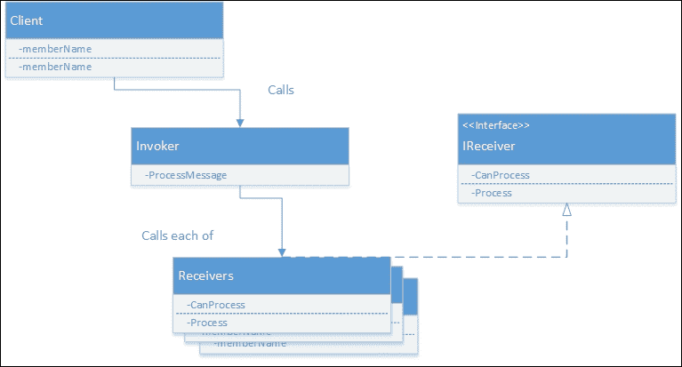
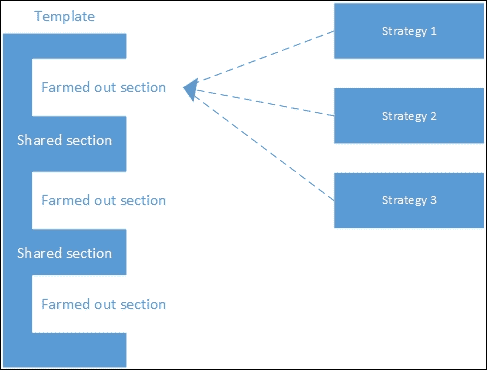

# 第五章：行为模式

在上一章中，我们看了描述对象如何构建以便简化交互的结构模式。

在本章中，我们将看一下 GoF 模式的最后一个，也是最大的分组：行为模式。这些模式提供了关于对象如何共享数据或者从不同的角度来看，数据如何在对象之间流动的指导。

我们将要看的模式如下：

+   责任链

+   命令

+   解释器

+   迭代器

+   中介者

+   备忘录

+   观察者

+   状态

+   策略

+   模板方法

+   访问者

再次，有许多最近确定的模式可能很好地被归类为行为模式。我们将推迟到以后的章节再来看这些模式，而是继续使用 GoF 模式。

# 责任链

我们可以将对象上的函数调用看作是向该对象发送消息。事实上，这种消息传递的思维方式可以追溯到 Smalltalk 的时代。责任链模式描述了一种方法，其中消息从一个类传递到另一个类。一个类可以对消息进行操作，也可以将其传递给链中的下一个成员。根据实现，可以对消息传递应用一些不同的规则。在某些情况下，只允许链中的第一个匹配链接对消息进行操作。在其他情况下，每个匹配的链接都对消息进行操作。有时允许链接停止处理，甚至在消息继续传递下去时改变消息：


让我们看看我们常用的例子中是否能找到这种模式的一个很好的例子：维斯特洛大陆。

## 实现

在维斯特洛大陆，法律制度几乎不存在。当然有法律，甚至有执行它们的城市警卫，但司法系统很少。这片土地的法律实际上是由国王和他的顾问决定的。有时间和金钱的人可以向国王请愿，国王会听取他们的投诉并作出裁决。这个裁决就是法律。当然，任何整天听农民的投诉的国王都会发疯。因此，许多案件在传到国王耳朵之前就被他的顾问们抓住并解决了。

为了在代码中表示这一点，我们需要首先考虑责任链将如何工作。投诉进来，从能够解决问题的最低可能的人开始。如果那个人不能或不愿解决问题，它就会上升到统治阶级的更高级成员。最终问题会达到国王，他是争端的最终仲裁者。我们可以把他看作是默认的争端解决者，当一切都失败时才会被召唤。责任链在下图中可见：


我们将从一个描述可能听取投诉的接口开始：

```js
export interface ComplaintListener{
  IsAbleToResolveComplaint(complaint: Complaint): boolean;
  ListenToComplaint(complaint: Complaint): string;
}
```

接口需要两个方法。第一个是一个简单的检查，看看类是否能够解决给定的投诉。第二个是听取和解决投诉。接下来，我们需要描述什么构成了投诉：

```js
var Complaint = (function () {
  function Complaint() {
    this.ComplainingParty = "";
    this.ComplaintAbout = "";
    this.Complaint = "";
  }
  return Complaint;
})();
```

接下来，我们需要一些不同的类来实现`ComplaintListener`，并且能够解决投诉：

```js
class ClerkOfTheCourt {
  IsInterestedInComplaint(complaint) {
    //decide if this is a complaint which can be solved by the clerk
    if(isInterested())
      return true;
    return false;
  }
  ListenToComplaint(complaint) {
    //perform some operation
    //return solution to the complaint
    return "";
  }
}
JudicialSystem.ClerkOfTheCourt = ClerkOfTheCourt;
class King {
  IsInterestedInComplaint(complaint) {
    return true;//king is the final member in the chain so must return true
  }
  ListenToComplaint(complaint) {
    //perform some operation
    //return solution to the complaint
    return "";
  }
}
JudicialSystem.King = King;
```

这些类中的每一个都实现了解决投诉的不同方法。我们需要将它们链接在一起，确保国王处于默认位置。这可以在这段代码中看到：

```js
class ComplaintResolver {
  constructor() {
    this.complaintListeners = new Array();
     this.complaintListeners.push(new ClerkOfTheCourt());
     this.complaintListeners.push(new King());
  }
  ResolveComplaint(complaint) {
    for (var i = 0; i < this.complaintListeners.length; i++) {
      if         (this.complaintListeners[i].IsInterestedInComplaint(complaint)) {
        return this.complaintListeners[i].ListenToComplaint(complaint);
      }
    }
  }
}
```

这段代码将逐个遍历每个监听器，直到找到一个对听取投诉感兴趣的监听器。在这个版本中，结果会立即返回，停止任何进一步的处理。这种模式有多种变体，其中多个监听器可以触发，甚至允许监听器改变下一个监听器的参数。以下图表显示了多个配置的监听器：



责任链在 JavaScript 中是一个非常有用的模式。在基于浏览器的 JavaScript 中，触发的事件会经过一条责任链。例如，您可以将多个监听器附加到链接的单击事件上，每个监听器都会触发，最后是默认的导航监听器。很可能您在大部分代码中都在使用责任链，甚至自己都不知道。

# 命令

命令模式是一种封装方法参数、当前对象状态以及要调用的方法的方法。实际上，命令模式将调用方法所需的一切打包到一个很好的包中，可以在以后的某个日期调用。使用这种方法，可以发出命令，并等到以后再决定哪段代码将执行该命令。然后可以将此包排队或甚至序列化以供以后执行。具有单一的命令执行点还允许轻松添加功能，如撤消或命令记录。

这种模式可能有点难以想象，所以让我们把它分解成其组成部分：


## 命令消息

命令模式的第一个组件是，可预测地，命令本身。正如我提到的，命令封装了调用方法所需的一切。这包括方法名、参数和任何全局状态。可以想象，在每个命令中跟踪全局状态是非常困难的。如果全局状态在命令创建后发生变化会发生什么？这个困境是使用全局状态的另一个原因，它是有问题的，应该避免使用。

设置命令有几种选择。在简单的一端，只需要跟踪一个函数和一组参数。因为 JavaScript 中函数是一等对象，它们可以很容易地保存到对象中。我们还可以将函数的参数保存到一个简单的数组中。让我们使用这种非常简单的方法构建一个命令。

命令的延迟性质在维斯特洛大陆中有一个明显的隐喻。在维斯特洛大陆中没有快速通信的方法。最好的方法是将小消息附加到鸟上并释放它们。这些鸟倾向于想要返回自己的家，因此每个领主在自己的家中饲养一些鸟，当它们成年时，将它们发送给其他可能希望与他们交流的领主。领主们保留一群鸟并记录哪只鸟将飞往哪个其他领主。维斯特洛国王通过这种方法向他忠诚的领主发送了许多命令。

国王发送的命令包含了领主所需的所有指令。命令可能是像带领你的部队这样的东西，而该命令的参数可能是部队的数量、位置和命令必须执行的日期。

在 JavaScript 中，最简单的表示方法是通过数组：

```js
var simpleCommand = new Array();
simpleCommand.push(new LordInstructions().BringTroops);
simpleCommand.push("King's Landing");
simpleCommand.push(500);
simpleCommand.push(new Date());
```

这个数组可以随意传递和调用。要调用它，可以使用一个通用函数：

```js
simpleCommand0;
```

如您所见，这个函数只适用于具有三个参数的命令。当然，您可以将其扩展到任意数量：

```js
simpleCommand0;
```

附加参数是未定义的，但函数不使用它们，因此没有任何不良影响。当然，这绝不是一个优雅的解决方案。

为每种类型的命令构建一个类是可取的。这样可以确保正确的参数已被提供，并且可以轻松区分集合中的不同类型的命令。通常，命令使用祈使句命名，因为它们是指令。例如，BringTroops、Surrender、SendSupplies 等。

让我们将我们丑陋的简单命令转换成一个合适的类：

```js
class BringTroopsCommand {
  constructor(location, numberOfTroops, when) {
    this._location = location;
    this._numberOfTroops = numberOfTroops;
    this._when = when;
  }
  Execute() {
    var receiver = new LordInstructions();
    receiver.BringTroops(this._location, this._numberOfTroops, this._when);
  }
}
```

我们可能希望实现一些逻辑来确保传递给构造函数的参数是正确的。这将确保命令在创建时失败，而不是在执行时失败。在执行期间可能会延迟，甚至可能延迟几天。验证可能不完美，但即使它只能捕捉到一小部分错误，也是有帮助的。

正如前面提到的，这些命令可以保存在内存中以供以后使用，甚至可以写入磁盘。

## 调用者

调用者是命令模式的一部分，指示命令执行其指令。调用者实际上可以是任何东西：定时事件，用户交互，或者只是流程中的下一步都可能触发调用。在前面的部分中执行`simpleCommand`命令时，我们在扮演调用者的角色。在更严格的命令中，调用者可能看起来像下面这样：

```js
command.Execute()
```

如您所见，调用命令非常容易。命令可以立即调用，也可以在以后的某个时间调用。一种流行的方法是将命令的执行推迟到事件循环的末尾。这可以在节点中完成：

```js
process.nextTick(function(){command.Execute();});
```

函数`process.nextTick`将命令的执行推迟到事件循环的末尾，以便在下次进程没有事情可做时执行。

## 接收者

命令模式中的最后一个组件是接收者。这是命令执行的目标。在我们的例子中，我们创建了一个名为`LordInstructions`的接收者：

```js
class LordInstructions {
  BringTroops(location, numberOfTroops, when) {
    console.log(`You have been instructed to bring ${numberOfTroops} troops to ${location} by ${when}`);
  }
}
```

接收者知道如何执行命令推迟的操作。实际上，接收者可能是任何类，而不必有任何特殊之处。

这些组件共同构成了命令模式。客户端将生成一个命令，将其传递给一个调用者，该调用者可以延迟命令的执行或立即执行，然后命令将作用于接收者。

在构建撤销堆栈的情况下，命令是特殊的，因为它们既有`Execute`方法，也有`Undo`方法。一个将应用程序状态推进，另一个将其推回。要执行撤销，只需从撤销堆栈中弹出命令，执行`Undo`函数，并将其推到重做堆栈上。对于重做，从重做中弹出，执行`Execute`，并推到撤销堆栈上。就是这么简单，尽管必须确保所有状态变化都是通过命令执行的。

《设计模式》一书概述了命令模式的一组稍微复杂的玩家。这在很大程度上是由于我们在 JavaScript 中避免了接口的依赖。由于 JavaScript 中的原型继承模型，该模式变得简单得多。

命令模式是一个非常有用的模式，用于推迟执行某段代码。我们将在《第十章 消息模式》中实际探讨命令模式和一些有用的伴生模式。

# 解释器

解释器模式是一种有趣的模式，因为它允许你创建自己的语言。这可能听起来有点疯狂，我们已经在写 JavaScript 了，为什么还要创建一个新的语言？自《设计模式》一书以来，领域特定语言（DSL）已经有了一些复兴。有些情况下，创建一个特定于某一需求的语言是非常有用的。例如，结构化查询语言（SQL）非常擅长描述对关系数据库的查询。同样，正则表达式已被证明在解析和操作文本方面非常有效。

有许多情况下，能够创建一个简单的语言是有用的。这才是关键：一个简单的语言。一旦语言变得更加复杂，优势很快就会因为创建实际上是一个编译器的困难而丧失。

这种模式与我们到目前为止看到的模式不同，因为它没有真正由模式定义的类结构。你可以按照自己的意愿设计你的语言解释器。

## 示例

对于我们的示例，让我们定义一种语言，用于描述维斯特洛大陆上的历史战斗。这种语言必须简单易懂，便于文职人员编写。我们将从创建一个简单的语法开始：

```js
(aggressor -> battle ground <- defender) -> victor
```

在这里，你可以看到我们只是写出了一个相当不错的语法，让人们描述战斗。罗伯特·拜拉席恩和雷加·坦格利安在三叉戟河之间的战斗将如下所示：

```js
(Robert Baratheon -> River Trident <- RhaegarTargaryen) -> Robert Baratheon
```

使用这种语法，我们希望构建一些能够查询战斗列表的代码。为了做到这一点，我们将依赖于正则表达式。对于大多数语言来说，这不是一个好的方法，因为语法太复杂。在这种情况下，人们可能希望创建一个词法分析器和一个解析器，并构建语法树，然而，到了那个时候，你可能会希望重新审视一下是否创建 DSL 真的是一个好主意。对于我们的语言，语法非常简单，所以我们可以使用正则表达式。

## 实现

我们首先为战斗建立一个 JavaScript 数据模型，如下所示：

```js
class Battle {
  constructor(battleGround, agressor, defender, victor) {
    this.battleGround = battleGround;
    this.agressor = agressor;
    this.defender = defender;
    this.victor = victor;
  }
}
```

接下来我们需要一个解析器：

```js
class Parser {
  constructor(battleText) {
    this.battleText = battleText;
    this.currentIndex = 0;
    this.battleList = battleText.split("\n");
  }
  nextBattle() {
   if (!this.battleList[0])
     return null;
    var segments = this.battleList[0].match(/\((.+?)\s?->\s?(.+?)\s?<-\s?(.+?)\s?->\s?(.+)/);
    return new Battle(segments[2], segments[1], segments[3], segments[4]);
  }
}
```

最好不要太在意那个正则表达式。然而，这个类确实接受一系列战斗（每行一个），并使用`next Battle`，允许解析它们。要使用这个类，我们只需要做以下操作：

```js
var text = "(Robert Baratheon -> River Trident <- RhaegarTargaryen) -> Robert Baratheon";
var p = new Parser(text);
p.nextBattle()
```

这将是输出：

```js
{
  battleGround: 'River Trident',
  agressor: 'Robert Baratheon',
  defender: 'RhaegarTargaryen)',
  victor: 'Robert Baratheon'
}
```

现在可以像查询 JavaScript 中的任何其他结构一样查询这个数据结构了。

正如我之前提到的，实现这种模式没有固定的方式，因此在前面的代码中所做的实现只是提供了一个例子。你的实现很可能会看起来非常不同，这也是可以的。

解释器在 JavaScript 中可能是一个有用的模式。然而，在大多数情况下，这是一个相当少用的模式。JavaScript 中解释的最佳示例是编译为 CSS 的语言。

# 迭代器

遍历对象集合是一个非常常见的问题。以至于许多语言都提供了专门的构造来遍历集合。例如，C#有`foreach`循环，Python 有`for x in`。这些循环构造经常建立在迭代器之上。迭代器是一种模式，提供了一种简单的方法，按顺序选择集合中的下一个项目。

迭代器的接口如下：

```js
interface Iterator{
  next();
}
```

## 实现

在维斯特洛大陆，有一个众所周知的人们排队等候王位的序列，以备国王不幸去世的情况。我们可以在这个集合上设置一个方便的迭代器，如果统治者去世，只需简单地调用`next`：

```js
class KingSuccession {
  constructor(inLineForThrone) {
    this.inLineForThrone = inLineForThrone;
    this.pointer = 0;
  }
  next() {
    return this.inLineForThrone[this.pointer++];
  }
}
```

这是用一个数组初始化的，然后我们可以调用它：

```js
var king = new KingSuccession(["Robert Baratheon" ,"JofferyBaratheon", "TommenBaratheon"]);
king.next() //'Robert Baratheon'
king.next() //'JofferyBaratheon'
king.next() //'TommenBaratheon'
```

迭代器的一个有趣的应用是不仅仅迭代一个固定的集合。例如，迭代器可以用来生成无限集合的顺序成员，比如斐波那契序列：

```js
class FibonacciIterator {
  constructor() {
    this.previous = 1;
    this.beforePrevious = 1;
  }
  next() {
    var current = this.previous + this.beforePrevious;
    this.beforePrevious = this.previous;
    this.previous = current;
    return current;
  }
}
```

这样使用：

```js
var fib = new FibonacciIterator()
fib.next() //2
fib.next() //3
fib.next() //5
fib.next() //8
fib.next() //13
fib.next() //21
```

迭代器是方便的构造，允许探索不仅仅是数组，而且是任何集合，甚至是任何生成的列表。有很多地方可以大量使用这个。

## ECMAScript 2015 迭代器

迭代器是如此有用，以至于它们实际上是 JavaScript 下一代的一部分。ECMAScript 2015 中使用的迭代器模式是一个返回包含`done`和`value`的对象的单个方法。当迭代器在集合的末尾时，`done`为`true`。ECMAScript 2015 迭代器的好处是 JavaScript 中的数组集合将支持迭代器。这开辟了一种新的语法，可以在很大程度上取代`for`循环：

```js
var kings = new KingSuccession(["Robert Baratheon" ,"JofferyBaratheon", "TommenBaratheon"]);
for(var king of kings){
  //act on members of kings
}
```

迭代器是 JavaScript 长期以来一直缺少的一种语法上的美好。ECMAScript-2015 的另一个很棒的特性是生成器。这实际上是一个内置的迭代器工厂。我们的斐波那契序列可以重写如下：

```js
function* FibonacciGenerator (){
  var previous = 1;
  var beforePrevious = 1;
  while(true){
    var current = previous + beforePrevious;
    beforePrevious = previous;
    previous = current;
    yield current;
  }
}
```

这样使用：

```js
var fib = new FibonacciGenerator()
fib.next().value //2
fib.next().value //3
fib.next().value //5
fib.next().value //8
fib.next().value //13
fib.next().value //21
```

# 中介者

在类中管理多对多关系可能是一个复杂的前景。让我们考虑一个包含多个控件的表单，每个控件都想在执行操作之前知道页面上的其他控件是否有效。不幸的是，让每个控件都知道其他控件会创建一个维护噩梦。每次添加一个新控件，都需要修改每个其他控件。

中介者将坐在各种组件之间，并作为一个单一的地方，可以进行消息路由的更改。通过这样做，中介者简化了维护代码所需的复杂工作。在表单控件的情况下，中介者很可能是表单本身。中介者的作用很像现实生活中的中介者，澄清和路由各方之间的信息交流：


## 实现

在维斯特洛大陆，经常需要中介者。中介者经常会死去，但我相信这不会发生在我们的例子中。

在维斯特洛大陆有许多伟大的家族拥有大城堡和广阔的土地。次要领主们向大家族宣誓效忠，形成联盟，经常通过婚姻得到支持。

在协调各家族的时候，大领主将充当中介者，来回传递信息并解决他们之间可能发生的任何争端。

在这个例子中，我们将大大简化各家之间的通信，并说所有消息都通过大领主传递。在这种情况下，我们将使用史塔克家作为我们的大领主。他们有许多其他家族与他们交谈。每个家族看起来大致如下：

```js
class Karstark {
  constructor(greatLord) {
    this.greatLord = greatLord;
  }
  receiveMessage(message) {
  }
  sendMessage(message) {
    this.greatLord.routeMessage(message);
  }
}
```

它们有两个函数，一个接收来自第三方的消息，一个发送消息给他们的大领主，这是在实例化时设置的。`HouseStark`类如下所示：

```js
class HouseStark {
  constructor() {
    this.karstark = new Karstark(this);
    this.bolton = new Bolton(this);
    this.frey = new Frey(this);
    this.umber = new Umber(this);
  }
  routeMessage(message) {
  }
}
```

通过`HouseStark`类传递所有消息，其他各个家族不需要关心它们的消息是如何路由的。这个责任被交给了`HouseStark`，它充当了中介。

中介者最适合用于通信既复杂又明确定义的情况。如果通信不复杂，那么中介者会增加额外的复杂性。如果通信不明确定义，那么在一个地方对通信规则进行编码就变得困难。

在 JavaScript 中，简化多对多对象之间的通信肯定是有用的。我实际上认为在许多方面，jQuery 充当了中介者。在页面上操作一组项目时，它通过抽象掉代码需要准确知道页面上哪些对象正在被更改来简化通信。例如：

```js
$(".error").slideToggle();
```

jQuery 是切换页面上所有具有`error`类的元素的可见性的简写吗？

# 备忘录

在命令模式的部分，我们简要讨论了撤销操作的能力。创建可逆命令并非总是可能的。对于许多操作，没有明显的逆向操作可以恢复原始状态。例如，想象一下对一个数字进行平方的代码：

```js
class SquareCommand {
  constructor(numberToSquare) {
    this.numberToSquare = numberToSquare;
  }
  Execute() {
    this.numberToSquare *= this.numberToSquare;
  }
}
```

给这段代码-9 将得到 81，但给它 9 也将得到 81。没有办法在没有额外信息的情况下撤销这个命令。

备忘录模式提供了一种恢复对象状态到先前状态的方法。备忘录记录了变量先前的值，并提供了恢复它们的功能。为每个命令保留一个备忘录可以轻松恢复不可逆转的命令。

除了撤销堆栈之外，还有许多情况下，具有回滚对象状态的能力是有用的。例如，进行假设分析需要对状态进行一些假设性的更改，然后观察事物如何变化。这些更改通常不是永久性的，因此可以使用备忘录模式进行回滚，或者如果项目是可取的，可以保留下来。备忘录模式的图表可以在这里看到：


典型的备忘录实现涉及三个角色：

+   **原始对象**：原始对象保存某种状态并提供生成新备忘录的接口。

+   **看护者**：这是模式的客户端，它请求获取新备忘录并管理何时进行恢复。

+   **备忘录**：这是原始对象保存状态的表示。这可以持久化到存储中以便进行回滚。

将备忘录模式的成员想象成老板和秘书做笔记可能会有所帮助。老板（看护者）向秘书（原始对象）口述备忘录，秘书在记事本（备忘录）上写下笔记。偶尔老板可能会要求秘书划掉他刚刚写的内容。

与备忘录模式相关的看护者的参与可以有所不同。在某些实现中，原始对象在其状态发生变化时会生成一个新的备忘录。这通常被称为写时复制，因为会创建状态的新副本并应用变化。旧版本可以保存到备忘录中。

## 实施

在维斯特洛大陆上有许多预言者，他们是未来的预言者。他们通过使用魔法来窥视未来，并检查当前的某些变化将如何在未来发挥作用。通常需要进行许多略有不同起始条件的预测。在设置起始条件时，备忘录模式是非常宝贵的。

我们从一个世界状态开始，它提供了某个特定起点的世界状态信息：

```js
class WorldState {
  constructor(numberOfKings, currentKingInKingsLanding, season) {
    this.numberOfKings = numberOfKings;
    this.currentKingInKingsLanding = currentKingInKingsLanding;
    this.season = season;
  }
}
```

这个`WorldState`类负责跟踪构成世界的所有条件。每当对起始条件进行更改时，应用程序都会修改它。因为这个世界状态包含了应用程序的所有状态，所以它可以被用作备忘录。我们可以将这个对象序列化并保存到磁盘上，或者发送回某个历史服务器。

接下来我们需要一个类，它提供与备忘录相同的状态，并允许创建和恢复备忘录。在我们的示例中，我们将其称为`WorldStateProvider`：

```js
class WorldStateProvider {
  saveMemento() {
    return new WorldState(this.numberOfKings, this.currentKingInKingsLanding, this.season);
  }
  restoreMemento(memento) {
    this.numberOfKings = memento.numberOfKings;
    this.currentKingInKingsLanding = memento.currentKingInKingsLanding;
    this.season = memento.season;
  }
}
```

最后，我们需要一个预言者的客户端，我们将称之为`Soothsayer`：

```js
class Soothsayer {
  constructor() {
    this.startingPoints = [];
    this.currentState = new WorldStateProvider();
  }
  setInitialConditions(numberOfKings, currentKingInKingsLanding, season) {
    this.currentState.numberOfKings = numberOfKings;
    this.currentState.currentKingInKingsLanding = currentKingInKingsLanding;
    this.currentState.season = season;
  }
  alterNumberOfKingsAndForetell(numberOfKings) {
    this.startingPoints.push(this.currentState.saveMemento());
    this.currentState.numberOfKings = numberOfKings;
  }
  alterSeasonAndForetell(season) {
    this.startingPoints.push(this.currentState.saveMemento());
    this.currentState.season = season;
  }
  alterCurrentKingInKingsLandingAndForetell(currentKingInKingsLanding) {
    this.startingPoints.push(this.currentState.saveMemento());
    this.currentState.currentKingInKingsLanding = currentKingInKingsLanding;
    //run some sort of prediction
  }
  tryADifferentChange() {
    this.currentState.restoreMemento(this.startingPoints.pop());
  }
}
```

这个类提供了一些方便的方法，它们改变了世界的状态，然后运行了一个预言。这些方法中的每一个都将先前的状态推入历史数组`startingPoints`。还有一个方法`tryADifferentChange`，它撤销了先前的状态更改，准备运行另一个预言。撤销是通过加载存储在数组中的备忘录来执行的。

尽管客户端 JavaScript 应用有很高的血统，但提供撤销功能却非常罕见。我相信这其中有各种原因，但大部分原因可能是人们并不期望有这样的功能。然而，在大多数桌面应用程序中，撤销功能是被期望的。我想，随着客户端应用程序在功能上不断增强，撤销功能将变得更加重要。当这种情况发生时，备忘录模式是实现撤销堆栈的一种绝妙方式。

# 观察者

观察者模式可能是 JavaScript 世界中使用最多的模式。这种模式特别在现代单页应用程序中使用；它是提供**模型视图视图模型**（**MVVM**）功能的各种库的重要组成部分。我们将在第七章中详细探讨这些模式，*响应式编程*。

经常有必要知道对象的值何时发生了变化。为了做到这一点，您可以用 getter 和 setter 包装感兴趣的属性：

```js
class GetterSetter {
  GetProperty() {
    return this._property;
  }
  SetProperty(value) {
    this._property = value;
  }
}
```

setter 函数现在可以增加对其他对值发生变化感兴趣的对象的调用：

```js
SetProperty(value) {
  var temp = this._property;
  this._property = value;
  this._listener.Event(value, temp);
}
```

现在，这个 setter 将通知监听器属性已发生变化。在这种情况下，旧值和新值都已包括在内。这并不是必要的，因为监听器可以负责跟踪先前的值。

观察者模式概括和规范了这个想法。观察者模式允许感兴趣的各方订阅变化通知，而不是只有一个调用监听器的单个调用。多个订阅者可以在下图中看到：


## 实施

维斯特洛的法庭是一个充满阴谋和诡计的地方。控制谁坐在王位上，以及他们的行动，是一个复杂的游戏。权力的游戏中的许多玩家雇佣了许多间谍来发现其他人的行动。这些间谍经常被多个玩家雇佣，并必须向所有玩家报告他们所发现的情况。

间谍是使用观察者模式的理想场所。在我们的特定示例中，被雇佣的间谍是国王的官方医生，玩家们非常关心给这位患病的国王开了多少止痛药。知道这一点可以让玩家提前知道国王可能何时去世 - 这是一个非常有用的信息。

间谍看起来像下面这样：

```js
class Spy {
  constructor() {
    this._partiesToNotify = [];
  }
  Subscribe(subscriber) {
    this._partiesToNotify.push(subscriber);
  }
  Unsubscribe(subscriber) {
    this._partiesToNotify.remove(subscriber);
  }
  SetPainKillers(painKillers) {
    this._painKillers = painKillers;
    for (var i = 0; i < this._partiesToNotify.length; i++) {
      this._partiesToNotifyi;
    }
  }
}
```

在其他语言中，订阅者通常必须遵守某个接口，观察者只会调用接口方法。这种负担在 JavaScript 中不存在，事实上，我们只给`Spy`类一个函数。这意味着订阅者不需要严格的接口。这是一个例子：

```js
class Player {
  OnKingPainKillerChange(newPainKillerAmount) {
    //perform some action
  }
}
```

可以这样使用：

```js
let s = new Spy();
let p = new Player();
s.Subscribe(p.OnKingPainKillerChange); //p is now a subscriber
s.SetPainKillers(12); //s will notify all subscribers
```

这提供了一种非常简单和高效的构建观察者的方法。订阅者使订阅者与可观察对象解耦。

观察者模式也可以应用于方法和属性。通过这样做，可以提供用于发生附加行为的钩子。这是为 JavaScript 库提供插件基础设施的常见方法。

在浏览器中，DOM 中各种项目上的所有事件监听器都是使用观察者模式实现的。例如，使用流行的 jQuery 库，可以通过以下方式订阅页面上所有按钮的`click`事件：

```js
$("body").on("click", "button", function(){/*do something*/})
```

即使在纯 JavaScript 中，相同的模式也适用：

```js
let buttons = document.getElementsByTagName("button");
for(let i =0; i< buttons.length; i++)
{
  buttons[i].onclick = function(){/*do something*/}
}
```

显然，观察者模式在处理 JavaScript 时非常有用。没有必要以任何重大方式改变模式。

# 状态

状态机在计算机编程中是一个非常有用的设备。不幸的是，大多数程序员并不经常使用它们。我相信对状态机的一些反对意见至少部分是因为许多人将它们实现为一个巨大的`if`语句，如下所示：

```js
function (action, amount) {
  if (this.state == "overdrawn" && action == "withdraw") {
    this.state = "on hold";
  }
  if (this.state == "on hold" && action != "deposit") {
    this.state = "on hold";
  }
  if (this.state == "good standing" && action == "withdraw" && amount <= this.balance) {
    this.balance -= amount;
  }
  if (this.state == "good standing" && action == "withdraw" && amount >this.balance) {
    this.balance -= amount;
    this.state = "overdrawn";
  }
};
```

这只是一个可能更长的示例。这样长的`if`语句很难调试，而且容易出错。只需翻转一个大于号就足以大大改变`if`语句的工作方式。

不要使用单个巨大的`if`语句块，我们可以利用状态模式。状态模式的特点是有一个状态管理器，它抽象了内部状态，并将消息代理到适当的状态，该状态实现为一个类。所有状态内部的逻辑和状态转换的控制都由各个状态类管理。状态管理器模式可以在以下图表中看到：


将状态分为每个状态一个类允许更小的代码块进行调试，并且使测试变得更容易。

状态管理器的接口非常简单，通常只提供与各个状态通信所需的方法。管理器还可以包含一些共享状态变量。

## 实施

正如在`if`语句示例中所暗示的，维斯特洛有一个银行系统。其中大部分集中在布拉沃斯岛上。那里的银行业务与这里的银行业务基本相同，包括账户、存款和取款。管理银行账户的状态涉及监视所有交易并根据交易改变银行账户的状态。

让我们来看看管理布拉沃斯银行账户所需的一些代码。首先是状态管理器：

```js
class BankAccountManager {
  constructor() {
    this.currentState = new GoodStandingState(this);
  }
  Deposit(amount) {
    this.currentState.Deposit(amount);
  }
  Withdraw(amount) {
    this.currentState.Withdraw(amount);
  }
  addToBalance(amount) {
    this.balance += amount;
  }
  getBalance() {
    return this.balance;
  }
  moveToState(newState) {
    this.currentState = newState;
  }
}
```

`BankAccountManager`类提供了当前余额和当前状态的状态。为了保护余额，它提供了一个用于读取余额的辅助工具，另一个用于增加余额。在真实的银行应用程序中，我更希望设置余额的功能比这个更有保护性。在这个`BankManager`版本中，操作当前状态的能力对状态是可访问的。它们有责任改变状态。这个功能可以集中在管理器中，但这会增加添加新状态的复杂性。

我们已经为银行账户确定了三种简单的状态：`Overdrawn`，`OnHold`和`GoodStanding`。每个状态在该状态下负责处理取款和存款。`GoodStandingstate`类如下所示：

```js
class GoodStandingState {
  constructor(manager) {
    this.manager = manager;
  }
  Deposit(amount) {
    this.manager.addToBalance(amount);
  }
  Withdraw(amount) {
    if (this.manager.getBalance() < amount) {
      this.manager.moveToState(new OverdrawnState(this.manager));
    }
    this.manager.addToBalance(-1 * amount);
  }
}
```

`OverdrawnState`类如下所示：

```js
class OverdrawnState {
  constructor(manager) {
    this.manager = manager;
  }
  Deposit(amount) {
    this.manager.addToBalance(amount);
    if (this.manager.getBalance() > 0) {
      this.manager.moveToState(new GoodStandingState(this.manager));
    }
  }
  Withdraw(amount) {
    this.manager.moveToState(new OnHold(this.manager));
    throw "Cannot withdraw money from an already overdrawn bank account";
  }
}
```

最后，`OnHold`状态如下所示：

```js
class OnHold {
  constructor(manager) {
    this.manager = manager;
  }
  Deposit(amount) {
    this.manager.addToBalance(amount);
    throw "Your account is on hold and you must attend the bank to resolve the issue";
  }
  Withdraw(amount) {
    throw "Your account is on hold and you must attend the bank to resolve the issue";
  }
}
```

您可以看到，我们已经成功地将混乱的`if`语句的所有逻辑重现在一些简单的类中。这里的代码量看起来比`if`语句要多得多，但从长远来看，将代码封装到单独的类中将会得到回报。

在 JavaScript 中有很多机会可以利用这种模式。跟踪状态是大多数应用程序中的典型问题。当状态之间的转换很复杂时，将其封装在状态模式中是简化事情的一种方法。还可以通过按顺序注册事件来构建简单的工作流程。这样做的一个好接口可能是流畅的，这样你就可以注册以下状态：

```js
goodStandingState
.on("withdraw")
.when(function(manager){return manager.balance > 0;})
  .transitionTo("goodStanding")
.when(function(manager){return mangaer.balance <=0;})
  .transitionTo("overdrawn");
```

# 策略

有人说过有很多种方法可以剥猫皮。我明智地从未研究过有多少种方法。在计算机编程中，算法也经常如此。通常有许多版本的算法，它们在内存使用和 CPU 使用之间进行权衡。有时会有不同的方法提供不同级别的保真度。例如，在智能手机上执行地理定位通常使用三种不同的数据来源之一：

+   GPS 芯片

+   手机三角定位

+   附近的 WiFi 点

使用 GPS 芯片提供了最高级别的保真度，但也是最慢的，需要最多的电池。查看附近的 WiFi 点需要非常少的能量，速度非常快，但提供的保真度较低。

策略模式提供了一种以透明方式交换这些策略的方法。在传统的继承模型中，每个策略都会实现相同的接口，这将允许任何策略进行交换。下图显示了可以进行交换的多个策略：


选择正确的策略可以通过多种不同的方式来完成。最简单的方法是静态选择策略。这可以通过配置变量或甚至硬编码来完成。这种方法最适合策略变化不频繁或特定于单个客户或用户的情况。

或者可以对要运行策略的数据集进行分析，然后选择合适的策略。如果已知策略 A 在数据传入时比策略 B 更好，那么可以首先运行一个快速的分析传播的算法，然后选择适当的策略。

如果特定算法在某种类型的数据上失败，这也可以在选择策略时考虑进去。在 Web 应用程序中，这可以用于根据数据的形状调用不同的 API。它还可以用于在 API 端点之一宕机时提供备用机制。

另一种有趣的方法是使用渐进增强。首先运行最快且最不准确的算法以提供快速的用户反馈。同时也运行一个较慢的算法，当它完成时，优越的结果将用于替换现有的结果。这种方法经常用于上面概述的 GPS 情况。您可能会注意到，在移动设备上使用地图时，地图加载后一会儿您的位置会更新；这是渐进增强的一个例子。

最后，策略可以完全随机选择。这听起来像是一种奇怪的方法，但在比较两种不同策略的性能时可能会有用。在这种情况下，将收集关于每种方法的表现如何的统计数据，并进行分析以选择最佳策略。策略模式可以成为 A/B 测试的基础。

选择要使用的策略可以是应用工厂模式的绝佳地方。

## 实施

在维斯特洛大陆，没有飞机、火车或汽车，但仍然有各种不同的旅行方式。人们可以步行、骑马、乘船航行，甚至可以坐船沿河而下。每种方式都有不同的优点和缺点，但最终它们都能把一个人从 A 点带到 B 点。接口可能看起来像下面这样：

```js
export interface ITravelMethod{
  Travel(source: string, destination: string) : TravelResult;
}
```

旅行结果向调用者传达了一些关于旅行方式的信息。在我们的情况下，我们追踪旅行需要多长时间，风险是什么，以及费用是多少：

```js
class TravelResult {
  constructor(durationInDays, probabilityOfDeath, cost) {
    this.durationInDays = durationInDays;
    this.probabilityOfDeath = probabilityOfDeath;
    this.cost = cost;
  }
}
```

在这种情况下，我们可能希望有一个额外的方法来预测一些风险，以便自动选择策略。

实现策略就像下面这样简单：

```js
class SeaGoingVessel {
  Travel(source, destination) {
    return new TravelResult(15, .25, 500);
  }
}

class Horse {
  Travel(source, destination) {
    return new TravelResult(30, .25, 50);
  }
}

class Walk {
  Travel(source, destination) {
    return new TravelResult(150, .55, 0);
  }
}
```

在策略模式的传统实现中，每个策略的方法签名应该相同。在 JavaScript 中，函数的多余参数会被忽略，缺少的参数可以给出默认值，因此有更多的灵活性。

显然，实际实现中风险、成本和持续时间的实际计算不会硬编码。要使用这些方法，只需要做以下操作：

```js
var currentMoney = getCurrentMoney();
var strat;
if (currentMoney> 500)
  strat = new SeaGoingVessel();
else if (currentMoney> 50)
  strat = new Horse();
else
  strat = new Walk();
var travelResult = strat.Travel();
```

为了提高这种策略的抽象级别，我们可以用更一般的名称替换具体的策略，描述我们要优化的内容：

```js
var currentMoney = getCurrentMoney();
var strat;
if (currentMoney> 500)
  strat = new FavorFastestAndSafestStrategy();
else
  strat = new FavorCheapest();
var travelResult = strat.Travel();
```

策略模式在 JavaScript 中是一个非常有用的模式。我们能够使这种方法比在不使用原型继承的语言中更简单：不需要接口。我们不需要从不同的策略中返回相同形状的对象。只要调用者有点意识到返回的对象可能有额外的字段，这是一个完全合理的，虽然难以维护的方法。

# 模板方法

策略模式允许用一个互补的算法替换整个算法。经常替换整个算法是过度的：绝大部分算法在每个策略中仍然保持相同，只有特定部分有轻微的变化。

模板方法模式是一种方法，允许共享算法的一些部分，并使用不同的方法实现其他部分。这些外包部分可以由方法家族中的任何一个方法来实现：



模板类实现了算法的部分，并将其他部分留作抽象，以便稍后由扩展它的类来覆盖。继承层次结构可以有几层深，每个级别都实现了模板类的更多部分。

### 提示

抽象类是包含抽象方法的类。抽象方法只是没有方法体的方法。抽象类不能直接使用，必须由另一个实现抽象方法的类来扩展。抽象类可以扩展另一个抽象类，以便不需要所有方法都由扩展类实现。

这种方法将渐进增强的原则应用到算法中。我们越来越接近一个完全实现的算法，同时建立一个有趣的继承树。模板方法有助于将相同的代码保持在一个位置，同时允许一些偏差。部分实现的链可以在下图中看到：


重写留作抽象的方法是面向对象编程的一个典型部分。很可能你经常使用这种模式，甚至没有意识到它有一个名字。

## 实现

我已经被知情人告知，有许多不同的酿造啤酒的方法。这些啤酒在选择原料和生产方法上有所不同。事实上，啤酒甚至不需要含有啤酒花 - 它可以由任意数量的谷物制成。然而，所有啤酒之间都存在相似之处。它们都是通过发酵过程制作的，所有合格的啤酒都含有一定的酒精含量。

在维斯特洛有许多自豪地制作顶级啤酒的工匠。我们想将他们的工艺描述为一组类，每个类描述一种不同的酿造啤酒的方法。我们从一个简化的酿造啤酒的实现开始：

```js
class BasicBeer {
  Create() {
    this.AddIngredients();
    this.Stir();
    this.Ferment();
    this.Test();
    if (this.TestingPassed()) {
      this.Distribute();
    }
  }
  AddIngredients() {
    throw "Add ingredients needs to be implemented";
  }
  Stir() {
    //stir 15 times with a wooden spoon
  }
  Ferment() {
    //let stand for 30 days
  }
  Test() {
    //draw off a cup of beer and taste it
  }
  TestingPassed() {
    throw "Conditions to pass a test must be implemented";
  }
  Distribute() {
    //place beer in 50L casks
  }
}
```

由于 JavaScript 中没有抽象的概念，我们已经为必须被覆盖的各种方法添加了异常。剩下的方法可以更改，但不是必须的。树莓啤酒的实现如下所示：

```js
class RaspberryBeer extends BasicBeer {
  AddIngredients() {
    **//add ingredients, probably including raspberries** 

  }
  TestingPassed() {
    **//beer must be reddish and taste of raspberries** 

  }
}
```

在这个阶段可能会进行更具体的树莓啤酒的子类化。

在 JavaScript 中，模板方法仍然是一个相当有用的模式。在创建类时有一些额外的语法糖，但这并不是我们在之前章节中没有见过的。我唯一要提醒的是，模板方法使用继承，因此将继承类与父类紧密耦合。这通常不是一种理想的状态。

# 访问者

本节中的最后一个模式是访问者模式。访问者提供了一种将算法与其操作的对象结构解耦的方法。如果我们想对不同类型的对象集合执行某些操作，并且根据对象类型执行不同的操作，通常需要使用大量的`if`语句。

让我们立刻在维斯特洛进行一个示例。一个军队由几个不同类别的战斗人员组成（重要的是我们要政治正确，因为维斯特洛有许多著名的女战士）。然而，军队的每个成员都实现了一个名为`IMemberOfArmy`的假设接口：

```js
interface IMemberOfArmy{
  printName();
}
```

这个的简单实现可能是这样的：

```js
class Knight {
  constructor() {
    this._type = "Westeros.Army.Knight";
  }
  printName() {
    console.log("Knight");
  }
  visit(visitor) {
    visitor.visit(this);
  }
}
```

现在我们有了这些不同类型的集合，我们可以使用`if`语句只在骑士上调用`printName`函数：

```js
var collection = [];
collection.push(new Knight());
collection.push(new FootSoldier());
collection.push(new Lord());
collection.push(new Archer());

for (let i = 0; i<collection.length; i++) {
  if (typeof (collection[i]) == 'Knight')
    collection[i].printName();
  else
    console.log("Not a knight");
}
```

除非你运行这段代码，你实际上会发现我们得到的只是以下内容：

```js
Not a knight
Not a knight
Not a knight
Not a knight
```

这是因为，尽管一个对象是骑士，但它仍然是一个对象，`typeof`在所有情况下都会返回对象。

另一种方法是使用`instanceof`而不是`typeof`：

```js
var collection = [];
collection.push(new Knight());
collection.push(new FootSoldier());
collection.push(new Lord());
collection.push(new Archer());

for (var i = 0; i < collection.length; i++) {
  if (collection[i] instanceof Knight)
    collection[i].printName();
  else
    console.log("No match");
}
```

实例方法的方法在遇到使用`Object.create`语法的人时效果很好：

```js
collection.push(Object.create(Knight));
```

尽管是骑士，当被问及是否是`Knight`的实例时，它将返回`false`。

这对我们来说是一个问题。访问者模式使问题变得更加严重，因为它要求语言支持方法重载。JavaScript 实际上并不支持这一点。可以使用各种技巧来使 JavaScript 在某种程度上意识到重载的方法，但通常的建议是根本不要费心，而是创建具有不同名称的方法。

然而，我们还不要放弃这种模式；它是一个有用的模式。我们需要一种可靠地区分一种类型和另一种类型的方法。最简单的方法是在类上定义一个表示其类型的变量：

```js
var Knight = (function () {
  function Knight() {
    this._type = "Knight";
  }
  Knight.prototype.printName = function () {
    console.log("Knight");
  };
  return Knight;
})();
```

有了新的`_type`变量，我们现在可以伪造真正的方法覆盖：

```js
var collection = [];
collection.push(new Knight());
collection.push(new FootSoldier());
collection.push(new Lord());
collection.push(new Archer());

for (vari = 0; i<collection.length; i++) {
  if (collection[i]._type == 'Knight')
    collection[i].printName();
  else
    console.log("No match");
}
```

有了这种方法，我们现在可以实现一个访问者。第一步是扩展我们军队的各种成员，使其具有一个接受访问者并应用它的通用方法：

```js
var Knight = (function () {
  function Knight() {
    this._type = "Knight";
  }
  Knight.prototype.printName = function () {
    console.log("Knight");
  };
  **Knight.prototype.visit = function (visitor) {** 

 **visitor.visit(this);** 

 **};** 

  return Knight;
})();
```

现在我们需要构建一个访问者。这段代码近似于我们在前面的代码中的`if`语句：

```js
varSelectiveNamePrinterVisitor = (function () {
  function SelectiveNamePrinterVisitor() {
  }
  SelectiveNamePrinterVisitor.prototype.Visit = function (memberOfArmy) {
    if (memberOfArmy._type == "Knight") {
      this.VisitKnight(memberOfArmy);
    } else {
      console.log("Not a knight");
    }
  };

  SelectiveNamePrinterVisitor.prototype.VisitKnight = function (memberOfArmy) {
    memberOfArmy.printName();
  };
  return SelectiveNamePrinterVisitor;
})();
```

这个访问者将被用作下面这样：

```js
var collection = [];
collection.push(new Knight());
collection.push(new FootSoldier());
collection.push(new Lord());
collection.push(new Archer());
var visitor = new SelectiveNamePrinterVisitor();
for (vari = 0; i<collection.length; i++) {
  collection[i].visit(visitor);
}
```

正如您所看到的，我们已经将集合中项目的类型的决定推迟到了访问者。这将项目本身与访问者解耦，如下图所示：


如果我们允许访问者决定对访问对象调用哪些方法，那么就需要一些技巧。如果我们可以为访问对象提供一个恒定的接口，那么访问者只需要调用接口方法。然而，这将逻辑从访问者移到被访问的对象中，这与对象不应该知道自己是访问者的一部分的想法相矛盾。

是否值得忍受这种欺诈行为，这实际上是一个练习。就我个人而言，我倾向于避免在 JavaScript 中使用访问者模式，因为使其工作的要求很复杂且不明显。

# 提示和技巧

以下是一些关于本章中一些模式的简短提示：

+   在实现解释器模式时，您可能会被诱惑使用 JavaScript 本身作为您的 DSL，然后使用`eval`函数来执行代码。这实际上是一个非常危险的想法，因为`eval`会带来整个安全问题的世界。在 JavaScript 中使用`eval`通常被认为是非常不好的做法。

+   如果您发现自己需要审计项目中的数据更改，则可以轻松地修改备忘录模式以适应。您不仅可以跟踪状态更改，还可以跟踪更改的时间和更改者。将这些备忘录保存到磁盘的某个地方，可以让您回溯并快速构建指向更改对象的审计日志。

+   观察者模式因为监听器没有正确注销而导致内存泄漏而臭名昭著。即使在 JavaScript 这样的内存管理环境中，这种情况也可能发生。要警惕未能取消观察者。

# 总结

在本章中，我们已经看过了一堆行为模式。其中一些模式，比如观察者和迭代器，几乎每天都会用到，而另一些模式，比如解释器，你可能在整个职业生涯中只会用到几次。了解这些模式应该有助于您找到常见问题的明确定义解决方案。

大多数模式都直接适用于 JavaScript，其中一些模式，比如策略模式，在动态语言中变得更加强大。我们发现的唯一有一些限制的模式是访问者模式。缺乏静态类和多态性使得这个模式难以实现，而不破坏适当的关注点分离。

这些并不是存在的所有行为模式。编程社区在过去的二十年里一直在基于 GoF 书中的思想并识别新的模式。本书的其余部分致力于这些新识别的模式。解决方案可能是非常古老的，但直到最近才被普遍认为是常见解决方案。就我而言，这是书开始变得非常有趣的地方，因为我们开始研究不太知名和更具 JavaScript 特色的模式。
