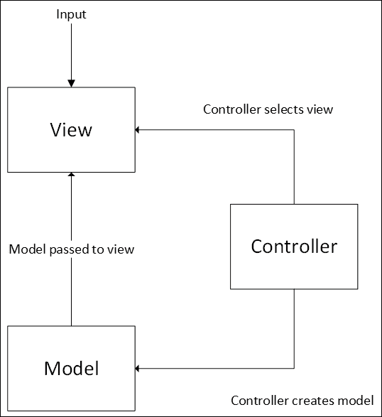
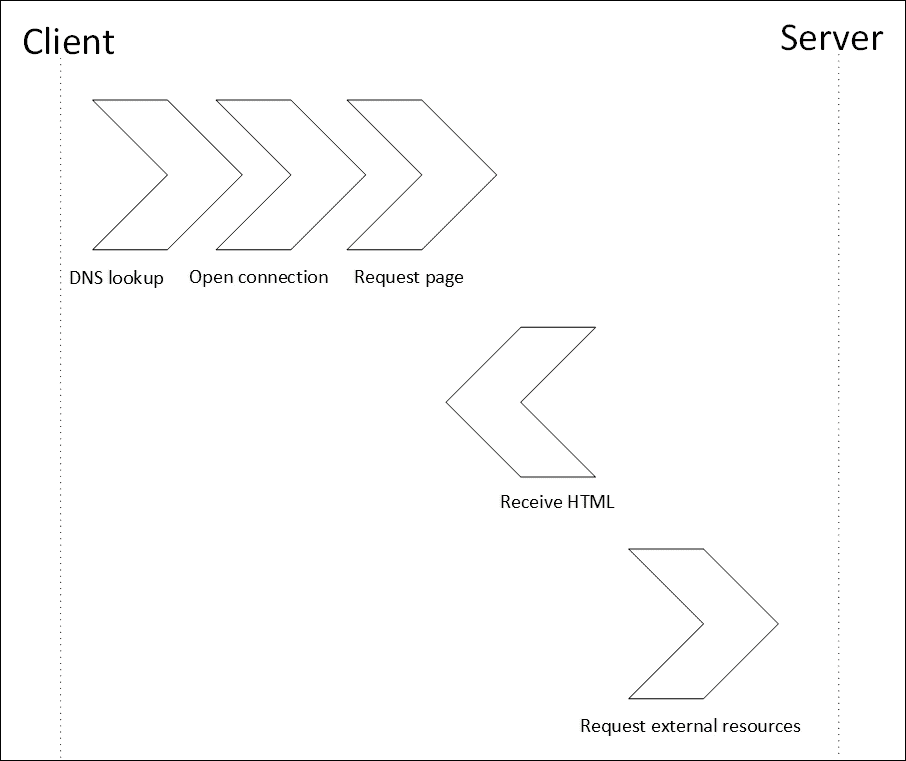
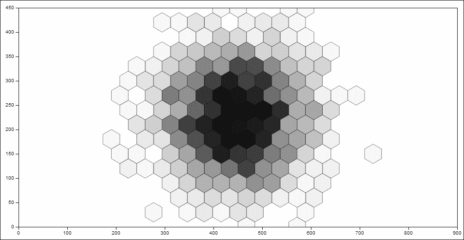
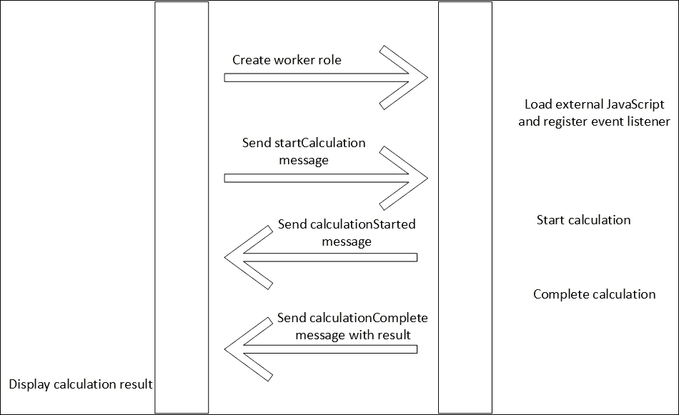
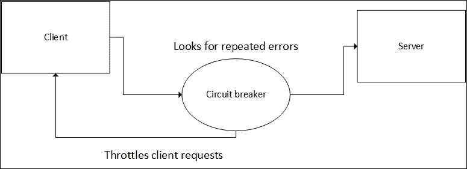
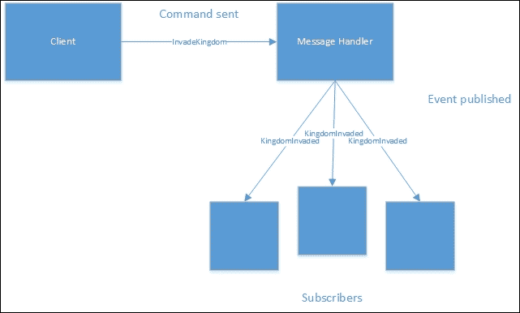
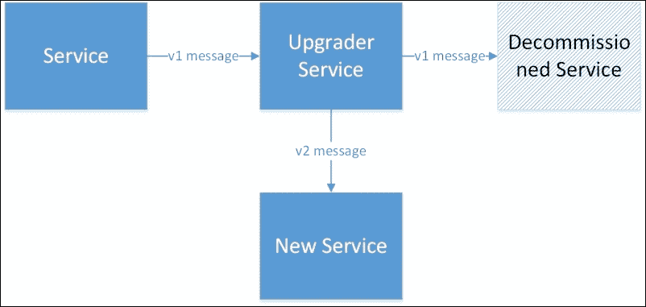

# 第二部分。其他模式

函数式编程

响应式编程

应用程序模式

Web 模式

消息模式

微服务

测试模式

高级模式

ECMAScript-2015/2016 解决方案今天

在第一部分中，我们专注于 GoF 书中最初确定的模式，这些模式是软件设计模式背后的最初动力。在本书的这一部分中，我们将超越这些模式，看看与函数式编程相关的模式，用于构建整个应用程序的大规模模式，专门用于 Web 的模式以及消息模式。此外，我们将研究测试模式和一些非常有趣的高级模式。最后，我们将看看如何在今天就能获得 JavaScript 下一个版本的许多功能。

# 第六章。函数式编程

函数式编程是一种与我们迄今为止专注的重度面向对象方法不同的开发方法。面向对象编程是解决许多问题的绝佳工具，但也存在一些问题。在面向对象的上下文中进行并行编程是困难的，因为状态可能会被不同的线程改变，产生未知的副作用。函数式编程不允许状态或可变变量。函数在函数式编程中充当主要的构建块。在过去可能使用变量的地方现在将使用函数。

即使在单线程程序中，函数也可能具有改变全局状态的副作用。这意味着，当调用一个未知的函数时，它可能改变程序的整个流程。这使得调试程序变得非常困难。

JavaScript 并不是一种函数式编程语言，但我们仍然可以将一些函数式原则应用到我们的代码中。我们将研究函数式空间中的许多模式：

+   函数传递

+   过滤器和管道

+   累加器

+   备忘录

+   不可变性

+   延迟实例化

# 函数式函数是无副作用的

函数式编程的核心原则之一是函数不应改变状态。函数内部的局部值可以被设置，但函数外部的任何东西都不可以改变。这种方法对于使代码更易维护非常有用。不再需要担心将数组传递给函数会对其内容造成混乱。特别是在使用不受控制的库时，这是一个问题。

JavaScript 内部没有机制可以阻止您改变全局状态。相反，您必须依赖开发人员编写无副作用的函数。这可能很困难，也可能不是，这取决于团队的成熟度。

也许并不希望将应用程序中的所有代码都放入函数中，但尽可能地分离是可取的。有一种称为命令查询分离的模式建议方法应该分为两类。要么是读取值的函数，要么是设置值的命令。二者不可兼得。保持方法按此分类有助于调试和代码重用。

无副作用函数的一个结果是，它们可以使用相同的输入被调用任意次数，结果都将是相同的。此外，由于没有状态的改变，多次调用函数不会产生任何不良副作用，除了使其运行速度变慢。

# 函数传递

在函数式编程语言中，函数是一等公民。函数可以赋值给变量并像处理其他变量一样传递。这并不是完全陌生的概念。即使像 C 这样的语言也有可以像其他变量一样处理的函数指针。C#有委托，在更近期的版本中有 lambda。最新版本的 Java 也添加了对 lambda 的支持，因为它们被证明非常有用。

JavaScript 允许将函数视为变量，甚至作为对象和字符串。这样，JavaScript 在本质上是函数式的。

由于 JavaScript 的单线程特性，回调是一种常见的约定，你几乎可以在任何地方找到它们。考虑在网页上的稍后时间调用一个函数。这是通过在 window 对象上设置超时来实现的，就像这样：

```js
setTimeout(function(){alert("Hello from the past")}, 5 * 1000);
```

设置超时函数的参数是要调用的函数和以毫秒为单位的延迟时间。

无论您在哪种 JavaScript 环境中工作，几乎不可能避免以回调函数的形式使用函数。Node.js 的异步处理模型高度依赖于能够调用函数并传递一些内容以便在以后的某个日期完成。在浏览器中调用外部资源也依赖于回调来通知调用者某些异步操作已完成。在基本的 JavaScript 中，这看起来像这样：

```js
let xmlhttp = new XMLHttpRequest()
xmlhttp.onreadystatechange = function()
if (xmlhttp.readyState==4 && xmlhttp.status==200){
  //process returned data
}
};
xmlhttp.open("GET", http://some.external.resource, true);
xmlhttp.send();
```

您可能会注意到我们在发送请求之前就分配了`onreadystatechange`函数。这是因为稍后分配可能会导致服务器在函数附加到准备状态更改之前做出响应的竞争条件。在这种情况下，我们使用内联函数来处理返回的数据。因为函数是一等公民，我们可以将其更改为以下形式：

```js
let xmlhttp;
function requestData(){
  xmlhttp = new XMLHttpRequest()
  xmlhttp.onreadystatechange=processData;
  xmlhttp.open("GET", http://some.external.resource, true);
  xmlhttp.send();
}

function processData(){
  if (xmlhttp.readyState==4 &&xmlhttp.status==200){
    //process returned data
  }
}
```

这通常是一种更清晰的方法，避免在另一个函数中执行复杂的处理。

但是，您可能更熟悉 jQuery 版本，它看起来像这样：

```js
$.getJSON('http://some.external.resource', function(json){
  //process returned data
});
```

在这种情况下，处理准备状态变化的模板已经为您处理了。如果请求数据失败，甚至还为您提供了便利：

```js
$.ajax('http://some.external.resource',
  { success: function(json){
      //process returned data
    },
    error: function(){
      //process failure
    },
    dataType: "json"
});
```

在这种情况下，我们将一个对象传递给`ajax`调用，该对象定义了许多属性。在这些属性中，成功和失败的函数回调是其中之一。将多个函数传递到另一个函数中的这种方法表明了为类提供扩展点的一种很好的方式。

很可能您以前已经看到过这种模式的使用，甚至没有意识到。将函数作为选项对象的一部分传递给构造函数是 JavaScript 库中提供扩展挂钩的常用方法。在上一章中，第五章，*行为模式*中，我们看到了对函数的一些处理，当将函数传递给观察者时。

## 实施

在维斯特洛，旅游业几乎不存在。有很多困难，如强盗杀害游客和游客卷入地区冲突。尽管如此，一些有远见的人已经开始宣传维斯特洛斯的大巡回之旅，他们将带领有能力的人游览所有主要景点。从国王之地到艾利，再到多恩的巨大山脉-这次旅行将覆盖一切。事实上，旅游局中一个相当数学倾向的成员已经开始称其为哈密顿之旅，因为它到达每个地方一次。

`HamiltonianTour`类提供了一个选项对象，允许定义一个选项对象。该对象包含可以附加回调的各种位置。在我们的情况下，它的接口看起来可能是以下样子：

```js
export class HamiltonianTourOptions{
  onTourStart: Function;
  onEntryToAttraction: Function;
  onExitFromAttraction: Function;
  onTourCompletion: Function;
}
```

完整的`HamiltonianTour`类如下所示：

```js
class HamiltonianTour {
  constructor(options) {
    this.options = options;
  }
  StartTour() {
    if (this.options.onTourStart && typeof (this.options.onTourStart) === "function")
      this.options.onTourStart();
      this.VisitAttraction("King's Landing");
      this.VisitAttraction("Winterfell");
      this.VisitAttraction("Mountains of Dorne");
      this.VisitAttraction("Eyrie");
    if (this.options.onTourCompletion && typeof (this.options.onTourCompletion) === "function")
      this.options.onTourCompletion();
  }
  VisitAttraction(AttractionName) {
    if (this.options.onEntryToAttraction && typeof (this.options.onEntryToAttraction) === "function")
      this.options.onEntryToAttraction(AttractionName);
      //do whatever one does in a Attraction
    if (this.options.onExitFromAttraction && typeof (this.options.onExitFromAttraction) === "function")
      this.options.onExitFromAttraction(AttractionName);
  }
}
```

您可以在突出显示的代码中看到我们如何检查选项，然后根据需要执行回调。只需简单地执行以下操作即可使用：

```js
var tour = new HamiltonianTour({
  onEntryToAttraction: function(cityname){console.log("I'm delighted to be in " + cityname)}});
      tour.StartTour();
```

运行此代码的输出将如下所示：

```js
I'm delighted to be in King's Landing
I'm delighted to be in Winterfell
I'm delighted to be in Mountains of Dorne
I'm delighted to be in Eyrie
```

在 JavaScript 中传递函数是解决许多问题的好方法，并且在 jQuery 等库和 express 等框架中被广泛使用。它是如此普遍地被采用，以至于使用它会增加代码的可读性障碍。

# 过滤器和管道

如果您对 Unix 命令行或者在较小程度上对 Windows 命令行有所了解，那么您可能已经使用过管道。管道由`|`字符表示，它是“获取程序 A 的输出并将其放入程序 B”的简写。这个相对简单的想法使得 Unix 命令行非常强大。例如，如果您想要列出目录中的所有文件，然后对它们进行排序并过滤出以字母`b`或`g`开头并以`f`结尾的文件，那么命令可能如下所示：

```js
ls|sort|grep "^[gb].*f$"
```

`ls`命令列出所有文件和目录，`sort`命令对它们进行排序，`grep`命令匹配文件名与正则表达式。在 Ubuntu 的`/etc`目录中运行这个命令会得到类似以下的结果：

```js
 **stimms@ubuntu1:/etc$ ls|sort|grep "^[gb].*f$"** 

blkid.conf
bogofilter.cf
brltty.conf
gai.conf
gconf
groff
gssapi_mech.conf
```

一些函数式编程语言，如 F#，提供了在函数之间进行管道传递的特殊语法。在 F#中，可以通过以下方式对列表进行偶数过滤：

```js
[1..10] |>List.filter (fun n -> n% 2 = 0);;
```

这种语法看起来非常漂亮，特别是在长链式函数中使用时。例如，将一个数字转换为浮点数，然后对其进行平方根运算，最后四舍五入，看起来会像下面这样：

```js
10.5 |> float |>Math.Sqrt |>Math.Round
```

这比 C 风格的语法更清晰，后者看起来会像下面这样：

```js
Math.Round(Math.Sqrt((float)10.5))
```

不幸的是，JavaScript 没有使用巧妙的 F#风格语法编写管道的能力，但是我们仍然可以通过方法链接来改进前面代码中显示的普通方法。

JavaScript 中的所有内容都是对象，这意味着我们可以通过向现有对象添加功能来改进它们的外观。对对象集合进行操作是函数式编程提供一些强大功能的领域。让我们首先向数组对象添加一个简单的过滤方法。您可以将这些查询视为以函数式方式编写的 SQL 数据库查询。

## 实现

我们希望提供一个对数组的每个成员进行匹配并返回一组结果的函数：

```js
Array.prototype.where = function (inclusionTest) {
  let results = [];
  for (let i = 0; i<this.length; i++) {
    if (inclusionTest(this[i]))
      results.push(this[i]);
  }
  return results;
};
```

这个看起来相当简单的函数允许我们快速过滤一个数组：

```js
var items = [1,2,3,4,5,6,7,8,9,10];
items.where(function(thing){ return thing % 2 ==0;});
```

我们返回的也是一个对象，这种情况下是一个数组对象。我们可以继续像下面这样链式调用方法：

```js
items.where(function(thing){ return thing % 2 ==0;})
  .where(function(thing){ return thing % 3 == 0;});
```

结果是一个只包含数字 6 的数组，因为它是 1 到 10 之间唯一既是偶数又可被三整除的数字。返回原始对象的修改版本而不改变原始对象的方法称为流畅接口。通过不改变原始的项目数组，我们为变量引入了一定程度的不可变性。

如果我们向数组扩展库添加另一个函数，我们就可以开始看到这些管道有多么有用：

```js
Array.prototype.select=function(projection){
  let results = [];
  for(let i = 0; i<this.length;i++){
    results.push(projection(this[i]));
  }
  return results;
};
```

这个扩展允许根据任意投影函数对原始项目进行投影。给定一组包含 ID 和名称的对象，我们可以使用我们的流畅扩展到数组来执行复杂的操作：

```js
let children = [{ id: 1, Name: "Rob" },
{ id: 2, Name: "Sansa" },
{ id: 3, Name: "Arya" },
{ id: 4, Name: "Brandon" },
{ id: 5, Name: "Rickon" }];
let filteredChildren = children.where(function (x) {
  return x.id % 2 == 0;
}).select(function (x) {
  return x.Name;
});
```

这段代码将构建一个新数组，其中只包含具有偶数 ID 的子项，而不是完整的对象，数组将只包含它们的名称：`Sansa`和`Brandon`。对于熟悉.Net 的人来说，这些函数可能看起来非常熟悉。.Net 上的**语言集成查询**（**LINQ**）库提供了类似命名的受函数启发的函数，用于操作集合。

以这种方式链接函数既更容易理解，也更容易构建，因为避免了临时变量，代码更加简洁。考虑使用循环和临时变量重新实现前面的示例：

```js
let children = [{ id: 1, Name: "Rob" },
{ id: 2, Name: "Sansa" },
{ id: 3, Name: "Arya" },
{ id: 4, Name: "Brandon" },
{ id: 5, Name: "Rickon" }];
let evenIds = [];
for(let i=0; i<children.length;i++)
{
  if(children[i].id%2==0)
    evenIds.push(children[i]);
}
let names = [];
for(let i=0; i< evenIds.length;i++)
{
  names.push(evenIds[i].name);
}
```

许多 JavaScript 库，比如 d3，都是为了鼓励这种编程方式而构建的。起初，遵循这种约定创建的代码似乎很糟糕，因为行长非常长。我认为这是行长不是一个很好的衡量复杂性的工具，而不是这种方法的实际问题。

# 累加器

我们已经研究了一些简单的数组函数，它们为数组添加了过滤和管道。另一个有用的工具是累加器。累加器通过对集合进行迭代来帮助构建单个结果。许多常见的操作，比如对数组元素求和，都可以使用累加器来实现，而不是使用循环。

递归在函数式编程语言中很受欢迎，其中许多语言实际上提供了一种称为“尾递归优化”的优化。支持这一点的语言为使用递归的函数提供了优化，其中堆栈帧被重用。这是非常高效的，可以轻松地替代大多数循环。关于 JavaScript 解释器是否支持尾递归优化的细节还不清楚。在大多数情况下，似乎并不支持，但我们仍然可以利用递归。

`for`循环的问题在于循环中的控制流是可变的。考虑这个相当容易犯的错误：

```js
let result = "";
let multiArray = [[1,2,3], ["a", "b", "c"]];
for(vari=0; i<multiArray.length; i++)
  for(var j=0; i<multiArray[i].length; j++)
    result += multiArray[i][j];
```

你发现错误了吗？我尝试了几次才得到一个可行的版本，我才发现了问题。问题在于第二个循环中的循环计数器，它应该是这样的：

```js
let result = "";
let multiArray = [[1,2,3], ["a", "b", "c"]];
for(let i=0; i<multiArray.length; i++)
  for(let j=0; j<multiArray[i].length; j++)
    result +=multiArray[i][j];
```

显然，通过更好的变量命名可以在一定程度上缓解这个问题，但我们希望完全避免这个问题。

相反，我们可以利用累加器，这是一个将集合中的多个值组合成单个值的工具。我们错过了 Westeros 的一些模式，所以让我们回到我们的神话般的例子。战争花费了大量的金钱，但幸运的是有大量的农民来交税，为领主们的王位之争提供资金。

## 实施

我们的农民由一个简单的模型代表，看起来像下面这样：

```js
let peasants = [
  {name: "Jory Cassel", taxesOwed: 11, bankBalance: 50},
  {name: "VardisEgen", taxesOwed: 15, bankBalance: 20}];
```

在这组农民中，我们有一个看起来像下面这样的累加器：

```js
TaxCollector.prototype.collect = function (items, value, projection) {
  if (items.length> 1)
    return projection(items[0]) + this.collect(items.slice(1), value, projection);
  return projection(items[0]);
};
```

这段代码接受一个项目列表，一个累加器值，以及一个将值投影到累加中的函数。

投影函数看起来像下面这样：

```js
function (item) {
  return Math.min(item.moneyOwed, item.bankBalance);
}
```

为了激活这个函数，我们只需要传入一个累加器的初始值以及数组和投影。激活值会有所不同，但往往是一个身份；在字符串累加器的情况下是一个空字符串，在数学累加器的情况下是 0 或 1。

每次通过累加器，我们都会缩小我们操作的数组的大小。所有这些都是在没有一个可变变量的情况下完成的。

内部累积可以是任何你喜欢的函数：字符串追加，加法，或者更复杂的东西。累加器有点像访问者模式，只是在累加器内部修改集合中的值是不被赞同的。记住，函数式编程是无副作用的。

# 记忆化

不要与记忆混淆，记忆化是一个特定术语，用于保留函数中先前计算的值。

正如我们之前看到的，无副作用的函数可以被多次调用而不会引起问题。与此相对的是，函数也可以被调用的次数少于需要的次数。考虑一个复杂或者至少耗时的数学运算的昂贵函数。我们知道函数的结果完全取决于函数的输入。因此，相同的输入将始终产生相同的输出。那么，为什么我们需要多次调用函数呢？如果我们保存函数的输出，我们可以检索到它，而不是重新进行耗时的数学运算。

以空间换时间是一个经典的计算科学问题。通过缓存结果，我们可以使应用程序更快，但会消耗更多的内存。决定何时进行缓存，何时简单地重新计算结果是一个困难的问题。

## 实施

在维斯特洛大陆，被称为大师的学者们长期以来对一个数字序列产生了浓厚的兴趣，这个序列似乎在自然界中频繁出现。一个奇怪的巧合是，他们称这个序列为斐波那契数列。它的定义是将序列中的前两个项相加以得到下一个项。这个序列的起始项被定义为 0、1、1。所以要得到下一个项，我们只需将 1 和 1 相加得到 2。下一个项将 2 和 1 相加得到 3，依此类推。找到序列的任意成员需要找到前两个成员，因此可能需要进行一些计算。

在我们的世界中，我们已经发现了一个避免大部分计算的封闭形式，但在维斯特洛还没有做出这样的发现。

一个朴素的方法是简单地计算每个项，如下所示：

```js
let Fibonacci = (function () {
  function Fibonacci() {
  }
  Fibonacci.prototype.NaieveFib = function (n) {
    if (n == 0)
      return 0;
    if (n <= 2)
      return 1;
    return this.NaieveFib(n - 1) + this.NaieveFib(n - 2);
  };
  return Fibonacci;
})();
```

这个解决方案对于小数字（比如 10）非常快。然而，对于更大的数字，比如大于 40，速度会明显变慢。这是因为基本情况被调用了 102,334,155 次。

让我们看看是否可以通过备忘录一些值来改善情况：

```js
let Fibonacci = (function () {
  function Fibonacci() {
    this.memoizedValues = [];
  }

  Fibonacci.prototype.MemetoFib = function (n) {
    if (n == 0)
      return 0;
    if (n <= 2)
      return 1;
    if (!this. memoizedValues[n])
      this. memoizedValues[n] = this.MemetoFib(n - 1) + this.MemetoFib(n - 2);
    return this. memoizedValues[n];
  };
  return Fibonacci;
})();
```

我们刚刚对我们遇到的每个项目进行了备忘录。事实证明，对于这个算法，我们存储了*n+1*个项目，这是一个相当不错的折衷。没有备忘录，计算第 40 个斐波那契数需要 963 毫秒，而备忘录版本只需要 11 毫秒。当函数变得更复杂时，差异会更加明显。备忘录版本的斐波那契数列 140 只需要 12 毫秒，而朴素版本……嗯，已经过了一天，它还在运行。

备忘录的最大优点是，对具有相同参数的函数的后续调用将非常快，因为结果已经计算过了。

在我们的例子中，只需要一个非常小的缓存。在更复杂的例子中，很难知道缓存应该有多大，或者一个值需要重新计算的频率。理想情况下，您的缓存应该足够大，以至于总是有足够的空间来放更多的结果。然而，这可能并不现实，需要做出艰难的决定，即哪些缓存成员应该被移除以节省空间。有很多方法可以执行缓存失效。有人说，缓存失效是计算科学中最棘手的问题之一，原因是我们实际上在试图预测未来。如果有人完善了一种预测未来的方法，那么他们很可能会将自己的技能应用于比缓存失效更重要的领域。两个选择是依赖于最近最少使用的缓存成员或最不经常使用的成员。问题的形状可能决定了更好的策略。

备忘录是加速需要多次执行的计算或者有共同子计算的计算的一个奇妙工具。人们可以将备忘录视为缓存的一种特殊情况，这是在构建网络服务器或浏览器时常用的技术。在更复杂的 JavaScript 应用程序中探索备忘录是值得的。

# 不变性

函数式编程的基石之一是所谓的变量只能被赋值一次。这就是不变性。ECMAScript 2015 支持一个新关键字，`const`。`const`关键字可以像`var`一样使用，只是用`const`赋值的变量将是不可变的。例如，以下代码显示了一个变量和一个常量，它们都以相同的方式被操作：

```js
let numberOfQueens = 1;
const numberOfKings = 1;
numberOfQueens++;
numberOfKings++;
console.log(numberOfQueens);
console.log(numberOfKings);
```

运行的输出如下：

```js
2
1
```

正如你所看到的，常数和变量的结果是不同的。

如果您使用的是不支持`const`的旧浏览器，那么`const`对您来说将不可用。一个可能的解决方法是使用更广泛采用的`Object.freeze`功能：

```js
let consts = Object.freeze({ pi : 3.141});
consts.pi = 7;
console.log(consts.pi);//outputs 3.141
```

正如您所看到的，这里的语法并不是很用户友好。另一个问题是，尝试对已分配的`const`进行赋值只会静默失败，而不是抛出错误。以这种方式静默失败绝对不是一种理想的行为；应该抛出完整的异常。如果启用了严格模式，ECMAScript 5 中添加了更严格的解析模式，并且实际上会抛出异常：

```js
"use strict";
var consts = Object.freeze({ pi : 3.141});
consts.pi = 7;
```

前面的代码将抛出以下错误：

```js
consts.pi = 7;
          ^
TypeError: Cannot assign to read only property 'pi' of #<Object>
```

另一种方法是我们之前提到的`object.Create`语法。在创建对象的属性时，可以指定`writable: false`来使属性不可变：

```js
var t = Object.create(Object.prototype,
{ value: { writable: false,
  value: 10}
});
t.value = 7;
console.log(t.value);//prints 10
```

然而，即使在严格模式下，当尝试写入不可写属性时也不会抛出异常。因此，我认为`const`关键字并不完美地实现了不可变对象。最好使用 freeze。

# 延迟实例化

如果您进入一个高端咖啡店并点一杯过于复杂的饮料（大杯奶茶拿铁，3 泵，脱脂牛奶，少水，无泡沫，超热，有人吗？），那么这种饮料将是临时制作的，而不是提前制作的。即使咖啡店知道当天会有哪些订单，他们也不会提前制作所有的饮料。首先，因为这会导致大量的毁坏、冷却的饮料，其次，如果他们必须等待当天所有订单完成，第一个顾客要等很长时间才能拿到他们的订单。

咖啡店遵循按需制作饮料的方法。他们在点单时制作饮料。我们可以通过使用一种称为延迟实例化或延迟初始化的技术来将类似的方法应用到我们的代码中。

考虑一个昂贵的创建对象；也就是说，创建对象需要很长时间。如果我们不确定对象的值是否需要，我们可以推迟到以后再完全创建它。

## 实施

让我们来看一个例子。Westeros 并不是很喜欢昂贵的咖啡店，但他们确实喜欢好的面包店。这家面包店提前接受不同种类的面包请求，然后一旦有订单，就会一次性烘烤所有面包。然而，创建面包对象是一个昂贵的操作，所以我们希望推迟到有人来取面包时再进行：

```js
class Bakery {
  constructor() {
    this.requiredBreads = [];
  }
  orderBreadType(breadType) {
    this.requiredBreads.push(breadType);
  }
}
```

首先，我们创建一个要根据需要创建的面包类型列表。通过订购面包类型，这个列表会被追加：

```js
var Bakery = (function () {
  function Bakery() {
    this.requiredBreads = [];
  }
  Bakery.prototype.orderBreadType = function (breadType) {
    this.requiredBreads.push(breadType);
  };
```

这样就可以快速地将面包添加到所需的面包列表中，而不必为每个面包的创建付出代价。

现在当调用`pickUpBread`时，我们将实际创建面包：

```js
pickUpBread(breadType) {
  console.log("Picup of bread " + breadType + " requested");
  if (!this.breads) {
    this.createBreads();
  }
  for (var i = 0; i < this.breads.length; i++) {
    if (this.breads[i].breadType == breadType)
      return this.breads[i];
  }
}
createBreads() {
  this.breads = [];
  for (var i = 0; i < this.requiredBreads.length; i++) {
    this.breads.push(new Bread(this.requiredBreads[i]));
  }
}
```

在这里，我们调用了一系列操作：

```js
let bakery = new Westeros.FoodSuppliers.Bakery();
bakery.orderBreadType("Brioche");
bakery.orderBreadType("Anadama bread");
bakery.orderBreadType("Chapati");
bakery.orderBreadType("Focaccia");

console.log(bakery.pickUpBread("Brioche").breadType + "picked up");
```

这将导致以下结果：

```js
Pickup of bread Brioche requested.
Bread Brioche created.
Bread Anadama bread created.
Bread Chapati created.
Bread Focaccia created.
Brioche picked up
```

您可以看到实际面包的收集是在取货后进行的。

延迟实例化可以用来简化异步编程。Promise 是简化 JavaScript 中常见的回调的一种方法。Promise 是一个包含状态和结果的对象。首次调用时，promise 处于未解决状态；一旦`async`操作完成，状态就会更新为完成，并填充结果。您可以将结果视为延迟实例化。我们将在第九章 *Web Patterns*中更详细地讨论 promise 和 promise 库。

懒惰可以节省大量时间，因为创建昂贵的对象最终可能根本不会被使用。

# 提示和技巧

尽管回调是处理 JavaScript 中异步方法的标准方式，但它们很容易变得混乱。有许多方法可以解决这种混乱的代码：promise 库提供了一种更流畅的处理回调的方式，未来版本的 JavaScript 可能会采用类似于 C# `async/await`语法的方法。

我真的很喜欢累加器，但它们在内存使用方面可能效率低下。缺乏尾递归意味着每次通过都会增加另一个堆栈帧，因此这种方法可能会导致内存压力。在这种情况下，所有事情都是在内存和代码可维护性之间进行权衡。

# 总结

JavaScript 不是一种函数式编程语言。这并不是说不可能将一些函数式编程的思想应用到它上面。这些方法可以使代码更清晰、更易于调试。有些人甚至可能会认为问题的数量会减少，尽管我从未见过任何令人信服的研究。

在本章中，我们研究了六种不同的模式。延迟实例化、记忆化和不可变性都是创建模式。函数传递既是结构模式，也是行为模式。累加器也是行为模式。过滤器和管道实际上并不属于 GoF 的任何一类，因此可以将它们视为一种样式模式。

在下一章中，我们将研究一些在应用程序中划分逻辑和呈现的模式。随着 JavaScript 应用程序的增长，这些模式变得更加重要。

# 第七章. 响应式编程

我曾经读过一本书，书中提到牛顿在观察芦苇周围的河流时想出了微积分的概念。我从未能找到其他支持这一说法的来源。然而，这是一个很好的形象。微积分涉及理解系统随时间变化的状态。大多数开发人员在日常工作中很少需要处理微积分。然而，他们必须处理系统的变化。毕竟，一个完全不变的系统是相当无聊的。

在过去几年中，关于将变化视为一系列事件的不同想法已经出现 - 就像牛顿所观察到的那条河流一样。给定一个起始位置和一系列事件，应该可以找出系统的状态。事实上，这就是使用事件存储的想法。我们不是将聚合的最终状态保存在数据库中，而是跟踪已应用于该聚合的所有事件。通过重放这一系列事件，我们可以重新创建聚合的当前状态。这似乎是一种存储对象状态的绕圈方式，但实际上对于许多情况非常有用。例如，一个断开连接的系统，比如手机应用程序在手机未连接到网络时，使用事件存储可以更容易地与其他事件合并，而不仅仅是保留最终状态。对于审计场景，它也非常有用，因为可以通过简单地在时间索引处停止重放来将系统拉回到任何时间点的状态。你有多少次被问到，“为什么系统处于这种状态？”，而你无法回答？有了事件存储，答案应该很容易确定。

在本章中，我们将涵盖以下主题：

+   应用状态变化

+   流

+   过滤流

+   合并流

+   用于多路复用的流

# 应用状态变化

在应用程序中，我们可以将所有事件发生的事情视为类似的事件流。用户点击按钮？事件。用户的鼠标进入某个区域？事件。时钟滴答？事件。在前端和后端应用程序中，事件是触发状态变化的事物。你可能已经在使用事件监听器进行事件处理。考虑将点击处理程序附加到按钮上：

```js
var item = document.getElementById("item1");
item. addEventListener("click", function(event){ /*do something */ });
```

在这段代码中，我们已经将处理程序附加到了`click`事件上。这是相当简单的代码，但是想象一下当我们添加条件时，这段代码的复杂性会如何迅速增加，比如“在点击后忽略 500 毫秒内的额外点击，以防止人们双击”和“如果按住*Ctrl*键时点击按钮，则触发不同的事件”。响应式编程或函数式响应式编程通过使用流提供了这些复杂交互场景的简单解决方案。让我们探讨一下你的代码如何从利用响应式编程中受益。

# 流

想要简单地思考事件流的最简单方法不是考虑你以前在编程中可能使用过的流，而是考虑数组。假设你有一个包含一系列数字的数组：

```js
[1, 4, 6, 9, 34, 56, 77, 1, 2, 3, 6, 10]
```

现在你想要过滤这个数组，只显示偶数。在现代 JavaScript 中，可以通过数组的`filter`函数轻松实现这一点：

```js
[1, 4, 6, 9, 34, 56, 77, 1, 2, 3, 6, 10].filter((x)=>x%2==0) =>
[4, 6, 34, 56, 2, 6, 10]
```

可以在这里看到一个图形表示：


这里的过滤功能保持不变，无论数组中有十个项目还是一万个项目。现在，如果源数组不断添加新项目，我们希望通过将任何新的偶数项目插入到依赖数组中来保持其最新状态。为此，我们可以使用类似装饰器的模式来钩入数组的`add`函数。使用装饰器，我们可以调用过滤方法，如果找到匹配项，就将其添加到过滤后的数组中。

实际上，流是对未来事件集合的可观察对象。可以使用流操作解决许多有趣的问题。让我们从一个简单的问题开始：处理点击。这个问题非常简单，表面上似乎没有使用流的优势。别担心，随着我们的深入，我们会让它变得更加困难。

在大部分情况下，本书避免使用任何特定的 JavaScript 库。这是因为模式应该能够在不需要太多仪式的情况下轻松实现。然而，在这种情况下，我们实际上要使用一个库，因为流的实现有一些细微之处，我们希望有一些语法上的美感。如果你想看看如何实现基本的流，那么你可以基于第五章中概述的观察者模式进行实现。

JavaScript 中有许多流库，如 Reactive.js、Bacon.js 和 RxJS 等。每个库都有各种优点和缺点，但具体细节超出了本书的范围。在本书中，我们将使用 JavaScript 的 Reactive Extensions，其源代码可以在 GitHub 上找到[`github.com/Reactive-Extensions/RxJS`](https://github.com/Reactive-Extensions/RxJS)。

让我们从一个简短的 HTML 代码开始：

```js
<body>
  <button id="button"> Click Me!</button>
  <span id="output"></span>
</body>
```

接下来，让我们添加一个快速的点击计数器：

```js
<script>
  var counter = 0;
  var button = document.getElementById('button');
  var source = Rx.Observable.fromEvent(button, 'click');
  var subscription = source.subscribe(function (e) {
    counter++;
    output.innerHTML = "Clicked " + counter + " time" + (counter > 1 ? "s" : "");
  });
</script>
```

在这里，你可以看到我们正在从按钮的`click`事件创建一个新的事件流。新创建的流通常被称为元流。每当从源流中发出事件时，它会自动被操作和发布到元流中。我们订阅了这个流并增加一个计数器。如果我们只想对偶数事件做出反应，我们可以通过向流订阅第二个函数来实现：

```js
var incrementSubscription = source.subscribe(() => counter++);
var subscription = source.filter(x=>counter%2==0).subscribe(function (e) {
  output.innerHTML = "Clicked " + counter + " time" +(counter > 1 ? "s" : "");
});
```

在这里，你可以看到我们正在对流应用过滤器，以使计数器与更新屏幕的函数不同。但是，将计数器保留在流之外感觉有些不好，对吧？很可能，每隔一次点击增加一次并不是这个函数的目标。更有可能的是，我们只想在双击时运行一个函数。

这是用传统方法很难做到的，然而这些复杂的交互可以很容易地通过流来实现。您可以看到我们如何在这段代码中解决这个问题：

```js
source.buffer(() => source.debounce(250))
.map((list) => list.length)
.filter((x) => x >= 2)
.subscribe((x)=> {
  counter++;
  output.innerHTML = "Clicked " + counter + " time" + (counter > 1 ? "s" : "");
});
```

在这里，我们获取点击流并使用防抖动来缓冲流以生成缓冲区的边界。防抖动是硬件世界的一个术语，意味着我们将一个嘈杂的信号清理成一个单一的事件。当按下物理按钮时，通常会有一些额外的高或低信号，而不是我们想要的单点信号。实际上，我们消除了在一个窗口内发生的重复信号。在这种情况下，我们等待`250`毫秒，然后触发一个事件以移动到一个新的缓冲区。缓冲区包含在防抖期间触发的所有事件，并将它们的列表传递给链中的下一个函数。map 函数生成一个以列表长度为内容的新流。接下来，我们过滤流，只显示值为 2 或更多的事件，即两次点击或更多。事件流看起来像下面的图表：


使用传统的事件监听器和回调执行相同的逻辑将会非常困难。人们很容易想象出一个更复杂的工作流程，这将失控。FRP 允许更简化的方式来处理事件。

# 过滤流

正如我们在前面的部分中看到的，可以过滤事件流，并从中产生一个新的事件流。您可能熟悉能够过滤数组中的项目。ES5 引入了一些新的数组运算符，如**filter**和**some**。其中的第一个产生一个只包含符合过滤规则的元素的新数组。`Some`是一个类似的函数，如果数组的任何元素匹配，则简单返回`true`。这些相同类型的函数也支持在流上，以及您可能熟悉的来自函数式语言的函数，如 First 和 Last。除了对数组有意义的函数之外，还有许多基于时间序列的函数，当您考虑到流存在于时间中时，这些函数更有意义。

我们已经看到了防抖动，这是一个基于时间的过滤器的例子。防抖动的另一个非常简单的应用是防止用户双击提交按钮的恼人错误。考虑一下使用流的代码有多简单：

```js
Rx.Observable.FromEvent(button, "click")
.debounce(1000).subscribe((x)=>doSomething());
```

您可能还会发现像 Sample 这样的函数，它从时间窗口生成一组事件。当我们处理可能产生大量事件的可观察对象时，这是一个非常方便的函数。考虑一下我们维斯特洛斯的示例。

不幸的是，维斯特洛是一个相当暴力的地方，人们似乎以不愉快的方式死去。有这么多人死去，我们不可能每个人都关注，所以我们只想对数据进行抽样并收集一些死因。

为了模拟这个传入的流，我们将从一个数组开始，类似于以下内容：

```js
var deaths = 
  {
    Name:"Stannis",
    Cause: "Cold"
  },
  {
    Name: "Tyrion",
    Cause: "Stabbing"
  },
…
}
```

### 提示

您可以看到我们正在使用数组来模拟事件流。这可以用任何流来完成，并且是一个非常简单的测试复杂代码的方法。您可以在数组中构建一个事件流，然后以适当的延迟发布它们，从而准确地表示从文件系统到用户交互的事件流的任何内容。

现在我们需要将我们的数组转换为事件流。幸运的是，有一些使用`from`方法的快捷方式可以做到这一点。这将简单地返回一个立即执行的流。我们希望假装我们有一个定期分布的事件流，或者在我们相当阴郁的情况下，死亡。这可以通过使用 RxJS 的两种方法来实现：`interval`和`zip`。`interval`创建一个定期间隔的事件流。`zip`匹配来自两个流的事件对。这两种方法一起将以定期间隔发出新的事件流：

```js
function generateDeathsStream(deaths) {
  return Rx.Observable.from(deaths).zip(Rx.Observable.interval(500), (death,_)=>death);
}
```

在这段代码中，我们将死亡数组与每`500`毫秒触发一次的间隔流进行了合并。因为我们对间隔事件不是特别感兴趣，所以我们简单地丢弃了它，并将数组中的项目进行了投影。

现在我们可以通过简单地取样本然后订阅它来对这个流进行取样。在这里，我们每`1500`毫秒取样一次：

```js
generateDeathsStream(deaths).sample(1500).subscribe((item) => { /*do something */ });
```

你可以有任意多个订阅者订阅一个流，所以如果你想进行一些取样，以及可能一些聚合函数，比如简单地计算事件的数量，你可以通过有几个订阅者来实现。

```js
Var counter = 0;
generateDeathsStream(deaths).subscribe((item) => { counter++ });
```

# 合并流

我们已经看到了`zip`函数，它将事件一对一地合并以创建一个新的流，但还有许多其他合并流的方法。一个非常简单的例子可能是一个页面，它有几个代码路径，它们都想执行类似的操作。也许我们有几个动作，所有这些动作都会导致状态消息被更新：

```js
var button1 = document.getElementById("button1");
var button2 = document.getElementById("button2");
var button3 = document.getElementById("button3");
var button1Stream = Rx.Observable.fromEvent(button1, 'click');
var button2Stream = Rx.Observable.fromEvent(button2, 'click');
var button3Stream = Rx.Observable.fromEvent(button3, 'click');
var messageStream = Rx.Observable.merge(button1Stream, button2Stream, button3Stream);
messageStream.subscribe(function (x) { return console.log(x.type + " on " + x.srcElement.id); });
```

在这段代码中，你可以看到各种流被传递到合并函数中，然后产生了合并后的流：

![合并流虽然有用，但这段代码似乎并不比直接调用事件处理程序更好，实际上它比必要的代码还要长。然而，考虑到状态消息的来源不仅仅是按钮推送。我们可能还希望异步事件也写出信息。例如，向服务器发送请求可能还想添加状态信息。另一个很棒的应用可能是使用在后台运行并使用消息与主线程通信的 web worker。对于基于 web 的 JavaScript 应用程序，这是我们实现多线程应用程序的方式。让我们看看它是什么样子。首先，我们可以从 worker 角色创建一个流。在我们的示例中，worker 只是计算斐波那契数列。我们在页面上添加了第四个按钮，并触发了 worker 进程：```jsvar worker = Rx.DOM.fromWorker("worker.js");button4Stream.subscribe(function (_) {  worker.onNext({ cmd: "start", number: 35 });});```现在我们可以订阅合并后的流，并将其与所有先前的流结合起来：```jsvar messageStream = Rx.Observable.merge(button1Stream, button2Stream, button3Stream, worker);messageStream.subscribe(function (x) {  appendToOutput(x.type + (x.srcElement.id === undefined ? " with " + x.data : " on " + x.srcElement.id));},function (err) { return appendToOutput(err, true); });```这一切看起来非常好，但我们不想一次给用户提供数十个通知。我们可以通过使用与之前看到的相同的间隔 zip 模式来限制事件流，以便一次只显示一个 toast。在这段代码中，我们用调用 toast 显示库来替换我们的`appendToOutput`方法：```jsvar messageStream = Rx.Observable.merge(button1Stream, button2Stream, button3Stream, worker);var intervalStream = Rx.Observable.interval(5000);messageStream.zip(intervalStream, function (x, _) {  return x;}).subscribe(function (x) {  toastr.info(x.type + (x.srcElement.id === undefined ? " with " + x.data : " on " + x.srcElement.id));},function (err) { return toastr.error(err); });```正如你所看到的，这个功能的代码很简短，易于理解，但包含了大量的功能。# 多路复用流在 Westeros 国王的议会中，没有人能够在权力地位上升到一定程度而不擅长建立间谍网络。通常，最好的间谍是那些能够最快做出反应的人。同样，我们可能有一些代码可以选择调用许多不同的服务中的一个来完成相同的任务。一个很好的例子是信用卡处理器：我们使用哪个处理器并不重要，因为它们几乎都是一样的。为了实现这一点，我们可以启动多个 HTTP 请求到每个服务。如果我们将每个请求放入一个流中，我们可以使用它来选择最快响应的处理器，然后使用该处理器执行其余的操作。使用 RxJS，这看起来像下面这样：```jsvar processors = Rx.Observable.amb(processorStream1, processorStream2);```甚至可以在`amb`调用中包含一个超时，以处理处理器没有及时响应的情况。# 提示和技巧可以应用于流的不同函数有很多。如果你决定在 JavaScript 中使用 RxJS 库进行 FRP 需求，许多常见的函数已经为你实现了。更复杂的函数通常可以编写为包含函数链，因此在编写自己的函数之前，尝试想出一种通过链式调用来创建所需功能的方法。在 JavaScript 中，经常会出现跨网络的异步调用失败。网络是不可靠的，移动网络尤其如此。在大多数情况下，当网络失败时，我们的应用程序也会失败。流提供了一个简单的解决方法，允许您轻松重试失败的订阅。在 RxJS 中，这种方法被称为“重试”。将其插入到任何可观察链中，可以使其更具抗网络故障的能力。# 总结函数式响应式编程在服务器端和客户端的不同应用中有许多用途。在客户端，它可以用于将大量事件整合成数据流，实现复杂的交互。它也可以用于最简单的事情，比如防止用户双击按钮。仅仅使用流来处理所有数据变化并没有太大的成本。它们非常易于测试，并且对性能影响很小。FRP 最美好的一点也许是它提高了抽象级别。您不必处理繁琐的流程代码，而是可以专注于应用程序的逻辑流。# 第八章 应用程序模式到目前为止，我们已经花了大量时间研究用于解决局部问题的模式，也就是说，仅涉及少数类而不是整个应用程序的问题。这些模式的范围很窄。它们通常只涉及两三个类，并且在任何给定的应用程序中可能只使用一次。您可以想象一下，还有更大规模的模式适用于整个应用程序。您可以将“工具栏”视为一个通用模式，它在应用程序中的许多地方使用。而且，它是在许多应用程序中使用的模式，以赋予它们相似的外观和感觉。模式可以帮助指导整个应用程序的组装方式。在本章中，我们将研究一系列我称之为 MV*家族的模式。这个家族包括 MVC、MVVM、MVP，甚至 PAC。就像它们的名字一样，这些模式本身非常相似。本章将涵盖这些模式，并展示如何或者是否可以将它们应用到 JavaScript 中。我们还将特别关注这些模式之间的区别。在本章结束时，您应该能够在鸡尾酒会上以 MVP 与 MVC 的微妙差异为题向客人讲解。涉及的主题将如下：+   模型视图模式的历史+   模型视图控制器+   模型视图呈现器+   模型视图视图模型# 首先，一些历史在应用程序内部分离关注点是一个非常重要的想法。我们生活在一个复杂且不断变化的世界中。这意味着不仅几乎不可能制定一个完全符合用户需求的计算机程序，而且用户需求是一个不断变化的迷宫。再加上一个事实，即用户 A 的理想程序与用户 B 的理想程序完全不同，我们肯定会陷入混乱。我们的应用程序需要像我们换袜子一样频繁地更改：至少每年一次。分层应用程序和维护模块化可以减少变更的影响。每个层次对其他层次了解得越少越好。在层次之间保持简单的接口可以减少一个层次的变更对另一个层次的影响的机会。如果您曾经仔细观察过高质量的尼龙制品（如热气球、降落伞或昂贵的夹克），您可能会注意到这种织物似乎形成了微小的方块。这是因为每隔几毫米，都会添加一根粗的加强线到织物中，形成交叉网格图案。如果织物被撕裂，那么撕裂将会被加强线停止或至少减缓。这限制了损坏的范围，并防止其扩散。应用程序中的层次和模块与限制变更的影响传播是完全相同的。在本书的前几章中，我们谈到了开创性的语言 Smalltalk。它是使类著名的语言。像许多这些模式一样，原始的 MV*模式，**模型 视图 控制器**（**MVC**），在被识别之前就已经被使用。尽管很难证明，但 MVC 最初是在 20 世纪 70 年代末由挪威计算机科学家 Trygve Reenskaug 在访问传奇般的施乐 PARC 期间提出的。在 20 世纪 80 年代，该模式在 Smalltalk 应用程序中得到了广泛使用。然而，直到 1988 年，该模式才在一篇名为《使用模型-视图-控制器用户界面范式的烹饪书》的文章中得到更正式的记录，作者是 Glenn E. Krasner 和 Stephen T. Pope。# 模型 视图 控制器 MVC 是一种用于创建丰富、交互式用户界面的模式：这正是在网络上变得越来越受欢迎的界面类型。敏锐的读者已经发现，该模式由三个主要组件组成：模型、视图和控制器。您可以在这个插图中看到信息在这些组件之间的流动：

前面的图表显示了 MVC 中三个组件之间的关系。

模型包含程序的状态。在许多应用程序中，该模型以某种形式包含在数据库中。模型可以从数据库等持久存储重新生成，也可以是瞬态的。理想情况下，模型是该模式中唯一可变的部分。视图和控制器都不与任何状态相关联。

对于一个简单的登录屏幕，模型可能如下所示：

```js
class LoginModel{
  UserName: string;
  Password: string;
  RememberMe: bool;
  LoginSuccessful: bool;
  LoginErrorMessage: string;
}
```

您会注意到，我们不仅为用户显示的输入字段设置了字段，还为登录状态设置了字段。用户可能不会注意到这一点，但它仍然是应用程序状态的一部分。

模型通常被建模为信息的简单容器。通常，模型中没有真正的功能。它只包含数据字段，也可能包含验证。在一些 MVC 模式的实现中，模型还包含有关字段的元数据，如验证规则。

### 注

裸对象模式是典型 MVC 模式的偏离。它通过大量的业务信息以及有关数据显示和编辑的提示来增强模型。甚至包含了将模型持久化到存储的方法。

裸对象模式中的视图是从这些模型自动生成的。控制器也是通过检查模型自动生成的。这将逻辑集中在显示和操作应用程序状态上，并使开发人员无需编写自己的视图和控制器。因此，虽然视图和控制器仍然存在，但它们不是实际的对象，而是从模型动态创建的。

已经成功地使用了该模式部署了几个系统。一些批评涌现，主要是关于如何从仅仅模型生成吸引人的用户界面以及如何正确协调多个视图。

在 Reenskaug 的博士论文《呈现裸对象》的序言中，他建议裸对象模式实际上比野生 MVC 的大多数派生更接近他最初对 MVC 的愿景。

当模型发生变化时，更新会传达给视图。通常通过使用观察者模式来实现。模型通常不知道控制器或视图。第一个只是告诉它要改变的东西，第二个只通过观察者模式更新，所以模型并不直接知道它。

视图基本上做您所期望的事情：将模型状态传达给目标。我不敢说视图必须是模型的视觉或图形表示，因为视图经常被传达到另一台计算机，并且可能以 XML、JSON 或其他数据格式的形式存在。在大多数情况下，特别是与 JavaScript 相关的情况，视图将是一个图形对象。在 Web 环境中，这通常是由浏览器呈现的 HTML。JavaScript 在手机和桌面上也越来越受欢迎，因此视图也可以是手机或桌面上的屏幕。

上述段落中的模型的视图可能如下图所示：


在没有使用观察者模式的情况下，视图可能会定期轮询模型以查找更改。在这种情况下，视图可能必须保持状态的表示，或者至少一个版本号。重要的是，视图不要单方面更新此状态，而不将更新传递给控制器，否则模型和视图中的副本将不同步。

最后，模型的状态由控制器更新。控制器通常包含更新模型字段的所有逻辑和业务规则。我们登录页面的简单控制器可能如下所示：

```js
class LoginController {
  constructor(model) {
    this.model = model;
  }
  Login(userName, password, rememberMe) {
    this.model.UserName = userName;
    this.model.Password = password;
    this.model.RememberMe = rememberMe;
    if (this.checkPassword(userName, password))
      this.model.LoginSuccessful;
    else {
      this.model.LoginSuccessful = false;
      this.model.LoginErrorMessage = "Incorrect username or password";
    }
  }
};
```

控制器知道模型的存在，并且通常也知道视图的存在。它协调两者。控制器可能负责初始化多个视图。例如，单个控制器可以提供模型所有实例的列表视图，以及仅提供详细信息的视图。在许多系统中，控制器将对模型进行创建、读取、更新和删除（CRUD）操作。控制器负责选择正确的视图，并建立模型和视图之间的通信。

当需要对应用程序进行更改时，代码的位置应立即显而易见。例如：

| 更改 | 位置 |
| --- | --- |
| 屏幕上的元素间距不合适，更改间距。 | 视图 |
| 由于密码验证中的逻辑错误，没有用户能够登录。 | 控制器 |
| 要添加的新字段。 | 所有层 |

### 注意

**Presentation-Abstraction-Control**（**PAC**）是另一种利用三个组件的模式。在这种情况下，它的目标是描述一组封装的三元组的层次结构，更符合我们对世界的思考方式。控制，类似于 MVC 控制器，将交互传递到封装组件的层次结构中，从而允许信息在组件之间流动。抽象类似于模型，但可能只代表对于特定 PAC 而言重要的一些字段，而不是整个模型。最后，演示文稿实际上与视图相同。

PAC 的分层性质允许对组件进行并行处理，这意味着它可以成为当今多处理器系统中强大的工具。

您可能会注意到最后一个需要对应用程序的所有层进行更改。这种责任的多重位置是裸对象模式试图通过动态创建视图和控制器来解决的。MVC 模式通过根据用户交互中的角色将代码分割成位置。这意味着单个数据字段存在于所有层中，如图所示：


有些人可能会称这为横切关注点，但实际上它并没有涵盖足够多的应用程序部分才能被称为这样。数据访问和日志记录是横切关注点，因为它们是普遍存在的，难以集中化。这种领域在不同层之间的普遍存在并不是一个主要问题。但是，如果这让你感到困扰，那么你可能是使用裸对象模式的理想候选人。

让我们开始构建一些 JavaScript 中表示 MVC 的代码。

## MVC 代码

让我们从一个简单的场景开始，我们可以应用 MVC。不幸的是，维斯特洛几乎没有计算机，可能是由于缺乏电力。因此，使用维斯特洛作为示例应用结构模式是困难的。遗憾的是，我们将不得不退一步，谈论一个控制维斯特洛的应用程序。让我们假设它是一个 Web 应用程序，并在客户端实现整个 MVC。

可以通过在客户端和服务器之间分割模型、视图和控制器来实现 MVC。通常，控制器会位于服务器上，并提供视图所知的 API。模型作为通信方法，既用于驻留在 Web 浏览器上的视图，也用于数据存储，可能是某种形式的数据库。在需要在客户端上进行一些额外控制的情况下，通常也会将控制器在服务器和客户端之间分割。

在我们的例子中，我们想创建一个控制城堡属性的屏幕。幸运的是，你很幸运，这不是一本关于使用 HTML 设计用户界面的书，因为我肯定会失败。我们将用图片代替 HTML：


在大多数情况下，视图只是为最终用户提供一组控件和数据。在这个例子中，视图需要知道如何调用控制器上的保存函数。让我们来设置一下：

```js
class CreateCastleView {
  constructor(document, controller, model, validationResult) {
    this.document = document;
    this.controller = controller;
    this.model = model;
    this.validationResult = validationResult;
    this.document.getElementById("saveButton").addEventListener("click", () => this.saveCastle());
    this.document.getElementById("castleName").value = model.name;
    this.document.getElementById("description").value = model.description;
    this.document.getElementById("outerWallThickness").value = model.outerWallThickness;
    this.document.getElementById("numberOfTowers").value = model.numberOfTowers;
    this.document.getElementById("moat").value = model.moat;
  }
  saveCastle() {
    var data = {
      name: this.document.getElementById("castleName").value,
      description: this.document.getElementById("description").value,
      outerWallThickness: this.document.getElementById("outerWallThickness").value,
      numberOfTowers: this.document.getElementById("numberOfTowers").value,
      moat: this.document.getElementById("moat").value
    };
    this.controller.saveCastle(data);
  }
}
```

您会注意到这个视图的构造函数包含对文档和控制器的引用。文档包含 HTML 和样式，由 CSS 提供。我们可以不传递对文档的引用，但以这种方式注入文档可以更容易地进行可测试性。我们将在后面的章节中更多地讨论可测试性。它还允许在单个页面上多次重用视图，而不必担心两个实例之间的冲突。

构造函数还包含对模型的引用，用于根据需要向页面字段添加数据。最后，构造函数还引用了一个错误集合。这允许将控制器的验证错误传递回视图进行处理。我们已经设置了验证结果为一个包装集合，看起来像下面这样：

```js
class ValidationResult{
  public IsValid: boolean;
  public Errors: Array<String>;
  public constructor(){
    this.Errors = new Array<String>();
  }
}
```

这里的唯一功能是按钮的`onclick`方法绑定到调用控制器上的保存。我们不是将大量参数传递给控制器上的`saveCastle`函数，而是构建一个轻量级对象并传递进去。这使得代码更易读，特别是在一些参数是可选的情况下。视图中没有真正的工作，所有输入直接传递给控制器。

控制器包含应用程序的真正功能：

```js
class Controller {
  constructor(document) {
    this.document = document;
  }
  createCastle() {
    this.setView(new CreateCastleView(this.document, this));
  }
  saveCastle(data) {
    var validationResult = this.validate(data);
    if (validationResult.IsValid) {
      //save castle to storage
      this.saveCastleSuccess(data);
    }
    else {
      this.setView(new CreateCastleView(this.document, this, data, validationResult));
    }
  }
  saveCastleSuccess(data) {
    this.setView(new CreateCastleSuccess(this.document, this, data));
  }
  setView(view) {
    //send the view to the browser
  }
  validate(model) {
    var validationResult = new validationResult();
    if (!model.name || model.name === "") {
      validationResult.IsValid = false;
      validationResult.Errors.push("Name is required");
    }
    return;
  }
}
```

这里的控制器做了很多事情。首先，它有一个`setView`函数，指示浏览器将给定的视图设置为当前视图。这可能是通过使用模板来完成的。这个工作的机制对于模式来说并不重要，所以我会留给你的想象力。

接下来，控制器实现了一个`validate`方法。该方法检查模型是否有效。一些验证可能在客户端执行，比如测试邮政编码的格式，但其他验证需要与服务器通信。如果用户名必须是唯一的，那么在客户端没有合理的方法在不与服务器通信的情况下进行测试。在某些情况下，验证功能可能存在于模型中而不是控制器中。

设置各种不同视图的方法也在控制器中找到。在这种情况下，我们有一个创建城堡的视图，然后成功和失败的视图。失败情况只返回相同的视图，并附加一系列验证错误。成功情况返回一个全新的视图。

将模型保存到某种持久存储的逻辑也位于控制器中。再次强调，实现这一点不如看到与存储系统通信的逻辑位于控制器中重要。

MVC 中的最后一个字母是模型。在这种情况下，它是一个非常轻量级的模型：

```js
class Model {
  constructor(name, description, outerWallThickness, numberOfTowers, moat) {
    this.name = name;
    this.description = description;
    this.outerWallThickness = outerWallThickness;
    this.numberOfTowers = numberOfTowers;
    this.moat = moat;
  }
}
```

正如你所看到的，它只是跟踪构成应用程序状态的变量。

这种模式中的关注点得到了很好的分离，使得相对容易进行更改。

# 模型视图 Presenter

**模型视图** **Presenter**（**MVP**）模式与 MVC 非常相似。这是在微软世界中相当知名的模式，通常用于构建 WPF 和 Silverlight 应用程序。它也可以在纯 JavaScript 中使用。关键区别在于系统不同部分的交互方式以及它们的责任范围。

第一个区别是，使用 Presenter 时，Presenter 和 View 之间存在一对一的映射关系。这意味着在 MVC 模式中存在于控制器中的逻辑，用于选择正确的视图进行渲染，不存在。或者说它存在于模式关注范围之外的更高级别。选择正确的 Presenter 可能由路由工具处理。这样的路由器将检查参数并提供最佳的 Presenter 选择。MVP 模式中的信息流可以在这里看到：


Presenter 既知道 View 又知道 Model，但 View 不知道 Model，Model 也不知道 View。所有通信都通过 Presenter 传递。

Presenter 模式通常以大量的双向分发为特征。点击将在 Presenter 中触发，然后 Presenter 将更新模型并更新视图。前面的图表表明输入首先通过视图传递。在 MVP 模式的被动版本中，视图与消息几乎没有交互，因为它们被传递到 Presenter。然而，还有一种称为活动 MVP 的变体，允许视图包含一些额外的逻辑。

这种活跃版本的 MVP 对于 Web 情况可能更有用。它允许在视图中添加验证和其他简单逻辑。这减少了需要从客户端传递回 Web 服务器的请求数量。

让我们更新现有的代码示例，使用 MVP 而不是 MVC。

## MVP 代码

让我们从视图开始：

```js
class CreateCastleView {
  constructor(document, presenter) {
    this.document = document;
    this.presenter = presenter;
    this.document.getElementById("saveButton").addEventListener("click", this.saveCastle);
  }
  setCastleName(name) {
    this.document.getElementById("castleName").value = name;
  }
  getCastleName() {
    return this.document.getElementById("castleName").value;
  }
  setDescription(description) {
    this.document.getElementById("description").value = description;
  }
  getDescription() {
    return this.document.getElementById("description").value;
  }
  setOuterWallThickness(outerWallThickness) {
    this.document.getElementById("outerWallThickness").value = outerWallThickness;
  }
  getOuterWallThickness() {
    return this.document.getElementById("outerWallThickness").value;
  }
  setNumberOfTowers(numberOfTowers) {
    this.document.getElementById("numberOfTowers").value = numberOfTowers;
  }
  getNumberOfTowers() {
    return parseInt(this.document.getElementById("numberOfTowers").value);
  }
  setMoat(moat) {
    this.document.getElementById("moat").value = moat;
  }
  getMoat() {
    return this.document.getElementById("moat").value;
  }
  setValid(validationResult) {
  }
  saveCastle() {
    this.presenter.saveCastle();
  }
}
```

如你所见，视图的构造函数不再接受对模型的引用。这是因为 MVP 中的视图不知道使用的是哪个模型。这些信息由 Presenter 抽象掉。保留对 Presenter 的引用仍然在构造函数中，以便向 Presenter 发送消息。

没有模型的情况下，公共 setter 和 getter 方法的数量增加了。这些 setter 允许 Presenter 更新视图的状态。getter 提供了一个抽象，隐藏了视图存储状态的方式，并为 Presenter 提供了获取信息的途径。`saveCastle`函数不再向 Presenter 传递任何值。

Presenter 的代码如下：

```js
class CreateCastlePresenter {
  constructor(document) {
    this.document = document;
    this.model = new CreateCastleModel();
    this.view = new CreateCastleView(document, this);
  }
  saveCastle() {
    var data = {
      name: this.view.getCastleName(),
      description: this.view.getDescription(),
      outerWallThickness: this.view.getOuterWallThickness(),
      numberOfTowers: this.view.getNumberOfTowers(),
      moat: this.view.getMoat()
    };
    var validationResult = this.validate(data);
    if (validationResult.IsValid) {
      //write to the model
      this.saveCastleSuccess(data);
    }
    else {
      this.view.setValid(validationResult);
    }
  }
  saveCastleSuccess(data) {
    //redirect to different presenter
  }
  validate(model) {
    var validationResult = new validationResult();
    if (!model.name || model.name === "") {
      validationResult.IsValid = false;
      validationResult.Errors.push("Name is required");
    }
    return;
  }
}
```

你可以看到，视图现在以持久的方式在 Presenter 中被引用。`saveCastle`方法调用视图以获取其数值。然而，Presenter 确保使用视图的公共方法而不是直接引用文档。`saveCastle`方法更新了模型。如果存在验证错误，它将回调视图以更新`IsValid`标志。这是我之前提到的双重分发的一个例子。

最后，模型与以前一样保持不变。我们将验证逻辑保留在 Presenter 中。在哪个级别进行验证，模型还是 Presenter，不如在整个应用程序中一致地进行验证更重要。

MVP 模式再次是构建用户界面的一个相当有用的模式。视图和模型之间更大的分离创建了一个更严格的 API，允许更好地适应变化。然而，这是以更多的代码为代价的。更多的代码意味着更多的错误机会。

# 模型视图视图模型

我们将在本章中看到的最后一种模式是模型视图视图模型模式，更常被称为 MVVM。到现在为止，这种模式应该已经相当熟悉了。再次，你可以在这个插图中看到组件之间的信息流：


你可以看到这里许多相同的构造已经回来了，但它们之间的通信有些不同。

在这种变化中，以前的控制器和 Presenter 现在是视图模型。就像 MVC 和 MVP 一样，大部分逻辑都在中心组件中，这里是视图模型。MVVM 中的模型本身实际上非常简单。通常，它只是一个简单地保存数据的信封。验证是在视图模型中完成的。

就像 MVP 一样，视图完全不知道模型的存在。不同之处在于，在 MVP 中，视图知道自己在与某个中间类交谈。它调用方法而不是简单地设置值。在 MVVM 中，视图认为视图模型就是它的视图。它不是调用像`saveCastle`这样的操作并传递数据，或者等待数据被请求，而是在字段发生变化时更新视图模型上的字段。实际上，视图上的字段与视图模型绑定。视图模型可以通过将这些值代理到模型，或者等到调用保存等类似操作时传递数据。

同样地，对视图模型的更改应立即在视图中反映出来。一个视图可能有多个视图模型。这些视图模型中的每一个可能会向视图推送更新，或者通过视图向其推送更改。

让我们来看一个真正基本的实现，然后我们将讨论如何使其更好。

## MVVM 代码

天真的视图实现，坦率地说，是一团糟：

```js
var CreateCastleView = (function () {
  function CreateCastleView(document, viewModel) {
    this.document = document;
    this.viewModel = viewModel;
    var _this = this;
    this.document.getElementById("saveButton").addEventListener("click", function () {
    return _this.saveCastle();
  });
  this.document.getElementById("name").addEventListener("change", this.nameChangedInView);
  this.document.getElementById("description").addEventListener("change", this.descriptionChangedInView);
  this.document.getElementById("outerWallThickness").addEventListener("change", this.outerWallThicknessChangedInView);
  this.document.getElementById("numberOfTowers").addEventListener("change", this.numberOfTowersChangedInView);
  this.document.getElementById("moat").addEventListener("change",this.moatChangedInView);
}
CreateCastleView.prototype.nameChangedInView = function (name) {
  this.viewModel.nameChangedInView(name);
};

CreateCastleView.prototype.nameChangedInViewModel = function (name) {
  this.document.getElementById("name").value = name;
};
//snipped more of the same
CreateCastleView.prototype.isValidChangedInViewModel = function (validationResult) {
  this.document.getElementById("validationWarning").innerHtml = validationResult.Errors;
  this.document.getElementById("validationWarning").className = "visible";
};
CreateCastleView.prototype.saveCastle = function () {
  this.viewModel.saveCastle();
};
return CreateCastleView;
})();
CastleDesign.CreateCastleView = CreateCastleView;
```

这是高度重复的，每个属性都必须被代理回`ViewModel`。我截断了大部分代码，但总共有大约 70 行。视图模型内部的代码同样糟糕：

```js
var CreateCastleViewModel = (function () {
  function CreateCastleViewModel(document) {
    this.document = document;
    this.model = new CreateCastleModel();
    this.view = new CreateCastleView(document, this);
  }
  CreateCastleViewModel.prototype.nameChangedInView = function (name) {
    this.name = name;
  };

  CreateCastleViewModel.prototype.nameChangedInViewModel = function (name) {
    this.view.nameChangedInViewModel(name);
  };
  //snip
  CreateCastleViewModel.prototype.saveCastle = function () {
    var validationResult = this.validate();
    if (validationResult.IsValid) {
      //write to the model
      this.saveCastleSuccess();
    } else {
      this.view.isValidChangedInViewModel(validationResult);
    }
  };

  CreateCastleViewModel.prototype.saveCastleSuccess = function () {
    //do whatever is needed when save is successful.
    //Possibly update the view model
  };

  CreateCastleViewModel.prototype.validate = function () {
    var validationResult = new validationResult();
    if (!this.name || this.name === "") {
      validationResult.IsValid = false;
        validationResult.Errors.push("Name is required");
    }
    return;
  };
  return CreateCastleViewModel;
})();
```

看一眼这段代码就会让你望而却步。它的设置方式会鼓励复制粘贴编程：这是引入代码错误的绝佳方式。我真希望有更好的方法来在模型和视图之间传递变化。

## 在模型和视图之间传递变化的更好方法

你可能已经注意到，有许多 MVVM 风格的 JavaScript 框架。显然，如果它们遵循我们在前一节中描述的方法，它们就不会被广泛采用。相反，它们遵循两种不同的方法之一。

第一种方法被称为脏检查。在这种方法中，与视图模型的每次交互之后，我们都会遍历其所有属性，寻找变化。当发现变化时，视图中的相关值将被更新为新值。对于视图中值的更改，操作都附加到所有控件上。然后这些操作会触发对视图模型的更新。

对于大型模型来说，这种方法可能会很慢，因为遍历大型模型的所有属性是昂贵的。可以导致模型变化的事情很多，而且没有真正的方法来判断是否通过更改另一个字段来改变模型中的一个远程字段，而不去验证它。但好处是，脏检查允许你使用普通的 JavaScript 对象。不需要像以前那样编写代码。而另一种方法——容器对象则不然。

使用容器对象提供了一个特殊的接口，用于包装现有对象，以便直接观察对象的变化。基本上这是观察者模式的应用，但是动态应用，因此底层对象并不知道自己正在被观察。间谍模式，也许？

这里举个例子可能会有所帮助。假设我们现在使用的是之前的模型对象：

```js
var CreateCastleModel = (function () {
  function CreateCastleModel(name, description, outerWallThickness, numberOfTowers, moat) {
    this.name = name;
    this.description = description;
    this.outerWallThickness = outerWallThickness;
    this.numberOfTowers = numberOfTowers;
    this.moat = moat;
  }
  return CreateCastleModel;
})();
```

然后，`model.name`不再是一个简单的字符串，我们会在其周围包装一些函数。在 Knockout 库的情况下，代码如下所示：

```js
var CreateCastleModel = (function () {
  function CreateCastleModel(name, description, outerWallThickness, numberOfTowers, moat) {
    this.name = ko.observable(name);
    this.description = ko.observable(description);
    this.outerWallThickness = ko.observable(outerWallThickness);
    this.numberOfTowers = ko.observable(numberOfTowers);
    this.moat = ko.observable(moat);
  }
  return CreateCastleModel;
})();
```

在上面的代码中，模型的各种属性都被包装成可观察的。这意味着它们现在必须以不同的方式访问：

```js
var model = new CreateCastleModel();
model.name("Winterfell"); //set
model.name(); //get
```

这种方法显然给你的代码增加了一些摩擦，并且使得更改框架相当复杂。

当前的 MVVM 框架在处理容器对象与脏检查方面存在分歧。AngularJS 使用脏检查，而 Backbone、Ember 和 Knockout 都使用容器对象。目前还没有明显的赢家。

## 观察视图变化

幸运的是，Web 上 MV*模式的普及以及观察模型变化的困难并没有被忽视。你可能期待我说这将在 ECMAScript-2015 中得到解决，因为这是我的正常做法。奇怪的是，解决所有这些问题的`Object.observe`，是 ECMAScript-2016 讨论中的一个功能。然而，在撰写本文时，至少有一个主要浏览器已经支持它。

可以像下面这样使用：

```js
var model = { };
Object.observe(model, function(changes){
  changes.forEach(function(change) {
    console.log("A " + change.type + " occured on " +  change.name + ".");
    if(change.type=="update")
      console.log("\tOld value was " + change.oldValue );
  });
});
model.item = 7;
model.item = 8;
delete model.item;
```

通过这个简单的接口来监视对象的变化，可以消除大型 MV*框架提供的大部分逻辑。为 MV*编写自己的功能将会更容易，实际上可能根本不需要使用外部框架。

# 提示和技巧

各种 MV*模式的不同层不一定都在浏览器上，也不一定都需要用 JavaScript 编写。许多流行的框架允许在服务器上维护模型，并使用 JSON 进行通信。

`Object.observe`可能还没有在所有浏览器上可用，但有一些 polyfill 可以用来创建类似的接口。性能不如原生实现好，但仍然可用。

# 总结

将关注点分离到多个层次可以确保应用程序的变化像防撕裂一样被隔离。各种 MV*模式允许在图形应用程序中分离关注点。各种模式之间的差异在于责任如何分离以及信息如何通信。

在下一章中，我们将探讨一些模式和技术，以改善开发和部署 JavaScript 到 Web 的体验。

# 第九章 网页模式

Node.js 的崛起证明了 JavaScript 在 Web 服务器上有一席之地，甚至是非常高吞吐量的服务器。毫无疑问，JavaScript 的传统仍然在客户端进行编程的浏览器中。

在本章中，我们将探讨一些模式，以提高客户端 JavaScript 的性能和实用性。我不确定所有这些是否都可以被认为是严格意义上的模式。然而，它们是重要的，值得一提。

本章我们将讨论以下概念：

+   发送 JavaScript

+   插件

+   多线程

+   断路器模式

+   退避

+   承诺

# 发送 JavaScript

将 JavaScript 传输给客户端似乎是一个简单的命题：只要您可以将代码传输给客户端，那么传输方式并不重要，对吗？嗯，不完全是这样。实际上，在将 JavaScript 发送到浏览器时需要考虑一些事情。

## 合并文件

在第二章中，*组织代码*，我们讨论了如何使用 JavaScript 构建对象，尽管对此的看法有所不同。我认为，将我的 JavaScript 或任何面向对象的代码组织成一个类对应一个文件的形式是一个好习惯。通过这样做，可以轻松找到代码。没有人需要在 9000 行长的 JavaScript 文件中寻找那个方法。它还允许建立一个层次结构，再次实现良好的代码组织。然而，对于开发人员的良好组织并不一定对计算机来说是良好的组织。在我们的情况下，拥有大量小文件实际上是非常有害的。要了解为什么，您需要了解一些关于浏览器如何请求和接收内容的知识。

当您在浏览器的地址栏中输入 URL 并按下*Enter*时，会发生一系列级联事件。首先，浏览器会要求操作系统将网站名称解析为 IP 地址。在 Windows 和 Linux（以及 OSX）上使用标准 C 库函数`gethostbyname`。此函数将检查本地 DNS 缓存，以查看名称到地址的映射是否已知。如果是，则返回该信息。如果不是，则计算机会向其上一级的 DNS 服务器发出请求。通常，这是由 ISP 提供的 DNS 服务器，但在较大的网络上也可能是本地 DNS 服务器。可以在此处看到 DNS 服务器之间的查询路径：


如果服务器上不存在记录，则请求会在一系列 DNS 服务器之间传播，以尝试找到知道该域的服务器。最终，传播会停止在根服务器处。这些根服务器是查询的终点 - 如果它们不知道谁负责域的 DNS 信息，那么查找将被视为失败。

一旦浏览器有了站点的地址，它就会打开一个连接并发送对文档的请求。如果没有提供文档，则发送*/*。如果连接是安全的，则此时执行 SSL/TSL 的协商。建立加密连接会有一些计算开销，但这正在慢慢得到解决。

服务器将以 HTML 的形式做出响应。当浏览器接收到这个 HTML 时，它开始处理它；浏览器在整个 HTML 文档被下载之前并不等待。如果浏览器遇到一个外部于 HTML 的资源，它将启动一个新的请求，打开另一个连接到 Web 服务器并下载该资源。对于单个域的最大连接数是有限制的，以防止 Web 服务器被淹没。还应该提到，建立到 Web 服务器的新连接会带来开销。Web 客户端和服务器之间的数据流可以在这个插图中看到：



应该限制与 Web 服务器的连接，以避免重复支付连接设置成本。这带我们来到我们的第一个概念：合并文件。

如果您已经遵循了在 JavaScript 中利用命名空间和类的建议，那么将所有 JavaScript 放在单个文件中就是一个微不足道的步骤。只需要将文件连接在一起，一切应该继续像往常一样工作。可能需要稍微注意一下包含的顺序，但通常不需要。

我们之前编写的代码基本上是每个模式一个文件。如果需要使用多个模式，那么我们可以简单地将文件连接在一起。例如，组合的生成器和工厂方法模式可能如下所示：

```js
var Westeros;
(function (Westeros) {
  (function (Religion) {
      …
  })(Westeros.Religion || (Westeros.Religion = {}));
  var Religion = Westeros.Religion;
})(Westeros || (Westeros = {}));
(function (Westeros) {
  var Tournament = (function () {
    function Tournament() {
  }
  return Tournament;
})();
Westeros.Tournament = Tournament;
…
})();
Westeros.Attendee = Attendee;
})(Westeros || (Westeros = {}));
```

可能会出现一个问题，即应该一次组合和加载多少 JavaScript。这是一个令人惊讶地难以回答的问题。一方面，希望在用户首次访问站点时为整个站点加载所有 JavaScript。这意味着用户最初会付出代价，但在浏览站点时不必下载任何额外的 JavaScript。这是因为浏览器将缓存脚本并重复使用它，而不是再次从服务器下载。然而，如果用户只访问站点上的一小部分页面，那么他们将加载许多不需要的 JavaScript。

另一方面，拆分 JavaScript 意味着额外的页面访问会因检索额外的 JavaScript 文件而产生惩罚。这两种方法之间存在一个平衡点。脚本可以被组织成映射到网站不同部分的块。这可能是再次使用适当的命名空间的地方。每个命名空间可以合并到一个文件中，然后在用户访问站点的那部分时加载。

最终，唯一有意义的方法是维护关于用户如何在站点上移动的统计信息。根据这些信息，可以建立一个找到平衡点的最佳策略。

## 缩小

将 JavaScript 合并到单个文件中解决了限制请求数量的问题。然而，每个请求可能仍然很大。我们再次面临一个问题，即如何使代码对人类快速可读与对计算机快速可读之间的分歧。

我们人类喜欢描述性的变量名，丰富的空格和适当的缩进。计算机不在乎描述性名称，空格或适当的缩进。事实上，这些东西会增加文件的大小，从而减慢代码的阅读速度。

缩小是一个将人类可读的代码转换为更小但等效的代码的编译步骤。外部变量的名称保持不变，因为缩小器无法知道其他代码可能依赖于变量名称保持不变。

例如，如果我们从第四章的组合代码开始，*结构模式*，压缩后的代码如下所示：

```js
var Westros;(function(Westros){(function(Food){var SimpleIngredient=(function(){function SimpleIngredient(name,calories,ironContent,vitaminCContent){this.name=name;this.calories=calories;this.ironContent=ironContent;this.vitaminCContent=vitaminCContent}SimpleIngredient.prototype.GetName=function(){return this.name};SimpleIngredient.prototype.GetCalories=function(){return this.calories};SimpleIngredient.prototype.GetIronContent=function(){return this.ironContent};SimpleIngredient.prototype.GetVitaminCContent=function(){return this.vitaminCContent};return SimpleIngredient})();Food.SimpleIngredient=SimpleIngredient;var CompoundIngredient=(function(){function CompoundIngredient(name){this.name=name;this.ingredients=new Array()}CompoundIngredient.prototype.AddIngredient=function(ingredient){this.ingredients.push(ingredient)};CompoundIngredient.prototype.GetName=function(){return this.name};CompoundIngredient.prototype.GetCalories=function(){var total=0;for(var i=0;i<this.ingredients.length;i++){total+=this.ingredients[i].GetCalories()}return total};CompoundIngredient.prototype.GetIronContent=function(){var total=0;for(var i=0;i<this.ingredients.length;i++){total+=this.ingredients[i].GetIronContent()}return total};CompoundIngredient.prototype.GetVitaminCContent=function(){var total=0;for(var i=0;i<this.ingredients.length;i++){total+=this.ingredients[i].GetVitaminCContent()}return total};return CompoundIngredient})();Food.CompoundIngredient=CompoundIngredient})(Westros.Food||(Westros.Food={}));var Food=Westros.Food})(Westros||(Westros={}));
```

您会注意到所有空格已被移除，并且任何内部变量都已被替换为较小的版本。与此同时，您可以看到一些众所周知的变量名保持不变。

缩小使这段特定代码节省了 40%。使用 gzip 对服务器的内容流进行压缩是一种流行的方法，是无损压缩。这意味着压缩和未压缩之间存在完美的双射。另一方面，缩小是一种有损压缩。一旦进行了缩小，就无法仅从缩小的代码中恢复到未缩小的代码。

### 注意

您可以在[`betterexplained.com/articles/how-to-optimize-your-site-with-gzip-compression/`](http://betterexplained.com/articles/how-to-optimize-your-site-with-gzip-compression/)了解更多关于 gzip 压缩的信息。

如果需要返回到原始代码，则可以使用源映射。源映射是提供从一种代码格式到另一种代码格式的转换的文件。它可以被现代浏览器中的调试工具加载，允许您调试原始代码而不是难以理解的压缩代码。多个源映射可以组合在一起，以允许从压缩代码到未压缩的 JavaScript 到 TypeScript 的转换。

有许多工具可用于构建压缩和合并的 JavaScript。Gulp 和 Grunt 是构建 JavaScript 资产管道的基于 JavaScript 的工具。这两个工具都调用外部工具（如 Uglify）来执行实际工作。Gulp 和 Grunt 相当于 GNU Make 或 Ant。

## 内容交付网络

最终交付的技巧是利用**内容交付网络**（**CDN**）。CDN 是分布式主机网络，其唯一目的是提供静态内容。就像浏览器在网站页面之间缓存 JavaScript 一样，它也会缓存在多个 Web 服务器之间共享的 JavaScript。因此，如果您的网站使用 jQuery，从知名 CDN（如[`code.jquery.com/`](https://code.jquery.com/)或 Microsoft 的 ASP.net CDN）获取 jQuery 可能会更快，因为它已经被缓存。从 CDN 获取还意味着内容来自不同的域，并且不计入对服务器的有限连接。引用 CDN 就像将脚本标签的源设置为指向 CDN 一样简单。

再次，需要收集一些指标，以查看是更好使用 CDN 还是将库简单地合并到 JavaScript 包中。此类指标的示例可能包括执行额外 DNS 查找所需的时间以及下载大小的差异。最佳方法是使用浏览器中的时间 API。

将 JavaScript 分发到浏览器的长短是需要实验的。测试多种方法并测量结果将为最终用户带来最佳结果。

# 插件

在野外有许多令人印象深刻的 JavaScript 库。对我来说，改变了我对 JavaScript 的看法的库是 jQuery。对于其他人来说，可能是其他流行的库，比如 MooTool、Dojo、Prototype 或 YUI。然而，jQuery 在流行度上迅速增长，并且在撰写本文时，已经赢得了 JavaScript 库之争。互联网上前一万个网站中有 78.5%使用了某个版本的 jQuery。其他库甚至没有超过 1%。

许多开发人员已经决定在这些基础库的基础上实现自己的库，以插件的形式。插件通常修改库暴露的原型并添加额外的功能。语法是这样的，对于最终开发人员来说，它看起来就像是核心库的一部分。

构建插件的方式取决于您要扩展的库。尽管如此，让我们看看如何为 jQuery 构建插件，然后为我最喜欢的库之一 d3 构建插件。我们将看看是否可以提取一些共同点。

## jQuery

jQuery 的核心是名为`sizzle.js`的 CSS 选择器库。正是 sizzle 负责 jQuery 可以使用 CSS3 选择器在页面上选择项目的所有非常聪明的方法。使用 jQuery 在页面上选择元素如下：

```js
$(":input").css("background-color", "blue");
```

在这里，返回了一个 jQuery 对象。jQuery 对象的行为很像，尽管不完全像数组。这是通过在 jQuery 对象上创建一系列从 0 到 n-1 的键来实现的，其中 n 是选择器匹配的元素数量。这实际上非常聪明，因为它使得可以像访问数组一样访问器：

```js
$($(":input")[2]).css("background-color", "blue");
```

虽然提供了大量额外的功能，但索引处的项目是普通的 HTML 元素，而不是用 jQuery 包装的，因此使用第二个`$()`。

对于 jQuery 插件，我们通常希望使我们的插件扩展这个 jQuery 对象。因为它在每次选择器被触发时动态创建，我们实际上扩展了一个名为`$.fn`的对象。这个对象被用作创建所有 jQuery 对象的基础。因此，创建一个插件，将页面上所有输入框中的文本转换为大写，名义上就像下面这样简单：

```js
$.fn.yeller = function(){
  this.each(function(_, item){
    $(item).val($(item).val().toUpperCase());
    return this;
  });
};
```

这个插件特别适用于发布到公告板，以及每当我的老板填写表格时。该插件遍历选择器选择的所有对象，并将它们的内容转换为大写。它也返回这个。通过这样做，我们允许链接额外的函数。您可以这样使用该函数：

```js
$(function(){$("input").yeller();});
```

这在很大程度上取决于`$`变量被赋值给 jQuery。这并不总是这样，因为`$`是 JavaScript 库中一个常用的变量，可能是因为它是唯一一个既不是字母也不是数字，也没有特殊含义的字符。

为了解决这个问题，我们可以使用立即执行的函数，就像我们在第二章中所做的那样，*组织代码*：

```js
(function($){
  $.fn.yeller2 = function(){
    this.each(function(_, item){
      $(item).val($(item).val().toUpperCase());
      return this;
    });
  };
})(jQuery);
```

这里的额外优势是，如果我们的代码需要辅助函数或私有变量，它们可以在同一个函数内设置。您还可以传入所需的任何选项。jQuery 提供了一个非常有用的`$.extend`函数，它可以在对象之间复制属性，非常适合用于将一组默认选项与传入的选项扩展在一起。我们在之前的章节中详细讨论过这一点。

jQuery 插件文档建议尽量减少对 jQuery 对象的污染。这是为了避免多个插件之间使用相同名称而产生冲突。他们的解决方案是有一个单一的函数，具有不同的行为，取决于传入的参数。例如，jQuery UI 插件就使用了这种方法来创建对话框：

```js
$(«.dialog»).dialog(«open»);
$(«.dialog»).dialog(«close»);
```

我更喜欢这样调用：

```js
$(«.dialog»).dialog().open();
$(«.dialog»).dialog().close();
```

使用动态语言，实际上并没有太大的区别，但我更喜欢有良好命名的函数，可以通过工具发现，而不是魔术字符串。

## d3

d3 是一个用于创建和操作可视化的优秀 JavaScript 库。大多数情况下，人们会将 d3 与可伸缩矢量图形一起使用，以制作像 Mike Bostock 的这个六边形图表一样的图形：



d3 试图不对其创建的可视化类型发表意见。因此，它没有内置支持创建条形图等内容。然而，有一系列插件可以添加到 d3 中，以实现各种各样的图表，包括前面图中显示的六边形图表。

更重要的是，jQuery d3 强调创建可链接的函数。例如，这段代码是创建柱状图的片段。您可以看到所有的属性都是通过链接设置的：

```js
var svg = d3.select(containerId).append("svg")
var bar = svg.selectAll("g").data(data).enter().append("g");
bar.append("rect")
.attr("height", yScale.rangeBand()).attr("fill", function (d, _) {
  return colorScale.getColor(d);
})
.attr("stroke", function (d, _) {
  return colorScale.getColor(d);
})
.attr("y", function (d, i) {
  return yScale(d.Id) + margins.height;
})
```

`d3`的核心是`d3`对象。该对象下挂了许多用于布局、比例尺、几何等的命名空间。除了整个命名空间，还有用于数组操作和从外部源加载数据的函数。

为`d3`创建一个插件的开始是决定我们将在代码中插入的位置。让我们构建一个创建新颜色比例尺的插件。颜色比例尺用于将一组值的定义域映射到一组颜色的值域。例如，我们可能希望将以下四个值的定义域映射到四种颜色的值域：


让我们插入一个函数来提供一个新的颜色比例尺，这种情况下支持分组元素。比例尺是一个将定义域映射到值域的函数。对于颜色比例尺，值域是一组颜色。一个例子可能是一个函数，将所有偶数映射到红色，所有奇数映射到白色。在表格上使用这个比例尺会产生斑马条纹：

```js
d3.scale.groupedColorScale = function () {
  var domain, range;

  function scale(x) {
    var rangeIndex = 0;
    domain.forEach(function (item, index) {
      if (item.indexOf(x) > 0)
        rangeIndex = index;
    });
    return range[rangeIndex];
  }

  scale.domain = function (x) {
    if (!arguments.length)
      return domain;
    domain = x;
    return scale;
  };

  scale.range = function (x) {
    if (!arguments.length)
      return range;
    range = x;
    return scale;
  };
  return scale;
};
```

我们只需将这个插件附加到现有的`d3.scale`对象上。这可以通过简单地给定一个数组作为定义域和一个数组作为值域来使用：

```js
var s = d3.scale.groupedColorScale().domain([[1, 2, 3], [4, 5]]).range(["#111111", "#222222"]);
s(3); //#111111
s(4); //#222222
```

这个简单的插件扩展了 d3 的比例尺功能。我们可以替换现有的功能，甚至包装它，使得对现有功能的调用可以通过我们的插件代理。

插件通常并不难构建，但它们在不同的库中可能有所不同。重要的是要注意库中现有变量名，以免覆盖它们，甚至覆盖其他插件提供的功能。一些建议使用字符串前缀来避免覆盖。

如果库在设计时考虑到了这一点，可能会有更多的地方可以挂接。一个流行的方法是提供一个选项对象，其中包含用于挂接我们自己的函数作为事件处理程序的可选字段。如果没有提供任何内容，函数将继续正常运行。

# 同时做两件事情-多线程

同时做两件事情是困难的。多年来，计算机世界的解决方案要么是使用多个进程，要么是使用多个线程。由于不同操作系统上的实现差异，两者之间的区别模糊不清，但线程通常是进程的轻量级版本。浏览器上的 JavaScript 不支持这两种方法。

在浏览器上历史上并没有真正需要多线程。JavaScript 被用来操作用户界面。在操作用户界面时，即使在其他语言和窗口环境中，也只允许一个线程同时操作。这避免了对用户来说非常明显的竞争条件。

然而，随着 JavaScript 在流行度上的增长，越来越复杂的软件被编写以在浏览器内运行。有时，这些软件确实可以从在后台执行复杂计算中受益。

Web workers 为浏览器提供了一种同时进行两件事情的机制。虽然这是一个相当新的创新，但 Web workers 现在在主流浏览器中得到了很好的支持。实际上，工作线程是一个可以使用消息与主线程通信的后台线程。Web workers 必须在单个 JavaScript 文件中自包含。

使用 Web workers 相当容易。我们将回顾一下之前几章中我们看过的斐波那契数列的例子。工作进程监听消息如下：

```js
self.addEventListener('message', function(e) {
  var data = e.data;
  if(data.cmd == 'startCalculation'){
    self.postMessage({event: 'calculationStarted'});
    var result = fib(data.parameters.number);
    self.postMessage({event: 'calculationComplete', result: result});
  };
}, false);
```

在这里，每当收到一个`startCalculation`消息时，我们就会启动一个新的`fib`实例。`fib`只是之前的朴素实现。

主线程从外部文件加载工作进程，并附加了一些监听器：

```js
function startThread(){
  worker =  new Worker("worker.js");
  worker.addEventListener('message', function(message) {
    logEvent(message.data.event);
    if(message.data.event == "calculationComplete"){
      writeResult(message.data.result);
    }
    if(message.data.event == "calculationStarted"){
      document.getElementById("result").innerHTML = "working";
    }
  });
};
```

为了开始计算，只需要发送一个命令：

```js
worker.postMessage({cmd: 'startCalculation', parameters: { number: 40}});
```

在这里，我们传递我们想要计算的序列中的项的编号。当计算在后台运行时，主线程可以自由地做任何它想做的事情。当从工作线程接收到消息时，它被放入正常的事件循环中进行处理：



如果你需要在 JavaScript 中进行耗时的计算，Web workers 可能对你有用。

如果你通过 Node.js 使用服务器端 JavaScript，那么进行多任务处理有不同的方法。Node.js 提供了分叉子进程的能力，并提供了一个与 Web worker 类似的接口来在子进程和父进程之间通信。不过这种方法会分叉整个进程，比使用轻量级线程更加消耗资源。

在 Node.js 中还存在一些其他工具，可以创建轻量级的后台工作进程。这些可能更接近于 Web 端存在的情况，而不是分叉子进程。

# 断路器模式

系统，即使是设计最好的系统，也会失败。系统越大、分布越广，失败的可能性就越高。许多大型系统，如 Netflix 或 Google，都内置了大量冗余。冗余并不会减少组件失败的可能性，但它们提供了备用方案。切换到备用方案通常对最终用户是透明的。

断路器模式是提供这种冗余的系统的常见组件。假设您的应用程序每五秒查询一次外部数据源，也许您正在轮询一些预计会发生变化的数据。当此轮询失败时会发生什么？在许多情况下，失败被简单地忽略，轮询继续进行。这实际上是客户端端的一个相当好的行为，因为数据更新并不总是至关重要。在某些情况下，失败会导致应用程序立即重试请求。在紧密的循环中重试服务器请求对客户端和服务器都可能有问题。客户端可能因为在循环中请求数据而变得无响应。

在服务器端，一个试图从失败中恢复的系统每五秒钟就会受到可能是成千上万的客户端的冲击。如果失败是由系统过载造成的，那么继续查询它只会使情况变得更糟。

断路器模式在达到一定数量的失败后停止尝试与正在失败的系统通信。基本上，重复的失败导致断路器被打开，应用程序停止查询。您可以在这个插图中看到断路器的一般模式：



对于服务器来说，随着失败的积累，客户端数量的减少为其提供了一些喘息的空间来恢复。请求风暴进来并使系统崩溃的可能性被最小化。

当然，我们希望断路器在某个时候重置，以便恢复服务。对此有两种方法，一种是客户端定期轮询（比以前频率低）并重置断路器，另一种是外部系统向其客户端通信服务已恢复。

## 退避

断路器模式的一个变种是使用某种形式的退避，而不是完全切断与服务器的通信。这是许多数据库供应商和云提供商建议的一种方法。如果我们最初的轮询间隔为五秒，那么当检测到失败时，将间隔更改为每 10 秒一次。重复这个过程，使用越来越长的间隔。

当请求重新开始工作时，更改时间间隔的模式将被颠倒。请求会越来越接近，直到恢复原始的轮询间隔。

监视外部资源可用性的状态是使用后台工作角色的理想场所。这项工作并不复杂，但它完全与主事件循环无关。

这再次减少了对外部资源的负载，为其提供了更多的喘息空间。它还使客户端不会因过多的轮询而负担过重。

使用 jQuery 的`ajax`函数的示例如下：

```js
$.ajax({
  url : 'someurl',
  type : 'POST',
  data :  ....,
  tryCount : 0,
  retryLimit : 3,
  success : function(json) {
    //do something
  },
  error : function(xhr, textStatus, errorThrown ) {
    if (textStatus == 'timeout') {
      this.tryCount++;
      **if (this.tryCount <= this.retryLimit) {** 

 **//try again** 

 **$.ajax(this);** 

 **return;** 

      }
      return;
    }
    if (xhr.status == 500) {
      //handle error
    } else {
      //handle error
    }
  }
});
```

您可以看到，突出显示的部分重新尝试查询。

这种退避方式实际上在以太网中用于避免重复的数据包碰撞。

## 降级的应用程序行为

您的应用程序呼叫外部资源很可能有很好的理由。退避并不查询数据源是完全合理的，但仍然希望用户能够与网站进行交互。解决这个问题的一个方法是降低应用程序的行为。

例如，如果您的应用程序显示实时股票报价信息，但提供股票信息的系统出现故障，那么可以替换为一个不太实时的服务。现代浏览器有许多不同的技术，允许在客户端计算机上存储少量数据。这个存储空间非常适合缓存一些旧版本的数据，以防最新版本不可用。

即使在应用程序向服务器发送数据的情况下，也可以降级行为。通常可以在本地保存数据更新，然后在服务恢复时一起发送它们。当用户离开页面时，任何后台工作都将终止。如果用户再也不返回网站，那么他们排队发送到服务器的任何更新都将丢失。

### 注意

一个警告：如果您采取这种方法，最好警告用户他们的数据已经过时，特别是如果您的应用程序是股票交易应用程序。

# 承诺模式

我之前说过 JavaScript 是单线程的。这并不完全准确。JavaScript 中有一个单一的事件循环。用长时间运行的进程阻塞这个事件循环被认为是不好的形式。当您的贪婪算法占用所有 CPU 周期时，其他事情就无法发生了。

当您在 JavaScript 中启动异步函数，比如从远程服务器获取数据时，很多活动都发生在不同的线程中。成功或失败处理程序函数在主事件线程中执行。这也是成功处理程序被编写为函数的部分原因：它允许它们在不同的上下文之间轻松传递。

因此，确实有一些活动是以异步、并行的方式发生的。当`async`方法完成后，结果将传递给我们提供的处理程序，并且处理程序将被放入事件队列中，在事件循环重复时下次被接收。通常，事件循环每秒运行数百次或数千次，具体取决于每次迭代需要做多少工作。

从语法上讲，我们将消息处理程序编写为函数并将其挂钩：

```js
var xmlhttp = new XMLHttpRequest(); 
xmlhttp.onreadystatechange = function() { 
  if (xmlhttp.readyState === 4){ 
    alert(xmlhttp.readyState); 
  }
;};
```

如果情况简单，这是合理的。然而，如果您想要对回调的结果执行一些额外的异步操作，那么您最终会得到嵌套的回调。如果需要添加错误处理，也是使用回调来完成。等待多个回调返回并协调您的响应的复杂性会迅速上升。

承诺模式提供了一些语法帮助来清理异步困难。如果我们采取一个常见的异步操作，比如使用 jQuery 通过 XMLHttp 请求检索数据，那么代码会同时接受错误和成功函数。它可能看起来像下面这样：

```js
$.ajax("/some/url",
{ success: function(data, status){},
  error: function(jqXHR, status){}
});
```

使用承诺而不是会使代码看起来更像下面这样：

```js
$.ajax("/some/url").then(successFunction, errorFunction);
```

在这种情况下，`$.ajax`方法返回一个包含值和状态的承诺对象。当异步调用完成时，该值将被填充。状态提供了有关请求当前状态的一些信息：它是否已完成，是否成功？

承诺还有许多在其上调用的函数。`then()`函数接受一个成功和一个错误函数，并返回一个额外的承诺。如果成功函数同步运行，那么承诺会立即返回为已实现。否则，它将保持在一个工作状态中，即待定状态，直到异步成功触发为止。

在我看来，jQuery 实现承诺的方法并不理想。他们的错误处理没有正确区分承诺未能实现和已失败但已处理的承诺。这使得 jQuery 的承诺与承诺的一般概念不兼容。例如，无法执行以下操作：

```js
$.ajax("/some/url").then(
  function(data, status){},
  function(jqXHR, status){
    //handle the error here and return a new promise
  }
).then(/*continue*/);
```

尽管错误已经被处理并返回了一个新的承诺，但处理将会终止。如果函数能够被写成以下形式将会更好：

```js
$.ajax("/some/url").then(function(data, status){})
.catch(function(jqXHR, status){
  //handle the error here and return a new promise
})
.then(/*continue*/);
```

关于在 jQuery 和其他库中实现承诺的讨论很多。由于这些讨论，当前提出的承诺规范与 jQuery 的承诺规范不同，并且不兼容。Promises/A+是许多承诺库（如`when.js`和 Q）满足的认证。它也构成了 ECMAScript-2015 所带来的承诺规范的基础。

承诺为同步和异步函数之间提供了桥梁，实际上将异步函数转换为可以像同步函数一样操作的东西。

如果承诺听起来很像我们在前几章看到的惰性评估模式，那么你完全正确。承诺是使用惰性评估构建的，对它们调用的操作被排队在对象内部，而不是立即评估。这是函数模式的一个很好的应用，甚至可以实现以下场景：

```js
when(function(){return 2+2;})
.delay(1000)
.then(function(promise){ console.log(promise());})
```

承诺极大地简化了 JavaScript 中的异步编程，并且应该被考虑用于任何在性质上是高度异步的项目中。

# 提示和技巧

ECMAScript 2015 的承诺在大多数浏览器上得到了很好的支持。如果需要支持旧版浏览器，那么有一些很棒的 shim 可以添加功能而不会增加太多开销。

当检查从远程服务器检索 JavaScript 的性能时，大多数现代浏览器都提供了工具来查看资源加载的时间轴。这个时间轴将显示浏览器何时在等待脚本下载，以及何时在解析脚本。使用这个时间轴可以进行实验，找到加载脚本或一系列脚本的最佳方式。

# 摘要

在本章中，我们看了一些改进 JavaScript 开发体验的模式或方法。我们关注了一些关于传递到浏览器的问题。我们还看了如何针对一些库实现插件并推断出一般的实践。接下来，我们看了如何在 JavaScript 中处理后台进程。断路器被建议作为保持远程资源获取的方法。最后，我们研究了承诺如何改进异步代码的编写。

在下一章中，我们将花费更多的时间来研究消息模式。我们已经稍微了解了如何使用 web worker，但在下一节中我们将大量扩展。

# 第十章。消息模式

当 Smalltalk，第一个真正的面向对象的编程语言，首次开发时，类之间的通信被设想为消息。不知何故，我们已经偏离了这个纯粹的消息理念。我们稍微谈到了函数式编程如何避免副作用，同样，基于消息的系统也是如此。

消息还可以实现令人印象深刻的可伸缩性，因为消息可以传播到数十甚至数百台计算机。在单个应用程序中，消息传递促进了低耦合和测试的便利性。

在本章中，我们将看一些与消息相关的模式。在本章结束时，您应该知道消息是如何工作的。当我第一次了解消息时，我想用它重写一切。

我们将涵盖以下主题：

+   消息到底是什么？

+   命令

+   事件

+   请求-回复

+   发布-订阅

+   扇出

+   死信队列

+   消息重播

+   管道和过滤器

# 消息到底是什么？

在最简单的定义中，消息是一组相关的数据位，它们一起具有一定的含义。消息的命名方式提供了一些额外的含义。例如，`AddUser`和`RenameUser`消息可能具有以下字段：

+   用户 ID

+   用户名

但是，这些字段存在于命名容器内的事实赋予了它们不同的含义。

消息通常与应用程序中的某个操作或业务中的某个操作相关。消息包含接收者执行操作所需的所有信息。在`RenameUser`消息的情况下，消息包含足够的信息，以便任何跟踪用户 ID 和用户名之间关系的组件更新其用户名值。

许多消息系统，特别是在应用程序边界之间通信的系统，还定义了**信封**。信封上有元数据，可以帮助消息审计、路由和安全性。信封上的信息不是业务流程的一部分，而是基础设施的一部分。因此，在信封上有安全注释是可以的，因为安全性存在于正常业务工作流程之外，并由应用程序的不同部分拥有。信封上的内容看起来像下图所示的内容：


消息应该被封闭，以便在创建后不能对其进行更改。这使得诸如审计和重播等操作更加容易。

消息可以用于在单个进程内进行通信，也可以用于应用程序之间进行通信。在大多数情况下，在应用程序内部发送消息和应用程序之间发送消息没有区别。一个区别是同步处理的处理。在单个进程内，消息可以以同步方式处理。这意味着主要处理在继续之前会等待消息的处理完成。

在异步场景中，消息的处理可能会在以后的某个时间发生。有时，这个时间可能是遥远的未来。当调用外部服务器时，异步肯定是正确的方法——这是由于与网络 I/O 相关的固有延迟。即使在单个进程内，JavaScript 的单线程特性也鼓励使用异步消息传递。在使用异步消息传递时，需要额外的注意和关注，因为一些针对同步消息传递所做的假设不再安全。例如，假设消息将按照发送顺序进行回复不再安全。

消息有两种不同的类型：命令和事件。命令指示发生的事情，而事件通知发生的事情。

## 命令

命令只是系统的一部分向另一部分发出的指令。这是一条消息，因此实际上只是一个简单的数据传输对象。如果回想一下在第五章中介绍的命令模式，*行为模式*，这正是它所使用的。

作为惯例，命令使用命令式命名。格式通常是`<动词><对象>`。因此，一个命令可能被称为`InvadeCity`。通常，在命名命令时，您希望避免使用通用名称，而是专注于导致命令的确切原因。

例如，考虑一个更改用户地址的命令。您可能会简单地称该命令为`ChangeAddress`，但这样做并没有添加任何额外的信息。更好的做法是深入挖掘并查看为什么要更改地址。是因为人搬家了，还是原始地址输入错误了？意图与实际数据更改一样重要。例如，由于错误而更改地址可能会触发与搬家的人不同的行为。搬家的用户可以收到搬家礼物，而更正地址的用户则不会。

消息应该具有业务含义的组件，以增加它们的效用。在复杂业务中定义消息以及它们如何构造是一个独立的研究领域。有兴趣的人可能会对**领域驱动设计**（**DDD**）感兴趣。

命令是针对特定组件的指令，用于给其下达执行任务的指示。

在浏览器的上下文中，你可以认为命令是在按钮上触发的点击。命令被转换为事件，而事件则传递给你的事件监听器。

只有一个端点应该接收特定的命令。这意味着只有一个组件负责执行动作。一旦一个命令被多个端点执行，就会引入任意数量的竞争条件。如果其中一个端点接受了命令，而另一个将其拒绝为无效呢？即使在发出了几个几乎相同的命令的情况下，它们也不应该被聚合。例如，从国王发送一个命令给他的所有将军应该给每个将军发送一个命令。

因为只有一个端点可以接收命令，所以该端点有可能验证甚至取消命令。命令的取消不应对应用程序的其余部分产生影响。

当执行了一个命令，就可能发布一个或多个事件。

## 事件

事件是一种特殊的消息，用于通知发生了某事。试图更改或取消事件是没有意义的，因为它只是通知发生了某事。除非你拥有一辆德洛雷安，否则你无法改变过去。

事件的命名约定是使用过去时。你可能会看到命令中单词顺序的颠倒，因此一旦`InvadeCity`命令成功，我们可能会得到`CityInvaded`。

与命令不同，事件可以被任意数量的组件接收。这种方法不会产生真正的竞争条件。由于没有消息处理程序可以更改消息或干扰其他副本消息的传递，每个处理程序都与其他处理程序隔离开来。

你可能对事件有所了解，因为你做过用户界面工作。当用户点击按钮时，事件就会“触发”。实际上，事件会广播给一系列监听器。你可以通过连接到该事件来订阅消息：

```js
document.getElementById("button1").addEventListener("click", doSomething);
```

浏览器中的事件并不完全符合我在前面段落中给出的事件定义。这是因为浏览器中的事件处理程序可以取消事件并阻止其传播到下一个处理程序。也就是说，当同一消息有一系列事件处理程序时，其中一个可以完全消耗该消息，不将其传递给后续处理程序。这样的方法当然有其用处，但也会引入一些混乱。幸运的是，对于 UI 消息，处理程序的数量通常相当少。

在某些系统中，事件可能具有多态性质。也就是说，如果我有一个名为`IsHiredSalary`的事件，当有人被聘用为有薪角色时会触发该事件，我可以将其作为消息`IsHired`的后代。这样做可以让订阅了`IsHiredSalary`和`IsHired`的处理程序在接收到`IsHiredSalary`事件时都被触发。JavaScript 并没有真正意义上的多态性，因此这样的东西并不特别有用。你可以添加一个消息字段来代替多态性，但看起来有些混乱：

```js
var IsHiredSalary = { __name: "isHiredSalary",
  __alsoCall: ["isHired"],
  employeeId: 77,
  …
}
```

在这种情况下，我使用`__`来表示信封中的字段。你也可以构建具有消息和信封的单独字段的消息，这并不那么重要。

让我们来看一个简单的操作，比如创建用户，以便我们可以看到命令和事件是如何交互的：


在这里，用户输入数据到表单并提交。Web 服务器接收输入，验证它，如果正确，创建一个命令。现在命令被发送到命令处理程序。命令处理程序执行一些操作，也许写入数据库，然后发布一个事件，被多个事件监听器消费。这些事件监听器可能发送确认电子邮件，通知系统管理员，或者执行任何数量的操作。

所有这些看起来很熟悉，因为系统已经包含了命令和事件。不同之处在于，我们现在明确地对命令和事件进行建模。

# 请求-响应

您将在消息传递中看到的最简单的模式是请求-响应模式。也称为请求-响应，这是一种检索由应用程序的另一部分拥有的数据的方法。

在许多情况下，发送命令是一个异步操作。命令被触发后，应用程序流程会继续进行。因此，没有简单的方法来执行诸如按 ID 查找记录之类的操作。相反，需要发送一个命令来检索记录，然后等待相关事件的返回。正常的工作流程如下图所示：


大多数事件可以被任意数量的监听器订阅。虽然可能对请求-响应模式有多个事件监听器，但这不太可能，也可能不可取。

我们可以在这里实现一个非常简单的请求-响应模式。在维斯特洛，发送及时消息存在一些问题。没有电力，通过乌鸦的腿传递消息是唯一可以快速实现的远距离传递消息的方法。因此我们有了一个乌鸦消息系统。

我们将从构建我们称之为**总线**开始。总线只是消息的分发机制。它可以在进程中实现，就像我们在这里做的一样，也可以在进程外实现。如果在进程外实现，有许多选项，从轻量级消息队列 0mq，到更全面的消息系统 RabbitMQ，再到建立在数据库和云端的各种系统。这些系统在消息的可靠性和持久性方面表现出一些不同的行为。重要的是要对消息分发系统的工作方式进行一些研究，因为它们可能决定应用程序的构建方式。它们还实现了不同的方法来处理应用程序的基本不可靠性：

```js
class CrowMailBus {
  constructor(requestor) {
    this.requestor = requestor;
    this.responder = new CrowMailResponder(this);
  }
  Send(message) {
    if (message.__from == "requestor") {
      this.responder.processMessage(message);
    }
    else {
      this.requestor.processMessage(message);
    }
  }
}
```

一个潜在的问题是客户端接收消息的顺序不一定是发送消息的顺序。为了解决这个问题，通常会包含某种相关 ID。当事件被触发时，它会包含来自发送方的已知 ID，以便使用正确的事件处理程序。

这个总线是一个非常天真的总线，因为它的路由是硬编码的。一个真正的总线可能允许发送者指定交付的终点地址。或者，接收者可以注册自己对特定类型的消息感兴趣。然后总线将负责进行一些有限的路由来指导消息。我们的总线甚至以它处理的消息命名 - 这显然不是一种可扩展的方法。

接下来我们将实现请求者。请求者只包含两种方法：一个用于发送请求，另一个用于从总线接收响应：

```js
class CrowMailRequestor {
  Request() {
    var message = { __messageDate: new Date(),
    __from: "requestor",
    __corrolationId: Math.random(),
    body: "Hello there. What is the square root of 9?" };
    var bus = new CrowMailBus(this);
    bus.Send(message);
    console.log("message sent!");
  }
  processMessage(message) {
    console.dir(message);
  }
}
```

处理消息函数目前只是记录响应，但在实际情况下可能会执行更多操作，比如更新 UI 或分派另一个消息。相关 ID 对于理解回复与发送消息的关联非常宝贵。

最后，响应者只是接收消息并用另一条消息回复。

```js
class CrowMailResponder {
  constructor(bus) {
    this.bus = bus;
  }
  processMessage(message) {
    var response = { __messageDate: new Date(),
    __from: "responder",
    __corrolationId: message.__corrolationId,
    body: "Okay invaded." };
    this.bus.Send(response);
    console.log("Reply sent");
  }
}
```

我们示例中的一切都是同步的，但要使其异步化只需要更换总线。如果我们在 node 中工作，可以使用`process.nextTick`来实现这一点，它只是将一个函数推迟到事件循环的下一次。如果我们在 web 上下文中，那么可以使用 web workers 在另一个线程中进行处理。实际上，启动 web worker 时，与其来回通信采用消息的形式：

```js
class CrowMailBus {
  constructor(requestor) {
    this.requestor = requestor;
    this.responder = new CrowMailResponder(this);
  }
  Send(message) {
    if (message.__from == "requestor") {
      process.nextTick(() => this.responder.processMessage(message));
    }
    else {
      process.nextTick(() => this.requestor.processMessage(message));
    }
  }
}
```

这种方法现在允许其他代码在消息被处理之前运行。如果我们在每次总线发送后编织一些打印语句，那么我们会得到以下输出：

```js
Request sent!
Reply sent
{ __messageDate: Mon Aug 11 2014 22:43:07 GMT-0600 (MDT),
  __from: 'responder',
  __corrolationId: 0.5604551520664245,
  body: 'Okay, invaded.' }
```

你可以看到打印语句在消息处理之前执行，因为该处理发生在下一次迭代中。

# 发布-订阅

在本章的其他地方，我已经提到了发布-订阅模型。发布-订阅是将事件与处理代码解耦的强大工具。

模式的关键在于，作为消息发布者，我的责任应该在我发送消息后立即结束。我不应该知道谁在监听消息或他们将对消息做什么。只要我履行了生成正确格式的消息的合同，其他事情就不重要了。

监听者有责任注册对消息类型的兴趣。当然，您希望注册某种安全性来阻止注册恶意服务。

我们可以更新我们的服务总线来做更多事情，完成路由和发送多个消息的工作。让我们将新方法称为`Publish`而不是`Send`。我们将保留`Send`来执行发送功能：



我们在上一节中使用的乌鸦邮件类比在这里开始崩溃，因为没有办法使用乌鸦广播消息。乌鸦太小，无法携带大型横幅，而且很难训练它们进行天空书写。我不愿意完全放弃乌鸦的想法，所以让我们假设存在一种乌鸦广播中心。在这里发送消息允许将其传播给许多已注册更新的感兴趣的各方。这个中心将更多或更少地与总线同义。

我们将编写我们的路由器，使其作为消息名称的函数。可以使用消息的任何属性来路由消息。例如，监听器可以订阅所有名为`invoicePaid`的消息，其中`amount`字段大于$10000。将这种逻辑添加到总线中会减慢它的速度，并且使调试变得更加困难。实际上，这更多地属于业务流程编排引擎的领域，而不是总线。我们将继续进行而不涉及这种复杂性。

首先要设置的是订阅发布消息的能力：

```js
CrowMailBus.prototype.Subscribe = function (messageName, subscriber) {
  this.responders.push({ messageName: messageName, subscriber: subscriber });
};
```

`Subscribe`函数只是添加一个消息处理程序和要消费的消息的名称。响应者数组只是一个处理程序数组。

当消息发布时，我们遍历数组并触发已注册该名称消息的每个处理程序：

```js
Publish(message) {
  for (let i = 0; i < this.responders.length; i++) {
    if (this.responders[i].messageName == message.__messageName) {
      (function (b) {
        process.nextTick(() => b.subscriber.processMessage(message));
      })(this.responders[i]);
    }
  }
}
```

这里的执行被推迟到下一个 tick。这是通过使用闭包来确保正确作用域的变量被传递的。现在我们可以改变我们的`CrowMailResponder`来使用新的`Publish`方法而不是`Send`：

```js
processMessage(message) {
  var response = { __messageDate: new Date(),
  __from: "responder",
  __corrolationId: message.__corrolationId,
  __messageName: "SquareRootFound",
  body: "Pretty sure it is 3." };
  this.bus.Publish(response);
  console.log("Reply published");
}
```

与之前允许`CrowMailRequestor`对象创建自己的总线不同，我们需要修改它以接受外部的`bus`实例。我们只需将其分配给`CrowMailRequestor`中的一个本地变量。同样，`CrowMailResponder`也应该接收`bus`的实例。

为了利用这一点，我们只需要创建一个新的总线实例并将其传递给请求者：

```js
var bus = new CrowMailBus();
bus.Subscribe("KingdomInvaded", new TestResponder1());
bus.Subscribe("KingdomInvaded", new TestResponder2());
var requestor = new CrowMailRequestor(bus);
requestor.Request();
```

在这里，我们还传递了另外两个对`KingdomInvaded`消息感兴趣的响应者。它们看起来像这样：

```js
var TestResponder1 = (function () {
  function TestResponder1() {}
  TestResponder1.prototype.processMessage = function (message) {
    console.log("Test responder 1: got a message");
  };
  return TestResponder1;
})();
```

现在运行这段代码将得到以下结果：

```js
Message sent!
Reply published
Test responder 1: got a message
Test responder 2: got a message
Crow mail responder: got a message
```

您可以看到消息是使用`Send`发送的。响应者或处理程序完成其工作并发布消息，该消息传递给每个订阅者。

有一些很棒的 JavaScript 库可以使发布和订阅变得更加容易。我最喜欢的之一是 Radio.js。它没有外部依赖项，其名称是发布订阅的一个很好的比喻。我们可以像这样重写我们之前的订阅示例：

```js
radio("KingdomInvalid").subscribe(new TestResponder1().processMessage);
radio("KingdomInvalid").subscribe(new TestResponder2().processMessage);
```

然后使用以下方法发布消息：

```js
radio("KingdomInvalid").broadcast(message);
```

## 扇出和扇入

发布订阅模式的一个很好的用途是让您将问题传播到许多不同的节点。摩尔定律一直是关于每平方单位的晶体管数量翻倍的。如果您一直关注处理器的时钟速度，您可能已经注意到在过去十年里时钟速度实际上没有发生任何显著变化。事实上，时钟速度现在比 2005 年还要低。

这并不是说处理器比以前“慢”。每个时钟周期中执行的工作量已经增加。核心数量也有所增加。现在看到单核处理器已经不再是常态；即使在手机中，双核处理器也变得很常见。拥有能够同时执行多项任务的计算机已经成为规则，而不是例外。

与此同时，云计算正在蓬勃发展。您直接购买的计算机比云中可租用的计算机更快。云计算的优势在于您可以轻松地扩展它。轻松地提供一百甚至一千台计算机来组成一个云提供商。

编写能够利用多个核心的软件是我们这个时代的伟大计算问题。直接处理线程是灾难的开始。锁定和争用对于大多数开发人员来说都太困难了：包括我在内！对于某些类别的问题，它们可以很容易地分解为子问题并进行分布。有些人将这类问题称为“令人尴尬地可并行化”。

消息传递提供了一个从问题中通信输入和输出的机制。如果我们有一个这样容易并行化的问题，比如搜索，那么我们将输入打包成一个消息。在这种情况下，它将包含我们的搜索词。消息还可能包含要搜索的文档集。如果我们有 10,000 个文档，那么我们可以将搜索空间分成四个包含 2500 个文档的集合。我们将发布五条消息，其中包含搜索词和要搜索的文档范围，如下所示：


不同的搜索节点将接收消息并执行搜索。然后将结果发送回一个节点，该节点将收集消息并将它们合并成一个。这将返回给客户端。

当然，这有点过于简化了。接收节点本身可能会维护一个它们负责的文档列表。这将防止原始发布节点必须了解任何有关其搜索的文档。搜索结果甚至可以直接返回给执行组装的客户端。

即使在浏览器中，扇出和扇入方法也可以通过使用 Web Workers 将计算分布到多个核心上。一个简单的例子可能是创建一种药水。一种药水可能包含许多成分，可以组合成最终产品。组合成分是相当复杂的计算，因此我们希望将这个过程分配给多个工作者。

我们从一个包含`combine()`方法和一个`complete()`函数的合并器开始，一旦所有分布的成分都被合并，就会调用该函数：

```js
class Combiner {
  constructor() {
    this.waitingForChunks = 0;
  }
  combine(ingredients) {
    console.log("Starting combination");
    if (ingredients.length > 10) {
      for (let i = 0; i < Math.ceil(ingredients.length / 2); i++) {
        this.waitingForChunks++;
        console.log("Dispatched chunks count at: " + this.waitingForChunks);
        var worker = new Worker("FanOutInWebWorker.js");
        worker.addEventListener('message', (message) => this.complete(message));
        worker.postMessage({ ingredients: ingredients.slice(i, i * 2) });
      }
    }
  }
  complete(message) {
    this.waitingForChunks--;
    console.log("Outstanding chunks count at: " + this.waitingForChunks);
    if (this.waitingForChunks == 0)
      console.log("All chunks received");
  }
};
```

为了跟踪未完成的工作人员数量，我们使用一个简单的计数器。由于主要的代码部分是单线程的，我们不会出现竞争条件的风险。一旦计数器显示没有剩余的工作人员，我们可以采取必要的步骤。Web 工作者如下所示：

```js
self.addEventListener('message', function (e) {
  var data = e.data;
  var ingredients = data.ingredients;
  combinedIngredient = new Westeros.Potion.CombinedIngredient();
  for (let i = 0; i < ingredients.length; i++) {
    combinedIngredient.Add(ingredients[i]);
  }
  console.log("calculating combination");
  setTimeout(combinationComplete, 2000);
}, false);

function combinationComplete() {
  console.log("combination complete");
  (self).postMessage({ event: 'combinationComplete', result: combinedIngredient });
}
```

在这种情况下，我们只需设置一个超时来模拟组合配料所需的复杂计算。

分配给多个节点的子问题不必是相同的问题。但是，它们应该足够复杂，以至于将它们分配出去的成本节省不会被发送消息的开销所消耗。

# 死信队列

无论我多努力，我都还没有写出任何不包含错误的重要代码块。我也没有很好地预测用户对我的应用程序做的各种疯狂的事情。为什么有人会连续点击那个链接 73 次？我永远不会知道。

在消息传递场景中处理故障非常容易。故障策略的核心是接受错误。我们有异常是有原因的，花费所有时间来预测和捕获异常是适得其反的。你不可避免地会花时间为从未发生的错误构建捕获，并错过频繁发生的错误。

在异步系统中，错误不需要在发生时立即处理。相反，导致错误的消息可以被放在一边，以便稍后由实际人员检查。消息存储在死信或错误队列中。从那里，消息在被纠正或处理程序被纠正后可以很容易地重新处理。理想情况下，消息处理程序被更改以处理表现出导致错误的任何属性的消息。这可以防止未来的错误，而且比修复生成消息的任何内容更可取，因为无法保证系统中其他具有相同问题的消息不会潜伏在其他地方。消息通过队列和错误队列的工作流程如下：

死信队列

随着越来越多的错误被捕获和修复，消息处理程序的质量也在提高。拥有消息错误队列可以确保不会错过任何重要的东西，比如“购买西蒙的书”消息。这意味着达到正确系统的进展是一个马拉松，而不是短跑。在正确测试之前，没有必要急于将修复推向生产。朝着正确系统的进展是持续而可靠的。

使用死信队列还可以改善对间歇性错误的捕捉。这些错误是由外部资源不可用或不正确导致的。想象一下一个调用外部 Web 服务的处理程序。在传统系统中，Web 服务的故障保证了消息处理程序的故障。然而，在基于消息的系统中，一旦命令到达队列的前端，就可以将其移回输入队列的末尾并在下次到达队列前端时再次尝试。在信封上，我们记录消息被出列（处理）的次数。一旦这个出列计数达到一个限制，比如五次，那么消息才会被移动到真正的错误队列中。

这种方法通过平滑处理小错误并阻止它们变成大错误来提高系统的整体质量。实际上，队列提供了故障隔离，防止小错误溢出并成为可能对整个系统产生影响的大错误。

## 消息重播

当开发人员处理产生错误的一组消息时，重新处理消息的能力也很有用。开发人员可以对死信队列进行快照，并在调试模式下反复处理，直到正确处理消息。消息的快照也可以成为消息处理程序的一部分测试。

即使没有错误，每天发送到服务的消息也代表用户的正常工作流程。这些消息可以在进入系统时镜像到审计队列中。审计队列中的数据可以用于测试。如果引入了新功能，那么可以回放正常的一天工作量，以确保正确行为或性能没有降级。

当然，如果审计队列包含每条消息的列表，那么理解应用程序如何达到当前状态就变得微不足道了。经常有人通过插入大量自定义代码或使用触发器和审计表来实现历史。这两种方法都不如消息传递在理解数据不仅发生了什么变化，还发生了为什么变化方面做得好。再次考虑地址更改的情况，如果没有消息传递，我们很可能永远不会知道为什么用户的地址与前一天不同。

保持系统数据变更的良好历史记录需要大量存储空间，但通过允许审计员查看每次变更是如何以及为什么进行的，这个成本是很容易支付的。良好构建的消息还允许历史记录包含用户进行更改的意图。

虽然在单个进程中实现这种消息传递系统是可能的，但却很困难。确保消息在发生错误时被正确保存是困难的，因为处理消息的整个过程可能会崩溃，带走内部消息总线。实际上，如果重放消息听起来值得调查，那么外部消息总线就是解决方案。

## 管道和过滤器

我之前提到过消息应该被视为不可变的。这并不是说消息不能被重新广播并更改一些属性，甚至作为一种新类型的消息进行广播。事实上，许多消息处理程序可能会消耗一个事件，然后在执行了一些任务后发布一个新事件。

举个例子，你可以考虑向系统添加新用户的工作流程：


在这种情况下，`CreateUser`命令触发了`UserCreated`事件。这个事件被许多不同的服务消耗。其中一个服务将用户信息传递给一些特定的联盟。当这个服务运行时，它会发布自己的一系列事件，每个事件都是为了接收新用户的详细信息的联盟。这些事件可能反过来被其他服务消耗，这些服务可能触发它们自己的事件。通过这种方式，变化可以在整个应用程序中传播。然而，没有一个服务知道比它启动和发布的事件更多的信息。这个系统耦合度很低。插入新功能是微不足道的，甚至删除功能也很容易：肯定比单片系统容易得多。

使用消息传递和自治组件构建的系统经常被称为使用**面向服务的架构**（**SOA**）或微服务。关于 SOA 和微服务之间是否有任何区别，仍然存在很多争论。

消息的更改和重新广播可以被视为管道或过滤器。一个服务可以像管道一样将消息代理给其他消费者，也可以像过滤器一样有选择地重新发布消息。

## 消息版本控制

随着系统的发展，消息中包含的信息也可能会发生变化。在我们的用户创建示例中，我们可能最初要求姓名和电子邮件地址。然而，市场部门希望能够发送给琼斯先生或琼斯夫人的电子邮件，所以我们还需要收集用户的头衔。这就是消息版本控制派上用场的地方。

现在我们可以创建一个扩展之前消息的新消息。该消息可以包含额外的字段，并可能使用版本号或日期进行命名。因此，像`CreateUser`这样的消息可能会变成`CreateUserV1`或`CreateUser20140101`。之前我提到过多态消息。这是一种消息版本控制的方法。新消息扩展了旧消息，因此所有旧消息处理程序仍然会触发。然而，我们也谈到了 JavaScript 中没有真正的多态能力。

另一个选择是使用升级消息处理程序。这些处理程序将接收新消息的版本并将其修改为旧版本。显然，新消息需要至少包含与旧版本相同的数据，或者具有允许将一种消息类型转换为另一种消息类型的数据。

考虑一个看起来像下面这样的 v1 消息：

```js
class CreateUserv1Message implements IMessage{
  __messageName: string
  UserName: string;
  FirstName: string;
  LastName: string;
  EMail: string;
}
```

考虑一个扩展了用户标题的 v2 消息：

```js
class CreateUserv2Message extends CreateUserv1Message implements IMessage{
  UserTitle: string;
}
```

然后我们可以编写一个非常简单的升级器或降级器，看起来像下面这样：

```js
var CreateUserv2tov1Downgrader = (function () {
  function CreateUserv2tov1Downgrader (bus) {
    this.bus = bus;
  }
  CreateUserv2tov1Downgrader.prototype.processMessage = function (message) {
    message.__messageName = "CreateUserv1Message";
    delete message.UserTitle;
    this.bus.publish(message);
  };
  return CreateUserv2tov1Downgrader;
})();
```

您可以看到，我们只是修改消息并重新广播它。

# 提示和技巧

消息在两个不同系统之间创建了一个明确定义的接口。定义消息应该由两个团队的成员共同完成。建立一个共同的语言可能会很棘手，特别是因为术语在不同的业务部门之间被重载。销售部门认为的客户可能与运输部门认为的客户完全不同。领域驱动设计提供了一些关于如何建立边界以避免混淆术语的提示。

现有大量的队列技术可用。它们每个都有关于可靠性、持久性和速度的许多不同属性。其中一些队列支持通过 HTTP 读写 JSON：这对于那些有兴趣构建 JavaScript 应用程序的人来说是理想的。哪种队列适合您的应用程序是一个需要进行一些研究的话题。

# 总结

消息传递及其相关模式是一个庞大的主题。深入研究消息会让您接触到**领域驱动设计**（**DDD**）和**命令查询职责分离**（**CQRS**），以及涉及高性能计算解决方案。

有大量的研究和讨论正在进行，以找到构建大型系统的最佳方法。消息传递是一种可能的解决方案，它避免了创建难以维护和易于更改的大块代码。消息传递在系统中提供了自然的边界，消息本身为一致的 API 提供了支持。

并非每个应用程序都受益于消息传递。构建这样一个松散耦合的应用程序会增加额外的开销。协作型应用程序、那些特别不希望丢失数据的应用程序以及那些受益于强大历史故事的应用程序都是消息传递的良好候选者。在大多数情况下，标准的 CRUD 应用程序就足够了。然而，了解消息传递模式仍然是值得的，因为它们会提供替代思路。

在本章中，我们看了一些不同的消息模式以及它们如何应用于常见场景。还探讨了命令和事件之间的区别。

在下一章中，我们将探讨一些使测试代码变得更容易的模式。测试非常重要，所以请继续阅读！

# 第十一章 微服务

现在似乎没有一本编程书籍是完整的，没有至少提到微服务的一些内容。为了避免这本书被指责为不符合规范的出版物，我们在微服务上包含了一章。

微服务被宣传为解决单块应用程序的问题的解决方案。很可能你处理过的每个应用程序都是单块应用程序：也就是说，应用程序有一个单一的逻辑可执行文件，并且可能分成诸如用户界面、服务或应用程序层和数据存储等层。许多应用程序中，这些层可能是一个网页、一个服务器端应用程序和一个数据库。单块应用程序有它们的问题，我相信你已经遇到过。

维护单块应用程序很快就变成了限制变化影响的练习。在这样的应用程序中，经常会发生对应用程序的一个看似孤立的角落的更改对应用程序的其他部分产生意外影响。尽管有许多模式和方法来描述良好隔离的组件，但在单块应用程序中，这些往往会被抛在一边。通常我们会采取捷径，这可能会节省时间，但将来会让我们的生活变得糟糕。

单块应用程序也很难扩展。因为我们倾向于只有三层，我们受限于扩展这些层中的每一层。如果中间层变慢，我们可以添加更多的应用服务器，或者如果 Web 层滞后，我们可以添加更多的 Web 服务器。如果数据库变慢，那么我们可以增加数据库服务器的性能。这些扩展方法都是非常大的操作。如果应用程序中唯一慢的部分是注册新用户，那么我们真的没有办法简单地扩展那个组件。这意味着不经常使用的组件（可以称为冷或凉组件）必须能够随着整个应用程序的扩展而扩展。这种扩展并不是免费的。

考虑到从单个 Web 服务器扩展到多个 Web 服务器会引入在多个 Web 服务器之间共享会话的问题。如果我们将应用程序分成多个服务，每个服务都作为数据的真实来源，那么我们可以独立地扩展这些部分。一个用于登录用户的服务，另一个用于保存和检索他们的偏好，另一个用于发送有关被遗弃的购物车的提醒电子邮件，每个服务负责自己的功能和数据。每个服务都是一个独立的应用程序，可以在单独的机器上运行。实际上，我们已经将我们的单块应用程序分片成了许多应用程序。每个服务不仅具有隔离的功能，而且还具有自己的数据存储，并且可以使用自己的技术来实现。单块应用程序和微服务之间的区别可以在这里看到：


应用程序更多地是通过组合服务来编写，而不是编写单一的单块应用程序。应用程序的用户界面甚至可以通过请求一些服务提供的可视组件来创建，然后由某种形式的组合服务插入到复合用户界面中。

Node.js 以只使用所需组件构建应用程序的轻量级方法，使其成为构建轻量级微服务的理想平台。许多微服务部署大量使用 HTTP 在服务之间进行通信，而其他则更多地依赖于消息系统，如 RabbitMQ 或 ZeroMQ。这两种通信方法可以在部署中混合使用。可以根据使用 HTTP 对仅进行查询的服务进行技术分割，并使用消息对执行某些操作的服务进行技术分割。这是因为消息比发送 HTTP 请求更可靠（取决于您的消息系统和配置）。

虽然看起来我们在系统中引入了大量复杂性，但这种复杂性在现代工具的管理下更容易处理。存在非常好的工具来管理分布式日志文件和监视应用程序的性能问题。通过容器化技术，隔离和运行许多应用程序比以往任何时候都更容易。

微服务可能不是解决我们所有维护和可扩展性问题的方法，但它们肯定是一个值得考虑的方法。在本章中，我们将探讨一些可能有助于使用微服务的模式：

+   外观

+   聚合服务

+   管道

+   消息升级器

+   服务选择器

+   故障模式

由于微服务是一个相对较新的发展，随着越来越多的应用程序采用微服务方法创建，可能会出现更多的模式。微服务方法与面向服务的体系结构（SOA）之间存在一些相似之处。这意味着 SOA 世界中可能有一些适用于微服务世界的模式。

# 外观

如果您觉得认识这个模式的名字，那么您是正确的。我们在第四章中讨论过这个模式，*结构模式*。在该模式的应用中，我们创建了一个可以指导多个其他类行动的类，提供了一个更简单的 API。我们的例子是一个指挥官指挥一支舰队。在微服务世界中，我们可以简单地用服务的概念取代类的概念。毕竟，服务的功能与微服务并没有太大的不同-它们都执行单个动作。

我们可以利用外观来协调使用多个其他服务。这种模式是本章中许多其他模式的基础模式。协调服务可能很困难，但通过将它们放在外观后面，我们可以使整个应用程序变得更简单。让我们考虑一个发送电子邮件的服务。发送电子邮件是一个相当复杂的过程，可能涉及许多其他服务：用户名到电子邮件地址的转换器，反恶意软件扫描器，垃圾邮件检查器，为各种电子邮件客户端格式化电子邮件正文的格式化器等等。

大多数想要发送电子邮件的客户并不想关注所有这些其他服务，因此可以放置一个外观电子邮件发送服务，它负责协调其他服务。协调模式可以在这里看到：


# 服务选择器

与外观类似的是服务选择器模式。在这种模式中，我们有一个服务作为其他服务的前端。根据到达的消息，可以选择不同的服务来响应初始请求。这种模式在升级场景和实验中很有用。如果您正在推出一个新的服务，并希望确保它在负载下能正常运行，那么您可以利用服务选择器模式将一小部分生产流量引导到新服务，同时密切监视它。另一个应用可能是将特定的客户或客户组引导到不同的服务。区分因素可以是任何东西，从将为您的服务付费的人引导到更快的终端，到将来自某些国家的流量引导到特定国家的服务。服务选择器模式可以在这个插图中看到：


# 聚合服务

在微服务架构中，数据由单个服务拥有，但有许多时候我们可能需要一次从许多不同的来源检索数据。再次考虑一下在维斯特洛大陆的小议会成员。他们可能有许多通报者，从他们那里收集有关王国运作的信息。您可以将每个通报者视为其自己的微服务。

### 提示

通报者是微服务的一个很好的比喻，因为每个通报者都是独立的，并且拥有自己的数据。服务也可能会偶尔失败，就像通报者可能会被捕获和终止一样。消息在通报者之间传递，就像在一组微服务之间传递一样。每个通报者对其他通报者的工作知之甚少，甚至不知道他们是谁——这种抽象对微服务也适用。

使用聚合服务模式，我们要求一组节点中的每一个执行某些操作或返回某些数据。这是一个相当常见的模式，即使在微服务世界之外也是如此，它是外观模式甚至适配器模式的特例。聚合器从其他一些服务请求信息，然后等待它们返回。一旦所有数据都返回了，聚合器可能执行一些额外的任务，比如总结数据或计算记录。然后将信息传递回给调用者。聚合器可以在这个插图中看到：


这种模式可能还有一些处理返回缓慢的服务或服务失败的规定。聚合器服务可能返回部分结果，或者在其中一个子服务达到超时时，从缓存返回数据。在某些架构中，聚合器可以返回部分结果，然后在可用时向调用者返回其他数据。

# 管道

管道是微服务连接模式的另一个例子。如果您曾经在*NIX 系统上使用过 shell，那么您肯定已经将一个命令的输出传递给另一个命令。*NIX 系统上的程序，如 ls、sort、uniq 和 grep，都是设计用来执行单一任务的；它们的强大之处在于能够将这些工具链接在一起构建相当复杂的工作流程。例如，这个命令：

```js
 **ls -1| cut -d \. -f 2 -s | sort |uniq** 

```

这个命令将列出当前目录中所有唯一的文件扩展名。它通过获取文件列表，然后剪切它们并获取扩展名来实现这一点；然后对其进行排序，最后传递给`uniq`，以删除重复项。虽然我不建议为排序或去重等琐碎操作创建微服务，但您可能有一系列服务，逐渐积累更多信息。

让我们想象一个查询服务，返回一组公司记录：

```js
 **| Company Id| Name | Address | City | Postal Code | Phone Number |** 

```

这条记录是由我们的公司查找服务返回的。现在我们可以将这条记录传递给我们的销售会计服务，该服务将向记录中添加销售总额：

```js
 **| Company Id| Name | Address | City | Postal Code | Phone Number | 2016 orders Total |** 

```

现在该记录可以传递给销售估算服务，该服务将进一步增强记录，估算 2017 年的销售额：

```js
 **| Company Id| Name | Address | City | Postal Code | Phone Number | 2016 orders Total | 2017 Sales Estimate |** 

```

这种渐进式增强也可以通过一个服务来逆转，该服务可以剥离不应呈现给用户的信息。记录现在可能变成以下内容：

```js
 **| Name | Address | City | Postal Code | Phone Number | 2016 orders Total | 2017 Sales Estimate |** 

```

在这里，我们删除了公司标识符，因为这是一个内部标识符。微服务管道应该是双向的，这样信息量就可以通过管道中的每个步骤传递，然后再通过每个步骤传递回来。这为服务提供了两次操作数据的机会，可以根据需要对数据进行操作。这与许多 Web 服务器中使用的方法相同，其中诸如 PHP 之类的模块被允许对请求和响应进行操作。管道可以在这里看到示例：


# 消息升级器

对于一些单片应用程序来说，升级是最高风险的活动之一。要做到这一点，您基本上需要一次性升级整个应用程序。即使是中等规模的应用程序，也有太多方面需要合理测试。因此，在某个时候，您只需要从旧系统切换到新系统。采用微服务方法，可以为每个单独的服务进行切换。较小的服务意味着风险可以分散在很长时间内，如果出现问题，错误的来源可以更快地被定位：单一的新组件。

问题在于仍在与升级服务的旧版本进行通信的服务。我们如何继续为这些服务提供服务，而无需更新所有这些服务呢？如果服务的接口保持不变，比如我们的服务计算地球上两点之间的距离，我们将其从使用简单的毕达哥拉斯方法更改为使用哈弗赛恩（一种在球面上找到两个点之间距离的公式），那么可能不需要对输入和输出格式进行更改。然而，通常情况下，这种方法对我们来说是不可用的，因为消息格式必须更改。即使在前面的例子中，也有可能更改输出消息。哈弗赛恩比毕达哥拉斯方法更准确，因此我们可能需要更多的有效数字，需要更大的数据类型。有两种很好的方法来处理这个问题：

1.  继续使用我们服务的旧版本和新版本。然后，我们可以在时间允许的情况下慢慢将客户服务迁移到新服务。这种方法存在问题：我们现在需要维护更多的代码。此外，如果我们更改服务的原因是无法继续运行它（安全问题，终止依赖服务等），那么我们就陷入了某种僵局。

1.  升级消息并传递它们。在这种方法中，我们采用旧的消息格式并将其升级到新的格式。这是通过另一个服务来完成的。这个服务的责任是接收旧的消息格式并发出新的消息格式。在另一端，您可能需要一个等效的服务来将消息降级为旧服务的预期输出格式。

升级服务应该有一个有限的寿命。理想情况下，我们希望尽快对依赖于已弃用服务的服务进行更新。微服务的小代码占用量，加上快速部署服务的能力，应该使这些类型的升级比单片方法所期望的更容易。一个示例消息升级器服务可以在这里看到：



# 失败模式

在本章中，我们已经提到了一些处理微服务故障的方法。然而，还有一些更有趣的方法值得考虑。其中之一是服务降级。

## 服务降级

这种模式也可以称为优雅降级，与渐进增强有关。让我们回顾一下用哈弗赛恩等效替换毕达哥拉斯距离函数的例子。如果哈弗赛恩服务由于某种原因而关闭，那么可以使用不太苛刻的函数代替它，而对用户几乎没有影响。事实上，他们可能根本没有注意到。用户拥有更糟糕的服务版本并不理想，但肯定比简单地向用户显示错误消息更可取。当哈弗赛恩服务恢复正常时，我们可以停止使用较差的服务。我们可以有多个级别的备用方案，允许多个不同的服务失败，同时我们继续向最终用户呈现一个完全功能的应用程序。

这种退化形式的另一个很好的应用是退回到更昂贵的服务。我曾经有一个发送短信的应用程序。确实很重要这些消息实际上被发送。我们大部分时间都使用我们首选的短信网关提供商，但是，如果我们的首选服务不可用，这是我们密切监视的情况，那么我们就会切换到使用另一个提供商。

## 消息存储

我们已经在查询服务和实际执行某些持久数据更改的服务之间划分了一些区别。当这些更新服务之一失败时，仍然需要在将来的某个时间运行数据更改代码。将这些请求存储在消息队列中可以让它们稍后运行，而不会有丢失任何非常重要的消息的风险。通常，当消息引发异常时，它会被返回到处理队列，可以进行重试。

有一句古老的谚语说，疯狂就是一遍又一遍地做同样的事情，却期待不同的结果。然而，有许多瞬态错误可以通过简单地再次执行相同的操作来解决。数据库死锁就是一个很好的例子。您的事务可能会被终止以解决死锁问题，在这种情况下，再次执行它实际上是推荐的方法。然而，不能无限次重试消息，因此最好选择一些相对较小的重试次数，比如三次或五次。一旦达到这个数字，消息就可以被发送到死信或毒消息队列。

毒消息，或者有些人称之为死信，是因为实际合理的原因而失败的消息。保留这些消息非常重要，不仅用于调试目的，还因为这些消息可能代表客户订单或医疗记录的更改：这些都是您不能承受丢失的数据。一旦消息处理程序已经被纠正，这些消息可以被重放，就好像错误从未发生过一样。存储队列和消息重新处理器可以在这里看到：


## 消息重放

虽然不是一个真正的生产模式，但围绕所有更改数据的服务构建基于消息的架构的一个副作用是，您可以获取消息以便在生产环境之外稍后重放。能够重放消息对于调试多个服务之间复杂交互非常方便，因为消息几乎包含了设置与生产环境完全相同的跟踪环境所需的所有信息。重放功能对于必须能够审计系统中的任何数据更改的环境也非常有用。还有其他方法来满足此类审计要求，但非常可靠的消息日志简直是一种乐趣。

## 消息处理的幂等性

我们将讨论的最后一个失败模式是消息处理的幂等性。随着系统规模的扩大，几乎可以肯定，微服务架构将跨越许多计算机。由于容器的重要性日益增长，这更是肯定的，容器本质上可以被视为计算机。在分布式系统中的计算机之间的通信是不可靠的；因此，消息可能会被传递多次。为了处理这种可能性，人们可能希望使消息处理具有幂等性。

### 提示

关于分布式计算的不可靠性，我强烈推荐阅读 Arnon Rotem-Gal-Oz 的《分布式计算谬误解释》一文，网址为[`rgoarchitects.com/Files/fallacies.pdf`](http://rgoarchitects.com/Files/fallacies.pdf)。

幂等性意味着一条消息可以被处理多次而不改变结果。这可能比人们意识到的更难实现，特别是对于那些本质上是非事务性的服务，比如发送电子邮件。在这些情况下，可能需要将已发送电子邮件的记录写入数据库。在某些情况下，电子邮件可能会被发送多次，但在电子邮件发送和记录写入之间的关键部分崩溃的情况是不太可能的。必须做出决定：是更好地多次发送电子邮件，还是根本不发送？

# 提示和技巧

如果你把微服务看作一个类，把微服务网络看作一个应用程序，那么很快就会发现，我们在本书中看到的许多模式同样适用于微服务。服务发现可能与依赖注入是同义词。单例、装饰器、代理；所有这些模式在微服务世界中同样适用，就像它们在进程边界内一样。

需要记住的一件事是，许多这些模式有点啰嗦，来回传送大量数据。在一个进程内，传递数据指针是没有额外开销的。但对于微服务来说情况并非如此。通过网络通信很可能会带来性能损失。

# 总结

微服务是一个令人着迷的想法，很可能在未来几年内得以实现。现在还为时过早，无法确定这是否只是在正确解决软件工程问题的道路上又一个错误转折，还是朝着正确方向迈出的重要一步。在本章中，我们探讨了一些模式，这些模式可能在你踏上微服务世界的旅程时会有所帮助。由于我们只是处于微服务成为主流的初期阶段，这一章的模式很可能会很快过时，并被发现不够优化。在开发过程中保持警惕，了解更大的画面是非常明智的。

# 第十二章。测试模式

在整本书中，我们一直在强调 JavaScript 不再是一个我们无法做有用事情的玩具语言。现在就有真实世界的软件是用 JavaScript 编写的，未来十年使用 JavaScript 的应用程序的比例只可能增长。

随着真实软件的出现，对正确性的担忧也随之而来。手动测试软件是痛苦的，而且容易出错。编写自动运行并测试应用程序各个方面的单元测试和集成测试要便宜得多，也更容易。

有无数工具可用于测试 JavaScript，从测试运行器到测试框架；这个生态系统非常丰富。在本章中，我们将尽量保持一种几乎不依赖特定工具的测试方法。本书不关心哪个框架是最好或最友好的。有一些普遍的模式适用于整个测试过程。我们将涉及一些具体的工具，但只是为了避免编写所有自己的测试工具而采取的捷径。

在本章中，我们将讨论以下主题：

+   虚假对象

+   猴子补丁

+   与用户界面交互

# 测试金字塔

作为计算机程序员，我们通常是高度分析性的人。这意味着我们总是在努力对概念进行分类和理解。这导致我们开发了一些非常有趣的全球技术，可以应用于计算机编程之外。例如，敏捷开发在一般社会中也有应用，但可以追溯到计算机。甚至可以说，模式的概念之所以如此流行，很大程度上是因为它被计算机程序员在其他生活领域中使用。

这种分类的愿望导致了将测试代码划分为许多不同类型的测试的概念。我见过从单元测试一直到工作流测试和 GUI 测试等多达八种不同类型的测试。这可能有些过度。更常见的是考虑有三种不同类型的测试：单元测试、集成测试和用户界面测试：


单元测试构成了金字塔的基础。它们数量最多，编写起来最容易，并且在提供错误信息时最细粒度。单元测试中的错误将帮助您找到具有错误的单个方法。随着金字塔的上升，测试数量随着粒度的减少而减少，而每个测试的复杂性则增加。在更高的层次上，当一个测试失败时，我们可能只能说：“在向系统添加订单时出现了问题”。

# 通过单元测试在小范围内进行测试

对许多人来说，单元测试是一个陌生的概念。这是可以理解的，因为在许多学校里，这个话题都没有得到很好的教授。我知道我在计算机科学的六年高等教育中从未听说过它。这是不幸的，因为交付高质量的产品是任何项目中非常重要的一部分。

对于了解单元测试的人来说，采用单元测试存在一个很大的障碍。经理，甚至开发人员经常认为单元测试和自动化测试整体上都是浪费时间。毕竟，你不能把一个单元测试交给客户，大多数客户也不在乎他们的产品是否经过了正确的单元测试。

单元测试的定义非常困难。它与集成测试非常接近，人们很容易在两者之间来回切换。在开创性的书籍《单元测试的艺术》中，作者罗伊·奥舍罗夫定义了单元测试为：

> *单元测试是一个自动化的代码片段，它调用系统中的一个工作单元，然后检查关于该工作单元行为的一个假设。*

一个工作单元的确切大小存在一些争议。有些人将其限制在一个函数或一个类，而其他人允许一个工作单元跨越多个类。我倾向于认为跨越多个类的工作单元实际上可以分解成更小、可测试的单元。

单元测试的关键在于它测试了一个小的功能片段，并且以可重复、自动化的方式快速测试了功能。一个人编写的单元测试应该很容易地被团队中的任何其他成员运行。

对于单元测试，我们希望测试小的功能片段，因为我们相信如果系统的所有组件都正确工作，那么整个系统也会工作。这并不是全部真相。模块之间的通信和单元内的功能一样容易出错。这就是为什么我们希望在几个层面上编写测试。单元测试检查我们正在编写的代码是否正确。集成测试测试应用程序中的整个工作流程，并且会发现单元之间的交互问题。

测试驱动开发方法建议在编写代码的同时编写测试。虽然这给了我们很大的信心，我们正在编写的代码是正确的，但真正的优势在于它有助于推动良好的架构。当代码之间存在太多的相互依赖时，要测试它就比良好分离的模块化代码要困难得多。开发人员编写的许多代码永远不会被任何人阅读。单元测试为开发人员提供了一种有用的方式，即使在他们知道没有人会再次看到他们的代码的情况下，也可以使他们走上正确的道路。没有比告诉人们他们将受到检查更好的方式来生产高质量的产品，即使检查者可能是一个自动化测试。

测试可以在开发新代码时运行，也可以在构建机器上以自动方式运行。如果每次开发人员提交更改时，整个项目都会被构建和测试，那么可以提供一些保证，即新提交的代码是正确的。有时构建会中断，这将是一个标志，表明刚刚添加的内容存在错误。通常，出现错误的代码可能甚至与更改的代码不相邻。修改后的返回值可能会在系统中传播，并在完全意想不到的地方显现出来。没有人可以一次记住比最琐碎的系统更多的东西。测试充当了第二记忆，检查和重新检查以前做出的假设。

一旦发生错误，立即中断构建可以缩短在代码中出现错误和发现并修复错误之间的时间。理想情况下，问题仍然在开发人员的脑海中，因此修复可以很容易地找到。如果错误直到几个月后才被发现，开发人员肯定会忘记当时正在做什么。开发人员甚至可能不在现场帮助解决问题，而是让从未见过代码的人来解决问题。

# 安排-执行-断言

在为任何代码构建测试时，一个非常常见的方法是遵循安排-执行-断言的步骤。这描述了单元测试中发生的不同步骤。

我们要做的第一件事是设置一个测试场景（安排）。这一步可以包括许多操作，并且可能涉及放置虚假对象来模拟真实对象，以及创建被测试主题的新实例。如果您发现您的测试设置代码很长或者很复杂，那很可能是一种异味，您应该考虑重构您的代码。如前一节所述，测试有助于驱动正确性和架构。难以编写的测试表明架构不够模块化。

一旦测试设置好了，下一步就是实际执行我们想要测试的函数（执行）。执行步骤通常非常简短，在许多情况下不超过一行代码。

最后一部分是检查函数的结果或世界的状态是否符合您的期望（断言）。

一个非常简单的例子可能是一个城堡建造者：

```js
class CastleBuilder {
  buildCastle(size) {
    var castle = new Castle();
    castle.size = size;
    return castle;
  }
}
```

这个类只是简单地构建一个特定大小的新城堡。我们想确保没有什么欺骗行为，并且当我们建造一个大小为`10`的城堡时，我们得到的是一个大小为`10`的城堡：

```js
function When_building_a_castle_size_should_be_correctly_set() {
  var castleBuilder = new CastleBuilder();
  var expectedSize = 10;
  var builtCastle = castleBuilder.buildCastle(10);
  assertEqual(expectedSize, builtCastle.size);
}
```

## 断言

您可能已经注意到，在上一个示例中，我们使用了一个名为`assertEquals`的函数。断言是一个测试，当它失败时会抛出异常。目前在 JavaScript 中没有内置的断言功能，尽管有一个提案正在进行中以添加它。

幸运的是，构建一个断言非常简单：

```js
function assertEqual(expected, actual){
  if(expected !== actual)
  throw "Got " + actual + " but expected " + expected;
}
```

在错误中提及实际值和期望值是有帮助的。

存在大量的断言库。Node.js 附带了一个，创造性地称为`assert.js`。如果您最终在 JavaScript 中使用测试框架，很可能它也包含一个断言库。

# 虚假对象

如果我们将应用程序中对象之间的相互依赖关系视为图形，很快就会发现有许多节点依赖于不止一个，而是许多其他对象。试图测试具有许多依赖关系的对象是具有挑战性的。每个依赖对象都必须被构建并包含在测试中。当这些依赖与网络或文件系统等外部资源进行交互时，问题变得棘手。很快我们就会一次性测试整个系统。这是一种合法的测试策略，称为**集成测试**，但我们真正感兴趣的是确保单个类的功能是正确的。

集成测试的执行速度往往比单元测试慢。

测试的主体可能有一个庞大的依赖图，这使得测试变得困难。你可以在这里看到一个例子：


我们需要找到一种方法来隔离被测试的类，这样我们就不必重新创建所有的依赖关系，包括网络。我们可以将这种方法看作是向我们的代码添加防护墙。我们将插入防护墙，阻止测试从一个类流向多个类。这些防护墙类似于油轮维持隔离以限制泄漏的影响并保持重量分布，如下所示：


*图片由[`www.reactivemanifesto.org/`](http://www.reactivemanifesto.org/)提供。*

为此，我们可以使用虚假对象来代替真实对象，虚假对象具有一组有限的功能。我们将看看三种创建虚假对象的不同方法。

首先是一个非常巧妙命名的测试间谍。

# 测试间谍

间谍是一种包装对象的方法，记录该方法的输入和输出以及调用次数。通过包装调用，可以检查函数的确切输入和输出。当不事先知道函数的确切输入时，可以使用测试间谍。

在其他语言中，构建测试间谍需要反射，可能会相当复杂。实际上，我们可以用不超过几行代码来制作一个基本的测试间谍。让我们来试验一下。

首先，我们需要一个要拦截的类：

```js
var SpyUpon = (function () {
  function SpyUpon() {
  }
  SpyUpon.prototype.write = function (toWrite) {
    console.log(toWrite);
  };
  return SpyUpon;
})();
```

现在我们想要监视这个函数。因为在 JavaScript 中，函数是一等对象，我们可以简单地重新调整`SpyUpon`对象：

```js
var spyUpon = new SpyUpon();
spyUpon._write = spyUpon.write;
spyUpon.write = function (arg1) {
  console.log("intercepted");
  this.called = true;
  this.args = arguments;
  this.result = this._write(arg1, arg2, arg3, arg4, arg5);
  return this.result;
};
```

在这里，我们接受现有的函数并给它一个新名字。然后我们创建一个新的函数，调用重命名的函数并记录一些东西。函数被调用后，我们可以检查各种属性：

```js
console.log(spyUpon.write("hello world"));
console.log(spyUpon.called);
console.log(spyUpon.args);
console.log(spyUpon.result);
```

在 node 中运行这段代码，我们得到以下结果：

```js
hello world
7
true
{ '0': 'hello world' }
7
```

使用这种技术，可以深入了解函数的使用方式。有许多库支持以比我们这里的简单版本更强大的方式创建测试间谍。有些提供记录异常、调用次数和每次调用的参数的工具。

# 存根

**存根**是另一个虚假对象的例子。当被测试的主体中有一些需要满足返回值对象的依赖关系时，我们可以使用存根。它们也可以用来提供防护，阻止计算密集型或依赖 I/O 的函数运行。

存根可以以与我们实现间谍相同的方式实现。我们只需要拦截对方法的调用，并用我们编写的版本替换它。然而，对于存根，我们实际上不调用被替换的函数。保留被替换函数可能是有用的，以防我们需要恢复存根类的功能。

让我们从一个对象开始，该对象的部分功能依赖于另一个对象：

```js
class Knight {
  constructor(credentialFactory) {
    this.credentialFactory = credentialFactory;
  }
  presentCredentials(toRoyalty) {
    console.log("Presenting credentials to " + toRoyalty);
    toRoyalty.send(this.credentialFactory.Create());
    return {};
  }
}
```

这个骑士对象在其构造函数中接受一个`credentialFactory`参数。通过传入对象，我们将依赖性外部化，并将创建`credentialFactory`的责任从骑士身上移除。我们之前已经看到了这种控制反转的方式，我们将在下一章中更详细地讨论它。这使得我们的代码更模块化，测试更容易。

现在，当我们想要测试骑士而不用担心凭证工厂的工作方式时，我们可以使用一个虚假对象，这里是一个存根：

```js
class StubCredentialFactory {
  constructor() {
    this.callCounter = 0;
  }
  Create() {
    //manually create a credential
  };
}
```

这个存根是一个非常简单的存根，只是返回一个标准的新凭证。如果需要多次调用，存根可以变得相当复杂。例如，我们可以将我们简单的存根重写为以下形式：

```js
class StubCredentialFactory {
  constructor() {
    this.callCounter = 0;
  }
  Create() {
    if (this.callCounter == 0)
      return new SimpleCredential();
    if (this.callCounter == 1)
      return new CredentialWithSeal();
    if (this.callCounter == 2)
      return null;
    this.callCounter++;
  }
}
```

这个存根的版本在每次调用时返回不同类型的凭据。第三次调用时返回 null。由于我们使用了控制反转来设置类，编写测试就像下面这样简单：

```js
var knight = new Knight(new StubCredentialFactory());
knight.presentCredentials("Queen Cersei");
```

我们现在可以执行测试：

```js
var knight = new Knight(new StubCredentialFactory());
var credentials = knight.presentCredentials("Lord Snow");
assert(credentials.type === "SimpleCredentials");
credentials = knight.presentCredentials("Queen Cersei");
assert(credentials.type === "CredentialWithSeal");
credentials = knight.presentCredentials("Lord Stark");
assert(credentials == null);
```

由于 JavaScript 中没有硬类型系统，我们可以构建存根而不必担心实现接口。也不需要存根整个对象，只需要我们感兴趣的函数。

# 模拟

最后一种虚假对象是**模拟**。模拟和存根之间的区别在于验证的位置。对于存根，我们的测试必须在行动之后检查状态是否正确。对于模拟对象，测试断言的责任落在模拟对象本身。模拟是另一个有用的地方，可以利用模拟库。但是，我们也可以简单地构建相同类型的东西：

```js
class MockCredentialFactory {
  constructor() {
    this.timesCalled = 0;
  }
  Create() {
    this.timesCalled++;
  }
  Verify() {
    assert(this.timesCalled == 3);
  }
}
```

这个`mockCredentialsFactory`类承担了验证正确函数是否被调用的责任。这是一种非常简单的模拟方法，可以像这样使用：

```js
var credentialFactory = new MockCredentialFactory();
var knight = new Knight(credentialFactory);
var credentials = knight.presentCredentials("Lord Snow");
credentials = knight.presentCredentials("Queen Cersei");
credentials = knight.presentCredentials("Lord Stark");
credentialFactory.Verify();
```

这是一个静态模拟，每次使用时都保持相同的行为。可以构建作为录音设备的模拟。您可以指示模拟对象期望某些行为，然后让它自动播放它们。

这个语法取自模拟库 Sinon 的文档。它看起来像下面这样：

```js
var mock = sinon.mock(myAPI);
mock.expects("method").once().throws();
```

# Monkey patching

我们已经看到了在 JavaScript 中创建虚假对象的许多方法。在创建间谍时，我们使用了一种称为**monkey patching**的方法。Monkey patching 允许您通过替换其函数来动态更改对象的行为。我们可以使用这种方法，而无需回到完全虚假的对象。使用这种方法可以单独更改任何现有对象的行为。这包括字符串和数组等内置对象。

# 与用户界面交互

今天使用的大量 JavaScript 用于客户端，并用于与屏幕上可见的元素进行交互。与页面交互通过称为**文档对象模型**（**DOM**）的页面模型进行。

页面上的每个元素都在 DOM 中表示。每当页面发生更改时，DOM 都会更新。如果我们向页面添加段落，那么 DOM 中就会添加一个段落。因此，如果我们的 JavaScript 代码添加了一个段落，检查它是否这样做只是检查 DOM 的一个函数。

不幸的是，这要求 DOM 实际上存在，并且以与实际页面相同的方式形成。有许多方法可以针对页面进行测试。

## 浏览器测试

最天真的方法就是简单地自动化浏览器。有一些项目可以帮助完成这项任务。可以自动化完整的浏览器，如 Firefox、Internet Explorer 或 Chrome，也可以选择一个无头浏览器。完整的浏览器方法要求测试机器上安装了浏览器，并且机器正在运行具有可用桌面的模式。

许多基于 Unix 的构建服务器不会被设置为显示桌面，因为大多数构建任务不需要。即使您的构建机器是 Windows 机器，构建帐户经常以无法打开窗口的模式运行。在我看来，使用完整浏览器进行测试也有破坏的倾向。会出现微妙的时间问题，并且测试很容易被浏览器的意外更改打断。经常需要手动干预来解决浏览器陷入不正确状态的问题。

幸运的是，已经努力将 Web 浏览器的图形部分与 DOM 和 JavaScript 解耦。对于 Chrome，这一举措已经导致了 PhantomJS，而对于 Firefox 则是 SlimerJS。

通常，需要完整浏览器的测试需要浏览器在多个页面之间进行导航。无头浏览器通过 API 提供了这一功能。我倾向于将这种规模的测试视为集成测试，而不是单元测试。

使用 PhantomJS 和位于浏览器顶部的 CasperJS 库进行的典型测试可能如下所示：

```js
var casper = require('casper').create();
casper.start('http://google.com', function() {
  assert.false($("#gbqfq").attr("aria-haspopup"));
  $("#gbqfq").val("redis");
  assert.true($("#gbqfq").attr("aria-haspopup"));
});
```

这将测试在 Google 搜索框中输入值是否会将`aria-haspopup`属性从`false`更改为`true`。

以这种方式测试会在很大程度上依赖于 DOM 不会发生太大变化。根据用于在页面上查找元素的选择器，页面样式的简单更改可能会破坏每个测试。我喜欢通过不使用 CSS 属性来选择元素，而是使用 ID 或者更好的是 data-*属性，将这种测试与页面的外观分开。当我们测试现有页面时，我们可能没有这样的奢侈，但对于新页面来说，这是一个很好的计划。

## 伪造 DOM

大部分时间，我们不需要完整的页面 DOM 来执行测试。我们需要测试的页面元素是页面上的一个部分，而不是整个页面。存在许多倡议可以通过纯 JavaScript 创建文档的一部分。例如，`jsdom`是一种通过注入 HTML 字符串并接收一个虚假窗口的方法。

在这个例子中，稍作修改，他们创建了一些 HTML 元素，加载了 JavaScript，并测试其是否正确返回：

```js
var jsdom = require("jsdom");
jsdom.env( '<p><a class="the-link" ref="https://github.com/tmpvar/jsdom">jsdom!</a></p>',["http://code.jquery.com/jquery.js"],
  function (errors, window) {
    assert.equal(window.$("a.the-link").text(), "jsdom!");
  }
);
```

如果你的 JavaScript 专注于页面的一个小部分，也许你正在构建自定义控件或 Web 组件，那么这是一种理想的方法。

## 包装操作

处理图形 JavaScript 的最终方法是停止直接与页面上的元素进行交互。这是当今许多更受欢迎的 JavaScript 框架采用的方法。一个简单地更新 JavaScript 模型，然后通过某种 MV*模式更新页面。我们在前几章中详细讨论了这种方法。

在这种情况下，测试变得非常容易。我们可以通过在运行代码之前构建模型状态，然后测试运行代码后的模型状态是否符合预期来测试复杂的 JavaScript。

例如，我们可以有一个如下所示的模型：

```js
class PageModel{
  titleVisible: boolean;
  users: Array<User>;
}
```

对于它的测试代码可能看起来就像下面这样简单：

```js
var model = new PageModel();
model.titleVisible = false;
var controller = new UserListPageController(model);
controller.AddUser(new User());
assert.true(model.titleVisible);
```

当页面上的所有内容都被操作时，通过与模型的绑定，我们可以确信模型中的更改是否正确地更新了页面。

有人会争辩说我们只是把问题转移了。现在错误的唯一可能性是 HTML 和模型之间的绑定是否不正确。因此，我们还需要测试是否已将绑定正确应用到 HTML。这需要更简单地进行更高级别的测试。我们可以通过更高级别的测试覆盖更多内容，尽管会牺牲知道错误发生的确切位置。

你永远无法测试应用程序的所有内容，但是未经测试的表面越小，越好。

# 技巧和窍门

我见过一些人通过添加注释来分隔安排-执行-断言：

```js
function testMapping(){
  //Arrange
  …
  //Act
  …
  //Assert
  …
}
```

你将会因为为每个测试输入这些注释而累得手指骨折。相反，我只是用空行分隔它们。分隔清晰，任何了解安排-执行-断言的人都会立即认识到你正在做什么。你会看到本章中的示例代码以这种方式分隔。

有无数的 JavaScript 测试库可用，可以让你的生活更轻松。选择一个可能取决于你的偏好风格。如果你喜欢 gherkin 风格的语法，那么 cuumber.js 可能适合你。否则，尝试 mocha，可以单独使用，也可以与 chai BDD 风格断言库一起使用，这也相当不错。还有一些针对 Angular 应用程序的测试框架，比如 Protractor（尽管你可以通过一些工作来测试其他框架）。我建议花一天时间玩一下，找到适合你的点。

在编写测试时，我倾向于以一种明显表明它们是测试而不是生产代码的方式命名它们。对于大多数 JavaScript，我遵循驼峰命名约定，比如`testMapping`。然而，对于测试方法，我遇到了一个下划线命名模式`When_building_a_castle_size_should_be_correctly_set`。这样测试就更像是一个规范。其他人对命名有不同的方法，没有“正确”的答案，所以请随意尝试。

# 总结

生产高质量产品总是需要广泛和重复的测试；这正是计算机真正擅长的事情。尽可能自动化。

测试 JavaScript 代码是一个新兴的事物。围绕它的工具，模拟对象，甚至运行测试的工具都在不断变化。能够使用诸如 Node.js 之类的工具快速运行测试，而不必启动整个浏览器，这非常有帮助。这个领域在未来几年内只会得到改善。我很期待看到它带来的变化。

在下一章中，我们将看一些 JavaScript 中的高级模式，这些模式可能不是每天都想使用，但非常方便。

# 第十三章。高级模式

当我给这一章命名时，我犹豫不决，*高级模式*。这并不是关于比其他模式更复杂或复杂的模式。这是关于你不经常使用的模式。坦率地说，来自静态编程语言背景的一些模式看起来有些疯狂。尽管如此，它们是完全有效的模式，并且在各大项目中都在使用。

在本章中，我们将讨论以下主题：

+   依赖注入

+   实时后处理

+   面向方面的编程

+   宏

# 依赖注入

我们在本书中一直在讨论的一个主题是使你的代码模块化的重要性。小类更容易测试，提供更好的重用，并促进团队更好的协作。模块化，松散耦合的代码更容易维护，因为变更可以受限。你可能还记得我们之前使用的一个 ripstop 的例子。

在这种模块化代码中，我们看到了很多控制反转。类通过创建者传递额外的类来插入功能。这将一些子类的工作责任移交给了父类。对于小项目来说，这是一个相当合理的方法。随着项目变得更加复杂和依赖图变得更加复杂，手动注入功能变得越来越困难。我们仍然在整个代码库中创建对象，将它们传递给创建的对象，因此耦合问题仍然存在，我们只是将它提升到了更高的级别。

如果我们将对象创建视为一项服务，那么这个问题的解决方案就呈现出来了。我们可以将对象创建推迟到一个中心位置。这使我们能够在一个地方简单轻松地更改给定接口的实现。它还允许我们控制对象的生命周期，以便我们可以重用对象或在每次使用时重新创建它们。如果我们需要用另一个实现替换接口的一个实现，那么我们可以确信只需要在一个位置进行更改。因为新的实现仍然满足合同，也就是接口，那么使用接口的所有类都可以对更改保持无知。

更重要的是，通过集中对象创建，更容易构造依赖于其他对象的对象。如果我们查看诸如`UserManager`变量的模块的依赖图，很明显它有许多依赖关系。这些依赖关系可能还有其他依赖关系等等。要构建一个`UserManager`变量，我们不仅需要传递数据库，还需要`ConnectionStringProvider`，`CredentialProvider`和`ConfigFileConnectionStringReader`。天哪，要创建所有这些实例将是一项艰巨的工作。相反，我们可以在注册表中注册每个接口的实现，然后只需去注册表查找如何创建它们。这可以自动化，依赖关系会自动注入到所有依赖项中，无需显式创建任何依赖项。这种解决依赖关系的方法通常被称为“解决传递闭包”。

依赖注入框架处理构造对象的责任。在应用程序设置时，依赖注入框架使用名称和对象的组合进行初始化。从这个组合中，它创建一个注册表或容器。通过容器构造对象时，容器查看构造函数的签名，并尝试满足构造函数中的参数。以下是依赖图的示例：


在诸如 C#或 Java 等更静态类型的语言中，依赖注入框架很常见。它们通常通过使用反射来工作，反射是一种使用代码从其他代码中提取结构信息的方法。在构建容器时，我们指定一个接口和一个或多个可以满足该接口的具体类。当然，使用接口和反射执行依赖注入需要语言支持接口和内省。

在 JavaScript 中无法做到这一点。JavaScript 既没有直接的内省，也没有传统的对象继承模型。一种常见的方法是使用变量名来解决依赖问题。考虑一个具有以下构造函数的类：

```js
var UserManager = (function () {
  function UserManager(database, userEmailer) {
    this.database = database;
    this.userEmailer = userEmailer;
  }
  return UserManager;
})();
```

构造函数接受两个非常具体命名的参数。当我们通过依赖注入构造这个类时，这两个参数通过查看容器中注册的名称并将它们传递到构造函数中来满足。然而，没有内省，我们如何提取参数的名称，以便知道传递到构造函数中的内容呢？

解决方案实际上非常简单。在 JavaScript 中，任何函数的原始文本都可以通过简单地调用`toString`来获得。因此，对于前面代码中给出的构造函数，我们可以这样做：

```js
UserManager.toString()
```

现在我们可以解析返回的字符串以提取参数的名称。必须小心地解析文本，但这是可能的。流行的 JavaScript 框架 Angular 实际上使用这种方法来进行其依赖注入。结果仍然相对预格式。解析实际上只需要进行一次，并且结果被缓存，因此不会产生额外的开销。

我不会详细介绍如何实际实现依赖注入，因为这相当乏味。在解析函数时，你可以使用字符串匹配算法进行解析，也可以为 JavaScript 语法构建词法分析器和解析器。第一种解决方案似乎更容易，但更好的决定可能是尝试为代码构建一个简单的语法树，然后进行注入。幸运的是，整个方法体可以被视为一个单一的标记，因此比构建一个完全成熟的解析器要容易得多。

如果你愿意对依赖注入框架的用户施加不同的语法，甚至可以创建自己的语法。Angular 2.0 依赖注入框架`di.js`支持自定义语法，用于表示应该注入对象的位置以及表示哪些对象满足某些要求。

将其用作需要注入一些代码的类，看起来像这段代码，取自`di.js`示例页面：

```js
@Inject(CoffeeMaker, Skillet, Stove, Fridge, Dishwasher)
export class Kitchen {
  constructor(coffeeMaker, skillet, stove, fridge, dishwasher) {
    this.coffeeMaker = coffeeMaker;
    this.skillet = skillet;
    this.stove = stove;
    this.fridge = fridge;
    this.dishwasher = dishwasher;
  }
}
```

`CoffeeMaker`实例可能看起来像以下代码：

```js
@Provide(CoffeeMaker)
@Inject(Filter, Container)
export class BodumCoffeeMaker{
  constructor(filter, container){
  …
  }
}
```

你可能也注意到了，这个例子使用了`class`关键字。这是因为该项目非常前瞻，需要使用`traceur.js`来提供 ES6 类支持。我们将在下一章学习`traceur.js`文件。

# 实时后处理

现在应该明显了，在 JavaScript 中运行`toString`函数是执行任务的有效方式。这似乎很奇怪，但实际上，编写发出其他代码的代码与 Lisp 一样古老，甚至可能更古老。当我第一次了解 AngularJS 中依赖注入的工作原理时，我对这种 hack 感到恶心，但对解决方案的创造力印象深刻。

如果可以通过解释代码来进行依赖注入，那么我们还能做些什么呢？答案是：相当多。首先想到的是，你可以编写特定领域的语言。

我们在第五章中讨论了 DSL，*行为模式*，甚至创建了一个非常简单的 DSL。通过加载和重写 JavaScript 的能力，我们可以利用接近 JavaScript 但不完全兼容的语法。在解释 DSL 时，我们的解释器会写出转换代码为实际 JavaScript 所需的额外标记。

我一直喜欢 TypeScript 的一个很好的特性是，标记为 public 的构造函数参数会自动转换为对象的属性。例如，以下是 TypeScript 代码：

```js
class Axe{
  constructor(public handleLength, public headHeight){}
}
```

编译为以下代码：

```js
var Axe = (function () {
  function Axe(handleLength, headHeight) {
    this.handleLength = handleLength;
    this.headHeight = headHeight;
  }
  return Axe;
})();
```

我们可以在我们的 DSL 中做类似的事情。从以下`Axe`定义开始：

```js
class Axe{
  constructor(handleLength, /*public*/ headHeight){}
}
```

我们在这里使用了注释来表示`headHeight`应该是公共的。与 TypeScript 版本不同，我们希望我们的源代码是有效的 JavaScript。因为注释包含在`toString`函数中，这样做完全没问题。

接下来要做的事情是实际上从中发出新的 JavaScript。我采取了一种天真的方法，并使用了正则表达式。这种方法很快就会失控，可能只适用于`Axe`类中格式良好的 JavaScript：

```js
function publicParameters(func){
  var stringRepresentation = func.toString();
  var parameterString = stringRepresentation.match(/^function .*\((.*)\)/)[1];
  var parameters = parameterString.split(",");
  var setterString = "";
  for(var i = 0; i < parameters.length; i++){
    if(parameters[i].indexOf("public") >= 0){
      var parameterName = parameters[i].split('/')[parameters[i].split('/').length-1].trim();
      setterString += "this." +  parameterName + " = " + parameterName + ";\n";
    }
  }
  var functionParts = stringRepresentation.match(/(^.*{)([\s\S]*)/);
  return functionParts[1] + setterString + functionParts[2];
}

console.log(publicParameters(Axe));
```

在这里，我们提取函数的参数并检查具有`public`注释的参数。此函数的结果可以传回到 eval 中，用于当前对象的使用，或者如果我们在预处理器中使用此函数，则可以写入文件。通常不鼓励在 JavaScript 中使用 eval。

使用这种处理方式可以做很多不同的事情。即使没有字符串后处理，我们也可以通过包装方法来探索一些有趣的编程概念。

# 面向方面的编程

软件的模块化是一个很好的特性，本书的大部分内容都是关于模块化及其优势。然而，软件还有一些跨整个系统的特性。安全性就是一个很好的例子。

我们希望在应用程序的所有模块中都有类似的安全代码，以检查人们是否实际上被授权执行某些操作。所以如果我们有这样的一个函数：

```js
var GoldTransfer = (function () {
  function GoldTransfer() {
  }
  GoldTransfer.prototype.SendPaymentOfGold = function (amountOfGold, destination) {
    var user = Security.GetCurrentUser();
    if (Security.IsAuthorized(user, "SendPaymentOfGold")) {
      //send actual payment
    } else {
      return { success: 0, message: "Unauthorized" };
    }
  };
  return GoldTransfer;
})();
```

我们可以看到有相当多的代码来检查用户是否被授权。这个相同的样板代码在应用程序的其他地方也被使用。事实上，由于这是一个高安全性的应用程序，安全检查在每个公共函数中都有。一切都很好，直到我们需要对常见的安全代码进行更改。这个更改需要在应用程序的每一个公共函数中进行。我们可以重构我们的应用程序，但事实仍然存在：我们需要在每个公共方法中至少有一些代码来执行安全检查。这被称为横切关注点。

在大多数大型应用程序中，还存在其他横切关注点。日志记录是一个很好的例子，数据库访问和性能检测也是如此。**面向方面的编程**（**AOP**）提供了一种通过**编织**过程来最小化重复代码的方式。

方面是一段可以拦截方法调用并改变它们的代码。在.Net 平台上有一个叫做 PostSharp 的工具可以进行方面编织，在 Java 平台上有一个叫做 AspectJ 的工具。这些工具可以钩入构建管道，并在代码被转换为指令后修改代码。这允许在需要的地方注入代码。源代码看起来没有改变，但编译输出现在包括对方面的调用。方面通过被注入到现有代码中来解决横切关注点。在这里，你可以看到通过编织器将一个方面应用到一个方法：


当然，在大多数 JavaScript 工作流程中，我们没有设计时编译步骤的奢侈。幸运的是，我们已经看到了一些方法，可以让我们使用 JavaScript 实现横切。我们需要的第一件事是包装我们在测试章节中看到的方法。第二个是本章前面提到的`tostring`能力。

对于 JavaScript 已经存在一些 AOP 库，可能是一个值得探索的好选择。然而，我们可以在这里实现一个简单的拦截器。首先让我们决定请求注入的语法。我们将使用之前的注释的想法来表示需要拦截的方法。我们只需要将方法中的第一行作为注释，写上`aspect(<aspect 的名称>)`。

首先，我们将采用稍微修改过的与之前相同的`GoldTransfer`类的版本：

```js
class GoldTransfer {
  SendPaymentOfGold(amountOfGold, destination) {
    var user = Security.GetCurrentUser();
    if (Security.IsAuthorized(user, "SendPaymentOfGold")) {
    }
    else {
     return { success: 0, message: "Unauthorized" };
    }
  }
}
```

我们已经剥离了以前存在的所有安全性内容，并添加了一个控制台日志，以便我们可以看到它实际上是如何工作的。接下来，我们需要一个方面来编织进去：

```js
class ToWeaveIn {
   BeforeCall() {
    console.log("Before!");
  }
  AfterCall() {
    console.log("After!");
  }
}
```

为此，我们使用一个简单的类，其中有一个`BeforeCall`和一个`AfterCall`方法，一个在原始方法之前调用，一个在原始方法之后调用。在这种情况下，我们不需要使用 eval，所以拦截更安全：

```js
function weave(toWeave, toWeaveIn, toWeaveInName) {
  for (var property in toWeave.prototype) {
    var stringRepresentation = toWeave.prototype[property].toString();
    console.log(stringRepresentation);
    if (stringRepresentation.indexOf("@aspect(" + toWeaveInName + ")")>= 0) {
      toWeave.prototype[property + "_wrapped"] = toWeave.prototype[property];
      toWeave.prototype[property] = function () {
      toWeaveIn.BeforeCall();
      toWeave.prototype[property + "_wrapped"]();
      toWeaveIn.AfterCall();
    };
    }
  }
}
```

这个拦截器可以很容易地修改为一个快捷方式，并在调用主方法体之前返回一些内容。它也可以被改变，以便通过简单跟踪包装方法的输出，然后在`AfterCall`方法中修改函数的输出。

这是一个相当轻量级的 AOP 示例。对于 JavaScript AOP 已经存在一些框架，但也许最好的方法是利用预编译器或宏语言。

# 混入

正如我们在本书的早期看到的那样，JavaScript 的继承模式与 C＃和 Java 等语言中典型的模式不同。JavaScript 使用原型继承，允许轻松地向类添加函数，并且可以从多个来源添加。原型继承允许以类似于备受诟病的多重继承的方式从多个来源添加方法。多重继承的主要批评是很难理解在某种情况下将调用哪个方法的重载。在原型继承模型中，这个问题在一定程度上得到了缓解。因此，我们可以放心地使用从多个来源添加功能的方法，这被称为 mixin。

Mixin 是一段代码，可以添加到现有类中以扩展其功能。它们在需要在不同的类之间共享函数的场景中最有意义，其中继承关系过于强大。

让我们想象一种情景，这种功能会很方便。在维斯特洛大陆，死亡并不总是像我们的世界那样永久。然而，那些从死者中复活的人可能并不完全与他们活着时一样。虽然`Person`和`ReanimatedPerson`之间共享了很多功能，但它们之间并没有足够的继承关系。在这段代码中，您可以看到 underscore 的`extend`函数用于向我们的两个人类添加 mixin。虽然可以在没有`underscore`的情况下做到这一点，但正如前面提到的，使用库会使一些复杂的边缘情况变得方便：

```js
var _ = require("underscore");
export class Person{
}
export class ReanimatedPerson{
}
export class RideHorseMixin{
  public Ride(){
    console.log("I'm on a horse!");
  }
}

var person = new Person();
var reanimatedPerson = new ReanimatedPerson();
_.extend(person, new RideHorseMixin());
_.extend(reanimatedPerson, new RideHorseMixin());

person.Ride();
reanimatedPerson.Ride();
```

Mixin 提供了一个在不同对象之间共享功能的机制，但会污染原型结构。

# 宏

通过宏预处理代码并不是一个新的想法。对于 C 和 C++来说，这是非常流行的。事实上，如果你看一下 Linux 的 Gnu 工具的一些源代码，它们几乎完全是用宏编写的。宏因难以理解和调试而臭名昭著。有一段时间，像 Java 和 C＃这样的新创建的语言之所以不支持宏，正是因为这个原因。

话虽如此，甚至像 Rust 和 Julia 这样的最新语言也重新引入了宏的概念。这些语言受到了 Scheme 语言的宏的影响，Scheme 是 Lisp 的一个方言。C 宏和 Lisp/Scheme 宏的区别在于，C 版本是文本的，而 Lisp/Scheme 版本是结构的。这意味着 C 宏只是被赞美的查找/替换工具，而 Scheme 宏则意识到它们周围的**抽象语法树**（**AST**），使它们更加强大。

Scheme 的 AST 比 JavaScript 的简单得多。尽管如此，有一个非常有趣的项目叫做`Sweet.js`，它试图为 JavaScript 创建结构宏。

`Sweet.js`插入到 JavaScript 构建管道中，并使用一个或多个宏修改 JavaScript 源代码。有许多完整的 JavaScript 转译器，即生成 JavaScript 的编译器。这些编译器在多个项目之间共享代码时存在问题。它们的代码差异很大，几乎没有真正的共享方式。`Sweet.js`支持在单个步骤中扩展多个宏。这允许更好地共享代码。可重用的部分更小，更容易一起运行。

`Sweet.js`的一个简单示例如下：

```js
let var = macro {
  rule { [$var (,) ...] = $obj:expr } => {
    var i = 0;
    var arr = $obj;
    $(var $var = arr[i++]) (;) ...
  }

  rule { $id } => {
    var $id
  }
}
```

这里的宏提供了 ECMAScript-2015 风格的解构器，将数组分割成三个字段。该宏匹配数组赋值和常规赋值。对于常规赋值，宏只是返回标识，而对于数组的赋值，它将分解文本并替换它。

例如，如果您在以下内容上运行它：

```js
var [foo, bar, baz] = arr;
```

然后，结果将是以下内容：

```js
var i = 0;
var arr$2 = arr;
var foo = arr$2[i++];
var bar = arr$2[i++];
var baz = arr$2[i++];
```

这只是一个宏的例子。宏的威力真的非常壮观。宏可以创建一个全新的语言或改变非常微小的东西。它们可以很容易地插入以适应任何需求。

# 技巧和窍门

使用基于名称的依赖注入允许名称之间发生冲突。为了避免冲突，值得在注入的参数前加上特殊字符。例如，AngularJS 使用`$`符号来表示一个注入的术语。

在本章中，我多次提到了 JavaScript 构建流水线。我们不得不构建一种解释性语言可能看起来有些奇怪。然而，从构建 JavaScript 可能会产生某些优化和流程改进。有许多工具可以用于帮助构建 JavaScript。像 Grunt 和 Gulp 这样的工具专门设计用于执行 JavaScript 和 Web 任务，但您也可以利用传统的构建工具，如 Rake、Ant，甚至是 Make。 

# 总结

在本章中，我们涵盖了许多高级 JavaScript 模式。在这些模式中，我相信依赖注入和宏对我们最有用。您可能并不一定希望在每个项目中都使用它们。当面对问题时，仅仅意识到可能的解决方案可能会改变您对问题的处理方式。

在本书中，我广泛讨论了 JavaScript 的下一个版本。然而，您不需要等到将来才能使用这些工具。今天，有方法可以将较新版本的 JavaScript 编译成当前版本的 JavaScript。最后一章将探讨一些这样的工具和技术。

# 第十四章。ECMAScript-2015/2016 解决方案今天

在本书中，我无法计算提到 JavaScript 即将推出的版本的次数，可以放心，这个数字很大。令人有些沮丧的是，语言没有跟上应用程序开发人员的要求。我们讨论过的许多方法在 JavaScript 的新版本中变得不再必要。然而，有一些方法可以让下一个版本的 JavaScript 在今天就能运行。

在本章中，我们将重点讨论其中的一些：

+   TypeScript

+   BabelJS

# TypeScript

编译成 JavaScript 的语言并不少。CoffeeScript 可能是这些语言中最知名的一个例子，尽管将 Java 编译成 JavaScript 的 Google Web Toolkit 也曾经非常流行。微软在 2012 年发布了一种名为 TypeScript 的语言，以设计成 JavaScript 的超集，就像 C++是 C 的超集一样。这意味着所有语法上有效的 JavaScript 代码也是 TypeScript 代码。

微软自身在一些较大的网络属性中大量使用 TypeScript。Office 365 和 Visual Studio Online 都有大量用 TypeScript 编写的代码库。这些项目实际上早于 TypeScript 很长时间。据报道，从 JavaScript 过渡到 TypeScript 相当容易，因为它是 JavaScript 的超集。

TypeScript 的设计目标之一是尽可能与 ECMAScript-2015 和未来版本兼容。这意味着 TypeScript 支持 ECMAScript-2016 的一些特性，尽管当然不是全部，以及 ECMAScript-2015 的大部分特性。TypeScript 部分支持的 ECMAScript-2016 的两个重要特性是装饰器和 async/await。

## 装饰器

在早些章节中，我们探讨了**面向方面的编程**（**AOP**）。使用 AOP，我们用拦截器包装函数。装饰器提供了一种简单的方法来做到这一点。假设我们有一个在维斯特洛传递消息的类。显然，那里没有电话或互联网，因此消息是通过乌鸦传递的。如果我们能监视这些消息将会非常有帮助。我们的`CrowMessenger`类看起来像下面这样：

```js
class CrowMessenger {
  @spy
  public SendMessage(message: string) {
    console.log(`Send message is ${message}`);
  }
}
var c = new CrowMessenger();
var r = c.SendMessage("Attack at dawn");
```

您可能会注意到`SendMessage`方法上的`@spy`注释。这只是另一个拦截和包装函数的函数。在 spy 内部，我们可以访问函数描述符。正如您在以下代码中所看到的，我们获取描述符并操纵它以捕获发送到`CrowMessenger`类的参数：

```js
function spy(target: any, key: string, descriptor?: any) {
  if(descriptor === undefined) {
    descriptor = Object.getOwnPropertyDescriptor(target, key);
  }
  var originalMethod = descriptor.value;

  descriptor.value =  function (...args: any[]) {
    var arguments = args.map(a => JSON.stringify(a)).join();
    var result = originalMethod.apply(this, args);
    console.log(`Message sent was: ${arguments}`);
    return result;
  }
  return descriptor;
}
```

间谍显然对于测试函数非常有用。我们不仅可以在这里监视值，还可以替换函数的输入和输出。考虑以下内容：

```js
descriptor.value =  function (...args: any[]) {
  var arguments = args.map(a => JSON.stringify(a)).join();
  **var result = "Retreat at once";** 

  console.log(`Message sent was: ${arguments}`);
  return result;
}
```

装饰器可以用于除 AOP 之外的其他目的。例如，您可以将对象的属性注释为可序列化，并使用注释来控制自定义 JSON 序列化。我怀疑随着装饰器的支持，装饰器将变得更加有用和强大。已经有 Angular 2.0 在大量使用装饰器。

## 异步/等待

在第七章中，*反应式编程*，我们谈到了 JavaScript 编程的回调性质使代码非常混乱。尝试将一系列异步事件链接在一起时，这一点表现得更加明显。我们很快陷入了一个看起来像下面这样的代码陷阱：

```js
$.post("someurl", function(){
  $.post("someotherurl", function(){
    $.get("yetanotherurl", function(){
      navigator.geolocation.getCurrentPosition(function(location){
        ...
      })
    })
  })
})
```

这段代码不仅难以阅读，而且几乎不可能理解。从 C#借鉴的异步/等待语法允许以更简洁的方式编写代码。在幕后，使用（或滥用，如果您愿意）生成器来创建真正的异步/等待的印象。让我们看一个例子。在前面的代码中，我们使用了返回客户端位置的地理位置 API。它是异步的，因为它与用户的机器进行一些 IO 以获取真实世界的位置。我们的规范要求我们获取用户的位置，将其发送回服务器，然后获取图像：

```js
navigator.geolocation.getCurrentPosition(function(location){
  $.post("/post/url", function(result){
    $.get("/get/url", function(){
   });
  });
});
```

如果我们现在引入异步/等待，代码可以变成以下形式：

```js
async function getPosition(){
  return await navigator.geolocation.getCurrentPosition();
}
async function postUrl(geoLocationResult){
  return await $.post("/post/url");
}
async function getUrl(postResult){
  return await $.get("/get/url");
}
async function performAction(){
  var position = await getPosition();
  var postResult = await postUrl(position);
  var getResult = await getUrl(postResult);
}
```

这段代码假设所有`async`响应都返回包含状态和结果的 promise 构造。事实上，大多数`async`操作并不返回 promise，但有库和工具可以将回调转换为 promise。正如您所看到的，这种语法比回调混乱要清晰得多，更容易理解。

## 类型

除了我们在前一节中提到的 ECMAScript-2016 功能之外，TypeScript 还具有一个非常有趣的类型系统。JavaScript 最好的部分之一是它是一种动态类型语言。我们反复看到，不受类型负担的好处节省了我们的时间和代码。TypeScript 中的类型系统允许您根据需要使用尽可能多或尽可能少的类型。您可以使用以下语法声明变量的类型：

```js
var a_number: number;
var a_string: string;
var an_html_element: HTMLElement;
```

一旦变量被分配了一个类型，TypeScript 编译器将使用它不仅来检查该变量的使用情况，还将推断出可能从该类派生的其他类型。例如，考虑以下代码：

```js
var numbers: Array<number> = [];
numbers.push(7);
numbers.push(9);
var unknown = numbers.pop();
```

在这里，TypeScript 编译器将知道`unknown`是一个数字。如果您尝试将其用作其他类型，比如以下字符串：

```js
console.log(unknown.substr(0,1));
```

然后编译器会抛出一个错误。然而，你不需要为任何变量分配类型。这意味着你可以调整类型检查的程度。虽然听起来很奇怪，但实际上这是一个很好的解决方案，可以在不失去 JavaScript 的灵活性的情况下引入类型检查的严谨性。类型只在编译期间强制执行，一旦代码编译成 JavaScript，与字段相关的类型信息的任何提示都会消失。因此，生成的 JavaScript 实际上非常干净。

如果你对类型系统感兴趣，知道逆变等词汇，并且可以讨论逐渐类型的各个层次，那么 TypeScript 的类型系统可能值得你花时间去研究。

本书中的所有示例最初都是用 TypeScript 编写的，然后编译成 JavaScript。这样做是为了提高代码的准确性，通常也是为了让我不那么频繁地搞砸。我非常偏袒，但我认为 TypeScript 做得非常好，肯定比纯 JavaScript 写得好。

未来版本的 JavaScript 中不支持类型。因此，即使未来版本的 JavaScript 带来了许多变化，我仍然相信 TypeScript 在提供编译时类型检查方面有其存在的价值。每当我写 TypeScript 时，类型检查器总是让我惊讶，因为它多次帮我避免了愚蠢的错误。

# BabelJS

TypeScript 的另一种选择是使用 BabelJS 编译器。这是一个开源项目，用于将 ECMAScript-2015 及更高版本转换为等效的 ECMAScript 5 JavaScript。ECMAScript-2015 中的许多更改都是语法上的美化，因此它们实际上可以表示为 ECMAScript 5 JavaScript，尽管不像那么简洁或令人愉悦。我们已经看到在 ES 5 中使用类似类的结构。BabelJS 是用 JavaScript 编写的，这意味着可以直接在网页上从 ECMAScript-2015 编译到 ES 5。当然，与编译器的趋势一样，BabelJS 的源代码使用了 ES 6 构造，因此必须使用 BabelJS 来编译 BabelJS。

在撰写本文时，BabelJS 支持的 ES6 函数列表非常广泛：

+   箭头函数

+   类

+   计算属性名称

+   默认参数

+   解构赋值

+   迭代器和 for of

+   生成器理解

+   生成器

+   模块

+   数字文字

+   属性方法赋值

+   对象初始化程序简写

+   剩余参数

+   扩展

+   模板文字

+   承诺

BabelJS 是一个多用途的 JavaScript 编译器，因此编译 ES-2015 代码只是它可以做的许多事情之一。有许多插件提供各种有趣的功能。例如，“内联环境变量”插件插入编译时变量，允许根据环境进行条件编译。

已经有大量关于这些功能如何工作的文档可用，因此我们不会详细介绍它们。

如果您已经安装了 node 和 npm，那么设置 Babel JS 就是一个相当简单的练习：

```js
 **npm install –g babel-cli** 

```

这将创建一个 BabelJS 二进制文件，可以进行编译，如下所示：

```js
 **babel  input.js --o output.js** 

```

对于大多数用例，您将希望使用构建工具，如 Gulp 或 Grunt，它们可以一次编译多个文件，并执行任意数量的后编译步骤。

## 类

到目前为止，你应该已经厌倦了阅读关于在 JavaScript 中创建类的不同方法。不幸的是，你是我写这本书的人，所以让我们看一个最后的例子。我们将使用之前的城堡例子。

BabelJS 不支持文件内的模块。相反，文件被视为模块，这允许以一种类似于`require.js`的方式动态加载模块。因此，我们将从我们的堡垒中删除模块定义，只使用类。TypeScript 中存在但 ES 6 中不存在的另一个功能是使用`public`作为参数前缀，使其成为类的公共属性。相反，我们使用`export`指令。

一旦我们做出了这些更改，源 ES6 文件看起来像这样：

```js
export class BaseStructure {
  constructor() {
    console.log("Structure built");
  }
}

export class Castle extends BaseStructure {
  constructor(name){
    this.name = name;
    super();
  }
  Build(){
    console.log("Castle built: " + this.name);
  }
}
```

生成的 ES 5 JavaScript 看起来像这样：

```js
"use strict";

var _createClass = function () { function defineProperties(target, props) { for (var i = 0; i < props.length; i++) { var descriptor = props[i]; descriptor.enumerable = descriptor.enumerable || false; descriptor.configurable = true; if ("value" in descriptor) descriptor.writable = true; Object.defineProperty(target, descriptor.key, descriptor); } } return function (Constructor, protoProps, staticProps) { if (protoProps) defineProperties(Constructor.prototype, protoProps); if (staticProps) defineProperties(Constructor, staticProps); return Constructor; }; }();

Object.defineProperty(exports, "__esModule", {
  value: true
});

function _possibleConstructorReturn(self, call) { if (!self) { throw new ReferenceError("this hasn't been initialised - super() hasn't been called"); } return call && (typeof call === "object" || typeofcall === "function") ? call : self; }

function _inherits(subClass, superClass) { if (typeof superClass !== "function" && superClass !== null) { throw new TypeError("Super expression must either be null or a function, not " + typeof superClass); } subClass.prototype = Object.create(superClass && superClass.prototype, { constructor: { value: subClass, enumerable: false, writable: true, configurable: true } }); if (superClass) Object.setPrototypeOf ? Object.setPrototypeOf(subClass, superClass) : subClass.__proto__ = superClass; }

function _classCallCheck(instance, Constructor) { if (!(instance instanceof Constructor)) { throw new TypeError("Cannot call a class as a function"); } }

var BaseStructure = exports.BaseStructure = function BaseStructure() {
  _classCallCheck(this, BaseStructure);
  console.log("Structure built");
};

var Castle = exports.Castle = function (_BaseStructure) {
  _inherits(Castle, _BaseStructure);
  function Castle(name) {
    _classCallCheck(this, Castle);
    var _this = _possibleConstructorReturn(this, Object.getPrototypeOf(Castle).call(this));
    _this.name = name;
    return _this;
  }
  _createClass(Castle, [{
    key: "Build",
    value: function Build() {
      console.log("Castle built: " + this.name);
    }
  }]);
  return Castle;
}(BaseStructure);
```

立即就会发现，BabelJS 生成的代码不如 TypeScript 中的代码干净。您可能还注意到有一些辅助函数用于处理继承场景。还有许多提到`"use strict";`。这是对 JavaScript 引擎的指示，它应该以严格模式运行。

严格模式阻止了许多危险的 JavaScript 实践。例如，在一些 JavaScript 解释器中，可以在不事先声明变量的情况下使用它是合法的：

```js
x = 22;
```

如果`x`之前未声明，这将抛出错误：

```js
var x = 22;
```

不允许在对象中复制属性，也不允许重复声明参数。还有许多其他实践方法，`"use strict";`会将其视为错误。我认为`"use strict";`类似于将所有警告视为错误。它可能不像 GCC 中的`-Werror`那样完整，但在新的 JavaScript 代码库中使用严格模式仍然是一个好主意。BabelJS 只是为您强制执行这一点。

## 默认参数

ES 6 中一个不是很重要但确实很好的功能是默认参数的引入。在 JavaScript 中一直可以调用函数而不指定所有参数。参数只是从左到右填充，直到没有更多的值，并且所有剩余的参数都被赋予 undefined。

默认参数允许为未填充的参数设置一个值，而不是 undefined：

```js
function CreateFeast(meat, drink = "wine"){
  console.log("The meat is: " + meat);
  console.log("The drink is: " + drink);
}
CreateFeast("Boar", "Beer");
CreateFeast("Venison");
```

这将输出以下内容：

```js
The meat is: Boar
The drink is: Beer
The meat is: Venison
The drink is: wine
```

生成的 JavaScript 代码实际上非常简单：

```js
"use strict";
function CreateFeast(meat) {
  var drink = arguments.length <= 1 || arguments[1] === undefined ? "wine" : arguments[1];
  console.log("The meat is: " + meat);
  console.log("The drink is: " + drink);
}
CreateFeast("Boar", "Beer");
CreateFeast("Venison");
```

## 模板文字

表面上看，模板文字似乎是解决 JavaScript 中缺乏字符串插值的解决方案。在某些语言中，比如 Ruby 和 Python，您可以直接将周围代码中的替换插入到字符串中，而无需将它们传递给某种字符串格式化函数。例如，在 Ruby 中，您可以执行以下操作：

```js
name= "Stannis";
print "The one true king is ${name}"
```

这将把`${name}`参数绑定到周围范围内的名称。

ES6 支持模板文字，允许在 JavaScript 中实现类似的功能：

```js
var name = "Stannis";
console.log(`The one true king is ${name}`);
```

可能很难看到，但该字符串实际上是用反引号而不是引号括起来的。要绑定到作用域的标记由`${}`表示。在大括号内，您可以放置复杂的表达式，例如：

```js
var army1Size = 5000;
var army2Size = 3578;
console.log(`The surviving army will be ${army1Size > army2Size ? "Army 1": "Army 2"}`);
```

这段代码的 BabelJS 编译版本只是简单地用字符串拼接来替代字符串插值：

```js
var army1Size = 5000;
var army2Size = 3578;
console.log(("The surviving army will be " + (army1Size > army2Size ? "Army 1" : "Army 2")));
```

模板文字还解决了许多其他问题。模板文字内部的换行符是合法的，这意味着您可以使用模板文字来创建多行字符串。

考虑到多行字符串的想法，模板文字似乎对构建特定领域语言很有用：这是我们已经多次看到的一个主题。DSL 可以嵌入到模板文字中，然后从外部插入值。例如，可以使用它来保存 HTML 字符串（当然是 DSL）并从模型中插入值。这些可能取代今天使用的一些模板工具。

## 使用 let 进行块绑定

JavaScript 中的变量作用域很奇怪。如果在块内定义变量，比如在`if`语句内部，那么该变量仍然可以在块外部使用。例如，看下面的代码：

```js
if(true)
{
  var outside = 9;
}
console.log(outside);
```

这段代码将打印`9`，即使外部变量显然超出了范围。至少如果你假设 JavaScript 像其他 C 语法语言一样支持块级作用域，那么它就超出了范围。JavaScript 中的作用域实际上是函数级的。在`if`和`for`循环语句附加的代码块中声明的变量被提升到函数的开头。这意味着它们在整个函数的范围内保持有效。

ES 6 引入了一个新关键字`let`，它将变量的作用域限制在块级。这种类型的变量非常适合在循环中使用，或者在`if`语句中保持正确的变量值。Traceur 实现了对块级作用域变量的支持。然而，由于性能影响，目前该支持是实验性的。

考虑以下代码：

```js
if(true)
{
  var outside = 9;
  et inside = 7;
}
console.log(outside);
console.log(inside);
```

这将编译为以下内容：

```js
var inside$__0;
if (true) {
  var outside = 9;
  inside$__0 = 7;
}
console.log(outside);
console.log(inside);
```

您可以看到内部变量被替换为重命名的变量。一旦离开代码块，变量就不再被替换。运行这段代码时，当`console.log`方法发生时，内部变量将报告为未定义。

## 在生产中

BabelJS 是一个非常强大的工具，可以在今天复制下一个版本的 JavaScript 的许多结构和特性。然而，生成的代码永远不会像原生支持这些结构那样高效。值得对生成的代码进行基准测试，以确保它继续满足项目的性能要求。

# 技巧和窍门

JavaScript 中有两个优秀的库可以在集合功能上进行函数式操作：Underscore.js 和 Lo-Dash。与 TypeScript 或 BabelJS 结合使用时，它们具有非常愉快的语法，并提供了巨大的功能。

例如，使用 Underscore 查找满足条件的集合成员的所有成员看起来像下面这样：

```js
_.filter(collection, (item) => item.Id > 3);
```

这段代码将找到所有 ID 大于`3`的项目。

这两个库中的任何一个都是我在新项目中添加的第一件事。Underscore 实际上已经与 backbone.js 捆绑在一起，这是一个 MVVM 框架。

Grunt 和 Gulp 的任务用于编译用 TypeScript 或 BabelJS 编写的代码。当然，微软的开发工具链中也对 TypeScript 有很好的支持，尽管 BabelJS 目前没有直接支持。

# 总结

随着 JavaScript 功能的扩展，对第三方框架甚至转译器的需求开始减少。语言本身取代了许多这些工具。像 jQuery 这样的工具的最终目标是它们不再需要，因为它们已经被吸收到生态系统中。多年来，Web 浏览器的速度一直无法跟上人们愿望变化的速度。

AngularJS 的下一个版本背后有很大的努力，但正在努力使新组件与即将到来的 Web 组件标准保持一致。Web 组件不会完全取代 AngularJS，但 Angular 最终将简单地增强 Web 组件。

当然，认为不需要任何框架或工具的想法是荒谬的。总会有新的解决问题的方法和新的库和框架出现。人们对如何解决问题的看法也会有所不同。这就是为什么市场上存在各种各样的 MVVM 框架的原因。

如果您使用 ES6 构造来处理 JavaScript，那么工作将会更加愉快。有几种可能的方法来做到这一点，哪种方法最适合您的具体问题是需要更仔细调查的问题。
