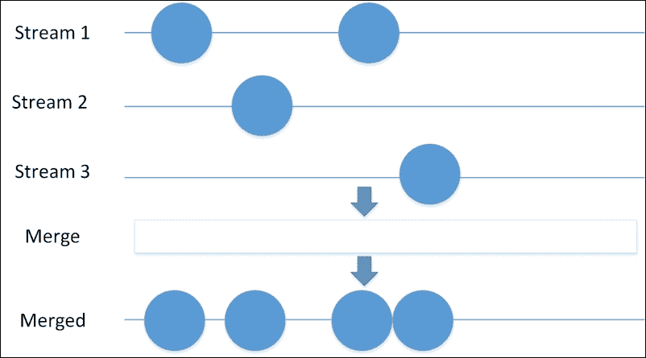

# 第七章：响应式编程

我曾经读过一本书，书中提到牛顿在观察芦苇周围的河流时想出了微积分的概念。我从未能找到其他支持这一说法的来源。然而，这是一个很好的形象。微积分涉及理解系统随时间变化的状态。大多数开发人员在日常工作中很少需要处理微积分。然而，他们必须处理系统的变化。毕竟，一个完全不变的系统是相当无聊的。

在过去几年中，关于将变化视为一系列事件的不同想法已经出现 - 就像牛顿所观察到的那条河流一样。给定一个起始位置和一系列事件，应该可以找出系统的状态。事实上，这就是使用事件存储的想法。我们不是将聚合的最终状态保存在数据库中，而是跟踪已应用于该聚合的所有事件。通过重放这一系列事件，我们可以重新创建聚合的当前状态。这似乎是一种存储对象状态的绕圈方式，但实际上对于许多情况非常有用。例如，一个断开连接的系统，比如手机应用程序在手机未连接到网络时，使用事件存储可以更容易地与其他事件合并，而不仅仅是保留最终状态。对于审计场景，它也非常有用，因为可以通过简单地在时间索引处停止重放来将系统拉回到任何时间点的状态。你有多少次被问到，“为什么系统处于这种状态？”，而你无法回答？有了事件存储，答案应该很容易确定。

在本章中，我们将涵盖以下主题：

+   应用状态变化

+   流

+   过滤流

+   合并流

+   用于多路复用的流

# 应用状态变化

在应用程序中，我们可以将所有事件发生的事情视为类似的事件流。用户点击按钮？事件。用户的鼠标进入某个区域？事件。时钟滴答？事件。在前端和后端应用程序中，事件是触发状态变化的事物。你可能已经在使用事件监听器进行事件处理。考虑将点击处理程序附加到按钮上：

```js
var item = document.getElementById("item1");
item. addEventListener("click", function(event){ /*do something */ });
```

在这段代码中，我们已经将处理程序附加到了`click`事件上。这是相当简单的代码，但是想象一下当我们添加条件时，这段代码的复杂性会如何迅速增加，比如“在点击后忽略 500 毫秒内的额外点击，以防止人们双击”和“如果按住*Ctrl*键时点击按钮，则触发不同的事件”。响应式编程或函数式响应式编程通过使用流提供了这些复杂交互场景的简单解决方案。让我们探讨一下你的代码如何从利用响应式编程中受益。

# 流

想要简单地思考事件流的最简单方法不是考虑你以前在编程中可能使用过的流，而是考虑数组。假设你有一个包含一系列数字的数组：

```js
[1, 4, 6, 9, 34, 56, 77, 1, 2, 3, 6, 10]
```

现在你想要过滤这个数组，只显示偶数。在现代 JavaScript 中，可以通过数组的`filter`函数轻松实现这一点：

```js
[1, 4, 6, 9, 34, 56, 77, 1, 2, 3, 6, 10].filter((x)=>x%2==0) =>
[4, 6, 34, 56, 2, 6, 10]
```

可以在这里看到一个图形表示：


这里的过滤功能保持不变，无论数组中有十个项目还是一万个项目。现在，如果源数组不断添加新项目，我们希望通过将任何新的偶数项目插入到依赖数组中来保持其最新状态。为此，我们可以使用类似装饰器的模式来钩入数组的`add`函数。使用装饰器，我们可以调用过滤方法，如果找到匹配项，就将其添加到过滤后的数组中。

实际上，流是对未来事件集合的可观察对象。可以使用流操作解决许多有趣的问题。让我们从一个简单的问题开始：处理点击。这个问题非常简单，表面上似乎没有使用流的优势。别担心，随着我们的深入，我们会让它变得更加困难。

在大部分情况下，本书避免使用任何特定的 JavaScript 库。这是因为模式应该能够在不需要太多仪式的情况下轻松实现。然而，在这种情况下，我们实际上要使用一个库，因为流的实现有一些细微之处，我们希望有一些语法上的美感。如果你想看看如何实现基本的流，那么你可以基于第五章中概述的观察者模式进行实现。

JavaScript 中有许多流库，如 Reactive.js、Bacon.js 和 RxJS 等。每个库都有各种优点和缺点，但具体细节超出了本书的范围。在本书中，我们将使用 JavaScript 的 Reactive Extensions，其源代码可以在 GitHub 上找到[`github.com/Reactive-Extensions/RxJS`](https://github.com/Reactive-Extensions/RxJS)。

让我们从一个简短的 HTML 代码开始：

```js
<body>
  <button id="button"> Click Me!</button>
  <span id="output"></span>
</body>
```

接下来，让我们添加一个快速的点击计数器：

```js
<script>
  var counter = 0;
  var button = document.getElementById('button');
  var source = Rx.Observable.fromEvent(button, 'click');
  var subscription = source.subscribe(function (e) {
    counter++;
    output.innerHTML = "Clicked " + counter + " time" + (counter > 1 ? "s" : "");
  });
</script>
```

在这里，你可以看到我们正在从按钮的`click`事件创建一个新的事件流。新创建的流通常被称为元流。每当从源流中发出事件时，它会自动被操作和发布到元流中。我们订阅了这个流并增加一个计数器。如果我们只想对偶数事件做出反应，我们可以通过向流订阅第二个函数来实现：

```js
var incrementSubscription = source.subscribe(() => counter++);
var subscription = source.filter(x=>counter%2==0).subscribe(function (e) {
  output.innerHTML = "Clicked " + counter + " time" +(counter > 1 ? "s" : "");
});
```

在这里，你可以看到我们正在对流应用过滤器，以使计数器与更新屏幕的函数不同。但是，将计数器保留在流之外感觉有些不好，对吧？很可能，每隔一次点击增加一次并不是这个函数的目标。更有可能的是，我们只想在双击时运行一个函数。

这是用传统方法很难做到的，然而这些复杂的交互可以很容易地通过流来实现。您可以看到我们如何在这段代码中解决这个问题：

```js
source.buffer(() => source.debounce(250))
.map((list) => list.length)
.filter((x) => x >= 2)
.subscribe((x)=> {
  counter++;
  output.innerHTML = "Clicked " + counter + " time" + (counter > 1 ? "s" : "");
});
```

在这里，我们获取点击流并使用防抖动来缓冲流以生成缓冲区的边界。防抖动是硬件世界的一个术语，意味着我们将一个嘈杂的信号清理成一个单一的事件。当按下物理按钮时，通常会有一些额外的高或低信号，而不是我们想要的单点信号。实际上，我们消除了在一个窗口内发生的重复信号。在这种情况下，我们等待`250`毫秒，然后触发一个事件以移动到一个新的缓冲区。缓冲区包含在防抖期间触发的所有事件，并将它们的列表传递给链中的下一个函数。map 函数生成一个以列表长度为内容的新流。接下来，我们过滤流，只显示值为 2 或更多的事件，即两次点击或更多。事件流看起来像下面的图表：


使用传统的事件监听器和回调执行相同的逻辑将会非常困难。人们很容易想象出一个更复杂的工作流程，这将失控。FRP 允许更简化的方式来处理事件。

# 过滤流

正如我们在前面的部分中看到的，可以过滤事件流，并从中产生一个新的事件流。您可能熟悉能够过滤数组中的项目。ES5 引入了一些新的数组运算符，如**filter**和**some**。其中的第一个产生一个只包含符合过滤规则的元素的新数组。`Some`是一个类似的函数，如果数组的任何元素匹配，则简单返回`true`。这些相同类型的函数也支持在流上，以及您可能熟悉的来自函数式语言的函数，如 First 和 Last。除了对数组有意义的函数之外，还有许多基于时间序列的函数，当您考虑到流存在于时间中时，这些函数更有意义。

我们已经看到了防抖动，这是一个基于时间的过滤器的例子。防抖动的另一个非常简单的应用是防止用户双击提交按钮的恼人错误。考虑一下使用流的代码有多简单：

```js
Rx.Observable.FromEvent(button, "click")
.debounce(1000).subscribe((x)=>doSomething());
```

您可能还会发现像 Sample 这样的函数，它从时间窗口生成一组事件。当我们处理可能产生大量事件的可观察对象时，这是一个非常方便的函数。考虑一下我们维斯特洛斯的示例。

不幸的是，维斯特洛是一个相当暴力的地方，人们似乎以不愉快的方式死去。有这么多人死去，我们不可能每个人都关注，所以我们只想对数据进行抽样并收集一些死因。

为了模拟这个传入的流，我们将从一个数组开始，类似于以下内容：

```js
var deaths = 
  {
    Name:"Stannis",
    Cause: "Cold"
  },
  {
    Name: "Tyrion",
    Cause: "Stabbing"
  },
…
}
```

### 提示

您可以看到我们正在使用数组来模拟事件流。这可以用任何流来完成，并且是一个非常简单的测试复杂代码的方法。您可以在数组中构建一个事件流，然后以适当的延迟发布它们，从而准确地表示从文件系统到用户交互的事件流的任何内容。

现在我们需要将我们的数组转换为事件流。幸运的是，有一些使用`from`方法的快捷方式可以做到这一点。这将简单地返回一个立即执行的流。我们希望假装我们有一个定期分布的事件流，或者在我们相当阴郁的情况下，死亡。这可以通过使用 RxJS 的两种方法来实现：`interval`和`zip`。`interval`创建一个定期间隔的事件流。`zip`匹配来自两个流的事件对。这两种方法一起将以定期间隔发出新的事件流：

```js
function generateDeathsStream(deaths) {
  return Rx.Observable.from(deaths).zip(Rx.Observable.interval(500), (death,_)=>death);
}
```

在这段代码中，我们将死亡数组与每`500`毫秒触发一次的间隔流进行了合并。因为我们对间隔事件不是特别感兴趣，所以我们简单地丢弃了它，并将数组中的项目进行了投影。

现在我们可以通过简单地取样本然后订阅它来对这个流进行取样。在这里，我们每`1500`毫秒取样一次：

```js
generateDeathsStream(deaths).sample(1500).subscribe((item) => { /*do something */ });
```

你可以有任意多个订阅者订阅一个流，所以如果你想进行一些取样，以及可能一些聚合函数，比如简单地计算事件的数量，你可以通过有几个订阅者来实现。

```js
Var counter = 0;
generateDeathsStream(deaths).subscribe((item) => { counter++ });
```

# 合并流

我们已经看到了`zip`函数，它将事件一对一地合并以创建一个新的流，但还有许多其他合并流的方法。一个非常简单的例子可能是一个页面，它有几个代码路径，它们都想执行类似的操作。也许我们有几个动作，所有这些动作都会导致状态消息被更新：

```js
var button1 = document.getElementById("button1");
var button2 = document.getElementById("button2");
var button3 = document.getElementById("button3");
var button1Stream = Rx.Observable.fromEvent(button1, 'click');
var button2Stream = Rx.Observable.fromEvent(button2, 'click');
var button3Stream = Rx.Observable.fromEvent(button3, 'click');
var messageStream = Rx.Observable.merge(button1Stream, button2Stream, button3Stream);
messageStream.subscribe(function (x) { return console.log(x.type + " on " + x.srcElement.id); });
```

在这段代码中，你可以看到各种流被传递到合并函数中，然后产生了合并后的流：


  
合并流虽然有用，但这段代码似乎并不比直接调用事件处理程序更好，实际上它比必要的代码还要长。然而，考虑到状态消息的来源不仅仅是按钮推送。我们可能还希望异步事件也写出信息。例如，向服务器发送请求可能还想添加状态信息。另一个很棒的应用可能是使用在后台运行并使用消息与主线程通信的 web worker。对于基于 web 的 JavaScript 应用程序，这是我们实现多线程应用程序的方式。让我们看看它是什么样子。

首先，我们可以从 worker 角色创建一个流。在我们的示例中，worker 只是计算斐波那契数列。我们在页面上添加了第四个按钮，并触发了 worker 进程：

```js
var worker = Rx.DOM.fromWorker("worker.js");
button4Stream.subscribe(function (_) {  
  worker.onNext({ cmd: "start", number: 35 });
});
```

现在我们可以订阅合并后的流，并将其与所有先前的流结合起来：

```js
var messageStream = Rx.Observable.merge(button1Stream, button2Stream, button3Stream, worker);
messageStream.subscribe(function (x) {  
  appendToOutput(x.type + (x.srcElement.id === undefined ? " with " + x.data : " on " + x.srcElement.id));
}, function (err) { return appendToOutput(err, true); });
```

这一切看起来非常好，但我们不想一次给用户提供数十个通知。我们可以通过使用与之前看到的相同的间隔 zip 模式来限制事件流，以便一次只显示一个 toast。在这段代码中，我们用调用 toast 显示库来替换我们的`appendToOutput`方法：

```js
var messageStream = Rx.Observable.merge(button1Stream, button2Stream, button3Stream, worker);
var intervalStream = Rx.Observable.interval(5000);
messageStream.zip(intervalStream, function (x, _) { return x;})
  .subscribe(function (x) {  
    toastr.info(x.type + (x.srcElement.id === undefined ? " with " + x.data : " on " + x.srcElement.id));
  }, function (err) { return toastr.error(err); });
```

正如你所看到的，这个功能的代码很简短，易于理解，但包含了大量的功能。# 多路复用流在 Westeros 国王的议会中，没有人能够在权力地位上升到一定程度而不擅长建立间谍网络。通常，最好的间谍是那些能够最快做出反应的人。同样，我们可能有一些代码可以选择调用许多不同的服务中的一个来完成相同的任务。一个很好的例子是信用卡处理器：我们使用哪个处理器并不重要，因为它们几乎都是一样的。

为了实现这一点，我们可以启动多个 HTTP 请求到每个服务。如果我们将每个请求放入一个流中，我们可以使用它来选择最快响应的处理器，然后使用该处理器执行其余的操作。使用 RxJS，这看起来像下面这样：

```js
var processors = Rx.Observable.amb(processorStream1, processorStream2);
```

甚至可以在`amb`调用中包含一个超时，以处理处理器没有及时响应的情况。# 提示和技巧可以应用于流的不同函数有很多。如果你决定在 JavaScript 中使用 RxJS 库进行 FRP 需求，许多常见的函数已经为你实现了。更复杂的函数通常可以编写为包含函数链，因此在编写自己的函数之前，尝试想出一种通过链式调用来创建所需功能的方法。

在 JavaScript 中，经常会出现跨网络的异步调用失败。网络是不可靠的，移动网络尤其如此。在大多数情况下，当网络失败时，我们的应用程序也会失败。流提供了一个简单的解决方法，允许您轻松重试失败的订阅。在 RxJS 中，这种方法被称为“重试”。将其插入到任何可观察链中，可以使其更具抗网络故障的能力。

# 总结

函数式响应式编程在服务器端和客户端的不同应用中有许多用途。在客户端，它可以用于将大量事件整合成数据流，实现复杂的交互。它也可以用于最简单的事情，比如防止用户双击按钮。仅仅使用流来处理所有数据变化并没有太大的成本。它们非常易于测试，并且对性能影响很小。

FRP 最美好的一点也许是它提高了抽象级别。您不必处理繁琐的流程代码，而是可以专注于应用程序的逻辑流。