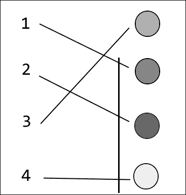

# 第九章：网页模式

Node.js 的崛起证明了 JavaScript 在 Web 服务器上有一席之地，甚至是非常高吞吐量的服务器。毫无疑问，JavaScript 的传统仍然在客户端进行编程的浏览器中。

在本章中，我们将探讨一些模式，以提高客户端 JavaScript 的性能和实用性。我不确定所有这些是否都可以被认为是严格意义上的模式。然而，它们是重要的，值得一提。

本章我们将讨论以下概念：

+   发送 JavaScript

+   插件

+   多线程

+   断路器模式

+   退避

+   承诺

# 发送 JavaScript

将 JavaScript 传输给客户端似乎是一个简单的命题：只要您可以将代码传输给客户端，那么传输方式并不重要，对吗？嗯，不完全是这样。实际上，在将 JavaScript 发送到浏览器时需要考虑一些事情。

## 合并文件

在第二章中，*组织代码*，我们讨论了如何使用 JavaScript 构建对象，尽管对此的看法有所不同。我认为，将我的 JavaScript 或任何面向对象的代码组织成一个类对应一个文件的形式是一个好习惯。通过这样做，可以轻松找到代码。没有人需要在 9000 行长的 JavaScript 文件中寻找那个方法。它还允许建立一个层次结构，再次实现良好的代码组织。然而，对于开发人员的良好组织并不一定对计算机来说是良好的组织。在我们的情况下，拥有大量小文件实际上是非常有害的。要了解为什么，您需要了解一些关于浏览器如何请求和接收内容的知识。

当您在浏览器的地址栏中输入 URL 并按下*Enter*时，会发生一系列级联事件。首先，浏览器会要求操作系统将网站名称解析为 IP 地址。在 Windows 和 Linux（以及 OSX）上使用标准 C 库函数`gethostbyname`。此函数将检查本地 DNS 缓存，以查看名称到地址的映射是否已知。如果是，则返回该信息。如果不是，则计算机会向其上一级的 DNS 服务器发出请求。通常，这是由 ISP 提供的 DNS 服务器，但在较大的网络上也可能是本地 DNS 服务器。可以在此处看到 DNS 服务器之间的查询路径：


如果服务器上不存在记录，则请求会在一系列 DNS 服务器之间传播，以尝试找到知道该域的服务器。最终，传播会停止在根服务器处。这些根服务器是查询的终点 - 如果它们不知道谁负责域的 DNS 信息，那么查找将被视为失败。

一旦浏览器有了站点的地址，它就会打开一个连接并发送对文档的请求。如果没有提供文档，则发送*/*。如果连接是安全的，则此时执行 SSL/TSL 的协商。建立加密连接会有一些计算开销，但这正在慢慢得到解决。

服务器将以 HTML 的形式做出响应。当浏览器接收到这个 HTML 时，它开始处理它；浏览器在整个 HTML 文档被下载之前并不等待。如果浏览器遇到一个外部于 HTML 的资源，它将启动一个新的请求，打开另一个连接到 Web 服务器并下载该资源。对于单个域的最大连接数是有限制的，以防止 Web 服务器被淹没。还应该提到，建立到 Web 服务器的新连接会带来开销。Web 客户端和服务器之间的数据流可以在这个插图中看到：


应该限制与 Web 服务器的连接，以避免重复支付连接设置成本。这带我们来到我们的第一个概念：合并文件。

如果您已经遵循了在 JavaScript 中利用命名空间和类的建议，那么将所有 JavaScript 放在单个文件中就是一个微不足道的步骤。只需要将文件连接在一起，一切应该继续像往常一样工作。可能需要稍微注意一下包含的顺序，但通常不需要。

我们之前编写的代码基本上是每个模式一个文件。如果需要使用多个模式，那么我们可以简单地将文件连接在一起。例如，组合的生成器和工厂方法模式可能如下所示：

```js
var Westeros;
(function (Westeros) {
  (function (Religion) {
      …
  })(Westeros.Religion || (Westeros.Religion = {}));
  var Religion = Westeros.Religion;
})(Westeros || (Westeros = {}));
(function (Westeros) {
  var Tournament = (function () {
    function Tournament() {
  }
  return Tournament;
})();
Westeros.Tournament = Tournament;
…
})();
Westeros.Attendee = Attendee;
})(Westeros || (Westeros = {}));
```

可能会出现一个问题，即应该一次组合和加载多少 JavaScript。这是一个令人惊讶地难以回答的问题。一方面，希望在用户首次访问站点时为整个站点加载所有 JavaScript。这意味着用户最初会付出代价，但在浏览站点时不必下载任何额外的 JavaScript。这是因为浏览器将缓存脚本并重复使用它，而不是再次从服务器下载。然而，如果用户只访问站点上的一小部分页面，那么他们将加载许多不需要的 JavaScript。

另一方面，拆分 JavaScript 意味着额外的页面访问会因检索额外的 JavaScript 文件而产生惩罚。这两种方法之间存在一个平衡点。脚本可以被组织成映射到网站不同部分的块。这可能是再次使用适当的命名空间的地方。每个命名空间可以合并到一个文件中，然后在用户访问站点的那部分时加载。

最终，唯一有意义的方法是维护关于用户如何在站点上移动的统计信息。根据这些信息，可以建立一个找到平衡点的最佳策略。

## 缩小

将 JavaScript 合并到单个文件中解决了限制请求数量的问题。然而，每个请求可能仍然很大。我们再次面临一个问题，即如何使代码对人类快速可读与对计算机快速可读之间的分歧。

我们人类喜欢描述性的变量名，丰富的空格和适当的缩进。计算机不在乎描述性名称，空格或适当的缩进。事实上，这些东西会增加文件的大小，从而减慢代码的阅读速度。

缩小是一个将人类可读的代码转换为更小但等效的代码的编译步骤。外部变量的名称保持不变，因为缩小器无法知道其他代码可能依赖于变量名称保持不变。

例如，如果我们从第四章的组合代码开始，*结构模式*，压缩后的代码如下所示：

```js
var Westros;(function(Westros){(function(Food){var SimpleIngredient=(function(){function SimpleIngredient(name,calories,ironContent,vitaminCContent){this.name=name;this.calories=calories;this.ironContent=ironContent;this.vitaminCContent=vitaminCContent}SimpleIngredient.prototype.GetName=function(){return this.name};SimpleIngredient.prototype.GetCalories=function(){return this.calories};SimpleIngredient.prototype.GetIronContent=function(){return this.ironContent};SimpleIngredient.prototype.GetVitaminCContent=function(){return this.vitaminCContent};return SimpleIngredient})();Food.SimpleIngredient=SimpleIngredient;var CompoundIngredient=(function(){function CompoundIngredient(name){this.name=name;this.ingredients=new Array()}CompoundIngredient.prototype.AddIngredient=function(ingredient){this.ingredients.push(ingredient)};CompoundIngredient.prototype.GetName=function(){return this.name};CompoundIngredient.prototype.GetCalories=function(){var total=0;for(var i=0;i<this.ingredients.length;i++){total+=this.ingredients[i].GetCalories()}return total};CompoundIngredient.prototype.GetIronContent=function(){var total=0;for(var i=0;i<this.ingredients.length;i++){total+=this.ingredients[i].GetIronContent()}return total};CompoundIngredient.prototype.GetVitaminCContent=function(){var total=0;for(var i=0;i<this.ingredients.length;i++){total+=this.ingredients[i].GetVitaminCContent()}return total};return CompoundIngredient})();Food.CompoundIngredient=CompoundIngredient})(Westros.Food||(Westros.Food={}));var Food=Westros.Food})(Westros||(Westros={}));
```

您会注意到所有空格已被移除，并且任何内部变量都已被替换为较小的版本。与此同时，您可以看到一些众所周知的变量名保持不变。

缩小使这段特定代码节省了 40%。使用 gzip 对服务器的内容流进行压缩是一种流行的方法，是无损压缩。这意味着压缩和未压缩之间存在完美的双射。另一方面，缩小是一种有损压缩。一旦进行了缩小，就无法仅从缩小的代码中恢复到未缩小的代码。

### 注意

您可以在[`betterexplained.com/articles/how-to-optimize-your-site-with-gzip-compression/`](http://betterexplained.com/articles/how-to-optimize-your-site-with-gzip-compression/)了解更多关于 gzip 压缩的信息。

如果需要返回到原始代码，则可以使用源映射。源映射是提供从一种代码格式到另一种代码格式的转换的文件。它可以被现代浏览器中的调试工具加载，允许您调试原始代码而不是难以理解的压缩代码。多个源映射可以组合在一起，以允许从压缩代码到未压缩的 JavaScript 到 TypeScript 的转换。

有许多工具可用于构建压缩和合并的 JavaScript。Gulp 和 Grunt 是构建 JavaScript 资产管道的基于 JavaScript 的工具。这两个工具都调用外部工具（如 Uglify）来执行实际工作。Gulp 和 Grunt 相当于 GNU Make 或 Ant。

## 内容交付网络

最终交付的技巧是利用**内容交付网络**（**CDN**）。CDN 是分布式主机网络，其唯一目的是提供静态内容。就像浏览器在网站页面之间缓存 JavaScript 一样，它也会缓存在多个 Web 服务器之间共享的 JavaScript。因此，如果您的网站使用 jQuery，从知名 CDN（如[`code.jquery.com/`](https://code.jquery.com/)或 Microsoft 的 ASP.net CDN）获取 jQuery 可能会更快，因为它已经被缓存。从 CDN 获取还意味着内容来自不同的域，并且不计入对服务器的有限连接。引用 CDN 就像将脚本标签的源设置为指向 CDN 一样简单。

再次，需要收集一些指标，以查看是更好使用 CDN 还是将库简单地合并到 JavaScript 包中。此类指标的示例可能包括执行额外 DNS 查找所需的时间以及下载大小的差异。最佳方法是使用浏览器中的时间 API。

将 JavaScript 分发到浏览器的长短是需要实验的。测试多种方法并测量结果将为最终用户带来最佳结果。

# 插件

在野外有许多令人印象深刻的 JavaScript 库。对我来说，改变了我对 JavaScript 的看法的库是 jQuery。对于其他人来说，可能是其他流行的库，比如 MooTool、Dojo、Prototype 或 YUI。然而，jQuery 在流行度上迅速增长，并且在撰写本文时，已经赢得了 JavaScript 库之争。互联网上前一万个网站中有 78.5%使用了某个版本的 jQuery。其他库甚至没有超过 1%。

许多开发人员已经决定在这些基础库的基础上实现自己的库，以插件的形式。插件通常修改库暴露的原型并添加额外的功能。语法是这样的，对于最终开发人员来说，它看起来就像是核心库的一部分。

构建插件的方式取决于您要扩展的库。尽管如此，让我们看看如何为 jQuery 构建插件，然后为我最喜欢的库之一 d3 构建插件。我们将看看是否可以提取一些共同点。

## jQuery

jQuery 的核心是名为`sizzle.js`的 CSS 选择器库。正是 sizzle 负责 jQuery 可以使用 CSS3 选择器在页面上选择项目的所有非常聪明的方法。使用 jQuery 在页面上选择元素如下：

```js
$(":input").css("background-color", "blue");
```

在这里，返回了一个 jQuery 对象。jQuery 对象的行为很像，尽管不完全像数组。这是通过在 jQuery 对象上创建一系列从 0 到 n-1 的键来实现的，其中 n 是选择器匹配的元素数量。这实际上非常聪明，因为它使得可以像访问数组一样访问器：

```js
$($(":input")[2]).css("background-color", "blue");
```

虽然提供了大量额外的功能，但索引处的项目是普通的 HTML 元素，而不是用 jQuery 包装的，因此使用第二个`$()`。

对于 jQuery 插件，我们通常希望使我们的插件扩展这个 jQuery 对象。因为它在每次选择器被触发时动态创建，我们实际上扩展了一个名为`$.fn`的对象。这个对象被用作创建所有 jQuery 对象的基础。因此，创建一个插件，将页面上所有输入框中的文本转换为大写，名义上就像下面这样简单：

```js
$.fn.yeller = function(){
  this.each(function(_, item){
    $(item).val($(item).val().toUpperCase());
    return this;
  });
};
```

这个插件特别适用于发布到公告板，以及每当我的老板填写表格时。该插件遍历选择器选择的所有对象，并将它们的内容转换为大写。它也返回这个。通过这样做，我们允许链接额外的函数。您可以这样使用该函数：

```js
$(function(){$("input").yeller();});
```

这在很大程度上取决于`$`变量被赋值给 jQuery。这并不总是这样，因为`$`是 JavaScript 库中一个常用的变量，可能是因为它是唯一一个既不是字母也不是数字，也没有特殊含义的字符。

为了解决这个问题，我们可以使用立即执行的函数，就像我们在第二章中所做的那样，*组织代码*：

```js
(function($){
  $.fn.yeller2 = function(){
    this.each(function(_, item){
      $(item).val($(item).val().toUpperCase());
      return this;
    });
  };
})(jQuery);
```

这里的额外优势是，如果我们的代码需要辅助函数或私有变量，它们可以在同一个函数内设置。您还可以传入所需的任何选项。jQuery 提供了一个非常有用的`$.extend`函数，它可以在对象之间复制属性，非常适合用于将一组默认选项与传入的选项扩展在一起。我们在之前的章节中详细讨论过这一点。

jQuery 插件文档建议尽量减少对 jQuery 对象的污染。这是为了避免多个插件之间使用相同名称而产生冲突。他们的解决方案是有一个单一的函数，具有不同的行为，取决于传入的参数。例如，jQuery UI 插件就使用了这种方法来创建对话框：

```js
$(«.dialog»).dialog(«open»);
$(«.dialog»).dialog(«close»);
```

我更喜欢这样调用：

```js
$(«.dialog»).dialog().open();
$(«.dialog»).dialog().close();
```

使用动态语言，实际上并没有太大的区别，但我更喜欢有良好命名的函数，可以通过工具发现，而不是魔术字符串。

## d3

d3 是一个用于创建和操作可视化的优秀 JavaScript 库。大多数情况下，人们会将 d3 与可伸缩矢量图形一起使用，以制作像 Mike Bostock 的这个六边形图表一样的图形：


d3 试图不对其创建的可视化类型发表意见。因此，它没有内置支持创建条形图等内容。然而，有一系列插件可以添加到 d3 中，以实现各种各样的图表，包括前面图中显示的六边形图表。

更重要的是，jQuery d3 强调创建可链接的函数。例如，这段代码是创建柱状图的片段。您可以看到所有的属性都是通过链接设置的：

```js
var svg = d3.select(containerId).append("svg")
var bar = svg.selectAll("g").data(data).enter().append("g");
bar.append("rect")
.attr("height", yScale.rangeBand()).attr("fill", function (d, _) {
  return colorScale.getColor(d);
})
.attr("stroke", function (d, _) {
  return colorScale.getColor(d);
})
.attr("y", function (d, i) {
  return yScale(d.Id) + margins.height;
})
```

`d3`的核心是`d3`对象。该对象下挂了许多用于布局、比例尺、几何等的命名空间。除了整个命名空间，还有用于数组操作和从外部源加载数据的函数。

为`d3`创建一个插件的开始是决定我们将在代码中插入的位置。让我们构建一个创建新颜色比例尺的插件。颜色比例尺用于将一组值的定义域映射到一组颜色的值域。例如，我们可能希望将以下四个值的定义域映射到四种颜色的值域：



让我们插入一个函数来提供一个新的颜色比例尺，这种情况下支持分组元素。比例尺是一个将定义域映射到值域的函数。对于颜色比例尺，值域是一组颜色。一个例子可能是一个函数，将所有偶数映射到红色，所有奇数映射到白色。在表格上使用这个比例尺会产生斑马条纹：

```js
d3.scale.groupedColorScale = function () {
  var domain, range;

  function scale(x) {
    var rangeIndex = 0;
    domain.forEach(function (item, index) {
      if (item.indexOf(x) > 0)
        rangeIndex = index;
    });
    return range[rangeIndex];
  }

  scale.domain = function (x) {
    if (!arguments.length)
      return domain;
    domain = x;
    return scale;
  };

  scale.range = function (x) {
    if (!arguments.length)
      return range;
    range = x;
    return scale;
  };
  return scale;
};
```

我们只需将这个插件附加到现有的`d3.scale`对象上。这可以通过简单地给定一个数组作为定义域和一个数组作为值域来使用：

```js
var s = d3.scale.groupedColorScale().domain([[1, 2, 3], [4, 5]]).range(["#111111", "#222222"]);
s(3); //#111111
s(4); //#222222
```

这个简单的插件扩展了 d3 的比例尺功能。我们可以替换现有的功能，甚至包装它，使得对现有功能的调用可以通过我们的插件代理。

插件通常并不难构建，但它们在不同的库中可能有所不同。重要的是要注意库中现有变量名，以免覆盖它们，甚至覆盖其他插件提供的功能。一些建议使用字符串前缀来避免覆盖。

如果库在设计时考虑到了这一点，可能会有更多的地方可以挂接。一个流行的方法是提供一个选项对象，其中包含用于挂接我们自己的函数作为事件处理程序的可选字段。如果没有提供任何内容，函数将继续正常运行。

# 同时做两件事情-多线程

同时做两件事情是困难的。多年来，计算机世界的解决方案要么是使用多个进程，要么是使用多个线程。由于不同操作系统上的实现差异，两者之间的区别模糊不清，但线程通常是进程的轻量级版本。浏览器上的 JavaScript 不支持这两种方法。

在浏览器上历史上并没有真正需要多线程。JavaScript 被用来操作用户界面。在操作用户界面时，即使在其他语言和窗口环境中，也只允许一个线程同时操作。这避免了对用户来说非常明显的竞争条件。

然而，随着 JavaScript 在流行度上的增长，越来越复杂的软件被编写以在浏览器内运行。有时，这些软件确实可以从在后台执行复杂计算中受益。

Web workers 为浏览器提供了一种同时进行两件事情的机制。虽然这是一个相当新的创新，但 Web workers 现在在主流浏览器中得到了很好的支持。实际上，工作线程是一个可以使用消息与主线程通信的后台线程。Web workers 必须在单个 JavaScript 文件中自包含。

使用 Web workers 相当容易。我们将回顾一下之前几章中我们看过的斐波那契数列的例子。工作进程监听消息如下：

```js
self.addEventListener('message', function(e) {
  var data = e.data;
  if(data.cmd == 'startCalculation'){
    self.postMessage({event: 'calculationStarted'});
    var result = fib(data.parameters.number);
    self.postMessage({event: 'calculationComplete', result: result});
  };
}, false);
```

在这里，每当收到一个`startCalculation`消息时，我们就会启动一个新的`fib`实例。`fib`只是之前的朴素实现。

主线程从外部文件加载工作进程，并附加了一些监听器：

```js
function startThread(){
  worker =  new Worker("worker.js");
  worker.addEventListener('message', function(message) {
    logEvent(message.data.event);
    if(message.data.event == "calculationComplete"){
      writeResult(message.data.result);
    }
    if(message.data.event == "calculationStarted"){
      document.getElementById("result").innerHTML = "working";
    }
  });
};
```

为了开始计算，只需要发送一个命令：

```js
worker.postMessage({cmd: 'startCalculation', parameters: { number: 40}});
```

在这里，我们传递我们想要计算的序列中的项的编号。当计算在后台运行时，主线程可以自由地做任何它想做的事情。当从工作线程接收到消息时，它被放入正常的事件循环中进行处理：


如果你需要在 JavaScript 中进行耗时的计算，Web workers 可能对你有用。

如果你通过 Node.js 使用服务器端 JavaScript，那么进行多任务处理有不同的方法。Node.js 提供了分叉子进程的能力，并提供了一个与 Web worker 类似的接口来在子进程和父进程之间通信。不过这种方法会分叉整个进程，比使用轻量级线程更加消耗资源。

在 Node.js 中还存在一些其他工具，可以创建轻量级的后台工作进程。这些可能更接近于 Web 端存在的情况，而不是分叉子进程。

# 断路器模式

系统，即使是设计最好的系统，也会失败。系统越大、分布越广，失败的可能性就越高。许多大型系统，如 Netflix 或 Google，都内置了大量冗余。冗余并不会减少组件失败的可能性，但它们提供了备用方案。切换到备用方案通常对最终用户是透明的。

断路器模式是提供这种冗余的系统的常见组件。假设您的应用程序每五秒查询一次外部数据源，也许您正在轮询一些预计会发生变化的数据。当此轮询失败时会发生什么？在许多情况下，失败被简单地忽略，轮询继续进行。这实际上是客户端端的一个相当好的行为，因为数据更新并不总是至关重要。在某些情况下，失败会导致应用程序立即重试请求。在紧密的循环中重试服务器请求对客户端和服务器都可能有问题。客户端可能因为在循环中请求数据而变得无响应。

在服务器端，一个试图从失败中恢复的系统每五秒钟就会受到可能是成千上万的客户端的冲击。如果失败是由系统过载造成的，那么继续查询它只会使情况变得更糟。

断路器模式在达到一定数量的失败后停止尝试与正在失败的系统通信。基本上，重复的失败导致断路器被打开，应用程序停止查询。您可以在这个插图中看到断路器的一般模式：


对于服务器来说，随着失败的积累，客户端数量的减少为其提供了一些喘息的空间来恢复。请求风暴进来并使系统崩溃的可能性被最小化。

当然，我们希望断路器在某个时候重置，以便恢复服务。对此有两种方法，一种是客户端定期轮询（比以前频率低）并重置断路器，另一种是外部系统向其客户端通信服务已恢复。

## 退避

断路器模式的一个变种是使用某种形式的退避，而不是完全切断与服务器的通信。这是许多数据库供应商和云提供商建议的一种方法。如果我们最初的轮询间隔为五秒，那么当检测到失败时，将间隔更改为每 10 秒一次。重复这个过程，使用越来越长的间隔。

当请求重新开始工作时，更改时间间隔的模式将被颠倒。请求会越来越接近，直到恢复原始的轮询间隔。

监视外部资源可用性的状态是使用后台工作角色的理想场所。这项工作并不复杂，但它完全与主事件循环无关。

这再次减少了对外部资源的负载，为其提供了更多的喘息空间。它还使客户端不会因过多的轮询而负担过重。

使用 jQuery 的`ajax`函数的示例如下：

```js
$.ajax({
  url : 'someurl',
  type : 'POST',
  data :  ....,
  tryCount : 0,
  retryLimit : 3,
  success : function(json) {
    //do something
  },
  error : function(xhr, textStatus, errorThrown ) {
    if (textStatus == 'timeout') {
      this.tryCount++;
      **if (this.tryCount <= this.retryLimit) {** 

 **//try again** 

 **$.ajax(this);** 

 **return;** 

      }
      return;
    }
    if (xhr.status == 500) {
      //handle error
    } else {
      //handle error
    }
  }
});
```

您可以看到，突出显示的部分重新尝试查询。

这种退避方式实际上在以太网中用于避免重复的数据包碰撞。

## 降级的应用程序行为

您的应用程序呼叫外部资源很可能有很好的理由。退避并不查询数据源是完全合理的，但仍然希望用户能够与网站进行交互。解决这个问题的一个方法是降低应用程序的行为。

例如，如果您的应用程序显示实时股票报价信息，但提供股票信息的系统出现故障，那么可以替换为一个不太实时的服务。现代浏览器有许多不同的技术，允许在客户端计算机上存储少量数据。这个存储空间非常适合缓存一些旧版本的数据，以防最新版本不可用。

即使在应用程序向服务器发送数据的情况下，也可以降级行为。通常可以在本地保存数据更新，然后在服务恢复时一起发送它们。当用户离开页面时，任何后台工作都将终止。如果用户再也不返回网站，那么他们排队发送到服务器的任何更新都将丢失。

### 注意

一个警告：如果您采取这种方法，最好警告用户他们的数据已经过时，特别是如果您的应用程序是股票交易应用程序。

# 承诺模式

我之前说过 JavaScript 是单线程的。这并不完全准确。JavaScript 中有一个单一的事件循环。用长时间运行的进程阻塞这个事件循环被认为是不好的形式。当您的贪婪算法占用所有 CPU 周期时，其他事情就无法发生了。

当您在 JavaScript 中启动异步函数，比如从远程服务器获取数据时，很多活动都发生在不同的线程中。成功或失败处理程序函数在主事件线程中执行。这也是成功处理程序被编写为函数的部分原因：它允许它们在不同的上下文之间轻松传递。

因此，确实有一些活动是以异步、并行的方式发生的。当`async`方法完成后，结果将传递给我们提供的处理程序，并且处理程序将被放入事件队列中，在事件循环重复时下次被接收。通常，事件循环每秒运行数百次或数千次，具体取决于每次迭代需要做多少工作。

从语法上讲，我们将消息处理程序编写为函数并将其挂钩：

```js
var xmlhttp = new XMLHttpRequest(); 
xmlhttp.onreadystatechange = function() { 
  if (xmlhttp.readyState === 4){ 
    alert(xmlhttp.readyState); 
  }
;};
```

如果情况简单，这是合理的。然而，如果您想要对回调的结果执行一些额外的异步操作，那么您最终会得到嵌套的回调。如果需要添加错误处理，也是使用回调来完成。等待多个回调返回并协调您的响应的复杂性会迅速上升。

承诺模式提供了一些语法帮助来清理异步困难。如果我们采取一个常见的异步操作，比如使用 jQuery 通过 XMLHttp 请求检索数据，那么代码会同时接受错误和成功函数。它可能看起来像下面这样：

```js
$.ajax("/some/url",
{ success: function(data, status){},
  error: function(jqXHR, status){}
});
```

使用承诺而不是会使代码看起来更像下面这样：

```js
$.ajax("/some/url").then(successFunction, errorFunction);
```

在这种情况下，`$.ajax`方法返回一个包含值和状态的承诺对象。当异步调用完成时，该值将被填充。状态提供了有关请求当前状态的一些信息：它是否已完成，是否成功？

承诺还有许多在其上调用的函数。`then()`函数接受一个成功和一个错误函数，并返回一个额外的承诺。如果成功函数同步运行，那么承诺会立即返回为已实现。否则，它将保持在一个工作状态中，即待定状态，直到异步成功触发为止。

在我看来，jQuery 实现承诺的方法并不理想。他们的错误处理没有正确区分承诺未能实现和已失败但已处理的承诺。这使得 jQuery 的承诺与承诺的一般概念不兼容。例如，无法执行以下操作：

```js
$.ajax("/some/url").then(
  function(data, status){},
  function(jqXHR, status){
    //handle the error here and return a new promise
  }
).then(/*continue*/);
```

尽管错误已经被处理并返回了一个新的承诺，但处理将会终止。如果函数能够被写成以下形式将会更好：

```js
$.ajax("/some/url").then(function(data, status){})
.catch(function(jqXHR, status){
  //handle the error here and return a new promise
})
.then(/*continue*/);
```

关于在 jQuery 和其他库中实现承诺的讨论很多。由于这些讨论，当前提出的承诺规范与 jQuery 的承诺规范不同，并且不兼容。Promises/A+是许多承诺库（如`when.js`和 Q）满足的认证。它也构成了 ECMAScript-2015 所带来的承诺规范的基础。

承诺为同步和异步函数之间提供了桥梁，实际上将异步函数转换为可以像同步函数一样操作的东西。

如果承诺听起来很像我们在前几章看到的惰性评估模式，那么你完全正确。承诺是使用惰性评估构建的，对它们调用的操作被排队在对象内部，而不是立即评估。这是函数模式的一个很好的应用，甚至可以实现以下场景：

```js
when(function(){return 2+2;})
.delay(1000)
.then(function(promise){ console.log(promise());})
```

承诺极大地简化了 JavaScript 中的异步编程，并且应该被考虑用于任何在性质上是高度异步的项目中。

# 提示和技巧

ECMAScript 2015 的承诺在大多数浏览器上得到了很好的支持。如果需要支持旧版浏览器，那么有一些很棒的 shim 可以添加功能而不会增加太多开销。

当检查从远程服务器检索 JavaScript 的性能时，大多数现代浏览器都提供了工具来查看资源加载的时间轴。这个时间轴将显示浏览器何时在等待脚本下载，以及何时在解析脚本。使用这个时间轴可以进行实验，找到加载脚本或一系列脚本的最佳方式。

# 摘要

在本章中，我们看了一些改进 JavaScript 开发体验的模式或方法。我们关注了一些关于传递到浏览器的问题。我们还看了如何针对一些库实现插件并推断出一般的实践。接下来，我们看了如何在 JavaScript 中处理后台进程。断路器被建议作为保持远程资源获取的方法。最后，我们研究了承诺如何改进异步代码的编写。

在下一章中，我们将花费更多的时间来研究消息模式。我们已经稍微了解了如何使用 web worker，但在下一节中我们将大量扩展。

