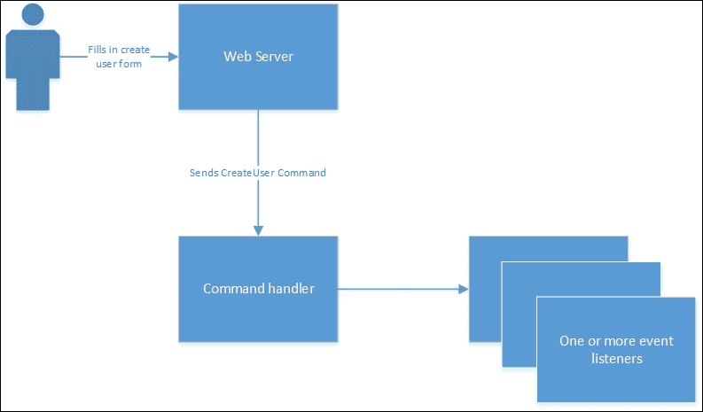

# 第十章：消息模式

当 Smalltalk，第一个真正的面向对象的编程语言，首次开发时，类之间的通信被设想为消息。不知何故，我们已经偏离了这个纯粹的消息理念。我们稍微谈到了函数式编程如何避免副作用，同样，基于消息的系统也是如此。

消息还可以实现令人印象深刻的可伸缩性，因为消息可以传播到数十甚至数百台计算机。在单个应用程序中，消息传递促进了低耦合和测试的便利性。

在本章中，我们将看一些与消息相关的模式。在本章结束时，您应该知道消息是如何工作的。当我第一次了解消息时，我想用它重写一切。

我们将涵盖以下主题：

+   消息到底是什么？

+   命令

+   事件

+   请求-回复

+   发布-订阅

+   扇出

+   死信队列

+   消息重播

+   管道和过滤器

# 消息到底是什么？

在最简单的定义中，消息是一组相关的数据位，它们一起具有一定的含义。消息的命名方式提供了一些额外的含义。例如，`AddUser`和`RenameUser`消息可能具有以下字段：

+   用户 ID

+   用户名

但是，这些字段存在于命名容器内的事实赋予了它们不同的含义。

消息通常与应用程序中的某个操作或业务中的某个操作相关。消息包含接收者执行操作所需的所有信息。在`RenameUser`消息的情况下，消息包含足够的信息，以便任何跟踪用户 ID 和用户名之间关系的组件更新其用户名值。

许多消息系统，特别是在应用程序边界之间通信的系统，还定义了**信封**。信封上有元数据，可以帮助消息审计、路由和安全性。信封上的信息不是业务流程的一部分，而是基础设施的一部分。因此，在信封上有安全注释是可以的，因为安全性存在于正常业务工作流程之外，并由应用程序的不同部分拥有。信封上的内容看起来像下图所示的内容：


消息应该被封闭，以便在创建后不能对其进行更改。这使得诸如审计和重播等操作更加容易。

消息可以用于在单个进程内进行通信，也可以用于应用程序之间进行通信。在大多数情况下，在应用程序内部发送消息和应用程序之间发送消息没有区别。一个区别是同步处理的处理。在单个进程内，消息可以以同步方式处理。这意味着主要处理在继续之前会等待消息的处理完成。

在异步场景中，消息的处理可能会在以后的某个时间发生。有时，这个时间可能是遥远的未来。当调用外部服务器时，异步肯定是正确的方法——这是由于与网络 I/O 相关的固有延迟。即使在单个进程内，JavaScript 的单线程特性也鼓励使用异步消息传递。在使用异步消息传递时，需要额外的注意和关注，因为一些针对同步消息传递所做的假设不再安全。例如，假设消息将按照发送顺序进行回复不再安全。

消息有两种不同的类型：命令和事件。命令指示发生的事情，而事件通知发生的事情。

## 命令

命令只是系统的一部分向另一部分发出的指令。这是一条消息，因此实际上只是一个简单的数据传输对象。如果回想一下在第五章中介绍的命令模式，*行为模式*，这正是它所使用的。

作为惯例，命令使用命令式命名。格式通常是`<动词><对象>`。因此，一个命令可能被称为`InvadeCity`。通常，在命名命令时，您希望避免使用通用名称，而是专注于导致命令的确切原因。

例如，考虑一个更改用户地址的命令。您可能会简单地称该命令为`ChangeAddress`，但这样做并没有添加任何额外的信息。更好的做法是深入挖掘并查看为什么要更改地址。是因为人搬家了，还是原始地址输入错误了？意图与实际数据更改一样重要。例如，由于错误而更改地址可能会触发与搬家的人不同的行为。搬家的用户可以收到搬家礼物，而更正地址的用户则不会。

消息应该具有业务含义的组件，以增加它们的效用。在复杂业务中定义消息以及它们如何构造是一个独立的研究领域。有兴趣的人可能会对**领域驱动设计**（**DDD**）感兴趣。

命令是针对特定组件的指令，用于给其下达执行任务的指示。

在浏览器的上下文中，你可以认为命令是在按钮上触发的点击。命令被转换为事件，而事件则传递给你的事件监听器。

只有一个端点应该接收特定的命令。这意味着只有一个组件负责执行动作。一旦一个命令被多个端点执行，就会引入任意数量的竞争条件。如果其中一个端点接受了命令，而另一个将其拒绝为无效呢？即使在发出了几个几乎相同的命令的情况下，它们也不应该被聚合。例如，从国王发送一个命令给他的所有将军应该给每个将军发送一个命令。

因为只有一个端点可以接收命令，所以该端点有可能验证甚至取消命令。命令的取消不应对应用程序的其余部分产生影响。

当执行了一个命令，就可能发布一个或多个事件。

## 事件

事件是一种特殊的消息，用于通知发生了某事。试图更改或取消事件是没有意义的，因为它只是通知发生了某事。除非你拥有一辆德洛雷安，否则你无法改变过去。

事件的命名约定是使用过去时。你可能会看到命令中单词顺序的颠倒，因此一旦`InvadeCity`命令成功，我们可能会得到`CityInvaded`。

与命令不同，事件可以被任意数量的组件接收。这种方法不会产生真正的竞争条件。由于没有消息处理程序可以更改消息或干扰其他副本消息的传递，每个处理程序都与其他处理程序隔离开来。

你可能对事件有所了解，因为你做过用户界面工作。当用户点击按钮时，事件就会“触发”。实际上，事件会广播给一系列监听器。你可以通过连接到该事件来订阅消息：

```js
document.getElementById("button1").addEventListener("click", doSomething);
```

浏览器中的事件并不完全符合我在前面段落中给出的事件定义。这是因为浏览器中的事件处理程序可以取消事件并阻止其传播到下一个处理程序。也就是说，当同一消息有一系列事件处理程序时，其中一个可以完全消耗该消息，不将其传递给后续处理程序。这样的方法当然有其用处，但也会引入一些混乱。幸运的是，对于 UI 消息，处理程序的数量通常相当少。

在某些系统中，事件可能具有多态性质。也就是说，如果我有一个名为`IsHiredSalary`的事件，当有人被聘用为有薪角色时会触发该事件，我可以将其作为消息`IsHired`的后代。这样做可以让订阅了`IsHiredSalary`和`IsHired`的处理程序在接收到`IsHiredSalary`事件时都被触发。JavaScript 并没有真正意义上的多态性，因此这样的东西并不特别有用。你可以添加一个消息字段来代替多态性，但看起来有些混乱：

```js
var IsHiredSalary = { __name: "isHiredSalary",
  __alsoCall: ["isHired"],
  employeeId: 77,
  …
}
```

在这种情况下，我使用`__`来表示信封中的字段。你也可以构建具有消息和信封的单独字段的消息，这并不那么重要。

让我们来看一个简单的操作，比如创建用户，以便我们可以看到命令和事件是如何交互的：



在这里，用户输入数据到表单并提交。Web 服务器接收输入，验证它，如果正确，创建一个命令。现在命令被发送到命令处理程序。命令处理程序执行一些操作，也许写入数据库，然后发布一个事件，被多个事件监听器消费。这些事件监听器可能发送确认电子邮件，通知系统管理员，或者执行任何数量的操作。

所有这些看起来很熟悉，因为系统已经包含了命令和事件。不同之处在于，我们现在明确地对命令和事件进行建模。

# 请求-响应

您将在消息传递中看到的最简单的模式是请求-响应模式。也称为请求-响应，这是一种检索由应用程序的另一部分拥有的数据的方法。

在许多情况下，发送命令是一个异步操作。命令被触发后，应用程序流程会继续进行。因此，没有简单的方法来执行诸如按 ID 查找记录之类的操作。相反，需要发送一个命令来检索记录，然后等待相关事件的返回。正常的工作流程如下图所示：


大多数事件可以被任意数量的监听器订阅。虽然可能对请求-响应模式有多个事件监听器，但这不太可能，也可能不可取。

我们可以在这里实现一个非常简单的请求-响应模式。在维斯特洛，发送及时消息存在一些问题。没有电力，通过乌鸦的腿传递消息是唯一可以快速实现的远距离传递消息的方法。因此我们有了一个乌鸦消息系统。

我们将从构建我们称之为**总线**开始。总线只是消息的分发机制。它可以在进程中实现，就像我们在这里做的一样，也可以在进程外实现。如果在进程外实现，有许多选项，从轻量级消息队列 0mq，到更全面的消息系统 RabbitMQ，再到建立在数据库和云端的各种系统。这些系统在消息的可靠性和持久性方面表现出一些不同的行为。重要的是要对消息分发系统的工作方式进行一些研究，因为它们可能决定应用程序的构建方式。它们还实现了不同的方法来处理应用程序的基本不可靠性：

```js
class CrowMailBus {
  constructor(requestor) {
    this.requestor = requestor;
    this.responder = new CrowMailResponder(this);
  }
  Send(message) {
    if (message.__from == "requestor") {
      this.responder.processMessage(message);
    }
    else {
      this.requestor.processMessage(message);
    }
  }
}
```

一个潜在的问题是客户端接收消息的顺序不一定是发送消息的顺序。为了解决这个问题，通常会包含某种相关 ID。当事件被触发时，它会包含来自发送方的已知 ID，以便使用正确的事件处理程序。

这个总线是一个非常天真的总线，因为它的路由是硬编码的。一个真正的总线可能允许发送者指定交付的终点地址。或者，接收者可以注册自己对特定类型的消息感兴趣。然后总线将负责进行一些有限的路由来指导消息。我们的总线甚至以它处理的消息命名 - 这显然不是一种可扩展的方法。

接下来我们将实现请求者。请求者只包含两种方法：一个用于发送请求，另一个用于从总线接收响应：

```js
class CrowMailRequestor {
  Request() {
    var message = { __messageDate: new Date(),
    __from: "requestor",
    __corrolationId: Math.random(),
    body: "Hello there. What is the square root of 9?" };
    var bus = new CrowMailBus(this);
    bus.Send(message);
    console.log("message sent!");
  }
  processMessage(message) {
    console.dir(message);
  }
}
```

处理消息函数目前只是记录响应，但在实际情况下可能会执行更多操作，比如更新 UI 或分派另一个消息。相关 ID 对于理解回复与发送消息的关联非常宝贵。

最后，响应者只是接收消息并用另一条消息回复。

```js
class CrowMailResponder {
  constructor(bus) {
    this.bus = bus;
  }
  processMessage(message) {
    var response = { __messageDate: new Date(),
    __from: "responder",
    __corrolationId: message.__corrolationId,
    body: "Okay invaded." };
    this.bus.Send(response);
    console.log("Reply sent");
  }
}
```

我们示例中的一切都是同步的，但要使其异步化只需要更换总线。如果我们在 node 中工作，可以使用`process.nextTick`来实现这一点，它只是将一个函数推迟到事件循环的下一次。如果我们在 web 上下文中，那么可以使用 web workers 在另一个线程中进行处理。实际上，启动 web worker 时，与其来回通信采用消息的形式：

```js
class CrowMailBus {
  constructor(requestor) {
    this.requestor = requestor;
    this.responder = new CrowMailResponder(this);
  }
  Send(message) {
    if (message.__from == "requestor") {
      process.nextTick(() => this.responder.processMessage(message));
    }
    else {
      process.nextTick(() => this.requestor.processMessage(message));
    }
  }
}
```

这种方法现在允许其他代码在消息被处理之前运行。如果我们在每次总线发送后编织一些打印语句，那么我们会得到以下输出：

```js
Request sent!
Reply sent
{ __messageDate: Mon Aug 11 2014 22:43:07 GMT-0600 (MDT),
  __from: 'responder',
  __corrolationId: 0.5604551520664245,
  body: 'Okay, invaded.' }
```

你可以看到打印语句在消息处理之前执行，因为该处理发生在下一次迭代中。

# 发布-订阅

在本章的其他地方，我已经提到了发布-订阅模型。发布-订阅是将事件与处理代码解耦的强大工具。

模式的关键在于，作为消息发布者，我的责任应该在我发送消息后立即结束。我不应该知道谁在监听消息或他们将对消息做什么。只要我履行了生成正确格式的消息的合同，其他事情就不重要了。

监听者有责任注册对消息类型的兴趣。当然，您希望注册某种安全性来阻止注册恶意服务。

我们可以更新我们的服务总线来做更多事情，完成路由和发送多个消息的工作。让我们将新方法称为`Publish`而不是`Send`。我们将保留`Send`来执行发送功能：


我们在上一节中使用的乌鸦邮件类比在这里开始崩溃，因为没有办法使用乌鸦广播消息。乌鸦太小，无法携带大型横幅，而且很难训练它们进行天空书写。我不愿意完全放弃乌鸦的想法，所以让我们假设存在一种乌鸦广播中心。在这里发送消息允许将其传播给许多已注册更新的感兴趣的各方。这个中心将更多或更少地与总线同义。

我们将编写我们的路由器，使其作为消息名称的函数。可以使用消息的任何属性来路由消息。例如，监听器可以订阅所有名为`invoicePaid`的消息，其中`amount`字段大于$10000。将这种逻辑添加到总线中会减慢它的速度，并且使调试变得更加困难。实际上，这更多地属于业务流程编排引擎的领域，而不是总线。我们将继续进行而不涉及这种复杂性。

首先要设置的是订阅发布消息的能力：

```js
CrowMailBus.prototype.Subscribe = function (messageName, subscriber) {
  this.responders.push({ messageName: messageName, subscriber: subscriber });
};
```

`Subscribe`函数只是添加一个消息处理程序和要消费的消息的名称。响应者数组只是一个处理程序数组。

当消息发布时，我们遍历数组并触发已注册该名称消息的每个处理程序：

```js
Publish(message) {
  for (let i = 0; i < this.responders.length; i++) {
    if (this.responders[i].messageName == message.__messageName) {
      (function (b) {
        process.nextTick(() => b.subscriber.processMessage(message));
      })(this.responders[i]);
    }
  }
}
```

这里的执行被推迟到下一个 tick。这是通过使用闭包来确保正确作用域的变量被传递的。现在我们可以改变我们的`CrowMailResponder`来使用新的`Publish`方法而不是`Send`：

```js
processMessage(message) {
  var response = { __messageDate: new Date(),
  __from: "responder",
  __corrolationId: message.__corrolationId,
  __messageName: "SquareRootFound",
  body: "Pretty sure it is 3." };
  this.bus.Publish(response);
  console.log("Reply published");
}
```

与之前允许`CrowMailRequestor`对象创建自己的总线不同，我们需要修改它以接受外部的`bus`实例。我们只需将其分配给`CrowMailRequestor`中的一个本地变量。同样，`CrowMailResponder`也应该接收`bus`的实例。

为了利用这一点，我们只需要创建一个新的总线实例并将其传递给请求者：

```js
var bus = new CrowMailBus();
bus.Subscribe("KingdomInvaded", new TestResponder1());
bus.Subscribe("KingdomInvaded", new TestResponder2());
var requestor = new CrowMailRequestor(bus);
requestor.Request();
```

在这里，我们还传递了另外两个对`KingdomInvaded`消息感兴趣的响应者。它们看起来像这样：

```js
var TestResponder1 = (function () {
  function TestResponder1() {}
  TestResponder1.prototype.processMessage = function (message) {
    console.log("Test responder 1: got a message");
  };
  return TestResponder1;
})();
```

现在运行这段代码将得到以下结果：

```js
Message sent!
Reply published
Test responder 1: got a message
Test responder 2: got a message
Crow mail responder: got a message
```

您可以看到消息是使用`Send`发送的。响应者或处理程序完成其工作并发布消息，该消息传递给每个订阅者。

有一些很棒的 JavaScript 库可以使发布和订阅变得更加容易。我最喜欢的之一是 Radio.js。它没有外部依赖项，其名称是发布订阅的一个很好的比喻。我们可以像这样重写我们之前的订阅示例：

```js
radio("KingdomInvalid").subscribe(new TestResponder1().processMessage);
radio("KingdomInvalid").subscribe(new TestResponder2().processMessage);
```

然后使用以下方法发布消息：

```js
radio("KingdomInvalid").broadcast(message);
```

## 扇出和扇入

发布订阅模式的一个很好的用途是让您将问题传播到许多不同的节点。摩尔定律一直是关于每平方单位的晶体管数量翻倍的。如果您一直关注处理器的时钟速度，您可能已经注意到在过去十年里时钟速度实际上没有发生任何显著变化。事实上，时钟速度现在比 2005 年还要低。

这并不是说处理器比以前“慢”。每个时钟周期中执行的工作量已经增加。核心数量也有所增加。现在看到单核处理器已经不再是常态；即使在手机中，双核处理器也变得很常见。拥有能够同时执行多项任务的计算机已经成为规则，而不是例外。

与此同时，云计算正在蓬勃发展。您直接购买的计算机比云中可租用的计算机更快。云计算的优势在于您可以轻松地扩展它。轻松地提供一百甚至一千台计算机来组成一个云提供商。

编写能够利用多个核心的软件是我们这个时代的伟大计算问题。直接处理线程是灾难的开始。锁定和争用对于大多数开发人员来说都太困难了：包括我在内！对于某些类别的问题，它们可以很容易地分解为子问题并进行分布。有些人将这类问题称为“令人尴尬地可并行化”。

消息传递提供了一个从问题中通信输入和输出的机制。如果我们有一个这样容易并行化的问题，比如搜索，那么我们将输入打包成一个消息。在这种情况下，它将包含我们的搜索词。消息还可能包含要搜索的文档集。如果我们有 10,000 个文档，那么我们可以将搜索空间分成四个包含 2500 个文档的集合。我们将发布五条消息，其中包含搜索词和要搜索的文档范围，如下所示：


不同的搜索节点将接收消息并执行搜索。然后将结果发送回一个节点，该节点将收集消息并将它们合并成一个。这将返回给客户端。

当然，这有点过于简化了。接收节点本身可能会维护一个它们负责的文档列表。这将防止原始发布节点必须了解任何有关其搜索的文档。搜索结果甚至可以直接返回给执行组装的客户端。

即使在浏览器中，扇出和扇入方法也可以通过使用 Web Workers 将计算分布到多个核心上。一个简单的例子可能是创建一种药水。一种药水可能包含许多成分，可以组合成最终产品。组合成分是相当复杂的计算，因此我们希望将这个过程分配给多个工作者。

我们从一个包含`combine()`方法和一个`complete()`函数的合并器开始，一旦所有分布的成分都被合并，就会调用该函数：

```js
class Combiner {
  constructor() {
    this.waitingForChunks = 0;
  }
  combine(ingredients) {
    console.log("Starting combination");
    if (ingredients.length > 10) {
      for (let i = 0; i < Math.ceil(ingredients.length / 2); i++) {
        this.waitingForChunks++;
        console.log("Dispatched chunks count at: " + this.waitingForChunks);
        var worker = new Worker("FanOutInWebWorker.js");
        worker.addEventListener('message', (message) => this.complete(message));
        worker.postMessage({ ingredients: ingredients.slice(i, i * 2) });
      }
    }
  }
  complete(message) {
    this.waitingForChunks--;
    console.log("Outstanding chunks count at: " + this.waitingForChunks);
    if (this.waitingForChunks == 0)
      console.log("All chunks received");
  }
};
```

为了跟踪未完成的工作人员数量，我们使用一个简单的计数器。由于主要的代码部分是单线程的，我们不会出现竞争条件的风险。一旦计数器显示没有剩余的工作人员，我们可以采取必要的步骤。Web 工作者如下所示：

```js
self.addEventListener('message', function (e) {
  var data = e.data;
  var ingredients = data.ingredients;
  combinedIngredient = new Westeros.Potion.CombinedIngredient();
  for (let i = 0; i < ingredients.length; i++) {
    combinedIngredient.Add(ingredients[i]);
  }
  console.log("calculating combination");
  setTimeout(combinationComplete, 2000);
}, false);

function combinationComplete() {
  console.log("combination complete");
  (self).postMessage({ event: 'combinationComplete', result: combinedIngredient });
}
```

在这种情况下，我们只需设置一个超时来模拟组合配料所需的复杂计算。

分配给多个节点的子问题不必是相同的问题。但是，它们应该足够复杂，以至于将它们分配出去的成本节省不会被发送消息的开销所消耗。

# 死信队列

无论我多努力，我都还没有写出任何不包含错误的重要代码块。我也没有很好地预测用户对我的应用程序做的各种疯狂的事情。为什么有人会连续点击那个链接 73 次？我永远不会知道。

在消息传递场景中处理故障非常容易。故障策略的核心是接受错误。我们有异常是有原因的，花费所有时间来预测和捕获异常是适得其反的。你不可避免地会花时间为从未发生的错误构建捕获，并错过频繁发生的错误。

在异步系统中，错误不需要在发生时立即处理。相反，导致错误的消息可以被放在一边，以便稍后由实际人员检查。消息存储在死信或错误队列中。从那里，消息在被纠正或处理程序被纠正后可以很容易地重新处理。理想情况下，消息处理程序被更改以处理表现出导致错误的任何属性的消息。这可以防止未来的错误，而且比修复生成消息的任何内容更可取，因为无法保证系统中其他具有相同问题的消息不会潜伏在其他地方。消息通过队列和错误队列的工作流程如下：

死信队列

随着越来越多的错误被捕获和修复，消息处理程序的质量也在提高。拥有消息错误队列可以确保不会错过任何重要的东西，比如“购买西蒙的书”消息。这意味着达到正确系统的进展是一个马拉松，而不是短跑。在正确测试之前，没有必要急于将修复推向生产。朝着正确系统的进展是持续而可靠的。

使用死信队列还可以改善对间歇性错误的捕捉。这些错误是由外部资源不可用或不正确导致的。想象一下一个调用外部 Web 服务的处理程序。在传统系统中，Web 服务的故障保证了消息处理程序的故障。然而，在基于消息的系统中，一旦命令到达队列的前端，就可以将其移回输入队列的末尾并在下次到达队列前端时再次尝试。在信封上，我们记录消息被出列（处理）的次数。一旦这个出列计数达到一个限制，比如五次，那么消息才会被移动到真正的错误队列中。

这种方法通过平滑处理小错误并阻止它们变成大错误来提高系统的整体质量。实际上，队列提供了故障隔离，防止小错误溢出并成为可能对整个系统产生影响的大错误。

## 消息重播

当开发人员处理产生错误的一组消息时，重新处理消息的能力也很有用。开发人员可以对死信队列进行快照，并在调试模式下反复处理，直到正确处理消息。消息的快照也可以成为消息处理程序的一部分测试。

即使没有错误，每天发送到服务的消息也代表用户的正常工作流程。这些消息可以在进入系统时镜像到审计队列中。审计队列中的数据可以用于测试。如果引入了新功能，那么可以回放正常的一天工作量，以确保正确行为或性能没有降级。

当然，如果审计队列包含每条消息的列表，那么理解应用程序如何达到当前状态就变得微不足道了。经常有人通过插入大量自定义代码或使用触发器和审计表来实现历史。这两种方法都不如消息传递在理解数据不仅发生了什么变化，还发生了为什么变化方面做得好。再次考虑地址更改的情况，如果没有消息传递，我们很可能永远不会知道为什么用户的地址与前一天不同。

保持系统数据变更的良好历史记录需要大量存储空间，但通过允许审计员查看每次变更是如何以及为什么进行的，这个成本是很容易支付的。良好构建的消息还允许历史记录包含用户进行更改的意图。

虽然在单个进程中实现这种消息传递系统是可能的，但却很困难。确保消息在发生错误时被正确保存是困难的，因为处理消息的整个过程可能会崩溃，带走内部消息总线。实际上，如果重放消息听起来值得调查，那么外部消息总线就是解决方案。

## 管道和过滤器

我之前提到过消息应该被视为不可变的。这并不是说消息不能被重新广播并更改一些属性，甚至作为一种新类型的消息进行广播。事实上，许多消息处理程序可能会消耗一个事件，然后在执行了一些任务后发布一个新事件。

举个例子，你可以考虑向系统添加新用户的工作流程：


在这种情况下，`CreateUser`命令触发了`UserCreated`事件。这个事件被许多不同的服务消耗。其中一个服务将用户信息传递给一些特定的联盟。当这个服务运行时，它会发布自己的一系列事件，每个事件都是为了接收新用户的详细信息的联盟。这些事件可能反过来被其他服务消耗，这些服务可能触发它们自己的事件。通过这种方式，变化可以在整个应用程序中传播。然而，没有一个服务知道比它启动和发布的事件更多的信息。这个系统耦合度很低。插入新功能是微不足道的，甚至删除功能也很容易：肯定比单片系统容易得多。

使用消息传递和自治组件构建的系统经常被称为使用**面向服务的架构**（**SOA**）或微服务。关于 SOA 和微服务之间是否有任何区别，仍然存在很多争论。

消息的更改和重新广播可以被视为管道或过滤器。一个服务可以像管道一样将消息代理给其他消费者，也可以像过滤器一样有选择地重新发布消息。

## 消息版本控制

随着系统的发展，消息中包含的信息也可能会发生变化。在我们的用户创建示例中，我们可能最初要求姓名和电子邮件地址。然而，市场部门希望能够发送给琼斯先生或琼斯夫人的电子邮件，所以我们还需要收集用户的头衔。这就是消息版本控制派上用场的地方。

现在我们可以创建一个扩展之前消息的新消息。该消息可以包含额外的字段，并可能使用版本号或日期进行命名。因此，像`CreateUser`这样的消息可能会变成`CreateUserV1`或`CreateUser20140101`。之前我提到过多态消息。这是一种消息版本控制的方法。新消息扩展了旧消息，因此所有旧消息处理程序仍然会触发。然而，我们也谈到了 JavaScript 中没有真正的多态能力。

另一个选择是使用升级消息处理程序。这些处理程序将接收新消息的版本并将其修改为旧版本。显然，新消息需要至少包含与旧版本相同的数据，或者具有允许将一种消息类型转换为另一种消息类型的数据。

考虑一个看起来像下面这样的 v1 消息：

```js
class CreateUserv1Message implements IMessage{
  __messageName: string
  UserName: string;
  FirstName: string;
  LastName: string;
  EMail: string;
}
```

考虑一个扩展了用户标题的 v2 消息：

```js
class CreateUserv2Message extends CreateUserv1Message implements IMessage{
  UserTitle: string;
}
```

然后我们可以编写一个非常简单的升级器或降级器，看起来像下面这样：

```js
var CreateUserv2tov1Downgrader = (function () {
  function CreateUserv2tov1Downgrader (bus) {
    this.bus = bus;
  }
  CreateUserv2tov1Downgrader.prototype.processMessage = function (message) {
    message.__messageName = "CreateUserv1Message";
    delete message.UserTitle;
    this.bus.publish(message);
  };
  return CreateUserv2tov1Downgrader;
})();
```

您可以看到，我们只是修改消息并重新广播它。

# 提示和技巧

消息在两个不同系统之间创建了一个明确定义的接口。定义消息应该由两个团队的成员共同完成。建立一个共同的语言可能会很棘手，特别是因为术语在不同的业务部门之间被重载。销售部门认为的客户可能与运输部门认为的客户完全不同。领域驱动设计提供了一些关于如何建立边界以避免混淆术语的提示。

现有大量的队列技术可用。它们每个都有关于可靠性、持久性和速度的许多不同属性。其中一些队列支持通过 HTTP 读写 JSON：这对于那些有兴趣构建 JavaScript 应用程序的人来说是理想的。哪种队列适合您的应用程序是一个需要进行一些研究的话题。

# 总结

消息传递及其相关模式是一个庞大的主题。深入研究消息会让您接触到**领域驱动设计**（**DDD**）和**命令查询职责分离**（**CQRS**），以及涉及高性能计算解决方案。

有大量的研究和讨论正在进行，以找到构建大型系统的最佳方法。消息传递是一种可能的解决方案，它避免了创建难以维护和易于更改的大块代码。消息传递在系统中提供了自然的边界，消息本身为一致的 API 提供了支持。

并非每个应用程序都受益于消息传递。构建这样一个松散耦合的应用程序会增加额外的开销。协作型应用程序、那些特别不希望丢失数据的应用程序以及那些受益于强大历史故事的应用程序都是消息传递的良好候选者。在大多数情况下，标准的 CRUD 应用程序就足够了。然而，了解消息传递模式仍然是值得的，因为它们会提供替代思路。

在本章中，我们看了一些不同的消息模式以及它们如何应用于常见场景。还探讨了命令和事件之间的区别。

在下一章中，我们将探讨一些使测试代码变得更容易的模式。测试非常重要，所以请继续阅读！

