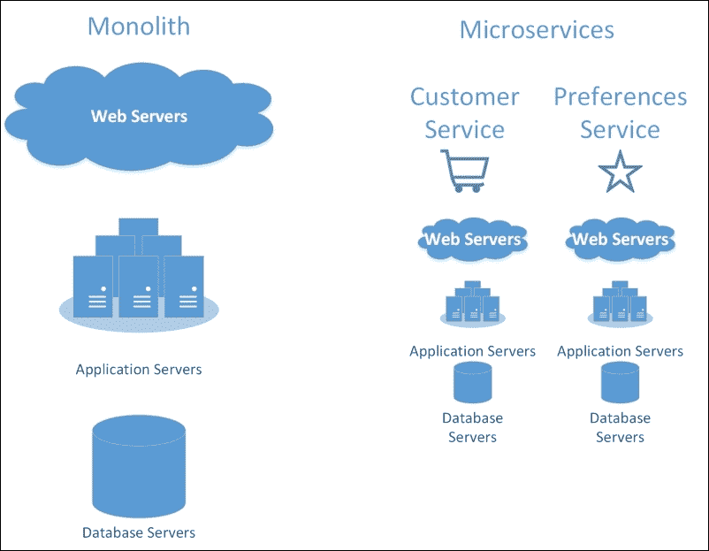
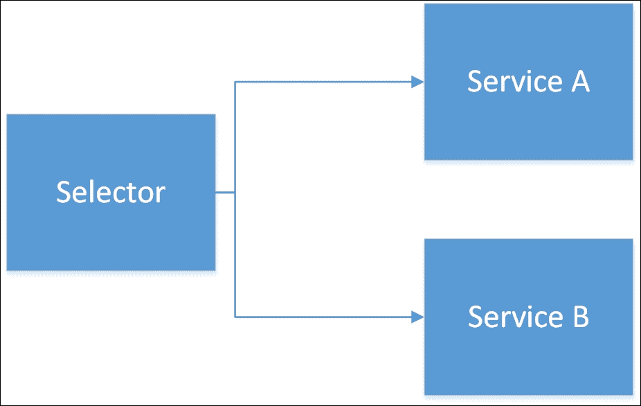
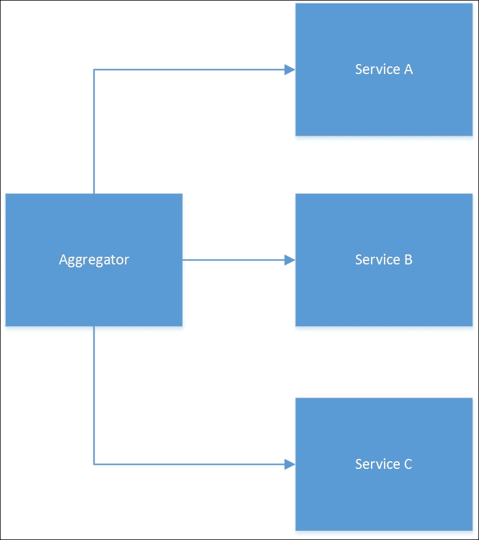
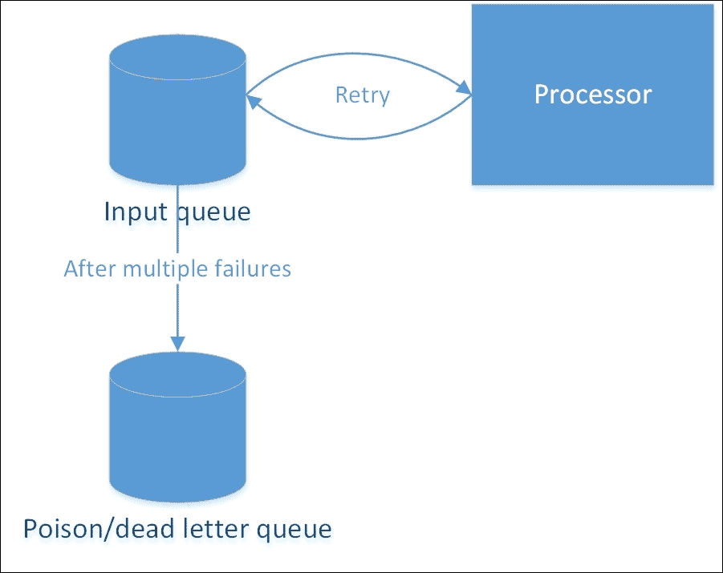

# 第十一章：微服务

现在似乎没有一本编程书籍是完整的，没有至少提到微服务的一些内容。为了避免这本书被指责为不符合规范的出版物，我们在微服务上包含了一章。

微服务被宣传为解决单块应用程序的问题的解决方案。很可能你处理过的每个应用程序都是单块应用程序：也就是说，应用程序有一个单一的逻辑可执行文件，并且可能分成诸如用户界面、服务或应用程序层和数据存储等层。许多应用程序中，这些层可能是一个网页、一个服务器端应用程序和一个数据库。单块应用程序有它们的问题，我相信你已经遇到过。

维护单块应用程序很快就变成了限制变化影响的练习。在这样的应用程序中，经常会发生对应用程序的一个看似孤立的角落的更改对应用程序的其他部分产生意外影响。尽管有许多模式和方法来描述良好隔离的组件，但在单块应用程序中，这些往往会被抛在一边。通常我们会采取捷径，这可能会节省时间，但将来会让我们的生活变得糟糕。

单块应用程序也很难扩展。因为我们倾向于只有三层，我们受限于扩展这些层中的每一层。如果中间层变慢，我们可以添加更多的应用服务器，或者如果 Web 层滞后，我们可以添加更多的 Web 服务器。如果数据库变慢，那么我们可以增加数据库服务器的性能。这些扩展方法都是非常大的操作。如果应用程序中唯一慢的部分是注册新用户，那么我们真的没有办法简单地扩展那个组件。这意味着不经常使用的组件（可以称为冷或凉组件）必须能够随着整个应用程序的扩展而扩展。这种扩展并不是免费的。

考虑到从单个 Web 服务器扩展到多个 Web 服务器会引入在多个 Web 服务器之间共享会话的问题。如果我们将应用程序分成多个服务，每个服务都作为数据的真实来源，那么我们可以独立地扩展这些部分。一个用于登录用户的服务，另一个用于保存和检索他们的偏好，另一个用于发送有关被遗弃的购物车的提醒电子邮件，每个服务负责自己的功能和数据。每个服务都是一个独立的应用程序，可以在单独的机器上运行。实际上，我们已经将我们的单块应用程序分片成了许多应用程序。每个服务不仅具有隔离的功能，而且还具有自己的数据存储，并且可以使用自己的技术来实现。单块应用程序和微服务之间的区别可以在这里看到：



应用程序更多地是通过组合服务来编写，而不是编写单一的单块应用程序。应用程序的用户界面甚至可以通过请求一些服务提供的可视组件来创建，然后由某种形式的组合服务插入到复合用户界面中。

Node.js 以只使用所需组件构建应用程序的轻量级方法，使其成为构建轻量级微服务的理想平台。许多微服务部署大量使用 HTTP 在服务之间进行通信，而其他则更多地依赖于消息系统，如 RabbitMQ 或 ZeroMQ。这两种通信方法可以在部署中混合使用。可以根据使用 HTTP 对仅进行查询的服务进行技术分割，并使用消息对执行某些操作的服务进行技术分割。这是因为消息比发送 HTTP 请求更可靠（取决于您的消息系统和配置）。

虽然看起来我们在系统中引入了大量复杂性，但这种复杂性在现代工具的管理下更容易处理。存在非常好的工具来管理分布式日志文件和监视应用程序的性能问题。通过容器化技术，隔离和运行许多应用程序比以往任何时候都更容易。

微服务可能不是解决我们所有维护和可扩展性问题的方法，但它们肯定是一个值得考虑的方法。在本章中，我们将探讨一些可能有助于使用微服务的模式：

+   外观

+   聚合服务

+   管道

+   消息升级器

+   服务选择器

+   故障模式

由于微服务是一个相对较新的发展，随着越来越多的应用程序采用微服务方法创建，可能会出现更多的模式。微服务方法与面向服务的体系结构（SOA）之间存在一些相似之处。这意味着 SOA 世界中可能有一些适用于微服务世界的模式。

# 外观

如果您觉得认识这个模式的名字，那么您是正确的。我们在第四章中讨论过这个模式，*结构模式*。在该模式的应用中，我们创建了一个可以指导多个其他类行动的类，提供了一个更简单的 API。我们的例子是一个指挥官指挥一支舰队。在微服务世界中，我们可以简单地用服务的概念取代类的概念。毕竟，服务的功能与微服务并没有太大的不同-它们都执行单个动作。

我们可以利用外观来协调使用多个其他服务。这种模式是本章中许多其他模式的基础模式。协调服务可能很困难，但通过将它们放在外观后面，我们可以使整个应用程序变得更简单。让我们考虑一个发送电子邮件的服务。发送电子邮件是一个相当复杂的过程，可能涉及许多其他服务：用户名到电子邮件地址的转换器，反恶意软件扫描器，垃圾邮件检查器，为各种电子邮件客户端格式化电子邮件正文的格式化器等等。

大多数想要发送电子邮件的客户并不想关注所有这些其他服务，因此可以放置一个外观电子邮件发送服务，它负责协调其他服务。协调模式可以在这里看到：


# 服务选择器

与外观类似的是服务选择器模式。在这种模式中，我们有一个服务作为其他服务的前端。根据到达的消息，可以选择不同的服务来响应初始请求。这种模式在升级场景和实验中很有用。如果您正在推出一个新的服务，并希望确保它在负载下能正常运行，那么您可以利用服务选择器模式将一小部分生产流量引导到新服务，同时密切监视它。另一个应用可能是将特定的客户或客户组引导到不同的服务。区分因素可以是任何东西，从将为您的服务付费的人引导到更快的终端，到将来自某些国家的流量引导到特定国家的服务。服务选择器模式可以在这个插图中看到：



# 聚合服务

在微服务架构中，数据由单个服务拥有，但有许多时候我们可能需要一次从许多不同的来源检索数据。再次考虑一下在维斯特洛大陆的小议会成员。他们可能有许多通报者，从他们那里收集有关王国运作的信息。您可以将每个通报者视为其自己的微服务。

### 提示

通报者是微服务的一个很好的比喻，因为每个通报者都是独立的，并且拥有自己的数据。服务也可能会偶尔失败，就像通报者可能会被捕获和终止一样。消息在通报者之间传递，就像在一组微服务之间传递一样。每个通报者对其他通报者的工作知之甚少，甚至不知道他们是谁——这种抽象对微服务也适用。

使用聚合服务模式，我们要求一组节点中的每一个执行某些操作或返回某些数据。这是一个相当常见的模式，即使在微服务世界之外也是如此，它是外观模式甚至适配器模式的特例。聚合器从其他一些服务请求信息，然后等待它们返回。一旦所有数据都返回了，聚合器可能执行一些额外的任务，比如总结数据或计算记录。然后将信息传递回给调用者。聚合器可以在这个插图中看到：



这种模式可能还有一些处理返回缓慢的服务或服务失败的规定。聚合器服务可能返回部分结果，或者在其中一个子服务达到超时时，从缓存返回数据。在某些架构中，聚合器可以返回部分结果，然后在可用时向调用者返回其他数据。

# 管道

管道是微服务连接模式的另一个例子。如果您曾经在*NIX 系统上使用过 shell，那么您肯定已经将一个命令的输出传递给另一个命令。*NIX 系统上的程序，如 ls、sort、uniq 和 grep，都是设计用来执行单一任务的；它们的强大之处在于能够将这些工具链接在一起构建相当复杂的工作流程。例如，这个命令：

```js
 **ls -1| cut -d \. -f 2 -s | sort |uniq** 

```

这个命令将列出当前目录中所有唯一的文件扩展名。它通过获取文件列表，然后剪切它们并获取扩展名来实现这一点；然后对其进行排序，最后传递给`uniq`，以删除重复项。虽然我不建议为排序或去重等琐碎操作创建微服务，但您可能有一系列服务，逐渐积累更多信息。

让我们想象一个查询服务，返回一组公司记录：

```js
 **| Company Id| Name | Address | City | Postal Code | Phone Number |** 

```

这条记录是由我们的公司查找服务返回的。现在我们可以将这条记录传递给我们的销售会计服务，该服务将向记录中添加销售总额：

```js
 **| Company Id| Name | Address | City | Postal Code | Phone Number | 2016 orders Total |** 

```

现在该记录可以传递给销售估算服务，该服务将进一步增强记录，估算 2017 年的销售额：

```js
 **| Company Id| Name | Address | City | Postal Code | Phone Number | 2016 orders Total | 2017 Sales Estimate |** 

```

这种渐进式增强也可以通过一个服务来逆转，该服务可以剥离不应呈现给用户的信息。记录现在可能变成以下内容：

```js
 **| Name | Address | City | Postal Code | Phone Number | 2016 orders Total | 2017 Sales Estimate |** 

```

在这里，我们删除了公司标识符，因为这是一个内部标识符。微服务管道应该是双向的，这样信息量就可以通过管道中的每个步骤传递，然后再通过每个步骤传递回来。这为服务提供了两次操作数据的机会，可以根据需要对数据进行操作。这与许多 Web 服务器中使用的方法相同，其中诸如 PHP 之类的模块被允许对请求和响应进行操作。管道可以在这里看到示例：


# 消息升级器

对于一些单片应用程序来说，升级是最高风险的活动之一。要做到这一点，您基本上需要一次性升级整个应用程序。即使是中等规模的应用程序，也有太多方面需要合理测试。因此，在某个时候，您只需要从旧系统切换到新系统。采用微服务方法，可以为每个单独的服务进行切换。较小的服务意味着风险可以分散在很长时间内，如果出现问题，错误的来源可以更快地被定位：单一的新组件。

问题在于仍在与升级服务的旧版本进行通信的服务。我们如何继续为这些服务提供服务，而无需更新所有这些服务呢？如果服务的接口保持不变，比如我们的服务计算地球上两点之间的距离，我们将其从使用简单的毕达哥拉斯方法更改为使用哈弗赛恩（一种在球面上找到两个点之间距离的公式），那么可能不需要对输入和输出格式进行更改。然而，通常情况下，这种方法对我们来说是不可用的，因为消息格式必须更改。即使在前面的例子中，也有可能更改输出消息。哈弗赛恩比毕达哥拉斯方法更准确，因此我们可能需要更多的有效数字，需要更大的数据类型。有两种很好的方法来处理这个问题：

1.  继续使用我们服务的旧版本和新版本。然后，我们可以在时间允许的情况下慢慢将客户服务迁移到新服务。这种方法存在问题：我们现在需要维护更多的代码。此外，如果我们更改服务的原因是无法继续运行它（安全问题，终止依赖服务等），那么我们就陷入了某种僵局。

1.  升级消息并传递它们。在这种方法中，我们采用旧的消息格式并将其升级到新的格式。这是通过另一个服务来完成的。这个服务的责任是接收旧的消息格式并发出新的消息格式。在另一端，您可能需要一个等效的服务来将消息降级为旧服务的预期输出格式。

升级服务应该有一个有限的寿命。理想情况下，我们希望尽快对依赖于已弃用服务的服务进行更新。微服务的小代码占用量，加上快速部署服务的能力，应该使这些类型的升级比单片方法所期望的更容易。一个示例消息升级器服务可以在这里看到：


# 失败模式

在本章中，我们已经提到了一些处理微服务故障的方法。然而，还有一些更有趣的方法值得考虑。其中之一是服务降级。

## 服务降级

这种模式也可以称为优雅降级，与渐进增强有关。让我们回顾一下用哈弗赛恩等效替换毕达哥拉斯距离函数的例子。如果哈弗赛恩服务由于某种原因而关闭，那么可以使用不太苛刻的函数代替它，而对用户几乎没有影响。事实上，他们可能根本没有注意到。用户拥有更糟糕的服务版本并不理想，但肯定比简单地向用户显示错误消息更可取。当哈弗赛恩服务恢复正常时，我们可以停止使用较差的服务。我们可以有多个级别的备用方案，允许多个不同的服务失败，同时我们继续向最终用户呈现一个完全功能的应用程序。

这种退化形式的另一个很好的应用是退回到更昂贵的服务。我曾经有一个发送短信的应用程序。确实很重要这些消息实际上被发送。我们大部分时间都使用我们首选的短信网关提供商，但是，如果我们的首选服务不可用，这是我们密切监视的情况，那么我们就会切换到使用另一个提供商。

## 消息存储

我们已经在查询服务和实际执行某些持久数据更改的服务之间划分了一些区别。当这些更新服务之一失败时，仍然需要在将来的某个时间运行数据更改代码。将这些请求存储在消息队列中可以让它们稍后运行，而不会有丢失任何非常重要的消息的风险。通常，当消息引发异常时，它会被返回到处理队列，可以进行重试。

有一句古老的谚语说，疯狂就是一遍又一遍地做同样的事情，却期待不同的结果。然而，有许多瞬态错误可以通过简单地再次执行相同的操作来解决。数据库死锁就是一个很好的例子。您的事务可能会被终止以解决死锁问题，在这种情况下，再次执行它实际上是推荐的方法。然而，不能无限次重试消息，因此最好选择一些相对较小的重试次数，比如三次或五次。一旦达到这个数字，消息就可以被发送到死信或毒消息队列。

毒消息，或者有些人称之为死信，是因为实际合理的原因而失败的消息。保留这些消息非常重要，不仅用于调试目的，还因为这些消息可能代表客户订单或医疗记录的更改：这些都是您不能承受丢失的数据。一旦消息处理程序已经被纠正，这些消息可以被重放，就好像错误从未发生过一样。存储队列和消息重新处理器可以在这里看到：



## 消息重放

虽然不是一个真正的生产模式，但围绕所有更改数据的服务构建基于消息的架构的一个副作用是，您可以获取消息以便在生产环境之外稍后重放。能够重放消息对于调试多个服务之间复杂交互非常方便，因为消息几乎包含了设置与生产环境完全相同的跟踪环境所需的所有信息。重放功能对于必须能够审计系统中的任何数据更改的环境也非常有用。还有其他方法来满足此类审计要求，但非常可靠的消息日志简直是一种乐趣。

## 消息处理的幂等性

我们将讨论的最后一个失败模式是消息处理的幂等性。随着系统规模的扩大，几乎可以肯定，微服务架构将跨越许多计算机。由于容器的重要性日益增长，这更是肯定的，容器本质上可以被视为计算机。在分布式系统中的计算机之间的通信是不可靠的；因此，消息可能会被传递多次。为了处理这种可能性，人们可能希望使消息处理具有幂等性。

### 提示

关于分布式计算的不可靠性，我强烈推荐阅读 Arnon Rotem-Gal-Oz 的《分布式计算谬误解释》一文，网址为[`rgoarchitects.com/Files/fallacies.pdf`](http://rgoarchitects.com/Files/fallacies.pdf)。

幂等性意味着一条消息可以被处理多次而不改变结果。这可能比人们意识到的更难实现，特别是对于那些本质上是非事务性的服务，比如发送电子邮件。在这些情况下，可能需要将已发送电子邮件的记录写入数据库。在某些情况下，电子邮件可能会被发送多次，但在电子邮件发送和记录写入之间的关键部分崩溃的情况是不太可能的。必须做出决定：是更好地多次发送电子邮件，还是根本不发送？

# 提示和技巧

如果你把微服务看作一个类，把微服务网络看作一个应用程序，那么很快就会发现，我们在本书中看到的许多模式同样适用于微服务。服务发现可能与依赖注入是同义词。单例、装饰器、代理；所有这些模式在微服务世界中同样适用，就像它们在进程边界内一样。

需要记住的一件事是，许多这些模式有点啰嗦，来回传送大量数据。在一个进程内，传递数据指针是没有额外开销的。但对于微服务来说情况并非如此。通过网络通信很可能会带来性能损失。

# 总结

微服务是一个令人着迷的想法，很可能在未来几年内得以实现。现在还为时过早，无法确定这是否只是在正确解决软件工程问题的道路上又一个错误转折，还是朝着正确方向迈出的重要一步。在本章中，我们探讨了一些模式，这些模式可能在你踏上微服务世界的旅程时会有所帮助。由于我们只是处于微服务成为主流的初期阶段，这一章的模式很可能会很快过时，并被发现不够优化。在开发过程中保持警惕，了解更大的画面是非常明智的。

