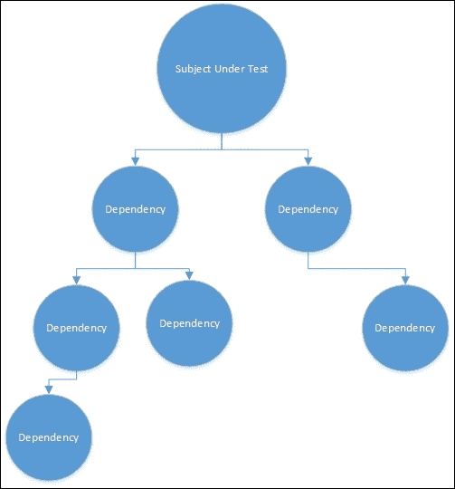

# 第十二章：测试模式

在整本书中，我们一直在强调 JavaScript 不再是一个我们无法做有用事情的玩具语言。现在就有真实世界的软件是用 JavaScript 编写的，未来十年使用 JavaScript 的应用程序的比例只可能增长。

随着真实软件的出现，对正确性的担忧也随之而来。手动测试软件是痛苦的，而且容易出错。编写自动运行并测试应用程序各个方面的单元测试和集成测试要便宜得多，也更容易。

有无数工具可用于测试 JavaScript，从测试运行器到测试框架；这个生态系统非常丰富。在本章中，我们将尽量保持一种几乎不依赖特定工具的测试方法。本书不关心哪个框架是最好或最友好的。有一些普遍的模式适用于整个测试过程。我们将涉及一些具体的工具，但只是为了避免编写所有自己的测试工具而采取的捷径。

在本章中，我们将讨论以下主题：

+   虚假对象

+   猴子补丁

+   与用户界面交互

# 测试金字塔

作为计算机程序员，我们通常是高度分析性的人。这意味着我们总是在努力对概念进行分类和理解。这导致我们开发了一些非常有趣的全球技术，可以应用于计算机编程之外。例如，敏捷开发在一般社会中也有应用，但可以追溯到计算机。甚至可以说，模式的概念之所以如此流行，很大程度上是因为它被计算机程序员在其他生活领域中使用。

这种分类的愿望导致了将测试代码划分为许多不同类型的测试的概念。我见过从单元测试一直到工作流测试和 GUI 测试等多达八种不同类型的测试。这可能有些过度。更常见的是考虑有三种不同类型的测试：单元测试、集成测试和用户界面测试：


单元测试构成了金字塔的基础。它们数量最多，编写起来最容易，并且在提供错误信息时最细粒度。单元测试中的错误将帮助您找到具有错误的单个方法。随着金字塔的上升，测试数量随着粒度的减少而减少，而每个测试的复杂性则增加。在更高的层次上，当一个测试失败时，我们可能只能说：“在向系统添加订单时出现了问题”。

# 通过单元测试在小范围内进行测试

对许多人来说，单元测试是一个陌生的概念。这是可以理解的，因为在许多学校里，这个话题都没有得到很好的教授。我知道我在计算机科学的六年高等教育中从未听说过它。这是不幸的，因为交付高质量的产品是任何项目中非常重要的一部分。

对于了解单元测试的人来说，采用单元测试存在一个很大的障碍。经理，甚至开发人员经常认为单元测试和自动化测试整体上都是浪费时间。毕竟，你不能把一个单元测试交给客户，大多数客户也不在乎他们的产品是否经过了正确的单元测试。

单元测试的定义非常困难。它与集成测试非常接近，人们很容易在两者之间来回切换。在开创性的书籍《单元测试的艺术》中，作者罗伊·奥舍罗夫定义了单元测试为：

> *单元测试是一个自动化的代码片段，它调用系统中的一个工作单元，然后检查关于该工作单元行为的一个假设。*

一个工作单元的确切大小存在一些争议。有些人将其限制在一个函数或一个类，而其他人允许一个工作单元跨越多个类。我倾向于认为跨越多个类的工作单元实际上可以分解成更小、可测试的单元。

单元测试的关键在于它测试了一个小的功能片段，并且以可重复、自动化的方式快速测试了功能。一个人编写的单元测试应该很容易地被团队中的任何其他成员运行。

对于单元测试，我们希望测试小的功能片段，因为我们相信如果系统的所有组件都正确工作，那么整个系统也会工作。这并不是全部真相。模块之间的通信和单元内的功能一样容易出错。这就是为什么我们希望在几个层面上编写测试。单元测试检查我们正在编写的代码是否正确。集成测试测试应用程序中的整个工作流程，并且会发现单元之间的交互问题。

测试驱动开发方法建议在编写代码的同时编写测试。虽然这给了我们很大的信心，我们正在编写的代码是正确的，但真正的优势在于它有助于推动良好的架构。当代码之间存在太多的相互依赖时，要测试它就比良好分离的模块化代码要困难得多。开发人员编写的许多代码永远不会被任何人阅读。单元测试为开发人员提供了一种有用的方式，即使在他们知道没有人会再次看到他们的代码的情况下，也可以使他们走上正确的道路。没有比告诉人们他们将受到检查更好的方式来生产高质量的产品，即使检查者可能是一个自动化测试。

测试可以在开发新代码时运行，也可以在构建机器上以自动方式运行。如果每次开发人员提交更改时，整个项目都会被构建和测试，那么可以提供一些保证，即新提交的代码是正确的。有时构建会中断，这将是一个标志，表明刚刚添加的内容存在错误。通常，出现错误的代码可能甚至与更改的代码不相邻。修改后的返回值可能会在系统中传播，并在完全意想不到的地方显现出来。没有人可以一次记住比最琐碎的系统更多的东西。测试充当了第二记忆，检查和重新检查以前做出的假设。

一旦发生错误，立即中断构建可以缩短在代码中出现错误和发现并修复错误之间的时间。理想情况下，问题仍然在开发人员的脑海中，因此修复可以很容易地找到。如果错误直到几个月后才被发现，开发人员肯定会忘记当时正在做什么。开发人员甚至可能不在现场帮助解决问题，而是让从未见过代码的人来解决问题。

# 安排-执行-断言

在为任何代码构建测试时，一个非常常见的方法是遵循安排-执行-断言的步骤。这描述了单元测试中发生的不同步骤。

我们要做的第一件事是设置一个测试场景（安排）。这一步可以包括许多操作，并且可能涉及放置虚假对象来模拟真实对象，以及创建被测试主题的新实例。如果您发现您的测试设置代码很长或者很复杂，那很可能是一种异味，您应该考虑重构您的代码。如前一节所述，测试有助于驱动正确性和架构。难以编写的测试表明架构不够模块化。

一旦测试设置好了，下一步就是实际执行我们想要测试的函数（执行）。执行步骤通常非常简短，在许多情况下不超过一行代码。

最后一部分是检查函数的结果或世界的状态是否符合您的期望（断言）。

一个非常简单的例子可能是一个城堡建造者：

```js
class CastleBuilder {
  buildCastle(size) {
    var castle = new Castle();
    castle.size = size;
    return castle;
  }
}
```

这个类只是简单地构建一个特定大小的新城堡。我们想确保没有什么欺骗行为，并且当我们建造一个大小为`10`的城堡时，我们得到的是一个大小为`10`的城堡：

```js
function When_building_a_castle_size_should_be_correctly_set() {
  var castleBuilder = new CastleBuilder();
  var expectedSize = 10;
  var builtCastle = castleBuilder.buildCastle(10);
  assertEqual(expectedSize, builtCastle.size);
}
```

## 断言

您可能已经注意到，在上一个示例中，我们使用了一个名为`assertEquals`的函数。断言是一个测试，当它失败时会抛出异常。目前在 JavaScript 中没有内置的断言功能，尽管有一个提案正在进行中以添加它。

幸运的是，构建一个断言非常简单：

```js
function assertEqual(expected, actual){
  if(expected !== actual)
  throw "Got " + actual + " but expected " + expected;
}
```

在错误中提及实际值和期望值是有帮助的。

存在大量的断言库。Node.js 附带了一个，创造性地称为`assert.js`。如果您最终在 JavaScript 中使用测试框架，很可能它也包含一个断言库。

# 虚假对象

如果我们将应用程序中对象之间的相互依赖关系视为图形，很快就会发现有许多节点依赖于不止一个，而是许多其他对象。试图测试具有许多依赖关系的对象是具有挑战性的。每个依赖对象都必须被构建并包含在测试中。当这些依赖与网络或文件系统等外部资源进行交互时，问题变得棘手。很快我们就会一次性测试整个系统。这是一种合法的测试策略，称为**集成测试**，但我们真正感兴趣的是确保单个类的功能是正确的。

集成测试的执行速度往往比单元测试慢。

测试的主体可能有一个庞大的依赖图，这使得测试变得困难。你可以在这里看到一个例子：



我们需要找到一种方法来隔离被测试的类，这样我们就不必重新创建所有的依赖关系，包括网络。我们可以将这种方法看作是向我们的代码添加防护墙。我们将插入防护墙，阻止测试从一个类流向多个类。这些防护墙类似于油轮维持隔离以限制泄漏的影响并保持重量分布，如下所示：


*图片由[`www.reactivemanifesto.org/`](http://www.reactivemanifesto.org/)提供。*

为此，我们可以使用虚假对象来代替真实对象，虚假对象具有一组有限的功能。我们将看看三种创建虚假对象的不同方法。

首先是一个非常巧妙命名的测试间谍。

# 测试间谍

间谍是一种包装对象的方法，记录该方法的输入和输出以及调用次数。通过包装调用，可以检查函数的确切输入和输出。当不事先知道函数的确切输入时，可以使用测试间谍。

在其他语言中，构建测试间谍需要反射，可能会相当复杂。实际上，我们可以用不超过几行代码来制作一个基本的测试间谍。让我们来试验一下。

首先，我们需要一个要拦截的类：

```js
var SpyUpon = (function () {
  function SpyUpon() {
  }
  SpyUpon.prototype.write = function (toWrite) {
    console.log(toWrite);
  };
  return SpyUpon;
})();
```

现在我们想要监视这个函数。因为在 JavaScript 中，函数是一等对象，我们可以简单地重新调整`SpyUpon`对象：

```js
var spyUpon = new SpyUpon();
spyUpon._write = spyUpon.write;
spyUpon.write = function (arg1) {
  console.log("intercepted");
  this.called = true;
  this.args = arguments;
  this.result = this._write(arg1, arg2, arg3, arg4, arg5);
  return this.result;
};
```

在这里，我们接受现有的函数并给它一个新名字。然后我们创建一个新的函数，调用重命名的函数并记录一些东西。函数被调用后，我们可以检查各种属性：

```js
console.log(spyUpon.write("hello world"));
console.log(spyUpon.called);
console.log(spyUpon.args);
console.log(spyUpon.result);
```

在 node 中运行这段代码，我们得到以下结果：

```js
hello world
7
true
{ '0': 'hello world' }
7
```

使用这种技术，可以深入了解函数的使用方式。有许多库支持以比我们这里的简单版本更强大的方式创建测试间谍。有些提供记录异常、调用次数和每次调用的参数的工具。

# 存根

**存根**是另一个虚假对象的例子。当被测试的主体中有一些需要满足返回值对象的依赖关系时，我们可以使用存根。它们也可以用来提供防护，阻止计算密集型或依赖 I/O 的函数运行。

存根可以以与我们实现间谍相同的方式实现。我们只需要拦截对方法的调用，并用我们编写的版本替换它。然而，对于存根，我们实际上不调用被替换的函数。保留被替换函数可能是有用的，以防我们需要恢复存根类的功能。

让我们从一个对象开始，该对象的部分功能依赖于另一个对象：

```js
class Knight {
  constructor(credentialFactory) {
    this.credentialFactory = credentialFactory;
  }
  presentCredentials(toRoyalty) {
    console.log("Presenting credentials to " + toRoyalty);
    toRoyalty.send(this.credentialFactory.Create());
    return {};
  }
}
```

这个骑士对象在其构造函数中接受一个`credentialFactory`参数。通过传入对象，我们将依赖性外部化，并将创建`credentialFactory`的责任从骑士身上移除。我们之前已经看到了这种控制反转的方式，我们将在下一章中更详细地讨论它。这使得我们的代码更模块化，测试更容易。

现在，当我们想要测试骑士而不用担心凭证工厂的工作方式时，我们可以使用一个虚假对象，这里是一个存根：

```js
class StubCredentialFactory {
  constructor() {
    this.callCounter = 0;
  }
  Create() {
    //manually create a credential
  };
}
```

这个存根是一个非常简单的存根，只是返回一个标准的新凭证。如果需要多次调用，存根可以变得相当复杂。例如，我们可以将我们简单的存根重写为以下形式：

```js
class StubCredentialFactory {
  constructor() {
    this.callCounter = 0;
  }
  Create() {
    if (this.callCounter == 0)
      return new SimpleCredential();
    if (this.callCounter == 1)
      return new CredentialWithSeal();
    if (this.callCounter == 2)
      return null;
    this.callCounter++;
  }
}
```

这个存根的版本在每次调用时返回不同类型的凭据。第三次调用时返回 null。由于我们使用了控制反转来设置类，编写测试就像下面这样简单：

```js
var knight = new Knight(new StubCredentialFactory());
knight.presentCredentials("Queen Cersei");
```

我们现在可以执行测试：

```js
var knight = new Knight(new StubCredentialFactory());
var credentials = knight.presentCredentials("Lord Snow");
assert(credentials.type === "SimpleCredentials");
credentials = knight.presentCredentials("Queen Cersei");
assert(credentials.type === "CredentialWithSeal");
credentials = knight.presentCredentials("Lord Stark");
assert(credentials == null);
```

由于 JavaScript 中没有硬类型系统，我们可以构建存根而不必担心实现接口。也不需要存根整个对象，只需要我们感兴趣的函数。

# 模拟

最后一种虚假对象是**模拟**。模拟和存根之间的区别在于验证的位置。对于存根，我们的测试必须在行动之后检查状态是否正确。对于模拟对象，测试断言的责任落在模拟对象本身。模拟是另一个有用的地方，可以利用模拟库。但是，我们也可以简单地构建相同类型的东西：

```js
class MockCredentialFactory {
  constructor() {
    this.timesCalled = 0;
  }
  Create() {
    this.timesCalled++;
  }
  Verify() {
    assert(this.timesCalled == 3);
  }
}
```

这个`mockCredentialsFactory`类承担了验证正确函数是否被调用的责任。这是一种非常简单的模拟方法，可以像这样使用：

```js
var credentialFactory = new MockCredentialFactory();
var knight = new Knight(credentialFactory);
var credentials = knight.presentCredentials("Lord Snow");
credentials = knight.presentCredentials("Queen Cersei");
credentials = knight.presentCredentials("Lord Stark");
credentialFactory.Verify();
```

这是一个静态模拟，每次使用时都保持相同的行为。可以构建作为录音设备的模拟。您可以指示模拟对象期望某些行为，然后让它自动播放它们。

这个语法取自模拟库 Sinon 的文档。它看起来像下面这样：

```js
var mock = sinon.mock(myAPI);
mock.expects("method").once().throws();
```

# Monkey patching

我们已经看到了在 JavaScript 中创建虚假对象的许多方法。在创建间谍时，我们使用了一种称为**monkey patching**的方法。Monkey patching 允许您通过替换其函数来动态更改对象的行为。我们可以使用这种方法，而无需回到完全虚假的对象。使用这种方法可以单独更改任何现有对象的行为。这包括字符串和数组等内置对象。

# 与用户界面交互

今天使用的大量 JavaScript 用于客户端，并用于与屏幕上可见的元素进行交互。与页面交互通过称为**文档对象模型**（**DOM**）的页面模型进行。

页面上的每个元素都在 DOM 中表示。每当页面发生更改时，DOM 都会更新。如果我们向页面添加段落，那么 DOM 中就会添加一个段落。因此，如果我们的 JavaScript 代码添加了一个段落，检查它是否这样做只是检查 DOM 的一个函数。

不幸的是，这要求 DOM 实际上存在，并且以与实际页面相同的方式形成。有许多方法可以针对页面进行测试。

## 浏览器测试

最天真的方法就是简单地自动化浏览器。有一些项目可以帮助完成这项任务。可以自动化完整的浏览器，如 Firefox、Internet Explorer 或 Chrome，也可以选择一个无头浏览器。完整的浏览器方法要求测试机器上安装了浏览器，并且机器正在运行具有可用桌面的模式。

许多基于 Unix 的构建服务器不会被设置为显示桌面，因为大多数构建任务不需要。即使您的构建机器是 Windows 机器，构建帐户经常以无法打开窗口的模式运行。在我看来，使用完整浏览器进行测试也有破坏的倾向。会出现微妙的时间问题，并且测试很容易被浏览器的意外更改打断。经常需要手动干预来解决浏览器陷入不正确状态的问题。

幸运的是，已经努力将 Web 浏览器的图形部分与 DOM 和 JavaScript 解耦。对于 Chrome，这一举措已经导致了 PhantomJS，而对于 Firefox 则是 SlimerJS。

通常，需要完整浏览器的测试需要浏览器在多个页面之间进行导航。无头浏览器通过 API 提供了这一功能。我倾向于将这种规模的测试视为集成测试，而不是单元测试。

使用 PhantomJS 和位于浏览器顶部的 CasperJS 库进行的典型测试可能如下所示：

```js
var casper = require('casper').create();
casper.start('http://google.com', function() {
  assert.false($("#gbqfq").attr("aria-haspopup"));
  $("#gbqfq").val("redis");
  assert.true($("#gbqfq").attr("aria-haspopup"));
});
```

这将测试在 Google 搜索框中输入值是否会将`aria-haspopup`属性从`false`更改为`true`。

以这种方式测试会在很大程度上依赖于 DOM 不会发生太大变化。根据用于在页面上查找元素的选择器，页面样式的简单更改可能会破坏每个测试。我喜欢通过不使用 CSS 属性来选择元素，而是使用 ID 或者更好的是 data-*属性，将这种测试与页面的外观分开。当我们测试现有页面时，我们可能没有这样的奢侈，但对于新页面来说，这是一个很好的计划。

## 伪造 DOM

大部分时间，我们不需要完整的页面 DOM 来执行测试。我们需要测试的页面元素是页面上的一个部分，而不是整个页面。存在许多倡议可以通过纯 JavaScript 创建文档的一部分。例如，`jsdom`是一种通过注入 HTML 字符串并接收一个虚假窗口的方法。

在这个例子中，稍作修改，他们创建了一些 HTML 元素，加载了 JavaScript，并测试其是否正确返回：

```js
var jsdom = require("jsdom");
jsdom.env( '<p><a class="the-link" ref="https://github.com/tmpvar/jsdom">jsdom!</a></p>',["http://code.jquery.com/jquery.js"],
  function (errors, window) {
    assert.equal(window.$("a.the-link").text(), "jsdom!");
  }
);
```

如果你的 JavaScript 专注于页面的一个小部分，也许你正在构建自定义控件或 Web 组件，那么这是一种理想的方法。

## 包装操作

处理图形 JavaScript 的最终方法是停止直接与页面上的元素进行交互。这是当今许多更受欢迎的 JavaScript 框架采用的方法。一个简单地更新 JavaScript 模型，然后通过某种 MV*模式更新页面。我们在前几章中详细讨论了这种方法。

在这种情况下，测试变得非常容易。我们可以通过在运行代码之前构建模型状态，然后测试运行代码后的模型状态是否符合预期来测试复杂的 JavaScript。

例如，我们可以有一个如下所示的模型：

```js
class PageModel{
  titleVisible: boolean;
  users: Array<User>;
}
```

对于它的测试代码可能看起来就像下面这样简单：

```js
var model = new PageModel();
model.titleVisible = false;
var controller = new UserListPageController(model);
controller.AddUser(new User());
assert.true(model.titleVisible);
```

当页面上的所有内容都被操作时，通过与模型的绑定，我们可以确信模型中的更改是否正确地更新了页面。

有人会争辩说我们只是把问题转移了。现在错误的唯一可能性是 HTML 和模型之间的绑定是否不正确。因此，我们还需要测试是否已将绑定正确应用到 HTML。这需要更简单地进行更高级别的测试。我们可以通过更高级别的测试覆盖更多内容，尽管会牺牲知道错误发生的确切位置。

你永远无法测试应用程序的所有内容，但是未经测试的表面越小，越好。

# 技巧和窍门

我见过一些人通过添加注释来分隔安排-执行-断言：

```js
function testMapping(){
  //Arrange
  …
  //Act
  …
  //Assert
  …
}
```

你将会因为为每个测试输入这些注释而累得手指骨折。相反，我只是用空行分隔它们。分隔清晰，任何了解安排-执行-断言的人都会立即认识到你正在做什么。你会看到本章中的示例代码以这种方式分隔。

有无数的 JavaScript 测试库可用，可以让你的生活更轻松。选择一个可能取决于你的偏好风格。如果你喜欢 gherkin 风格的语法，那么 cuumber.js 可能适合你。否则，尝试 mocha，可以单独使用，也可以与 chai BDD 风格断言库一起使用，这也相当不错。还有一些针对 Angular 应用程序的测试框架，比如 Protractor（尽管你可以通过一些工作来测试其他框架）。我建议花一天时间玩一下，找到适合你的点。

在编写测试时，我倾向于以一种明显表明它们是测试而不是生产代码的方式命名它们。对于大多数 JavaScript，我遵循驼峰命名约定，比如`testMapping`。然而，对于测试方法，我遇到了一个下划线命名模式`When_building_a_castle_size_should_be_correctly_set`。这样测试就更像是一个规范。其他人对命名有不同的方法，没有“正确”的答案，所以请随意尝试。

# 总结

生产高质量产品总是需要广泛和重复的测试；这正是计算机真正擅长的事情。尽可能自动化。

测试 JavaScript 代码是一个新兴的事物。围绕它的工具，模拟对象，甚至运行测试的工具都在不断变化。能够使用诸如 Node.js 之类的工具快速运行测试，而不必启动整个浏览器，这非常有帮助。这个领域在未来几年内只会得到改善。我很期待看到它带来的变化。

在下一章中，我们将看一些 JavaScript 中的高级模式，这些模式可能不是每天都想使用，但非常方便。

