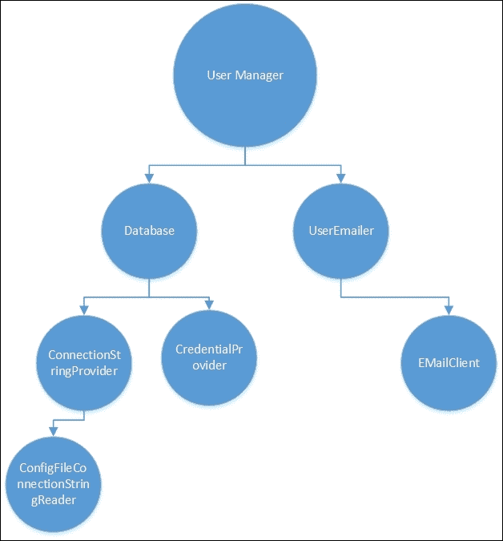
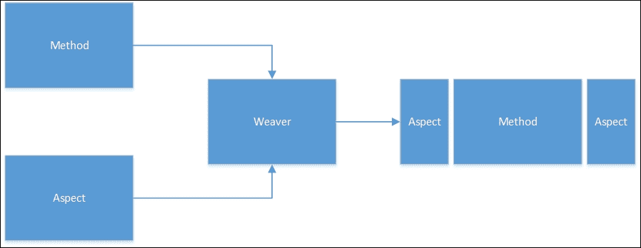

# 第十三章：高级模式

当我给这一章命名时，我犹豫不决，*高级模式*。这并不是关于比其他模式更复杂或复杂的模式。这是关于你不经常使用的模式。坦率地说，来自静态编程语言背景的一些模式看起来有些疯狂。尽管如此，它们是完全有效的模式，并且在各大项目中都在使用。

在本章中，我们将讨论以下主题：

+   依赖注入

+   实时后处理

+   面向方面的编程

+   宏

# 依赖注入

我们在本书中一直在讨论的一个主题是使你的代码模块化的重要性。小类更容易测试，提供更好的重用，并促进团队更好的协作。模块化，松散耦合的代码更容易维护，因为变更可以受限。你可能还记得我们之前使用的一个 ripstop 的例子。

在这种模块化代码中，我们看到了很多控制反转。类通过创建者传递额外的类来插入功能。这将一些子类的工作责任移交给了父类。对于小项目来说，这是一个相当合理的方法。随着项目变得更加复杂和依赖图变得更加复杂，手动注入功能变得越来越困难。我们仍然在整个代码库中创建对象，将它们传递给创建的对象，因此耦合问题仍然存在，我们只是将它提升到了更高的级别。

如果我们将对象创建视为一项服务，那么这个问题的解决方案就呈现出来了。我们可以将对象创建推迟到一个中心位置。这使我们能够在一个地方简单轻松地更改给定接口的实现。它还允许我们控制对象的生命周期，以便我们可以重用对象或在每次使用时重新创建它们。如果我们需要用另一个实现替换接口的一个实现，那么我们可以确信只需要在一个位置进行更改。因为新的实现仍然满足合同，也就是接口，那么使用接口的所有类都可以对更改保持无知。

更重要的是，通过集中对象创建，更容易构造依赖于其他对象的对象。如果我们查看诸如`UserManager`变量的模块的依赖图，很明显它有许多依赖关系。这些依赖关系可能还有其他依赖关系等等。要构建一个`UserManager`变量，我们不仅需要传递数据库，还需要`ConnectionStringProvider`，`CredentialProvider`和`ConfigFileConnectionStringReader`。天哪，要创建所有这些实例将是一项艰巨的工作。相反，我们可以在注册表中注册每个接口的实现，然后只需去注册表查找如何创建它们。这可以自动化，依赖关系会自动注入到所有依赖项中，无需显式创建任何依赖项。这种解决依赖关系的方法通常被称为“解决传递闭包”。

依赖注入框架处理构造对象的责任。在应用程序设置时，依赖注入框架使用名称和对象的组合进行初始化。从这个组合中，它创建一个注册表或容器。通过容器构造对象时，容器查看构造函数的签名，并尝试满足构造函数中的参数。以下是依赖图的示例：



在诸如 C#或 Java 等更静态类型的语言中，依赖注入框架很常见。它们通常通过使用反射来工作，反射是一种使用代码从其他代码中提取结构信息的方法。在构建容器时，我们指定一个接口和一个或多个可以满足该接口的具体类。当然，使用接口和反射执行依赖注入需要语言支持接口和内省。

在 JavaScript 中无法做到这一点。JavaScript 既没有直接的内省，也没有传统的对象继承模型。一种常见的方法是使用变量名来解决依赖问题。考虑一个具有以下构造函数的类：

```js
var UserManager = (function () {
  function UserManager(database, userEmailer) {
    this.database = database;
    this.userEmailer = userEmailer;
  }
  return UserManager;
})();
```

构造函数接受两个非常具体命名的参数。当我们通过依赖注入构造这个类时，这两个参数通过查看容器中注册的名称并将它们传递到构造函数中来满足。然而，没有内省，我们如何提取参数的名称，以便知道传递到构造函数中的内容呢？

解决方案实际上非常简单。在 JavaScript 中，任何函数的原始文本都可以通过简单地调用`toString`来获得。因此，对于前面代码中给出的构造函数，我们可以这样做：

```js
UserManager.toString()
```

现在我们可以解析返回的字符串以提取参数的名称。必须小心地解析文本，但这是可能的。流行的 JavaScript 框架 Angular 实际上使用这种方法来进行其依赖注入。结果仍然相对预格式。解析实际上只需要进行一次，并且结果被缓存，因此不会产生额外的开销。

我不会详细介绍如何实际实现依赖注入，因为这相当乏味。在解析函数时，你可以使用字符串匹配算法进行解析，也可以为 JavaScript 语法构建词法分析器和解析器。第一种解决方案似乎更容易，但更好的决定可能是尝试为代码构建一个简单的语法树，然后进行注入。幸运的是，整个方法体可以被视为一个单一的标记，因此比构建一个完全成熟的解析器要容易得多。

如果你愿意对依赖注入框架的用户施加不同的语法，甚至可以创建自己的语法。Angular 2.0 依赖注入框架`di.js`支持自定义语法，用于表示应该注入对象的位置以及表示哪些对象满足某些要求。

将其用作需要注入一些代码的类，看起来像这段代码，取自`di.js`示例页面：

```js
@Inject(CoffeeMaker, Skillet, Stove, Fridge, Dishwasher)
export class Kitchen {
  constructor(coffeeMaker, skillet, stove, fridge, dishwasher) {
    this.coffeeMaker = coffeeMaker;
    this.skillet = skillet;
    this.stove = stove;
    this.fridge = fridge;
    this.dishwasher = dishwasher;
  }
}
```

`CoffeeMaker`实例可能看起来像以下代码：

```js
@Provide(CoffeeMaker)
@Inject(Filter, Container)
export class BodumCoffeeMaker{
  constructor(filter, container){
  …
  }
}
```

你可能也注意到了，这个例子使用了`class`关键字。这是因为该项目非常前瞻，需要使用`traceur.js`来提供 ES6 类支持。我们将在下一章学习`traceur.js`文件。

# 实时后处理

现在应该明显了，在 JavaScript 中运行`toString`函数是执行任务的有效方式。这似乎很奇怪，但实际上，编写发出其他代码的代码与 Lisp 一样古老，甚至可能更古老。当我第一次了解 AngularJS 中依赖注入的工作原理时，我对这种 hack 感到恶心，但对解决方案的创造力印象深刻。

如果可以通过解释代码来进行依赖注入，那么我们还能做些什么呢？答案是：相当多。首先想到的是，你可以编写特定领域的语言。

我们在第五章中讨论了 DSL，*行为模式*，甚至创建了一个非常简单的 DSL。通过加载和重写 JavaScript 的能力，我们可以利用接近 JavaScript 但不完全兼容的语法。在解释 DSL 时，我们的解释器会写出转换代码为实际 JavaScript 所需的额外标记。

我一直喜欢 TypeScript 的一个很好的特性是，标记为 public 的构造函数参数会自动转换为对象的属性。例如，以下是 TypeScript 代码：

```js
class Axe{
  constructor(public handleLength, public headHeight){}
}
```

编译为以下代码：

```js
var Axe = (function () {
  function Axe(handleLength, headHeight) {
    this.handleLength = handleLength;
    this.headHeight = headHeight;
  }
  return Axe;
})();
```

我们可以在我们的 DSL 中做类似的事情。从以下`Axe`定义开始：

```js
class Axe{
  constructor(handleLength, /*public*/ headHeight){}
}
```

我们在这里使用了注释来表示`headHeight`应该是公共的。与 TypeScript 版本不同，我们希望我们的源代码是有效的 JavaScript。因为注释包含在`toString`函数中，这样做完全没问题。

接下来要做的事情是实际上从中发出新的 JavaScript。我采取了一种天真的方法，并使用了正则表达式。这种方法很快就会失控，可能只适用于`Axe`类中格式良好的 JavaScript：

```js
function publicParameters(func){
  var stringRepresentation = func.toString();
  var parameterString = stringRepresentation.match(/^function .*\((.*)\)/)[1];
  var parameters = parameterString.split(",");
  var setterString = "";
  for(var i = 0; i < parameters.length; i++){
    if(parameters[i].indexOf("public") >= 0){
      var parameterName = parameters[i].split('/')[parameters[i].split('/').length-1].trim();
      setterString += "this." +  parameterName + " = " + parameterName + ";\n";
    }
  }
  var functionParts = stringRepresentation.match(/(^.*{)([\s\S]*)/);
  return functionParts[1] + setterString + functionParts[2];
}

console.log(publicParameters(Axe));
```

在这里，我们提取函数的参数并检查具有`public`注释的参数。此函数的结果可以传回到 eval 中，用于当前对象的使用，或者如果我们在预处理器中使用此函数，则可以写入文件。通常不鼓励在 JavaScript 中使用 eval。

使用这种处理方式可以做很多不同的事情。即使没有字符串后处理，我们也可以通过包装方法来探索一些有趣的编程概念。

# 面向方面的编程

软件的模块化是一个很好的特性，本书的大部分内容都是关于模块化及其优势。然而，软件还有一些跨整个系统的特性。安全性就是一个很好的例子。

我们希望在应用程序的所有模块中都有类似的安全代码，以检查人们是否实际上被授权执行某些操作。所以如果我们有这样的一个函数：

```js
var GoldTransfer = (function () {
  function GoldTransfer() {
  }
  GoldTransfer.prototype.SendPaymentOfGold = function (amountOfGold, destination) {
    var user = Security.GetCurrentUser();
    if (Security.IsAuthorized(user, "SendPaymentOfGold")) {
      //send actual payment
    } else {
      return { success: 0, message: "Unauthorized" };
    }
  };
  return GoldTransfer;
})();
```

我们可以看到有相当多的代码来检查用户是否被授权。这个相同的样板代码在应用程序的其他地方也被使用。事实上，由于这是一个高安全性的应用程序，安全检查在每个公共函数中都有。一切都很好，直到我们需要对常见的安全代码进行更改。这个更改需要在应用程序的每一个公共函数中进行。我们可以重构我们的应用程序，但事实仍然存在：我们需要在每个公共方法中至少有一些代码来执行安全检查。这被称为横切关注点。

在大多数大型应用程序中，还存在其他横切关注点。日志记录是一个很好的例子，数据库访问和性能检测也是如此。**面向方面的编程**（**AOP**）提供了一种通过**编织**过程来最小化重复代码的方式。

方面是一段可以拦截方法调用并改变它们的代码。在.Net 平台上有一个叫做 PostSharp 的工具可以进行方面编织，在 Java 平台上有一个叫做 AspectJ 的工具。这些工具可以钩入构建管道，并在代码被转换为指令后修改代码。这允许在需要的地方注入代码。源代码看起来没有改变，但编译输出现在包括对方面的调用。方面通过被注入到现有代码中来解决横切关注点。在这里，你可以看到通过编织器将一个方面应用到一个方法：



当然，在大多数 JavaScript 工作流程中，我们没有设计时编译步骤的奢侈。幸运的是，我们已经看到了一些方法，可以让我们使用 JavaScript 实现横切。我们需要的第一件事是包装我们在测试章节中看到的方法。第二个是本章前面提到的`tostring`能力。

对于 JavaScript 已经存在一些 AOP 库，可能是一个值得探索的好选择。然而，我们可以在这里实现一个简单的拦截器。首先让我们决定请求注入的语法。我们将使用之前的注释的想法来表示需要拦截的方法。我们只需要将方法中的第一行作为注释，写上`aspect(<aspect 的名称>)`。

首先，我们将采用稍微修改过的与之前相同的`GoldTransfer`类的版本：

```js
class GoldTransfer {
  SendPaymentOfGold(amountOfGold, destination) {
    var user = Security.GetCurrentUser();
    if (Security.IsAuthorized(user, "SendPaymentOfGold")) {
    }
    else {
     return { success: 0, message: "Unauthorized" };
    }
  }
}
```

我们已经剥离了以前存在的所有安全性内容，并添加了一个控制台日志，以便我们可以看到它实际上是如何工作的。接下来，我们需要一个方面来编织进去：

```js
class ToWeaveIn {
   BeforeCall() {
    console.log("Before!");
  }
  AfterCall() {
    console.log("After!");
  }
}
```

为此，我们使用一个简单的类，其中有一个`BeforeCall`和一个`AfterCall`方法，一个在原始方法之前调用，一个在原始方法之后调用。在这种情况下，我们不需要使用 eval，所以拦截更安全：

```js
function weave(toWeave, toWeaveIn, toWeaveInName) {
  for (var property in toWeave.prototype) {
    var stringRepresentation = toWeave.prototype[property].toString();
    console.log(stringRepresentation);
    if (stringRepresentation.indexOf("@aspect(" + toWeaveInName + ")")>= 0) {
      toWeave.prototype[property + "_wrapped"] = toWeave.prototype[property];
      toWeave.prototype[property] = function () {
      toWeaveIn.BeforeCall();
      toWeave.prototype[property + "_wrapped"]();
      toWeaveIn.AfterCall();
    };
    }
  }
}
```

这个拦截器可以很容易地修改为一个快捷方式，并在调用主方法体之前返回一些内容。它也可以被改变，以便通过简单跟踪包装方法的输出，然后在`AfterCall`方法中修改函数的输出。

这是一个相当轻量级的 AOP 示例。对于 JavaScript AOP 已经存在一些框架，但也许最好的方法是利用预编译器或宏语言。

# 混入

正如我们在本书的早期看到的那样，JavaScript 的继承模式与 C＃和 Java 等语言中典型的模式不同。JavaScript 使用原型继承，允许轻松地向类添加函数，并且可以从多个来源添加。原型继承允许以类似于备受诟病的多重继承的方式从多个来源添加方法。多重继承的主要批评是很难理解在某种情况下将调用哪个方法的重载。在原型继承模型中，这个问题在一定程度上得到了缓解。因此，我们可以放心地使用从多个来源添加功能的方法，这被称为 mixin。

Mixin 是一段代码，可以添加到现有类中以扩展其功能。它们在需要在不同的类之间共享函数的场景中最有意义，其中继承关系过于强大。

让我们想象一种情景，这种功能会很方便。在维斯特洛大陆，死亡并不总是像我们的世界那样永久。然而，那些从死者中复活的人可能并不完全与他们活着时一样。虽然`Person`和`ReanimatedPerson`之间共享了很多功能，但它们之间并没有足够的继承关系。在这段代码中，您可以看到 underscore 的`extend`函数用于向我们的两个人类添加 mixin。虽然可以在没有`underscore`的情况下做到这一点，但正如前面提到的，使用库会使一些复杂的边缘情况变得方便：

```js
var _ = require("underscore");
export class Person{
}
export class ReanimatedPerson{
}
export class RideHorseMixin{
  public Ride(){
    console.log("I'm on a horse!");
  }
}

var person = new Person();
var reanimatedPerson = new ReanimatedPerson();
_.extend(person, new RideHorseMixin());
_.extend(reanimatedPerson, new RideHorseMixin());

person.Ride();
reanimatedPerson.Ride();
```

Mixin 提供了一个在不同对象之间共享功能的机制，但会污染原型结构。

# 宏

通过宏预处理代码并不是一个新的想法。对于 C 和 C++来说，这是非常流行的。事实上，如果你看一下 Linux 的 Gnu 工具的一些源代码，它们几乎完全是用宏编写的。宏因难以理解和调试而臭名昭著。有一段时间，像 Java 和 C＃这样的新创建的语言之所以不支持宏，正是因为这个原因。

话虽如此，甚至像 Rust 和 Julia 这样的最新语言也重新引入了宏的概念。这些语言受到了 Scheme 语言的宏的影响，Scheme 是 Lisp 的一个方言。C 宏和 Lisp/Scheme 宏的区别在于，C 版本是文本的，而 Lisp/Scheme 版本是结构的。这意味着 C 宏只是被赞美的查找/替换工具，而 Scheme 宏则意识到它们周围的**抽象语法树**（**AST**），使它们更加强大。

Scheme 的 AST 比 JavaScript 的简单得多。尽管如此，有一个非常有趣的项目叫做`Sweet.js`，它试图为 JavaScript 创建结构宏。

`Sweet.js`插入到 JavaScript 构建管道中，并使用一个或多个宏修改 JavaScript 源代码。有许多完整的 JavaScript 转译器，即生成 JavaScript 的编译器。这些编译器在多个项目之间共享代码时存在问题。它们的代码差异很大，几乎没有真正的共享方式。`Sweet.js`支持在单个步骤中扩展多个宏。这允许更好地共享代码。可重用的部分更小，更容易一起运行。

`Sweet.js`的一个简单示例如下：

```js
let var = macro {
  rule { [$var (,) ...] = $obj:expr } => {
    var i = 0;
    var arr = $obj;
    $(var $var = arr[i++]) (;) ...
  }

  rule { $id } => {
    var $id
  }
}
```

这里的宏提供了 ECMAScript-2015 风格的解构器，将数组分割成三个字段。该宏匹配数组赋值和常规赋值。对于常规赋值，宏只是返回标识，而对于数组的赋值，它将分解文本并替换它。

例如，如果您在以下内容上运行它：

```js
var [foo, bar, baz] = arr;
```

然后，结果将是以下内容：

```js
var i = 0;
var arr$2 = arr;
var foo = arr$2[i++];
var bar = arr$2[i++];
var baz = arr$2[i++];
```

这只是一个宏的例子。宏的威力真的非常壮观。宏可以创建一个全新的语言或改变非常微小的东西。它们可以很容易地插入以适应任何需求。

# 技巧和窍门

使用基于名称的依赖注入允许名称之间发生冲突。为了避免冲突，值得在注入的参数前加上特殊字符。例如，AngularJS 使用`$`符号来表示一个注入的术语。

在本章中，我多次提到了 JavaScript 构建流水线。我们不得不构建一种解释性语言可能看起来有些奇怪。然而，从构建 JavaScript 可能会产生某些优化和流程改进。有许多工具可以用于帮助构建 JavaScript。像 Grunt 和 Gulp 这样的工具专门设计用于执行 JavaScript 和 Web 任务，但您也可以利用传统的构建工具，如 Rake、Ant，甚至是 Make。 

# 总结

在本章中，我们涵盖了许多高级 JavaScript 模式。在这些模式中，我相信依赖注入和宏对我们最有用。您可能并不一定希望在每个项目中都使用它们。当面对问题时，仅仅意识到可能的解决方案可能会改变您对问题的处理方式。

在本书中，我广泛讨论了 JavaScript 的下一个版本。然而，您不需要等到将来才能使用这些工具。今天，有方法可以将较新版本的 JavaScript 编译成当前版本的 JavaScript。最后一章将探讨一些这样的工具和技术。

