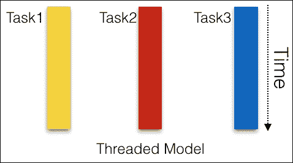
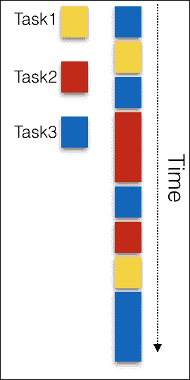

# 第九章：承诺和代理

本章介绍了**异步编程**的重要概念，以及 JavaScript 如何成为利用它的理想语言。本章我们还将介绍代理的元编程这两个概念是在 ES6 中引入的。

在本章中，我们的主要重点是理解异步编程，在我们深入语言特定的构造之前，让我们花时间来理解这个概念。

第一个模型-**同步模型**-是一切的开始。这是最简单的编程模型。每个任务都是依次执行的，只有在第一个任务完成执行后，下一个任务才能开始。当你在这个模型中编程时，我们期望当前任务之前的所有任务都已经完成，没有错误。看一下以下图：


**单线程异步模型**是我们都熟悉的模型。然而，这个模型可能是低效的和需要优化的。对于由几个不同任务组成的任何非平凡程序，这个模型可能会很慢。以以下假设情景为例：

```js
    var result = database.query("SELECT * FROM table");      
    console.log("After reading from the database"); 

```

考虑到同步模型，两个任务是依次执行的。这意味着第二个语句只有在第一个语句完成执行后才会执行。假设第一个语句是一个昂贵的任务，需要 10 秒（从远程数据库读取甚至需要更长的时间是正常的），第二个语句将被阻塞。

当你需要编写高性能和可扩展的系统时，这是一个严重的问题。还有另一个问题，当你编写需要为人类交互编写接口的程序时，比如我们在浏览器上运行的网站。当你执行可能需要一些时间的任务时，你不能阻塞用户。他们可能正在输入输入字段中的内容，而昂贵的任务正在运行；如果我们在忙于执行昂贵的操作时阻止用户输入，那将是一种糟糕的体验。在这种情况下，昂贵的任务需要在后台运行，而我们可以愉快地接受用户的输入。

为了解决这个问题，一个解决方案是将每个任务拆分成自己的控制线程。这被称为**多线程**或**线程模型**。考虑以下图：



不同之处在于任务的拆分方式。在线程模型中，每个任务都在自己的控制线程中执行。通常，线程由操作系统管理，并且可以在不同的 CPU 核心上并行运行，或者在单个核心上通过 CPU 进行适当的线程调度。对于现代 CPU 来说，线程模型在性能上可以非常优化。许多语言支持这种流行的模型。尽管是一种流行的模型，线程模型在实践中可能会很复杂。线程需要相互通信和协调。线程间通信可能会很快变得棘手。还有线程模型的变体，其中状态是不可变的。在这种情况下，模型变得更简单，因为每个线程负责不可变状态，而无需在线程之间管理状态。

# 异步编程模型

第三个模型是我们最感兴趣的。在这个模型中，任务在单个控制线程中交错进行。考虑以下图：



**异步模型**更简单，因为你只有一个线程。当你执行一个任务时，你可以确定只有这个任务在执行。这个模型不需要复杂的线程协调机制，因此更可预测。线程模型和异步模型之间还有一个区别；在线程模型中，你没有办法控制线程的执行，因为线程调度大部分是由操作系统完成的。然而，在异步模型中，没有这样的挑战。

在哪些情况下，异步模型可以胜过同步模型？如果我们只是将任务分成更小的块，直觉上，即使这些更小的块在最后加起来也会花费相当多的时间。

还有一个重要的因素我们还没有考虑。当你执行一个任务时，你最终会等待某些东西-磁盘读取、数据库查询或网络调用；这些都是阻塞操作。当你进入阻塞模式时，你的任务在同步模型中只是等待。看一下下面的图：


在上图中，黑色块是任务等待某些东西的地方。什么是可能导致这种阻塞的典型操作？任务在 CPU 和 RAM 中执行。典型的 CPU 和 RAM 可以处理数据传输命令，比典型的磁盘读取或网络调用快几个数量级。

### 提示

请参考 CPU、内存和磁盘之间延迟的比较（[`gist.github.com/jboner/2841832`](https://gist.github.com/jboner/2841832)）。

当你的任务等待来自这些来源的**I**/**O**（**输入**/**输出**）时，延迟是不可预测的。对于一个做大量 I/O 的同步程序来说，这是性能不佳的原因。

同步和异步模型之间最重要的区别是它们处理阻塞操作的方式。在异步模型中，当程序面临一个遇到阻塞的任务时，会在不等待阻塞操作完成的情况下执行另一个任务。在一个可能存在阻塞的程序中，异步程序的性能优于等效的同步程序，因为等待的时间更少。这种模型的一个略微不准确的可视化如下图所示：


有了这个异步模型的概念背景，我们可以看看语言特定的构造来支持这个模型。

# JavaScript 调用堆栈

在 JavaScript 中，函数调用形成一个帧的堆栈。考虑以下例子：

```js
    function c(z2) { 
        console.log(new Error().stack); 
    } 
    function b(z1) { 
        c(z1+ 1); 
    } 
    function a(z) { 
        b(z + 1); 
    } 
    a(1);  

    //at c (eval at <anonymous>) 
    //at b (eval at <anonymous>) 
    //at a (eval at <anonymous>) 

```

当我们调用函数`a()`时，堆栈中创建了第一个帧，其中包含函数`a()`中的参数和所有局部变量。当函数`a()`调用函数`b()`时，第二个帧被创建并推到堆栈顶部。所有函数调用都是这样进行的。当`c()`函数返回时，堆栈顶部的帧被弹出，留下函数`b()`和`a()`；这一直持续到整个堆栈为空。这是必要的，因为一旦函数执行完毕，JavaScript 需要知道返回的位置。

## 消息队列

JavaScript 运行时包含一个消息队列。这个队列包含要处理的消息列表。这些消息是响应事件（如`click`或收到的 HTTP 响应）而排队的。每个消息都与一个回调函数相关联。

## 事件循环

浏览器标签在一个单线程-事件循环中运行。这个循环不断地从消息队列中挑选消息并执行与之相关联的回调。事件循环只是不断地从消息队列中挑选任务，而其他进程则向消息队列添加任务。其他进程，如定时器和事件处理程序，会并行运行并不断向队列中添加任务。

## 定时器

`setTimeout()`方法创建一个计时器，并等待直到触发。当计时器执行时，一个任务被添加到消息队列中。`setTimeOut()`方法接受两个参数：一个回调和持续时间（以毫秒为单位）。在持续时间之后，回调被添加到消息队列中。一旦回调被添加到消息队列中，事件循环最终会捡起它并执行它。然而，并没有保证事件循环何时会捡起回调。

### 完全运行

当事件循环从队列中取出消息时，相关的回调会完全运行。这意味着在处理下一个消息之前，消息会完全被处理。这个特性给了异步模型一种可预测性。由于在执行之间没有任何干预来中断任何消息，这个模型比其他模型简单得多。然而，一旦消息被取出，即使执行时间太长，浏览器上的任何其他交互也会被阻塞。

### 事件

您可以为对象注册事件处理程序，并异步接收方法的结果。以下示例显示了如何为`XMLHttpRequest` API 设置事件处理程序：

```js
    var xhr = new XMLHttpRequest(); 
    xhr.open('GET', 'http://babeljs.io', true); 
    xhr.onload = function(e) { 
      if (this.status == 200) { 
        console.log("Works"); 
      } 
    }; 
    xhr.send(); 

```

在上面的片段中，我们创建了`XMLHttpRequest`类的对象。一旦请求对象被创建，我们将为其注册事件处理程序。例如`onload()`等事件处理程序在从`open()`方法接收到响应时会异步触发。

`send()`方法实际上并不会启动请求，它会将请求添加到消息队列中，以便事件循环捡起并执行与之关联的必要回调。

### 回调

Node.js 应用程序推广了这种接收异步数据的风格。回调是作为异步函数调用的最后一个参数传递的函数。

为了说明用法，让我们使用 Node.js 中读取文件的以下示例：

```js
    fs.readFile('/etc/passwd', (err, data) => { 
      if (err) throw err; 
     console.log(data); 
    }); 

```

不要担心这里的一些细节。我们使用文件系统模块作为`fs`的别名。这个模块有一个`readFile`方法来异步读取文件。我们将文件路径和文件名作为第一个参数传递，将回调函数作为函数的最后一个参数传递。在示例中，我们使用匿名函数作为回调。

回调函数有两个参数-错误和数据。当`readFile()`方法成功时，回调函数接收`data`，如果失败，`error`参数将包含错误详情。

我们还可以使用稍微函数式的风格来编写相同的回调。考虑以下示例：

```js
    fs.readFile('/etc/passwd',  
      //success 
      function(data) { 
        console.log(data) 
      }, 
      //error 
      function(error) { 
        console.log(error) 
      } 
    );   

```

这种传递回调的风格也被称为**连续传递风格**（**CPS**）；执行的下一步或继续作为参数传递。下面的例子进一步说明了回调的 CPS 风格：

```js
    console.log("1"); 
    cps("2", function cps_step2(val2){ 
      console.log(val2); 
      cps("3", function cos_step3(val3){ 
        console.log(val3); 
      }) 
      console.log("4"); 
    }); 
    console.log("5"); 
    //1 5 2 4 3 

    function cps(val, callback) { 
      setTimeout(function () { 
            callback(val); 
      }, 0); 
    } 

```

我们将为每个步骤提供继续（下一个回调）。这种嵌套的回调风格有时也会引起一个问题，被称为回调地狱。

回调和 CPS 引入了一种完全不同的编程风格。虽然与其他构造相比，理解回调更容易，但回调可能会创建稍微难以理解的代码。

# 承诺

ES6 引入了承诺作为回调的替代。与回调一样，承诺用于检索异步函数调用的结果。使用承诺比回调更容易，并产生更可读的代码。然而，为了为您的异步函数实现承诺需要更多的工作。

承诺对象代表一个可能现在或将来可用的值，或者可能永远不可用。顾名思义，承诺可能会被实现或被拒绝。承诺充当了最终结果的占位符。

承诺有三种互斥的状态，如下所示：

1.  在结果准备好之前，承诺是**待定**的；这是初始状态。

1.  当结果准备好时，承诺是**实现**的。

1.  发生错误时，promise 被**拒绝**。

当一个待定的 promise 被完成或拒绝时，与 promise 的`then()`方法排队的相关回调/处理程序将被执行。

promise 的目的是为 CPS 回调提供更好的语法。典型的 CPS 风格的异步函数如下：

```js
    asyncFunction(arg, result => { 
      //... 
    }) 

```

前面的代码可以用 promise 写得有些不同，如下面的代码行所示：

```js
    asyncFunction(arg). 
    then(result=>{ 
      //... 
    }); 

```

异步函数现在返回一个 promise，这是一个最终结果的占位符。使用`then()`方法注册的回调在结果准备好时会被通知。

你可以链接`then()`方法。当`then()`方法看到回调触发了另一个返回 promise 的异步操作时，它会返回该 promise。看一下以下例子：

```js
    asyncFunction(arg) 
    .then(resultA=>{ 
      //... 
      return asyncFunctionB(argB); 
    }) 
    .then(resultB=>{ 
      //... 
    }) 

```

让我们看一个实际的例子，说明我们如何使用 promise。我们在 Node.js 中看到了一个典型的异步文件读取的例子；现在让我们看看当使用 promise 时，这个例子会是什么样子。为了唤起我们的记忆，我们写了类似以下的东西：

```js
    fs.readFile('text.json', 
      function (error, text) { 
          if (error) { 
              console.error('Error while reading text file'); 
          } else { 
              try { 
                  //... 
              } catch (e) { 
                  console.error('Invalid content'); 
              } 
          } 
      }); 

```

我们在这里将回调视为延续；现在让我们看看如何使用 promise 来编写相同的函数：

```js
    readFileWithPromises('text.json') 
    .then(text=>{ 
      //...process text 
    }) 
    .catch(error=>{ 
      console.error('Error while reading text file'); 
    }) 

```

现在回调通过结果和方法`then()`和`catch()`被调用。错误处理更加清晰，因为我们不再写`if...else`和`try...catch`构造了。

## 创建 promise

我们看到了如何消费 promise。现在，让我们看看如何生成它们。

作为生产者，你可以创建一个`Promise`对象，并通过`Promise`发送结果。这个构造看起来像以下的代码片段：

```js
    const p = new Promise( 
      function (resolve, reject) { // (1) 

          if (   ) { 
              resolve(value); // success 
          } else { 
              reject(reason); // failure 
          } 
      }); 

```

`Promise`的参数是一个执行函数。执行函数处理 promise 的两种状态，如下：

+   **解决**：如果结果成功生成，执行器通过`resolve()`方法将结果发送回来。这个方法通常会完成`Promise`对象。

+   **拒绝**：如果发生错误，执行器通过`reject()`方法通知消费者。如果发生异常，也会通过`reject()`方法通知。

作为消费者，你可以通过`then()`和`catch()`方法被通知 promise 的完成或拒绝。考虑以下代码片段作为例子：

```js
    promise 
    .then(result => { /* promise fulfilled */ }) 
    .catch(error => { /* promise rejected */ }); 

```

现在我们对如何生成 promise 有了一些背景知识，让我们重新编写我们之前的异步文件`read`方法的例子，以生成 promise。我们将使用 Node.js 的文件系统模块和`readFile()`方法，就像上次一样。如果你不理解以下代码片段中的任何 Node.js 特定构造，请不要担心。考虑以下代码：

```js
    import {readFile} from 'fs'; 
    function readFileWithPromises(filename) { 
        return new Promise( 
            function (resolve, reject) { 
                readFile(filename,  
                    (error, data) => { 
                        if (error) { 
                            reject(error); 
                        } else { 
                            resolve(data); 
                        } 
                    }); 
            }); 
    } 

```

在前面的代码片段中，我们创建了一个新的`Promise`对象并将其返回给消费者。正如我们之前看到的，`Promise`对象的参数是执行函数，执行函数负责`Promise`的两种状态-完成和拒绝。执行函数接受两个参数，`resolve`和`reject`。这些是通知`Promise`对象状态给消费者的函数。

在执行函数内部，我们将调用实际的函数-`readFile()`方法；如果这个函数成功，我们将使用`resolve()`方法返回结果，如果有错误，我们将使用`reject()`方法通知消费者。

如果在`then()`中发生错误，它们会在后续的`catch()`块中被捕获。看一下以下代码：

```js
    readFileWithPromises('file.txt') 
    .then(result=> { 'something causes an exception'}) 
    .catch(error=> {'Something went wrong'}); 

```

在这种情况下，`then()`的反应引起了异常或错误，后续的`catch()`块可以处理这个问题。

同样，在`then()`或`catch()`处理程序中抛出的异常会传递给下一个错误处理程序。考虑以下代码片段：

```js
    readFileWithPromises('file.txt') 
    .then(throw new Error()) 
    .catch(error=> {'Something went wrong'}); 

```

### Promise.all()

一个有趣的用例是创建一个可迭代的 promise。假设您有一个要访问和解析结果的 URL 列表。您可以为每个 fetch URL 调用创建 promise，并单独使用它们，或者您可以创建一个包含所有 URL 的迭代器，并一次性使用 promise。`Promise.all()`方法将可迭代的 promise 作为参数。当所有 promise 都被实现时，数组将填充其结果。考虑以下代码作为示例:

```js
    Promise.all([ 
        f1(), 
        f2() 
    ]) 
    .then(([r1,r2]) => { 
        //    
    }) 
    .catch(err => { 
        //.. 
    }); 

```

## 元编程和代理

元编程是指一种编程方法，其中程序了解其结构并可以操纵自身。许多语言支持元编程，以宏的形式。宏是函数式语言（如**LISP**（**Locator/ID Separation Protocol**））中的重要构造。在 Java 和 C#等语言中，反射是一种元编程形式，因为程序可以使用反射来检查有关自身的信息。

在 JavaScript 中，您可以说对象的方法允许您检查结构，因此它们提供了元编程。有三种元编程范式(*元对象协议的艺术*，Kiczales 等人，[`mitpress.mit.edu/books/art-metaobject-protocol`](https://mitpress.mit.edu/books/art-metaobject-protocol))：

+   内省: 这给予程序内部的只读访问

+   自我修改: 这使得对程序进行结构性更改成为可能

+   干预: 这改变了语言语义

`Object.keys()`方法是内省的一个例子。在下面的例子中，程序正在检查自己的结构:

```js
    const introspection = { 
      intro() { 
        console.log("I think therefore I am"); 
      } 
    } 
    for (const key of Object.keys(introspection)){ 
      console.log(key);  //intro 
    } 

```

在 JavaScript 中，通过改变对象的属性，也可以进行自我修改。

然而，干预或更改语言语义的能力在 ES6 之前在 JavaScript 中是不可用的。代理被引入以开放这种可能性。

## 代理

您可以使用代理来确定对象的行为，每当访问其属性时，称为目标。代理用于定义对象的基本操作的自定义行为，例如查找属性、函数调用和赋值。

代理需要两个参数，如下所示:

+   处理程序: 对于要自定义的每个操作，您需要一个`handler`方法。此方法拦截操作，有时称为陷阱。

+   目标: 当`handler`未拦截操作时，`target`作为回退使用。

让我们看下面的例子，以更好地理解这个概念:

```js
    var handler = { 
      get: function(target, name){ 
        return name in target ? target[name] :42; 
      } 
    } 
    var p = new Proxy({}, handler); 
    p.a = 100; 
    p.b = undefined; 
    console.log(p.a, p.b); // 100, undefined 
    console.log('c' in p, p.c); // false, 42 

```

在这个例子中，我们正在捕获从对象获取属性的操作。如果属性不存在，我们将返回`42`作为默认属性值。我们使用`get`处理程序来捕获此操作。

您可以使用代理在将其设置在对象上之前验证值。为此，我们可以捕获`set`处理程序如下:

```js
    let ageValidator = { 
      set: function(obj, prop, value) { 
        if (prop === 'age') { 
          if (!Number.isInteger(value)) { 
            throw new TypeError('The age is not an number'); 
          } 
          if (value > 100) { 
            throw new RangeError('You cant be older than 100'); 
          } 
        } 
        // If no error - just store the value in the property 
        obj[prop] = value; 
      } 
    }; 
    let p = new Proxy({}, ageValidator); 
    p.age = 100; 
    console.log(p.age); // 100 
    p.age = 'Two'; // Exception 
    p.age = 300; // Exception 

```

在上面的例子中，我们正在捕获`set`处理程序。当我们设置对象的属性时，我们正在捕获该操作并引入值的验证。如果值有效，我们将设置属性。

## 函数陷阱

如果目标是函数，可以捕获两种操作:`apply`和`construct`。

要拦截函数调用，您需要捕获`get`和`apply`操作。首先获取函数，然后应用调用该函数。因此，您`get`函数并返回函数。

让我们考虑以下示例，以了解方法拦截是如何工作的:

```js
    var car = { 
      name: "Ford", 
      method_1: function(text){ 
        console.log("Method_1 called with "+ text); 
      } 
    } 
    var methodInterceptorProxy = new Proxy(car, { 
     //target is the object being proxied, receiver is the proxy 
     get: function(target, propKey, receiver){ 
      //I only want to intercept method calls, not property access 
      var propValue = target[propKey]; 
      if (typeof propValue != "function"){ 
       return propValue; 
  } 
      else{ 
       return function(){ 
        console.log("intercepting call to " + propKey
          + " in car " + target.name); 
        //target is the object being proxied 
        return propValue.apply(target, arguments); 
       } 
      } 
     } 
    }); 
    methodInterceptorProxy.method_1("Mercedes"); 
    //"intercepting call to method_1 in car Ford" 
    //"Method_1 called with Mercedes" 

```

在上面的例子中，我们正在捕获`get`操作。如果要`get`的属性的类型是函数，我们将使用`apply`来调用该函数。如果您看到输出，我们会得到两个`console.logs`；第一个是来自代理的，我们捕获了`get`操作，第二个是来自实际方法调用。

元编程是一个有趣的构造。然而，任何形式的内省或反射都会影响性能。在使用代理时应该小心，因为它们可能会很慢。

# 总结

在本章中，我们看了两个重要的概念。ES6 代理是用于定义基本操作的自定义行为的有用的元编程构造（例如，属性查找、赋值、枚举、函数调用等）。我们看了如何使用处理程序、陷阱和代理目标来拦截和修改操作的默认行为。这为我们提供了在 JavaScript 中以前缺乏的非常强大的元编程能力。

本章讨论的另一个重要构造是 ES6 的 Promise。Promise 很重要，因为它们使得异步编程构造更容易使用。Promise 充当了一个值的代理，当 Promise 被创建时值不一定已知。这使得异步方法可以返回类似于同步方法的值 - 异步方法返回的不是最终值，而是将来某个时间点的值的 Promise。

这些都是 ES6 中非常强大的构造，极大地增强了语言的核心能力。

在下一章中，我们将探讨使用 JavaScript 在浏览器和 DOM 操作方面的迷人可能性。
