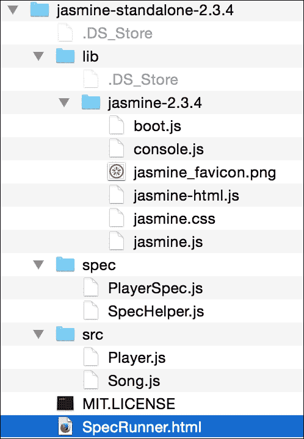
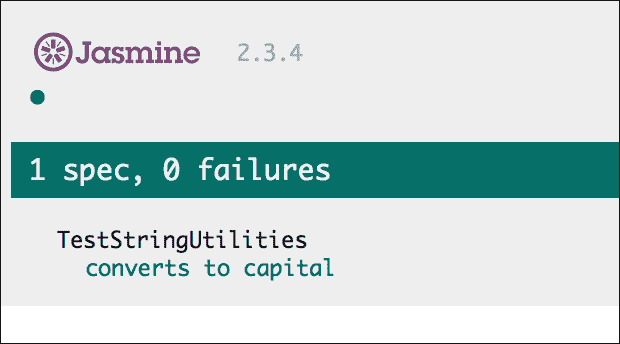
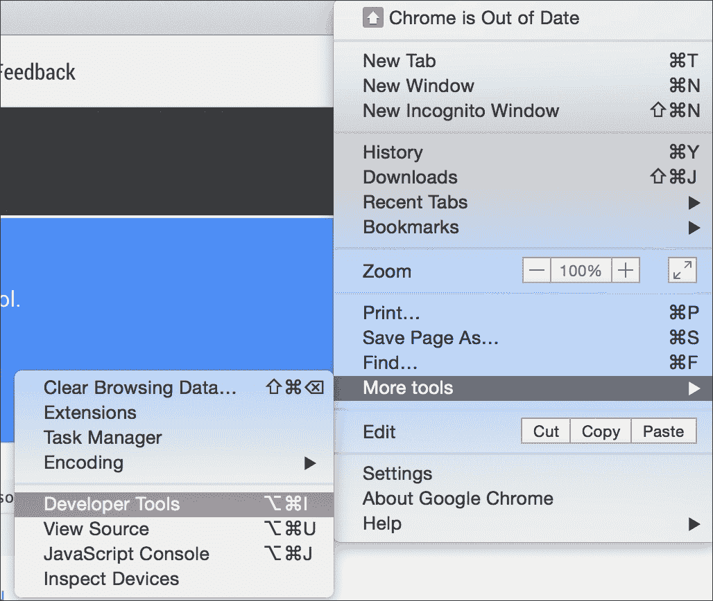
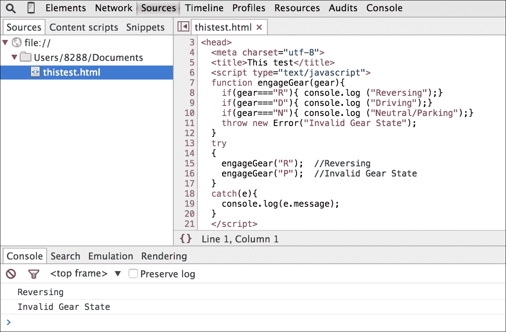
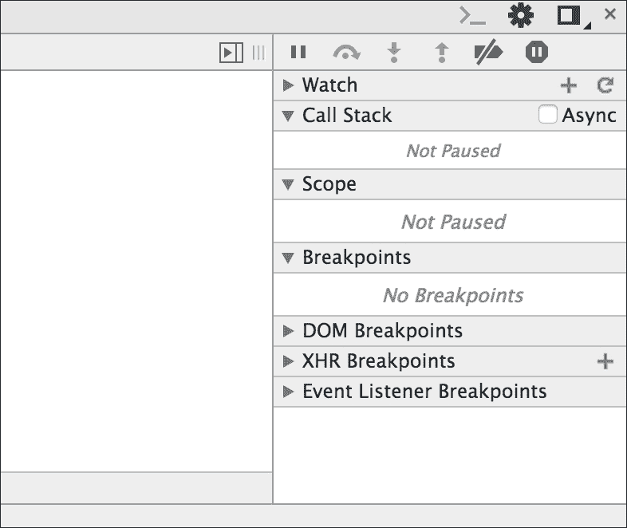
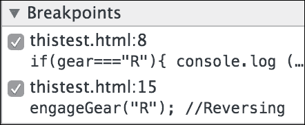
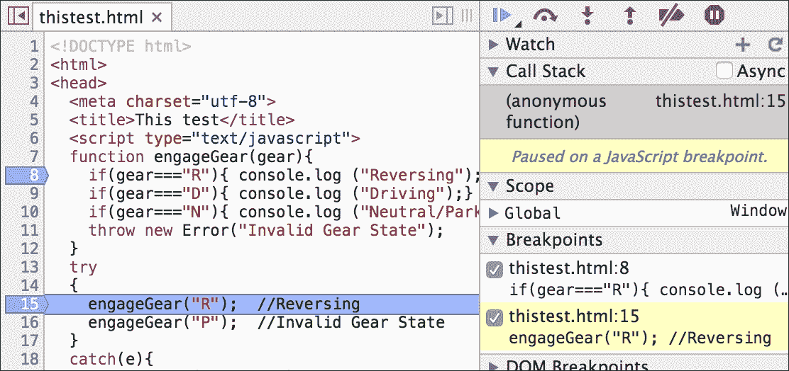
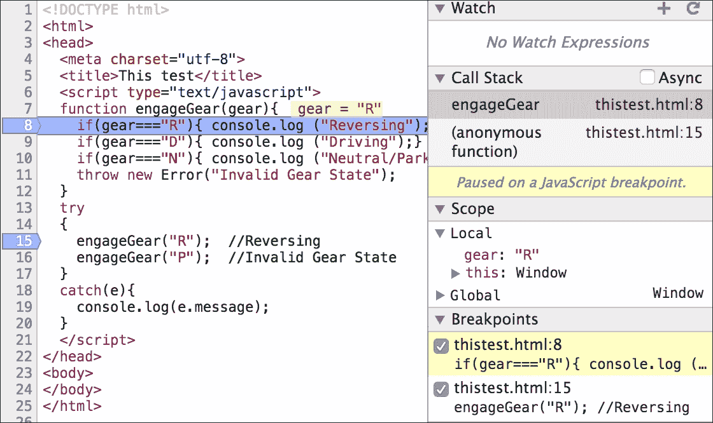

# 第十二章：测试和调试

当你编写 JavaScript 应用程序时，你很快会意识到拥有一个完善的测试策略是不可或缺的。事实上，不写足够的测试几乎总是一个坏主意。覆盖代码的所有非平凡功能是至关重要的，以确保以下几点：

+   现有代码按规范行为

+   任何新代码都不会破坏规范定义的行为

这两点都非常重要。许多工程师只考虑第一点作为足够测试代码的唯一原因。测试覆盖的最明显优势是确保推送到生产系统的代码大部分是无错误的。聪明地编写测试用例以覆盖代码的最大功能区域，通常可以很好地指示代码的整体质量。在这一点上不应该有争论或妥协。尽管很不幸，许多生产系统仍然缺乏足够的代码覆盖。建立一个工程文化，让开发人员像编写代码一样考虑编写测试是非常重要的。

第二点更加重要。传统系统通常很难管理。当你在处理代码时，无论是别人写的还是由一个大型分布式团队编写的，很容易引入错误并破坏事物。即使是最优秀的工程师也会犯错。当你在处理一个你不熟悉的大型代码库时，如果没有足够的测试覆盖来帮助你，你会引入错误。因为没有测试用例来确认你的更改，你对自己的更改没有信心，你的代码发布将是不稳定的，缓慢的，显然充满了隐藏的错误。

你将不会重构或优化你的代码，因为你不会真正确定对代码库的更改可能会破坏什么（同样，因为没有测试用例来确认你的更改）；所有这些都是一个恶性循环。这就像土木工程师说-尽管我建造了这座桥，但我对建筑质量没有信心。它可能会立即倒塌，也可能永远不会。尽管这听起来可能有些夸张，但我见过很多高影响的生产代码被推送而没有测试覆盖。这是有风险的，应该避免。当你编写足够的测试用例来覆盖大部分功能代码时，当你对这些部分进行更改时，你会立即意识到是否存在问题。如果你的更改导致测试用例失败，你会意识到问题。如果你的重构破坏了测试场景，你会意识到问题；所有这些都发生在代码被推送到生产之前。

近年来，像测试驱动开发和自测试代码这样的想法在敏捷方法中变得越来越重要。这些都是基本合理的想法，将帮助你编写健壮的代码-你有信心的代码。我们将在本章讨论所有这些想法。我们将了解如何在现代 JavaScript 中编写良好的测试用例。我们还将看一些工具和方法来调试你的代码。传统上，由于缺乏工具，JavaScript 测试和调试都有些困难，但现代工具使这两者都变得容易和自然。

# 单元测试

当我们谈论测试用例时，我们大多指的是单元测试。假设我们要测试的单元总是一个函数是不正确的。这个单元，或者说工作单元，是一个构成单一行为的逻辑单元。这个单元应该能够通过公共接口被调用，并且应该能够独立进行测试。

因此，单元测试可以执行以下功能：

+   它测试一个单一的逻辑函数

+   它可以在没有特定执行顺序的情况下运行

+   它负责处理自己的依赖和模拟数据

+   对于相同的输入，总是返回相同的结果

+   它应该是自解释的，可维护的和可读的

Martin Fowler 提倡*测试金字塔*（[`martinfowler.com/bliki/TestPyramid.html`](http://martinfowler.com/bliki/TestPyramid.html)）策略，以确保我们有大量的单元测试来确保最大的代码覆盖率。在本章中，我们将讨论两种重要的测试策略。

## 测试驱动开发

**测试驱动开发**（**TDD**）在过去几年中变得非常重要。这个概念最初是作为极限编程方法论的一部分提出的。其核心思想是有短小的重复开发周期，重点是先编写测试用例。这个周期看起来像下面这样：

1.  根据代码单元的具体规格添加一个测试用例。

1.  运行现有的测试套件，看看你编写的新测试用例是否失败；它应该失败，因为该单元尚未有代码。这一步确保当前的测试工具能够正常工作。

1.  编写的代码主要用于确认测试用例。这段代码并没有经过优化、重构，甚至可能并不完全正确。但是，目前来说这是可以接受的。

1.  重新运行测试，看看所有的测试用例是否通过。经过这一步，你可以确信新代码没有破坏任何东西。

1.  重构代码以确保你正在优化单元并处理所有边缘情况

这些步骤对于你添加的任何新代码都是重复的。这是一种对敏捷方法论非常有效的优雅策略。只有当可测试的代码单元很小并且仅符合测试用例时，TDD 才会成功。

## 行为驱动开发

在尝试遵循 TDD 时一个非常常见的问题是词汇和正确性的定义。BDD 试图在遵循 TDD 时引入一种通用语言。这种语言确保业务和工程都在讨论同一件事情。

我们将使用 Jasmine 作为主要的 BDD 框架，并探索各种测试策略。

### 注意

你可以通过从[`github.com/jasmine/jasmine/releases/download/v2.3.4/jasmine-standalone-2.3.4.zip`](https://github.com/jasmine/jasmine/releases/download/v2.3.4/jasmine-standalone-2.3.4.zip)下载独立包来安装 Jasmine。

当你解压这个包时，你会看到以下的目录结构：



`lib`目录包含了你在项目中需要的 JavaScript 文件，用于开始编写 Jasmine 测试用例。如果你打开`SpecRunner.html`，你会发现其中包含了以下 JavaScript 文件：

```js
    <script src="lib/jasmine-2.3.4/jasmine.js"></script> 
    <script src="lib/jasmine-2.3.4/jasmine-html.js"></script> 
    <script src="lib/jasmine-2.3.4/boot.js"></script>     

    <!-- include source files here... -->    
    <script src="src/Player.js"></script>    
    <script src="src/Song.js"></script>     
    <!-- include spec files here... -->    
    <script src="spec/SpecHelper.js"></script>    
    <script src="spec/PlayerSpec.js"></script> 

```

前三个是 Jasmine 自己的框架文件。接下来的部分包括我们想要测试的源文件和实际的测试规格。

让我们通过一个非常普通的例子来尝试 Jasmine。创建一个`bigfatjavascriptcode.js`文件，并将其放在`src/`目录中。我们将要测试的函数如下：

```js
    function capitalizeName(name){ 
      return name.toUpperCase(); 
    } 

```

这是一个简单的函数，只做了一件事情。它接收一个字符串并返回一个大写的字符串。我们将围绕这个函数测试各种情况。这就是我们之前讨论过的代码单元。

接下来，创建测试规格。创建一个 JavaScript 文件`test.spec.js`，并将其放在`spec/`目录中。你需要将以下两行添加到你的`SpecRunner.html`中：文件应包含以下内容：

```js
    <script src="src/bigfatjavascriptcode.js"></script>     
    <script src="spec/test.spec.js"></script>    

```

包含的顺序并不重要。当我们运行`SpecRunner.html`时，你会看到类似以下图片的内容：



这是 Jasmine 报告，显示了执行的测试数量以及失败和成功的数量。现在，让我们让测试用例失败。我们想要测试一个情况，即将一个`undefined`变量传递给函数。让我们添加一个测试用例，如下所示：

```js
    it("can handle undefined", function() { 
        var str= undefined; 
        expect(capitalizeName(str)).toEqual(undefined); 
    }); 

```

现在，当你运行`SpecRunner`时，你会看到以下结果：


正如你所看到的，这个测试用例显示了一个详细的错误堆栈的失败。现在，我们将着手解决这个问题。在你的原始 JS 代码中，处理 undefined 如下：

```js
    function capitalizeName(name){ 
      if(name){ 
        return name.toUpperCase(); 
      }   
    } 

```

通过这个改变，你的测试用例将通过，并且你将在 Jasmine 报告中看到以下结果：


这非常类似于测试驱动开发的样子。你编写测试用例，然后填写必要的代码以符合规范，并重新运行测试套件。让我们了解一下 Jasmine 测试的结构。

我们的测试规范看起来像以下代码片段：

```js
    describe("TestStringUtilities", function() { 
          it("converts to capital", function() { 
              var str = "albert"; 
              expect(capitalizeName(str)).toEqual("ALBERT"); 
          }); 
          it("can handle undefined", function() { 
              var str= undefined; 
              expect(capitalizeName(str)).toEqual(undefined); 
          }); 
    }); 

```

`describe("TestStringUtilities"`是一个测试套件。测试套件的名称应该描述我们正在测试的代码单元；这可以是一个函数或一组相关功能。在规范内部，你将调用全局的 Jasmine 函数`it`，并传递规范的标题和验证测试用例条件的函数。这个函数就是实际的测试用例。你可以使用`expect`函数捕获一个或多个断言或一般的期望。当所有期望都为`true`时，你的规范通过了。你可以在`describe`和`it`函数内部编写任何有效的 JavaScript 代码。作为期望的一部分验证的值使用匹配器进行匹配。在我们的例子中，`toEqual`是匹配器，用于匹配两个值是否相等。Jasmine 包含丰富的匹配器，适合大多数常见用例。Jasmine 支持的一些常见匹配器如下：

+   toBe：这个匹配器检查被比较的两个对象是否相等。这与===比较相同。例如，看下面的代码片段：

```js
        var a = { value: 1}; 
        var b = { value: 1 }; 

        expect(a).toEqual(b);  // success, same as == comparison 
        expect(b).toBe(b);     // failure, same as === comparison 
        expect(a).toBe(a);     // success, same as === comparison 

```

+   not：你可以用 not 前缀否定一个匹配项。例如，`expect(1).not.toEqual(2);`将否定`toEqual()`所做的匹配。

+   toContain：这个检查一个元素是否是数组的一部分。它不是一个精确的对象匹配，如 toBe。例如，看一下下面的代码行：

```js
        expect([1, 2, 3]).toContain(3); 
        expect("astronomy is a science").toContain("science"); 

```

+   toBeDefined 和 toBeUndefined：这两个匹配项很方便，可以检查变量是否为 undefined。

+   toBeNull：这个检查变量的值是否为 null。

+   toBeGreaterThan 和 toBeLessThan：这两个匹配器执行数字比较（也适用于字符串）。例如，考虑以下代码片段：

```js
        expect(2).toBeGreaterThan(1); 
        expect(1).toBeLessThan(2); 
        expect("a").toBeLessThan("b"); 

```

Jasmine 的一个有趣特性是间谍。当你编写一个大型系统时，不可能确保所有系统始终可用和正确。同时，你不希望你的单元测试因为一个可能被破坏或不可用的依赖而失败。为了模拟所有依赖都可用于我们要测试的代码单元的情况，我们将模拟这个依赖，始终给出我们期望的响应。模拟是测试的一个重要方面，大多数测试框架都提供了模拟支持。Jasmine 允许使用一个名为**Spy**的功能进行模拟。Jasmine 间谍本质上是我们可能在编写测试用例时没有准备好的函数的存根，但作为功能的一部分，我们需要跟踪我们正在执行这些依赖项而不是忽略它们。考虑以下例子：

```js
    describe("mocking configurator", function() { 
      var cofigurator = null; 
      var responseJSON = {}; 

      beforeEach(function() { 
        configurator = { 
          submitPOSTRequest: function(payload) { 
            //This is a mock service that will eventually be replaced  
            //by a real service 
            console.log(payload); 
            return {"status": "200"}; 
          } 
        }; 
        spyOn(configurator, 'submitPOSTRequest').and.returnValue
         ({"status": "200"}); 
       configurator.submitPOSTRequest({ 
          "port":"8000", 
          "client-encoding":"UTF-8" 
        }); 
      }); 

      it("the spy was called", function() { 
        expect(configurator.submitPOSTRequest).toHaveBeenCalled(); 
      }); 

      it("the arguments of the spy's call are tracked", function() { 
        expect(configurator.submitPOSTRequest).toHaveBeenCalledWith(
          {"port":"8000", "client-encoding":"UTF-8"}); 
      }); 
    }); 

```

在这个例子中，当我们编写这个测试用例时，我们要么没有依赖项`configurator.submitPOSTRequest()`的真正实现，要么有人正在修复这个特定的依赖项；无论哪种情况，我们都没有它可用。为了使我们的测试工作，我们需要模拟它。Jasmine 间谍允许我们用它的模拟替换一个函数，并允许我们跟踪它的执行。

在这种情况下，我们需要确保调用了依赖项。当实际的依赖项准备好时，我们将重新访问这个测试用例，以确保它符合规范；然而，此时，我们只需要确保调用了依赖项。Jasmine 函数`tohaveBeenCalled()`让我们跟踪可能是模拟的函数的执行。我们可以使用`toHaveBeenCalledWith()`，它允许我们确定存根函数是否使用正确的参数进行了调用。使用 Jasmine 间谍可以创建几种其他有趣的场景。本章的范围不允许我们覆盖它们所有，但我鼓励你自己发现这些领域。

## 摩卡，柴和西农

尽管 Jasmine 是最突出的 JavaScript 测试框架，但 mocha 和 chai 在`Node.js`环境中也越来越受到重视。

+   Mocha 是用于描述和运行测试用例的测试框架

+   柴是 Mocha 支持的断言库

+   西农在创建测试时非常方便地创建模拟和存根

我们不会在本书中讨论这些框架；然而，如果你想尝试这些框架，对 Jasmine 的经验将会很有帮助。

# JavaScript 调试

如果你不是一个完全新的程序员，我相信你一定花了一些时间来调试你自己或别人的代码。调试几乎就像一种艺术形式。每种语言在调试方面都有不同的方法和挑战。JavaScript 传统上是一种难以调试的语言。我曾经在痛苦中度过了几天几夜，试图使用`alert()`函数调试糟糕的 JavaScript 代码。幸运的是，现代浏览器，如 Mozilla，Firefox 和 Google Chrome，都有出色的**开发者工具**，可以帮助在浏览器中调试 JavaScript。还有像 IntelliJ IDEA 和 WebStorm 这样的 IDE，对 JavaScript 和 Node.js 有很好的调试支持。在本章中，我们将主要关注 Google Chrome 内置的开发者工具。Firefox 也支持 Firebug 扩展，并且有出色的内置开发者工具，但由于它们的行为与 Google Chrome 的**开发者工具**几乎相同，我们将讨论在这两种工具中都适用的常见调试方法。

在我们讨论具体的调试技术之前，让我们了解一下在尝试调试我们的代码时我们感兴趣的错误类型。

## 语法错误

当你的代码有一些不符合 JavaScript 语法的东西时，解释器会拒绝那部分代码。如果你的 IDE 帮助你进行语法检查，这些错误很容易被捕捉到。大多数现代 IDE 都可以帮助解决这些错误。早些时候，我们讨论了工具的有用性，比如 JSLint 和 JSHint，可以帮助捕捉代码中的语法问题。它们分析代码并标记语法错误。JSHint 的输出可能非常有启发性。例如，以下输出显示了我们可以在代码中进行的许多更改。以下代码片段来自我的一个现有项目：

```js
    temp git:(dev_branch) X jshint test.js 
    test.js: line 1, col 1, Use the function form of "use strict". 
    test.js: line 4, col 1, 'destructuring expression' 
      is available in ES6 (use esnext option) or 
      Mozilla JS extensions (use moz). 
    test.js: line 44, col 70, 'arrow function syntax (=>)' 
      is only available in ES6 (use esnext option). 
    test.js: line 61, col 33, 'arrow function syntax (=>)'
      is only available in ES6 (use esnext option). 
    test.js: line 200, col 29, Expected ')' to match '(' from
      line 200 and instead saw ':'. 
    test.js: line 200, col 29, 'function closure expressions' 
      is only available in Mozilla JavaScript extensions (use moz option). 
    test.js: line 200, col 37, Expected '}' to match '{' from 
      line 36 and instead saw ')'. 
    test.js: line 200, col 39, Expected ')' and instead saw '{'. 
    test.js: line 200, col 40, Missing semicolon. 

```

### 使用严格模式

我们在前几章中简要讨论了严格模式。当你启用严格模式时，JavaScript 不再接受代码中的语法错误。严格模式不会悄悄失败，而是会将这些失败抛出错误。它还可以帮助你将错误转换为实际的错误。有两种强制使用严格模式的方法。如果你想要整个脚本都使用严格模式，你可以在 JavaScript 程序的第一行添加`use strict`语句（带引号）。如果你想要特定函数符合严格模式，你可以将指令添加为函数的第一行。例如，看一下以下代码片段：

```js
    function strictFn(){    
      // This line makes EVERYTHING under this scrict mode 
      'use strict';    
      ... 
      function nestedStrictFn() {  
        //Everything in this function is also nested 
        ... 
      }    
    } 

```

## 运行时异常

当您执行代码时，出现这些错误，尝试引用一个`未定义`的变量，或者尝试处理`null`。当运行时异常发生时，导致异常的特定行之后的任何代码都不会被执行。在代码中正确处理这种异常情况是至关重要的。虽然异常处理可以帮助防止崩溃，但它们也有助于调试。您可以将可能遇到运行时异常的代码包装在`try{ }`块中。当此块内的任何代码生成运行时异常时，相应的处理程序会捕获它。处理程序由`catch(exception){}`块定义。让我们通过以下示例来澄清这一点：

```js
    try { 
      var a = doesnotexist; // throws a runtime exception 
    } catch(e) {  
      console.log(e.message);  //handle the exception 
      //prints - "doesnotexist is not defined" 
    } 

```

在这个例子中，`var a = doesnotexist`行试图将一个`未定义`的变量`doesnotexist`赋值给另一个变量`a`。这会导致运行时异常。当我们将这个有问题的代码包装在`try{}catch(){}`块中，或者当异常发生（或被抛出）时，执行会在`try{}`块中停止，并直接转到`catch() {}`处理程序。捕获处理程序负责处理异常情况。在这种情况下，我们为了调试目的在控制台上显示错误消息。您可以明确地抛出异常来触发代码中未处理的情况。考虑以下的例子：

```js
    function engageGear(gear){ 
      if(gear==="R"){ console.log ("Reversing");} 
      if(gear==="D"){ console.log ("Driving");} 
      if(gear==="N"){ console.log ("Neutral/Parking");} 
      throw new Error("Invalid Gear State"); 
    } 
    try 
    { 
      engageGear("R");  //Reversing 
      engageGear("P");  //Invalid Gear State 
    } 
    catch(e){ 
      console.log(e.message); 
    } 

```

在这个例子中，我们正在处理变速器的有效状态：`R`，`N`和`D`；然而，当我们收到无效状态时，我们明确地抛出异常，清楚地说明原因。当我们调用可能引发异常的函数时，我们将在`try{}`块中包装代码，并附加一个带有`catch(){}`的处理程序。当异常被`catch()`块捕获时，我们将适当地处理异常情况。

### Console.log 和断言

在控制台上显示执行状态在调试时可能非常有用。尽管现代开发工具允许您设置断点并在运行时停止执行以检查特定值，但通过在控制台上记录一些变量状态，您可以快速检测到一些小问题。

有了这些概念，让我们看看如何使用 Chrome **开发者工具**来调试 JavaScript 代码。

### Chrome 开发者工具

您可以通过单击**菜单** | **更多工具** | **开发者工具**来启动 Chrome **开发者工具**。看一下以下的屏幕截图：



Chrome 开发者工具在浏览器的下方窗格中打开，并且有一堆非常有用的部分。考虑以下的屏幕截图：


**元素**面板帮助您检查和监视 DOM 树和每个组件的相关样式表。

**网络**面板对于理解网络活动非常有用。例如，您可以实时监视通过网络下载的资源。

对我们来说最重要的窗格是**Sources**窗格。这个窗格显示了 JavaScript 和调试器。让我们创建一个包含以下内容的示例 HTML：

```js
    <!DOCTYPE html> 
    <html> 
    <head> 
      <meta charset="utf-8"> 
      <title>This test</title> 
      <script type="text/javascript"> 
      function engageGear(gear){ 
        if(gear==="R"){ console.log ("Reversing");} 
        if(gear==="D"){ console.log ("Driving");} 
        if(gear==="N"){ console.log ("Neutral/Parking");} 
        throw new Error("Invalid Gear State"); 
      } 
      try 
      { 
        engageGear("R");  //Reversing 
        engageGear("P");  //Invalid Gear State 
      } 
      catch(e){ 
        console.log(e.message); 
      } 
      </script> 
    </head> 
    <body> 
    </body> 
    </html> 

```

保存这个 HTML 文件并在 Google Chrome 中打开它。在浏览器中打开**开发者工具**，您将看到以下屏幕：



这是**Sources**面板的视图。您可以在此面板中看到 HTML 和嵌入的 JavaScript 源代码。您还可以看到**Console**窗口，并且可以看到文件被执行并且输出显示在控制台上。

在右侧，您将看到调试器窗口，如下面的屏幕截图所示：



在**Sources**面板中，单击行号**8**和**15**以添加断点。断点允许您在指定的位置停止脚本的执行。考虑以下的屏幕截图：


在调试窗格中，您可以看到所有现有的断点。看一下以下的屏幕截图：



现在，当您重新运行同一个页面时，您会看到执行停在调试点。请看下面的截图：



这个窗口现在有了所有的操作。您可以看到执行已经暂停在第 15 行。在调试窗口中，您可以看到触发了哪个断点。您还可以看到**调用堆栈**并以多种方式恢复执行。调试命令窗口有很多操作。看一下下面的截图：


您可以通过点击以下按钮恢复执行，直到下一个断点：


当您这样做时，执行会继续，直到遇到下一个断点。在我们的情况下，我们将在第 8 行停下来。请看下面的截图：



您可以观察到**调用堆栈**窗口显示了我们是如何到达第 8 行的。**作用域**面板显示了**局部**作用域，在断点到达时您可以看到作用域中的变量。您还可以步进或跳过下一个函数。

使用 Chrome 开发者工具还有其他非常有用的机制来调试和分析您的代码。我建议您尝试使用这个工具，并将其作为您常规开发流程的一部分。

# 总结

测试和调试阶段对于开发健壮的 JavaScript 代码至关重要。TDD 和 BDD 是与敏捷方法学密切相关的方法，被 JavaScript 开发者社区广泛接受。在本章中，我们回顾了围绕 TDD 的最佳实践以及 Jasmine 作为测试框架的使用。此外，我们还看到了使用 Chrome 开发者工具调试 JavaScript 的各种方法。

在下一章中，我们将探索 ES6、DOM 操作和跨浏览器策略的新颖世界。
