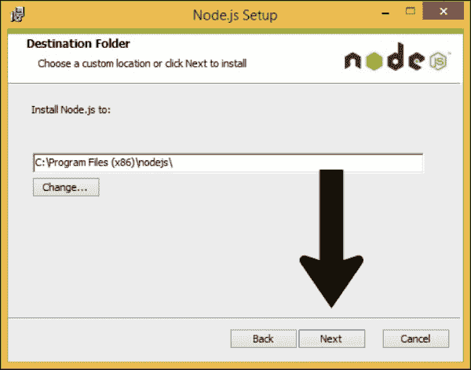
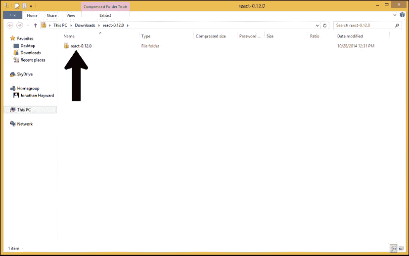

# 第一章：介绍和安装

欢迎来到 JavaScript 中反应式（函数式）编程的美妙世界！在本书中，我们将涵盖 JavaScript 的*好部分*，尽管我们不会完全遵循它。我们将涵盖函数式编程、反应式编程和 ReactJS 库，并将所有这些整合到 JavaScript 的函数式反应式编程中。如果您要学习反应式编程，我们建议您认真考虑函数式反应式编程，包括尽可能多地学习函数式编程。在这种情况下，整个函数式反应式编程的总和大于其各部分。我们将把反应式编程应用到 JavaScript 用户界面开发中。用户界面是**函数式反应式编程**（**FRP**）真正闪耀的领域。

本章将涵盖以下主题：

+   主题的概述，包括：

+   一个更简单的用户界面编程方法的讨论

+   对编程范式的简要讨论，如函数式和反应式编程

+   本书中各章的概述

+   查看如何安装本书中使用的一些工具

# 一个概述

有很多事情可以说，但（函数式）反应式编程可能比您想象的要容易。今天，关于函数式反应式编程的大部分内容都令人生畏，就像几年前关于闭包的说明一样。

## 处理用户界面编程的更简单方法

多年前，当我开始学习 JavaScript 时，我选择了一个网站，从中我学到了我需要理解的一切，以执行面向对象的信息隐藏，也就是如何创建一个具有私有字段的 JavaScript 对象。我可能读了两三章，这些章节充满了理论计算机科学，还有引言的 10-15%，然后我放弃了。然后我发现使用闭包来创建一个具有私有字段的对象是多么容易，只是简单的*学来用去*：

```js
   var counter = (function() {
  var value = 0;
  return {
    get_value: function() {
      return value;
    },
    increment_value: function() {
      value += 1;
    }
  }
})();
```

现在，函数式反应式编程正处于 JavaScript 闭包几年前的状态。在开始反应式编程之前，您必须阅读的理论数量令人震惊，而且大部分文献都是博士阅读水平的。这是个坏消息。但好消息是，您不必阅读那么多。

本书的目的是提供一种类似于*学来用去*的方式，传达如何使用闭包来创建具有私有字段的 JavaScript 对象。理论本身并不坏，引入理论进行讨论也不是问题，但是以做一些简单事情的代价来制作一篇完整的论文的理论支持是一个问题。

我们希望这本书能让您明白，例如，使用函数式反应式编程在 JavaScript 中构建游戏用户界面比使用 jQuery 更容易。

### 编程范式

周围有多种编程范式，并且并非所有都是互斥的。许多编程语言都是*多范式*语言，支持使用多种范式，包括不仅仅是 JavaScript，还有 OCaml、PHP、Python 和 Perl 等语言。

请注意，您至少有时可以使用一种语言来支持范式，而该语言并非明确设计为支持它。面向对象编程最初并不是为像 Java 或 Ruby 这样专门用于支持面向对象编程的语言而制定的，而是作为一种工程学科的问题，最初是在早于面向对象编程的语言中使用的。

在编程范式中，我们现在有以下内容：

+   面向方面的编程：有人建议程序员的专业发展从过程式编程转向面向对象编程，然后是面向方面的编程，最后是函数式编程。面向方面编程的一个典型例子是日志记录，它是在程序中通过天真的用法传播的一个方面。面向方面编程处理编程的横切面，如安全性、状态的诊断暴露和日志记录。

+   声明式编程：函数式响应式编程的一个关键概念是它是声明式的，而不是命令式的。换句话说，*c = a + b*并不意味着取*a*的当前值，加上*b*的当前值，并将它们的总和存储在*c*中。相反，我们声明一个持久的关系，它的工作方式有点像电子表格中的*C1 = A1 + B1*。如果*A1*或*B1*发生变化，*C1*会立即受到影响。存储在*C1*中的不是赋值时的*A1*值加上*B1*值的结果，而是更持久的东西，可以按需获取单个值。

+   防御性编程：类似于防御性驾驶，防御性编码意味着编写的代码在给定有缺陷的输入时能够正确地运行。函数式响应式编程是一种在面对网络问题和非理想的现实条件时，要么能够正确运行，要么能够在恶劣条件下优雅地降级的方法。

+   函数式编程：这里，术语*函数*具有数学意义，而不是编程意义。在命令式编程中，函数可以（而且通常是）操作状态。因此，`init()`函数可能会初始化程序最初运行所需的所有数据。函数是接受零个或多个输入并返回结果的东西。例如，*f(x) = 3x+1*，*g(x) = sin(x)*和*h(x, y) = x'(y)*（在*y*处的*x*的导数）都是数学函数；它们都不涉及任何状态数据的操作。纯函数是在数学定义下排除了如何处理状态的函数。函数式编程还允许并经常包括高阶函数，或者作用于函数的函数（在微积分中，导数或积分代表一个高阶函数，迭代积分包括一个以另一个高阶函数作为输入的高阶函数）。解决方案集中在抽象函数上的问题，这些函数操作抽象函数，往往对计算机科学类型更具吸引力，而不是真正用于商业世界的东西。这里探讨的高阶函数将是相对具体的。你不需要一直使用高阶函数，一旦掌握了核心概念，它们并不难使用。

+   命令式编程：命令式编程是一种常见的编程方式，对于大多数首次接触命令式编程的程序员来说，它可能是最自然的工作方式。函数式响应式编程的营销提案包括了对这种基本方法的另类选择。函数式响应式编程的声明式编程、函数式编程中的纯函数（包括高阶函数）以及响应式编程的时间序列，提供了一种对命令式编程自然倾向的替代方案。

+   信息隐藏：Steve McConnel 的《代码大全》描述了几种方法，并告诉我们哪些方法对不同的环境最为理想（例如，对于过程式编程，最适合的环境是小型项目而不是面向对象编程）。对于仅仅信息隐藏而言，他的建议是“尽可能多地使用这个”。在通用信息隐藏的发展中，一个大型项目通过在更大的区域内封装秘密来处理，而更大的秘密则通过封装子秘密来分割。过程式编程、面向对象编程和功能性编程的一个很大部分都是为了促进信息隐藏。信息隐藏是洛德米特法则背后的软件工程问题，例如，你可以在方法调用中有一个点`(foo.bar())`，但不能有两个点`(foo.baz.bar())`。

+   面向对象编程：程序被分割成对象，而不是具有单一结构。这些对象有自己的方法和字段，可能又被分割成更多的对象。这为比过程式编程更大的项目提供了一个可接受的信息隐藏水平，即使面向对象编程基本上是从过程式编程开始并在其基础上构建。

+   模式：模式并不是好软件的配方，但在更高层次的人类抽象中，它们提供了一种谈论最佳重复解决方案的方式，以避免从头开始重新发明已经解决的问题。此外，特定的模式被提到了台面上，包括 MVC 和现在的观察者模式，尽管观察者模式通常不会在与响应式编程相关的情况下提到，但它却是一个重要的组成部分。

+   过程式编程：过程式编程是提到的方法中最古老的之一，它旨在为早期基于*goto*流程控制的意大利面代码提供一些秩序。也许我们可以批评过程式编程，因为一旦面向对象编程、面向方面编程和面向对象设计模式可用，它就不再做足够多的事情。当你有工具可以从 goto 的鼠窝、指针作为数据结构的 goto 等方面进一步推进时，从过程式编程转向其他编程是正确的选择。

+   响应式编程：假设功能性编程在很大程度上是指函数具有第一类地位，并且可以创建高阶函数（作用于其他函数的函数）。那么响应式编程在很大程度上是指时间序列（随时间具有不同值的函数）具有第一类地位。对于音乐、游戏、用户界面和其他一些用例，计算当前时刻的正确值是响应式编程的一个亮点。

+   功能性响应式编程：功能性响应式编程是建立在功能构件上的响应式编程，其中函数和时间序列都是第一类实体。有一些有用且令人惊讶地简单的函数，可以作用于一个时间序列，从而提供另一个时间序列（这两个序列中的任何一个都可以被其他时间序列的函数所作用）。功能性响应式编程的一个主要卖点是，它提供了比直接陷入“回调地狱”更为优雅和可维护的方法。

# 安装所需工具

许多读者可能已经安装了 Chrome 和 Node.js，如果他们之前没有安装的话，他们可能会感到很舒适。对于那些更喜欢逐步指导的人，以下是安装适当软件的详细信息。

谷歌浏览器可以从[`google.com/chrome`](http://google.com/chrome)安装。请注意，对于某些 Linux 发行版，Chrome 可能无法从软件包管理器中获取。谷歌浏览器是一个明显的选择，可以考虑将其包含在发行版的软件包中，但由于许可问题，Chrome 的某些部分可能被列为非免费，这意味着就发行版维护者而言，您可以使用它，但我们不愿意将其包含在仅免费的软件包存储库中。

Node.js 可以从[`nodejs.org/download`](http://nodejs.org/download)获取。如果您使用 Linux，最好通过软件包管理器获取。请注意，Node.js 自带其自己的软件包管理器 npm，可用于下载在 Node.js 下使用的软件包。

有用的 ReactJS 入门套件可以从[`facebook.github.io/react/downloads.html`](http://facebook.github.io/react/downloads.html)获取。

以下说明适用于 Windows 8.1（我更喜欢在 Mac 或 Linux 上开发，但是写作 Windows 8.1 作为通用语言）。

## 安装谷歌浏览器

我们将使用谷歌浏览器作为主要的参考浏览器：

1.  要下载它，转到[`google.com/chrome`](http://google.com/chrome)，然后点击左下方的**立即下载**按钮，如下所示：

1.  接下来，点击右下方的**接受并安装**按钮，如下面的截图所示：

1.  然后，当询问是否要运行或保存安装程序时，点击**运行**按钮，如下所示：

1.  接下来，授权 Chrome 的安装程序对系统进行更改，如下面的截图所示：

1.  然后点击**下一步**按钮安装 Chrome，如下面的截图所示：

1.  等待一分钟进行安装，然后如果愿意，将 Chrome 设置为默认浏览器：

就是这样！

## 安装 Node.js

安装 Node.js 很简单，它使得使用 JavaScript 作为唯一语言来启动 HTTP 服务变得容易。

1.  转到[`nodejs.org/download`](http://nodejs.org/download)：

1.  点击**Windows 安装程序**，等待安装程序下载。然后点击窗口的左下角，如此截图所示：

1.  当安装程序启动时，点击**下一步**，如下所示：

1.  然后点击复选框接受协议条款，如下所示：

1.  之后，点击**下一步**按钮继续，如下截图所示：

1.  当询问要安装软件的位置时，点击**下一步**按钮，如下截图所示：

1.  然后点击**下一步**继续，如下一截图所示。如果需要，自定义功能：

1.  之后，点击**安装**按钮继续安装，如下所示：

1.  最后，点击**完成**按钮完成安装 Node.js，如下截图所示：

1.  授权安装程序对计算机进行更改，如下所示：

## 安装 ReactJS 的入门套件

要安装入门套件，请执行以下步骤：

1.  转到[`facebook.github.io/react/downloads.html`](http://facebook.github.io/react/downloads.html)，您将看到一个类似于以下截图的屏幕：

1.  单击**下载入门套件 0.12.0**开始下载（这将显示在左下角），如前面的截图所示。

1.  您将看到一个 ZIP 文件在底部下载：

1.  从这里，您应该能够浏览 ZIP 文件的内容：

# 总结

在本章中，我们简要概述了编程范式，以表明函数式响应式编程可能适用的领域，并安装了基本工具。

我们将在下一章讨论 JavaScript。Node.js 的基础知识在*附录*中讨论。
