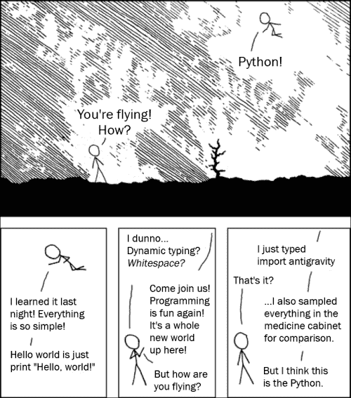

# 第六章。函数式响应式编程-基础知识

我可能从这里有点尴尬地提到，我有数学硕士学位和许多数学奖项，但我发现与基本函数式编程相关的一些数学概念有点难以理解。一个人不会阻止在相关数学和计算机科学领域有扎实基础的人去攻克，例如，在维基百科关于函数式响应式编程中链接的基础性函数式响应式编程论文的完整数学严谨性。然而，这里的意图略有不同：从函数式响应式编程中学到对于没有或不记得那些开创性作品所依赖的数学水平的专业开发人员有用的东西。

StackOverflow 的评论反复问道，“你能不能以不假设计算数学博士的方式解释它？”这里的意图不是提供那些数学文章的全部内容，而是提供一个对于真正的专业软件开发人员有用的、实用的子集，他们不会梦见 Scheme 或 Haskell。

在本章中，我们将涵盖：

+   计算机传统的记忆之旅

+   函数式响应式编程

+   如果你只学到一件事……

+   了解有关函数式编程的知识

+   前端 Web 开发的未来

让我们深入了解。这段充满传统的记忆之旅可能会相当漫长，但在任何意义上都不会枯燥无味。

# 计算机传统的记忆之旅

有一个非常侮辱性的检查表一直在流传，适用于宠物（或其他）编程语言。其中一个侮辱是，“程序员不应该需要理解范畴论来编写*Hello, World!*”这反映了部分湿后耳朵的初级程序员在他们提出最好的编程语言时不断犯的错误的烦恼。在这方面，它可能与愚蠢的事情清单一样，愚蠢的事情清单是从无数冒险电影中发生的愚蠢事情中学到的。作者从无数电影反派的错误中吸取教训，宣称“射击对我的敌人来说并不是太好”，“除非绝对必要，我不会包括自毁机制……”这些侮辱来自于一次又一次看到相同错误的挫败感。

还有其他一些显示编程智慧和智慧的观点。例如，宠物或玩具语言的数量级比成功的语言要多得多，成功可以是在学术计算机科学领域或商业信息技术领域。任何语言发展中被广泛认可的转折点是，当它在一个可以通过使用它来编写自己的编译器的水平上工作时。

这并不是一个不重要的观点；当 Java 首次宣布时，宣称 Java 编译器是用 Java 本身编写的，这意味着能够运行 Java 运行时环境的系统应该能够编译用 Java 编写的软件。在这方面，一个常见的侮辱某人对自己热情洋溢的宠物语言的标准问题是，“除了自己的编译器，它还用来写过其他东西吗？”计算机智慧和传统的这一特定节点已经融入了检查表：其中两个条目是，“用这种语言编写的最重要的程序是它自己的编译器”，然后，更具侮辱性的是，“用这种语言编写的最重要的程序甚至不是它自己的编译器”。

但是，“程序员不应该需要理解范畴论来编写*Hello, World!*”的哲学反对意见并不是为了听起来侮辱而凭空捏造的。这是由 1978 年 Kernigan 和 Ritchie 经典著作《C 程序设计语言》第一版开始的传统，在深入研究复杂性之前开发的第一个程序是一个最小的 C 程序，思想是“让我们在尝试行走之前先爬”，打印出*Hello, World!*：

```js
main()
{
  printf("hello, world.\n");
}
```

介绍新编程语言的人普遍遵循使用`Hello, World!`作为他们的第一个示例程序的传统。这是“程序员不需要理解范畴论就能编写*Hello, World!*”的一端。那么光谱的另一端是什么？

在学术数学世界中，无论是纯数学还是应用数学，数学作为成功的标志已经变得非常专业化（就像任何经历了足够工作的领域一样）。有评论说，能够理解数学会议上提出的 50 篇论文中的 13 篇以上的数学家是非常罕见的。数学已经变得足够专业化，以至于大多数数学博士，无论多么有能力，都无法理解大多数其他数学博士的工作。在这种情况下，希望能够理解所有数学就像希望能够说出所有人类语言一样：有点天真。数学博士项目的目的也许不是让你发展到能够理解数学学科的整个广度，而是深入理解某个狭窄领域，以至于在你的博士学位完成时，你比世界上任何其他人更深入地理解了这个高度专注的领域。

有两种例外，连接所有数学的学科，但从完全相反的方向。一方面是逻辑和数学基础，它研究了所有其他数学领域所基础的基石。现在有一些关于逻辑属于数学还是哲学的问题，人们也听说过有人被要求决定他们想成为逻辑学家还是数学家。但撇开这些问题，可以说逻辑通过挖掘其他数学领域所依赖的基石与所有数学领域相连接。

然后还有另一种选择：*范畴论*。一个芭比娃娃曾经说过，“数学很难”，但数学界很清楚这一点，不需要芭比的帮助。阿尔伯特·爱因斯坦说过，“不要担心你在数学上的困难。我可以向你保证，我的困难更大。”但数学分支范畴论尤其难以理解。

如果逻辑可以研究数学伟大建筑的基石，范畴论则着眼于已经建成的城市，并探索贯穿各种数学领域的建筑主题和相似之处。范畴论是一门学科，有点像比较文学学科，从业者被期望能够应对不只一种语言的比较文学。可以说范畴论是整个数学领域中最困难的地方。你需要做一些大多数数学博士从未学过的事情。

此外，也许是一种致敬，我的导师是一位范畴论家，他能够有效地指导一个关于点集拓扑这个鲜为人知的分支的论文，尽管他在点集拓扑方面并没有显示出特别的专长。因此，说一个使用你的语言的程序员需要理解范畴论才能编写*Hello, world!*是相当刻薄的侮辱。

那么这与函数式或函数式反应式编程有什么关系呢？很高兴你问！

在维基百科文章中链接的函数式响应式编程的资源中，Haskell（或者构建在其上的东西）是主导语言。还有一些其他的语言，比如 Scheme 的一个方言，但人们似乎总是回到 Haskell。有很多 Haskell 的资源；其中最受尊敬的之一是《学习 Haskell 为了更好的》[`tinyurl.com/reactjs-learn-haskell`](http://tinyurl.com/reactjs-learn-haskell)。它在第九章中神秘地出现了一个*Hello, World!*程序，而不是第一章。为什么是第九章？嗯，正如解释的那样，输入和输出是建立在单子之上的。但是真的需要这么多的解释才能理解单子吗？是的；单子是建立在应用函子的概念之上的，而应用函子是建立在函子的基本概念之上的，这让人想起在数学研究生阶段遇到的某个名字，但并没有真正理解。让我们去维基百科的函子页面看看。维基百科以清晰易读而闻名。维基百科页面中有一些内容。其中一点是，语言对于维基百科来说实在是太过神秘了。另一点是，函子实际上是从范畴论中获得的东西：

> *在数学中，函子是范畴之间的一种映射，适用于范畴论。函子可以被看作是范畴之间的同态。在小范畴的范畴中，函子可以被更普遍地看作是态射。*

函子最初是在代数拓扑学中考虑的，在那里，代数对象（如基本群）与拓扑空间相关联，代数同态与连续映射相关联。如今，函子在现代数学中被广泛应用于各种范畴。因此，函子通常适用于数学中范畴论可以进行抽象的领域。

## Hello, World!的高级先决条件！

如果你想挑战自己，可以阅读维基百科关于函子的文章。但如果你发现自己只是匆匆浏览，因为大部分内容都超出了你的理解范围，那么你不用担心：可能很多数学博士也会以同样的方式匆匆浏览，出于同样的原因。

在这一点上还有更多可以说的，但我将限制自己在评论本章意图之后再做一点补充。这导致了本章的核心困难。这是一本关于信息技术而不是计算机科学的文本，虽然可以向计算机科学家请教，但这本文本的撰写意图是从一个程序员的角度向另一个程序员撰写。在 Haskell 中，目标相当于基于*看到，模仿*的基础上说，“这是一个纯函数的例子；那是一个输入和输出单子的例子。尽量让你的程序的大部分工作都来自纯部分，并将输入和输出限制在尽可能小的隔离空间中。”

有一点可以用 Haskell 和 Python 进行对比，再次以 XKCD 为例——注意 Python 中给出的一切都是简单的第一个例子。第一次接触 Python 会让人感觉再次爱上编程。同样的情况也完全适用于 ReactJS，就像再次发现网络一样：



Python 和 Haskell 在至少一个方面相似：它们都允许快速软件开发。Haskell 拥有与 Python 所期望的类似功能：一名本科生花了几个月的时间，在 Haskell 中实现了 Quake 3 引擎的大部分功能。Haskell 可能还有其他优势，比如其非常可靠的类型系统，而且一旦某些东西编译完成，它就已经有很大的可能性可以工作。然而，这里追求的问题是，“它能让程序员高效生产吗？”这个屏幕截图来自一个本科生项目中在几个月内实现的 Quake 3 级别。Haskell 有一些 Python 没有的东西：比如非常可靠的类型系统。然而，Haskell 和 Python 至少在这一点上是相似的：在熟练开发者的手中，它们都允许生产力和开发速度，这需要在看到之前才能相信。


但是，有经验的程序员可能会尝试 Python 并发现自己能够游刃有余，但如果他们无法处理数学，他们在使用 Haskell 时就不会有相同的体验。Haskell 为那些能够处理大量计算数学的人提供了快速开发的超能力。Python 为更广泛的程序员群体提供了这样的能力，无论他们是否具有丰富的数学背景。

这一章是一个尝试，无论对错，都是为了解释事情，以便信息技术工作者，而不仅仅是计算机科学专业人员，可以像有经验的程序员一样，用函数式响应式编程和 ReactJS 获得良好的 Python 体验，而不是导致许多开发人员继续发表令人沮丧的评论的有经验的程序员的糟糕的 Haskell 体验，这些评论在一段时间后变得非常悲伤，比如“如果我懂得更多数学，我可能会理解这个”。

我们写这本书的目的是为了使程序员在这个领域有用，而不仅仅是懂很多数学的计算机科学学生。但至少暗示了一种更简单的方法，以及有经验的程序员说“如果我懂得更多数学，我可能会理解这个”。直接从页面[`tinyurl.com/reactjs-learn-monads`](http://tinyurl.com/reactjs-learn-monads)获取。现在，以下是学习单子的一些步骤：

1.  获得计算机科学博士学位。

1.  把它丢掉，因为你在这一部分不需要它！

（也许普通开发人员终究可以从（响应式）函数式编程中获益！）

# 区分函数式响应式编程的特点

作为函数式响应式编程的领军人物之一，也可以说是函数式响应式编程的鼻祖之一，Conal Elliott 回顾了术语“函数式响应式编程”，一个领军人物对于名称的反思可能会非常有趣。Elliott 对术语“函数式”表示了保留意见，他认为这个词现在意味着很多东西，因此意义不大，并对术语没有包含的一个词表示遗憾：时间。他提出了一个另类的名称，即指示性连续时间编程，即使我们在这里使用更标准的术语“函数式响应式编程”，这也是重要的。通过“指示性”，我们的意思是，正如我们之前讨论 ReactJS 时所讨论的，你只需指定需要完成的任务，而不是每一步如何完成它。连续时间不仅仅意味着应该这样称呼它，而且连续时间是如此重要，以至于它应该被纳入现在所谓的函数式响应式编程的名称中。

连续时间元素出现在这些来源中，对一些人来说可能会感到惊讶，因为计算机只能离散地测量时间，但这种区别是概念模型中的区别，而不是实现中观察到的特征。这种比较类似于函数式语言中存在的无限列表，人们可以从列表中取出多少或多少而不会用完预先计算的条目，或者更明显地是栅格图形（GIF、JPEG、PNG）与矢量图形（SVG、一些 PDF）之间的区别，栅格图形有一定数量的像素表示，而矢量图形可以根据经典广告执行人员的说法进行渲染，公司标志在信头上高一英寸时看起来和在公司总部的八英尺高处一样好看。

连续时间意味着时间的处理方式类似于 SVG 或其他矢量图形，而不是栅格 GIF/JPEG/PNG，后者存储在固定分辨率上，没有多余的像素。对于函数式响应式编程的建议之一是，连续时间事件和可能是连续值行为或事件流具有第一类实体的地位，作为定义特征的一部分（尽管有人可能指出，也许不是唯一的特征）是函数是第一类实体，可以作为参数传递，就像 JavaScript 和其他语言中的匿名函数一样。

ReactJS 与这个有什么关系可能并不立即明显；我看过十多个 ReactJS 视频，通常是来自 Facebook 开发人员。强调了*指称语义*，这是一个正式术语，用来描述只需要完成什么，而不是如何完成每一步。还有关于虚拟 DOM 的持续讨论，这相当于“如果你想了解更多，你可以学习，但你只需要告诉系统如何`render()`，然后相信系统会完成其余的工作。”但事实上，连续时间语义是内置在 ReactJS 的基本工作原理中的。开发人员的责任之一是编写一个`render()`方法，指定在调用时页面上应该显示什么（也许还要适当地调用`render()`；`render()`不会自己运行）。

这并不具备连续时间的所有特性；一个教学视频暗示了一个系统，不仅可以实时工作，还可以允许类似 VCR 的“倒带”和“快进”功能来逐步通过时间，Pete Hunt 的一个 ReactJS 视频暗示了 Facebook 可能通过 ReactJS 技术接收一个错误报告，并能够逐个细节地重放发生错误之前的情况，而没有书面描述错误的情况，只是“粗话”。然而，最突出的用例是假定连续时间，并且开发人员有责任编写一个`render()`函数，可以在调用时正确地指定要渲染的内容，并且（顺便）适当地调用该函数。

# 如果你只学到一件事...

理查德·P·费曼的经典“费曼讲义”被认为是对技术主题进行清晰解释的典范，他以一个非常简单的问题开篇：如果科学的其他一切都被遗忘，只有一句话的信息幸存下来，那么理想情况下会是什么？费曼给出了一个简洁的答案，实际上表达了很多内容：

> *"如果在某场灾难中，所有的科学知识都被摧毁，只有一句话传给下一代生物，哪句话会包含最多信息？我相信那就是原子假设，即**一切事物都是由原子组成的——小颗粒在永恒的运动中移动，当它们相距一点时相互吸引，但当它们被挤压到一起时则相互排斥。**在这一句话中，你会看到，关于世界的大量信息，只要稍加想象和思考。"*

这在费曼讲座中作为一个跳板，可以让我们对我们所知道的物理学说很多。

函数式响应式编程的最大学习要点可以用一句话概括，这是与函数式编程本身相关的一堂课，函数式响应式编程进一步完善了这一点：*尽可能多地编写纯函数，数学风格的，尽可能少地编写或遵循配方*。

配方会说一些诸如“将烤箱预热至 350°F。在一个大碗中混合叶子、酥油和盐。用羊皮纸在两个大烤盘上铺一层。将叶子均匀分布在每个托盘上的一层中…”现在这并不是在挖苦家政和烹饪的人。（纯粹的功能性烹饪方法永远不会产生任何可食用的东西，如果你想完成任何事情，这是一个小缺点。）配方同样可以在许多许多 YouTube 视频中找到，详细说明如何更换，例如 2004 年福特 Escort 上的破损雨刷，它们也支持传统的黑客编写的 How-to，尽管它们在今天不像早期那样突出，这并不是因为黑客社区意识到使用 How-to 不是解决困难的适当方式，而是因为几乎所有事物的通用性都得到了足够的改善，以至于你不需要一个在烧录 CD 时提到月相的 How-to；How-to 很少可能是唯一的选择（这实际上是它们最好的用例）。

我对 Haskell 经历了哪些理论上的扭曲（即：*需要*经历）以最小程度地妥协其功能状态来包含输入和输出有些担忧。但同样，即使纯粹的函数式 JavaScript 可能存在与否，我们最好还是尽量增加我们的软件部分是纯函数式的，并最小化通过指定如何做事来完成工作的部分。这里的函数不应该像结构化编程中那样意味着“返回一个值的子例程”。一个函数不是在做某事并在完成时返回一些有趣的东西。它更多地具有数学上的意义，“接受零个或多个参数，并且不多不少地返回一个基于该值得到的值。”

计算机人员使用的基本数学中的纯函数的例子包括算术函数，如加法、减法、乘法、除法、指数、阶乘（例如，4 的阶乘是 4*3*2*1），斐波那契数，三角函数，如正弦和余弦，双曲函数，积分，导数，欧几里得除法来计算两个正整数之间的最大公约数，等等。毫无例外，这些函数接受零个或更多个（或者，对于这些情况，一个或更多个）输入，并从中计算出一些东西，而不做任何外部更改；它们没有更新数据库或输出东西到控制台。它们只是接受它们的输入，并确定性地计算出一个输出，不多不少。这就是纯函数的本质。

**长词**是“一个半英尺长的词”。其中一些词在各处流传，包括在关于 ReactJS 和函数式响应式编程的视频中，比如幂等和**引用透明度**。但是与纯函数相关的含义是简单而直接的。

幂等函数是指无论调用一次还是一百次，都会返回相同结果的函数。在数学中，例如加法和阶乘，总是给出相同的结果。RESTful 网络服务提供了一个较少数学的幂等性的例子：请求相同的 URL 意味着每次都会得到相同的 HTML 或其他数据。获取静态内容是幂等的；从 CDN 获取的库的版本应该无论谁、在哪里或何时请求，都会得到相同的下载。

缓存，比如使用 Steve Souder 的经典远期*Expires*头部来实现 Yslow，是一种非常有用的方法，特别是在下载之间存在幂等性的情况下。（如果下载是幂等的，无论是下载新副本还是从浏览器缓存中提供副本，文档都是相同的。）动态内容，无论是老式的 CGI 脚本还是动态的 Django 应用程序，都不是幂等的。如果一个页面上甚至在 HTML 注释中写着“此页面在某个时间下载”，那就不是幂等的。Web 最初是设计为幂等的；后来人们开始意识到动态内容可能非常有用，并开始研究如何克服 HTTP 的无状态、幂等设计。

引用透明度这八个音节的词意味着函数调用可以等效地替换为它返回的值。因为 4!等于 24，所以在你的代码中包含 4!和只包含 24 应该是等效的。如果你有一个值的余弦，使用`cos()`的结果的存储值或重新计算应该是等效的。破坏引用透明度的不纯行为是每次调用`cos()`都记录一个字符串，这是一个经典的*副作用*的例子。

### 提示

“副作用”这个术语是不幸的，可能是有意使用的措辞；在医学背景下，所有药物都会产生多种效果，其中一些是服药的目的，而另一些则被容忍为必要的副作用。在医学上，副作用是指药物的效果是被容忍的，但不是服药的目的。在程序中记录消息是一种副作用，有点像说服用止痛药并随后减轻身体疼痛是一种副作用：这正是服药的全部目的，而不是药物可能产生的其他效果，这样称呼它是一种副作用有点奇怪。

上面是一些基本数学函数的示例，也许这很容易，因为在某些数学领域，一切都是纯函数，可能是由纯函数构建的，而且环境排除了不纯函数或副作用。人们也可以举多项式作为由纯函数构建的纯函数的例子，如果你有能力使用它，这是一种非常好的方法，但如果习惯于用信息性假设来构建一切，这种方法会感到陌生和困惑。对于以命令为基础的程序员来说，命令式函数是短期内最容易的方法，但长期来看更难。对于以函数为基础的程序员来说，函数式编程在短期和长期内都很容易。但是，要在实际信息技术中看到这些问题的例子，我们不需要看得比 ReactJS 更远。

Facebook 的长期痛苦学习基本上导致了一个认识，即摆脱困境的方法是通过幂等性和引用透明度，这就是 ReactJS 的编写目的。

# 学会你能学到的东西！

正统精神传统中的一位智者将许多事情归纳为 55 条格言（[`tinyurl.com/reactjs-55-maxims`](http://tinyurl.com/reactjs-55-maxims)），其中第二条是，“祈祷应该是你能做到的，而不是你认为你必须做到的”，这些话对于大部分编程也同样适用。这里有一个建议，但不会让非数学家感到畏惧。尽可能按照你能做到的方式去遵循这个建议，而不是你认为你必须这样做。尽可能多地学习函数式编程。尽可能纯粹地使用 JavaScript 进行函数式编程。

我现在已经理解了函子，而在我读数学研究生时却未能做到。从理论角度来看，我还没有完全理解应用函子和单子的概念，但尽可能地编写纯函数，并尽量少地使用输入和输出单子的想法似乎是可行的，这比追溯单子的概念起源要容易得多。这属于尽可能地使用函数式编程，而不是你认为必须使用的范畴。

函数式响应式编程的维基百科文章链接到了该领域的九部重要作品，如果你想解决一个良好的数学难题，所有这些作品都值得一搏。数学符号可能像维基百科上的函子文章一样密集。

但是，如果我们看看编程语言，这里有一个线索。文献中提到了几种有趣的可能性，都是函数式的：一种 Scheme 方言，DDD 和 Elm（它是一种独立的语言，编译成自己的 JavaScript / HTML / CSS，与 DDD 相比）。但是，函数式响应式编程作者最感兴趣的似乎远远是 Haskell。这给了我们一个免费的线索，至少在其起源中，Haskell 是几乎所有关于函数式响应式编程的重要论文的重心。任何语言，包括 Haskell，都有缺陷，但简单地忽略函数式响应式编程的重要作品倾向于 Haskell 是愚蠢的。

函数式响应式编程是建立在函数式编程的基础上的响应式编程。在使用 ReactJS 开发 JavaScript 时，一些方面已经为我们处理了。我们只需要声明性地指定 UI 在渲染时应该是什么样子，ReactJS 将处理所有必要的编译，因此声明性的`render()`方法将被转换为 DOM 上的优化的命令。但至少乍一看，如果你想理解函数式响应式编程，学习一种与 Haskell 紧密相关的技术是有意义的，只有在你穿上 Haskell 的鞋走了一英里之后，然后知道它们是否会让你不舒服，才写下你对 Haskell 的“独立宣言”。

《Learn You a Haskell for Great Good》受到了批评，但这本书被故意选为教授一门一流的函数式语言的优秀教材。指出 Haskell 的教材在允许读者看到传统的“Hello, world!”程序之前，涵盖了八章的理论和一些范畴论概念，这比挑剔一个一般的介绍更有说服力，并且会引起一个明显的反应，但是有更好的例子没有这个问题。一个更专注于实际应用于现实世界信息技术需求的伴随教材是《Real World Haskell》（[`book.realworldhaskell.org/read/`](http://book.realworldhaskell.org/read/)）。这些并不是唯一的教材，但至少提供了一个很好的搭配和一个起点，并经常一起推荐。

更重要的是，不要试图匆匆翻阅这两本书，并期望经过一天甚至一个月的学习，就能比你多年使用的任何喜爱的语言更容易地在 Haskell 中完成工作。相反，玩耍，尝试这些东西。把 Glasgow Haskell Compiler 当作你圣诞节收到的一套漂亮的虚拟乐高。《Learn You a Haskell for Great Good》从未深入探讨如何编写 Web 服务器，这正是该书的优势所在。它建立了只有对你有利的核心优势，并应该让你更有能力欣赏和利用 JavaScript 中函数式编程的机会。G.K.切斯特顿说：

> 理解一切都是一种负担。诗人只渴望升华和扩张，一个可以展现自己的世界。诗人只希望把头伸进天堂。是逻辑学家试图把天堂放进他的脑袋。而他的脑袋却会崩裂。试着把你的头伸进天堂，而不是立刻把天堂放进你的头脑。如果你现在是一个熟练的程序员，也许是在命令范式中，那么很有可能在学校时，当你探索事物时，你试图用编程把头伸进天堂。你写游戏；你玩耍，获得了以后在专业工作中会用到的基础。如果你想学习 Haskell，不要死记硬背。重新变成一个小孩，玩耍。阅读《Learn You a Haskell for Great Good》，它故意避免了如何在最后期限前快速完成某事，直到你真正掌握了基础才去阅读《Real World Haskell》，请不要把《Real World Haskell》当作“抄近路”的理由，试图在最后期限内发布商业风格的功能。

在他关于《更好的部分》的南美演讲中，道格拉斯·克罗克福德在描述良好的 JavaScript 时，给了越来越强的函数式编程重点。我看过的早期克罗克福德的视频，当时只有《好部分》，甚至没有《更好的部分》的迹象，似乎将 JavaScript 的更好部分与其函数式一面联系在一起。但《更好的部分》更明确地表示，JavaScript 和谐的改进之一是你可以应用尾递归，并使用函数式的流程控制风格，使一些流程控制，如循环几乎或完全不必要。

即使不考虑函数式响应式编程，更好的 JavaScript 似乎越来越意味着函数式 JavaScript。这是一件非常好的事情。正如前面提到的，Scheme 被称为“你永远不会使用的最好的语言”，计算机科学家们一直选择基于计算机科学使用价值的一组通常的函数式语言，这是一个必须离开的小天堂，才能进入专业编程。

JavaScript 改变了这一点，不仅仅是通过使匿名函数成为主流。特别是在与 ReactJS 一起使用时，JavaScript 为主流软件开发提供了享受函数式编程优点的最大机会。只要你明白自己在做什么，你就能越多地以函数式范式编写 JavaScript。

函数式编程，无论是响应式还是其他方式，如果你在学校接触了更数学化的函数式编程，可能会更容易理解。但是可以教会程序员如何在 Haskell 中写出“Hello, world!”，同时将范畴论中最难理解的数学知识放在视线之外，隐藏在引擎盖下。

函数式编程的计算数学基础应该像高级语言中的机器或汇编语言一样：存在于引擎盖下，使语言功能成为可能，但在最小程度上是不透明的抽象，*只是工作*，无论一个人是否是一个能够在引擎盖下进行调整的机械师。

在某种意义上，对于已经离开学校一段时间的资深程序员来说，需要的是学习函数式编程的“好部分”。在这种情况下，好部分可能因程序员的函数式编程舒适水平而异。标准是“做你能做的，而不是你认为你必须做的”。理解声明式/指示性编程与命令式编程之间的差异，可能有些困难，但并不是太难。尽可能编写纯函数，并隔离必须具有副作用的代码，即使你试图避免它们，这是一种思维转变，但并不是太棘手。

例如，在 Haskell 中学习函子实际上比范畴论要容易一些，即使维基百科页面没有反映出这一点。大多数程序员不应该花太长时间编写一个主要是纯函数，输入和输出由单子的最小隔离处理的第一个 Haskell 程序。但是使用单子等功能要比理解使用纯函数并逐步构建单子的扭曲步骤容易得多。

而且值得重申：如果函数式（反应式）编程适合主流使用，那么从函数到单子的重度数学理论不应该像 C 程序员被迫使用汇编语言或软件生成的机器指令一样被强加给普通的专业开发人员。有人说，“C 是一种将汇编语言的强大与使用汇编语言的便利结合在一起的语言”，但 C 从来没有强迫大多数程序员微观管理编译器如何渲染 C 源代码。

现在，许多主流语言，特别是多范式语言，已经融入了一些函数式编程的优势。尽管如此，有人可能会建议，JavaScript 是所有主流语言中直接提供最佳函数式编程优势的语言。不一定是计算机科学家喜欢的 Haskell 或 Lisp/Scheme 等语言中最好的函数式编程；很难找到一个主流编程工作，管理层会允许使用 Haskell 或 Scheme 的解决方案。但在主流语言中，JavaScript 仍然是最有吸引力的。计算机科学家长期以来一直喜欢函数式编程，至少有一位在学校学习数学的程序员评论说，“函数式编程是我见过的第一个有意义的编程范式。”对于几乎所有计算机科学家都喜欢的卓越性，JavaScript 不仅仅是浏览器执行的语言，尽管这很重要。它还为在雇主的招聘要求中经常遇到的语言提供了最佳的函数式编程机会。

# JavaScript 作为新的裸金属

Douglas Crockford 在前面提到的《更好的部分》中试图表明程序员和其他人一样情感用事。他以一种对于库恩学者来说并不奇怪的方式支持了这一观点：软件工程的基本改进是通过坚持早期方法的程序员的消退而取得的。他举了六个或者更多的“需要一代人”的例子：“需要一代人”才意识到高级语言是一个好主意，或者所有编程语言语句中的 F 炸弹，goto 语句，不是一个好主意。尽管 Crockford 举了几个例子，但他的努力似乎并不打算包括所有重要的例子：尽管我并不完全确定日期，但似乎在 20 世纪 60 年代，Smalltalk 意识到引用比指针更好（指针被称为“数据结构的 goto”），到 20 世纪 90 年代，像 Java 这样的主流语言用引用取代了指针，大约需要一代人的时间。

Crockford 对程序员以自我表达的自由来进行裸金属编程或者经常使用 goto 语句来处理流程控制做了一些评论。但说到底，包括匿名函数在主流语言中使用需要两代人的时间，JavaScript 是第一个，软件开发的改进并不是因为现有的程序员接受了更好的方法而生根。

它们生根是因为新程序员接受了更好的方法，而大多数年长、不信服的程序员则逐渐消失。（即使他们可能学会了。但在某种意义上，通过接受新变化来避免过时是一种选择。只是很多人会说，“20 岁时对我来说够好，40 岁时也够好了。”并不是每个人都被铁定的决定所控制：只是在程序员中存在一个“默认设置”，随着时间推移而变得不再合适。）

JavaScript 是网络上的*通用语言*，即使你不喜欢它，因为它不是你最喜欢的语言（确实，为什么它会像 Perl、Python、Java 或 C++一样呢？），它已经存在并且可能是最重要的语言，而且将在相当长的一段时间内保持这种地位。但在这种情况下，“需要一代人”的可能是意识到在非 JavaScript 语言中进行网络编程是一个好主意。

Alan Perlis 说过，“当一个编程语言的程序需要关注无关紧要的事情时，它就是低级的”，如果要在 JavaScript 中进行良好的编程，就需要避开许多语言的陷阱，而这些原因对于一般检查来说并不明显，JavaScript 需要关注无关紧要的事情：JavaScript 是低级的。

在新的网络开发中，ReactJS 视频中的一个令人鼓舞的迹象不仅是使用了另一种非 JavaScript 语言或语法糖 CoffeeScript，而且它的引入是平稳和随意的，完全没有道歉、辩护或解释。他们使用 CoffeeScript 的事实本身就很重要，而且他们这样做时没有任何防御性的痕迹更加重要。现在 CoffeeScript 可能不是所有可以或应该被编译成 JavaScript 的语言中的全部或最终选择。但看到除了 JavaScript“裸金属”之外的东西是令人鼓舞的。

这并不意味着“裸金属”编程没有用武之地。业余游戏开发者或来自大型公司的程序员，试图从裸金属中挤出最后一丝性能，无论是为独立应用程序和游戏，都会合理地希望挤出用户计算机的最后一丝性能，无论是在应用程序编程的“裸金属”上还是在网络上的 JavaScript 上。但就像通常情况下不会用 C 或汇编语言编写 Web 应用程序一样（即使在 CGI 脚本是交付动态内容的主要手段时也不会这样），对于大多数 Web 编程的用途来说，一部好的智能手机（稍微老一点的 iPhone 5 大约比网络刚刚出现时的顶级计算机快 100 倍）真的足够快，可以运行通过编译其他语言生成的 JavaScript 代码。而且，当人们了解 JavaScript 是如何开发的时，它就更加令人印象深刻。这是一种在 10 天内设计的计算机语言，通常人们不仅会对此表示印象深刻，还会说：“伙计，放松点！如果你继续滥用兴奋剂，你会害死自己！”

使用高级语言是可取的基本原因是程序员们学会忽略这一点，以便在 JavaScript 中完成任何工作。道格拉斯·克罗克福德的《精粹》，以及 JavaScript 既有宝藏又有地雷的想法，以及良好地避开地雷的一部分，已经深深扎根，以至于对于大多数阅读本书的程序员来说，这本书的简要摘要可能是完全多余的。

这本身就是一个严肃的理由，如果有选择的话，要考虑替代 JavaScript“裸金属”编程。事实上，对于前端 Web 开发，有许多替代 JavaScript“裸金属”的选择。[`tinyurl.com/reactjs-compiled-javascript`](http://tinyurl.com/reactjs-compiled-javascript)列出了许多其他语言，包括旨在在某些方面提供增强 JavaScript 的家族和朋友，以及将其他语言编译为 JavaScript 的编译器，包括（通常）Basic、C/C++、C#/F#/.NET、Erlang、Go、Haskell、Java/JVM、Lisp、OCAML、Pascal、PHP、Python、Ruby、Scheme、Smalltalk 和 SQL 的多个选项。显然，并非每个编译器和实现都特别好，但就像其他任何严肃的计算机语言一样，JavaScript 是图灵完备的，不仅在理论上可以将其他完整的语言编译为 JavaScript 以及“裸金属”，而且在实践中也是可能的，并且是有充分意义的。JavaScript 可能会成为最重要的编译目标，甚至超越 x86_64 机器代码。或者也可能不会，但 JavaScript 的可取性和能力意味着编写编译为 JavaScript 的语言的现象——意味着大多数其他语言——在可预见的未来可能会不断增长。

# 总结

这一章可能是对早期尝试的一种尝试，而早期尝试通常不会成功。网上有许多重要文件，但它们假设你不仅可以编程，还可以处理大多数专业开发人员无法处理的特定类型的数学，也许甚至从未达到过熟练程度。这里的目标不是提供另一个高度数学化的解释，而是产生一份对大多数前端开发人员有用的文件，也许在一个不那么高尚的层面上，自然会考虑命令式解决方案。这里的目标是朝着更加功能化和不那么命令式的编程方向发展，但也要产生一份适合专业程序员实际具有的数学技能水平的文件，而不是某个权威可能希望他们具有的数学技能水平。因此，先决条件并不是假设程序员在被允许编写“Hello, world!”之前必须理解范畴论本身。

在本章中，我们回顾了计算机传说的记忆。这次回顾包括了对严厉的计算机清单、简单的“Hello, world!”程序和范畴论的探讨，以及函数式响应式编程首选语言 Haskell 可能会要求你在写“Hello, world!”时使用范畴论。这是一个重大问题。

我们还研究了函数式响应式编程的特点，包括时间的处理方式。本章还涵盖了对问题“如果你只能从函数式响应式编程中学到一件事，最好学什么？”的认真回答。

本章还涵盖了学习纯函数式开发的内容，而不是你认为必须学习的内容。试图学习太多函数式编程很容易让自己陷入瘫痪，而且老练的命令式程序员学习函数式编程（需要改变看待世界的方式）并不是件容易的事。这是一种尝试，提供了一种理智的方法来从函数式编程中获益，而不至于完全迷失在与函数式编程的无尽挣扎中。

我们还讨论了 Web 开发的未来，JavaScript 被视为新的“裸金属”。

在我们的下一章中，我们将探讨支持函数式响应式编程的工具。让我们开始吧！
