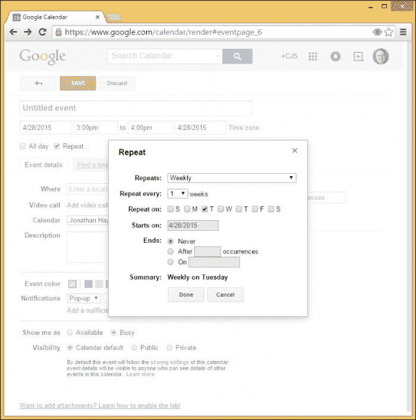
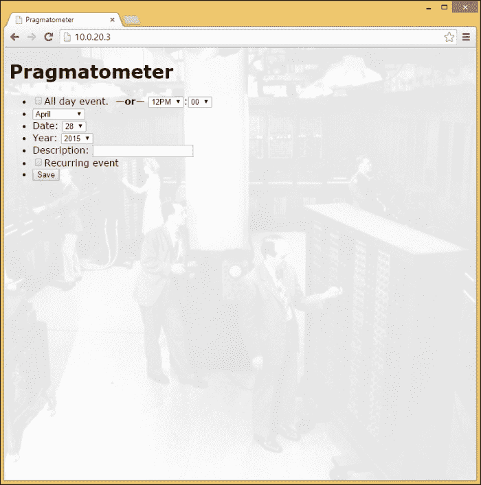
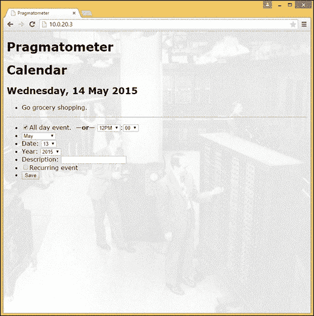
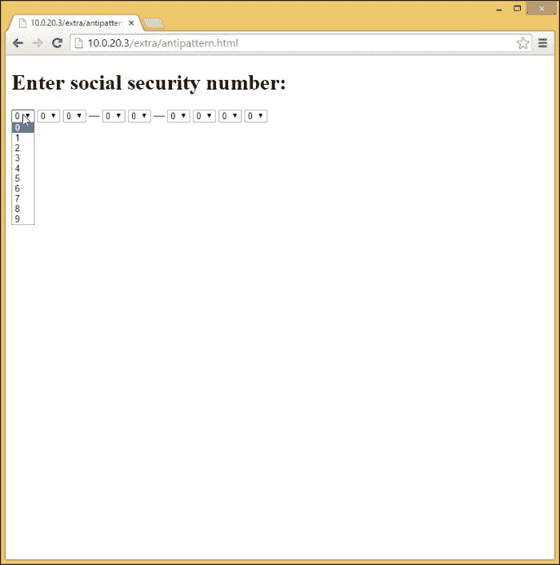

# 第十章。在 JavaScript 中演示函数式响应式编程：一个实时示例第 III 部分-日历

本章将是本书中最复杂的部分。在整本书中，各章之间存在着从轻微到不那么轻微的差异。这些差异是有意为之的，以便如果你在岔路口遇到了困难，本书可以覆盖两种选择。这些章节旨在相辅相成，而不是一直强调同一点。在这里，我们不会透露关于核心 ReactJS 的更多信息，而是展示如何应对现实世界中棘手的商业问题，以及一个涉及 ReactJS 但并非专注于它的解决方案。我们将在一个更严肃的应用程序中使用 ReactJS，一个支持重复事件的日历，提供的功能和能力比如 Google 日历更加复杂和强大，如下图所示。*如果你每个月第二和第四个星期四晚上 7:00 有 Toastmasters 俱乐部会议，这个日历都支持！*核心功能的目的绝不是玩具。

在本章中，我们将讨论以下几点：

+   了解具有重复日历条目的日历

+   一个类及其 Hijaxed 形式的要点

+   基本数据类型-普通的 JavaScript 对象

+   一个渲染函数-外部包装器

+   渲染页面-一次性日历条目 UI

+   重复日历条目的扩展用户界面

+   渲染日历条目-匿名辅助函数

+   显示日历条目的主循环

+   对每天的日历条目进行排序以显示

+   支持日历条目描述中的 Markdown

+   一次只处理一个主要组件

# 再来一次山姆-一个有趣的挑战

以下是一个示例屏幕截图，显示了如何在 Google 日历中输入重复条目：



这个日历系统受到了一个使用正则表达式匹配日期字符串的私人日历系统的启发，就像这样：`Wed Apr 29 18:13:24 CDT`。此外，使用正则表达式确实可以做很多事情。例如，*每个偶数月的第一个星期六*的*检查汽车发动机液体*条目是`periodic_Sat.(Feb|Apr|Jun|Aug|Oct|Dec).( 1| 2| 3| 4| 5| 6| 7)..................,Check fluid levels in car`。然而，这与一个真正复杂的正则表达式相比微不足道。但这确实暗示了为什么正则表达式被认为是只能写不能读的代码。可以猜测，即使你是一个正则表达式的作者，你也会推迟检查（如果必须的话）。换句话说，你不想检查之前段落中引用的正则表达式是否匹配偶数月的第一个星期六的日期。这就是正则表达式对程序员的影响，而这个正则表达式与 URL 正则表达式相比是优雅的，URL 正则表达式是这样开始的：

```js
~(?:\b[a-z\d.-]+://[^<>\s]+|\b(?:(?:(?:[^\s!@#$%^&*()_=+[\]{}\|;:'
```

本章的代码旨在可读性，有时会慢慢地费力地，但非常清晰，没有任何正则表达式的痕迹。有人说程序员遇到字符串问题时会说：“我知道！我会用正则表达式！”现在程序员有了两个问题。

根据我的经验，我多年来一直在使用正则表达式，它们无疑是我最有效的缺陷注入方法，而且我经常第一次就搞错简单的正则表达式。这就是为什么我和其他人一样，不再看好正则表达式。

默认情况下，该程序为输入一次性日历条目提供了一个相对简单的用户界面。

以下是我们程序的用户界面的屏幕截图，最初呈现的样子，没有深入了解重复日历条目的各种选项：



渐进式披露为重复日历条目保留了更详细的组合，如果用户选择查看它们，则显示了重复日历条目的附加控件。

以下是用于重复日历条目的更高级界面的屏幕截图。由于重复日历条目通常以几种不同的方式组织，因此提供了几个控件。


# 经典的 Hijaxing 效果很好

当我们打开这个类时，一个成员因其缺席而显眼——`mixins: [React.addons.LinkedStateMixin]`。这个成员在我们之前的章节中大量出现，我们在那里介绍了表单字段之间的双向数据绑定，我们指定了 HTML 字段/JSX 组件的值，以及这个补充实现，其中表单不受控制（值未指定）。在这里，表单元素以旧式方式查询，因为它们是需要的。虽然 ReactJS 坚信单向数据绑定应该是规范，但双向数据绑定也是合法的，最好是在一个小而隔离的区域内。这一章和之前的章节旨在提供两种略有不同的方法的工作示例，以便为您提供一个参考：

```js
var Calendar = React.createClass({
```

`getInitialState（）`函数初始化了两个项目。一个是日历条目的列表。另一个是一个患者，手术进行中，直到手术完成并可以添加到活动条目列表中。

有两种类型的条目：一个较小的基本条目，只给出一次性日历条目的日期，另一个是更大、更复杂的条目，提供了重复系列日历条目所需的更完整信息。另一种实现可能会将它们保存在单独的列表中；在这里，我们使用一个列表，并检查单个条目，以查看它们是否具有“重复”字段，这是重复系列具有的，而一次性日历条目则没有：

```js
  getInitialState: function() {
    return {entries: [], entry_being_added: this.new_entry()};
  },
```

`handle_submit（）`函数劫持了表单提交，获取手术台上的条目并填写其字段，无论是一次性日历条目还是系列。然后将条目添加到条目列表中并重置表单（直接`reset（）`表单会更简单，但这提供了稍微更精细的控制，更新默认日期为今天的日期，以便表单的`reset（）`不会总是将页面最初加载的日期重置）。

条目的性质是公式化的——都是普通的旧 JavaScript 对象，易于 JSON 序列化——本质上是包含字符串、整数和布尔值的字典（在两种情况下，条目还包含其他包含字符串和整数的字典）。这里没有使用闭包或其他更复杂的技术；设计意在简单到足以让某人仔细阅读`handle_submit（）`并准确知道一次性和重复日历条目是如何表示的。

`handle_submit（）`函数从表单中提取信息，判断它代表一次性还是重复的日历条目：

```js
  handle_submit: function(event) {
    event.preventDefault();
    (this.state.entry_being_added.month =
      parseInt(document.getElementById('month').value));
    (this.state.entry_being_added.date =
      parseInt(document.getElementById('date').value));
    (this.state.entry_being_added.year =
      parseInt(document.getElementById('year').value));
    if (document.getElementById('all_day').checked) {
      this.state.entry_being_added.all_day = true;
    }
    (this.state.entry_being_added.description =
      document.getElementById('description').value);
    if (this.state.entry_being_added.hasOwnProperty('repeats') 
    && this.state.entry_being_added.repeats) {
      (this.state.entry_being_added.start.time =
        this.state.entry_being_added.time);
```

最后，将从表单中读取的条目添加到活动条目列表中，并为进一步的数据输入放置一个新的条目：

```js
      var old_entry = this.state.entry_being_added;
      this.state.entries.push(this.state.entry_being_added);
      this.state.entry_being_added = this.new_entry();
      var entry = this.new_entry();
      (document.getElementById('month').value =
        entry.month.toString());
      (document.getElementById('date').value =
        entry.date.toString());
      (document.getElementById('year').value =
        entry.year.toString());
      document.getElementById('all_day').checked = false;
      document.getElementById('description').value = '';
      document.getElementById('advanced').checked = false;
      if (old_entry.hasOwnProperty('repeats') &&
        old_entry.repeats) {
        (document.getElementById('month_based_frequency').value =
          'Every');
        document.getElementById('month_occurrence').value = '-1';
        document.getElementById('series_ends').checked = false;
        (document.getElementById('end_month').value = 
          '' + new Date().getMonth());
        (document.getElementById('end_date').value = 
          '' + new Date().getDate());
        (document.getElementById('end_year').value =
          '' + new Date().getFullYear() + 1);
      }
    },
```

在这里，我们创建一个新条目。这将是一个一次性的日历条目，如果需要，稍后可以扩展为代表系列。

以下是一个显示了一次性事件的日历的屏幕截图：



# 考虑到可用性，但仍有增长空间

这里有一点可能会解释代码中的一个令人困惑的地方：输入中表示的时间单位并不是要表示 JavaScript 日期对象表示的所有内容，而是要最大限度地与 JavaScript 日期对象兼容。这意味着，特别是一些令程序员困惑的设计在我们的代码中得到了容纳，因为 JavaScript 日期对象将一个月的日期从 1 到 31 进行编号，就像一般的日历使用一样，但月份从 0（一月）到 11（十二月）表示。同样，日期对象中的小时范围是从 0 到 23。

这个函数在功能上是一个构造函数，但它并不是为了使用 new 关键字而设计的，因为整个构造函数和 `this` 是 Crockford 在 *The Better Parts* 中不再包括的东西，他在创建 AdSafe 后试图按照自己的建议行事，禁止使用 `this` 关键字出于安全原因。他发现他的代码变得更小更好。在 ReactJS 中，使用 `this` 构建的代码是不可妥协的，但当我们不需要时，可以选择退出。

还有一个特定的绕道，一些更敏锐的读者可能会注意到：初始小时设置为 12，而不是 0。那些说不允许用户首先输入无效数据的学校，可能会导致可用性上的一些“反模式”。考虑一下值得耻辱的界面，用于输入美国社会安全号码，这种情况可能很少发生，也不是因为你需要一个机构范围的标识符。

下一个截图显示了也许是确保以适当格式输入（可能是）美国社会安全号码的最糟糕的方式，从可用性和用户界面的角度来看：



这个用户界面不合适；一个更好的方法是允许文本输入，使用 JavaScript 强制精确的九位数字，并简单地忽略连字符（最好也忽略其他非数字字符）。

这个界面的实现代表了仔细的思考，但在可用性方面存在一些妥协，一个好的实验室可能会对其进行改进（这里的圣杯是有一个文本字段，用户在其中输入时间，系统自动使用启发式方法来识别实际意思，但该系统可能难以确定日历条目是否安排在上午 8 点还是下午 8 点）。在输入小时后立即放置上午或下午，并放在同一个输入框中，违反了最少惊讶原则，该原则认为无论软件做什么，都应该尽量减少用户的惊讶。通常预期的方法是为小时设置一个字段，为分钟设置一个字段，为上午或下午设置一个字段。但根据默认值的不同，这允许有中午约定的人输入 3 小时，15 分钟，并单击**保存**，结果却得到了一个安排在上午 3:15 的约会。错误仍然可能发生，但所采用的设计意在帮助人们在一天中的中间开始，并更有可能输入他们真正想要的小时。

以下截图显示了我们程序的默认用户界面，没有为用户界面添加控件。它显示了一天中的小时下拉菜单，旨在作为一个合理的默认值，并减少用户输入时间时出现上午或下午的错误：


界面上的一个可用性改进是使用文本字段而不是分钟下拉菜单，使用 JavaScript 验证，强制执行从 0 到 59 的整数值，可能是单个数字值之前的前导零。

但是让我们从默认的开始时间移动到其他时间。

以下是具有一次性事件和重复事件的日历示例：


# 只需简单的 JavaScript 对象

让我们看一下以下代码：

```js
    new_entry: function() {
      var result = {};
      result.hours = 12;
      result.minutes = 0;
      result.month = new Date().getMonth();
      result.date = new Date().getDate();
      result.year = new Date().getFullYear();
      result.weekday = new Date().getDay();
      result.description = '';
      return result;
    },
```

对于一次性日历条目，字段的使用方式与您可能期望的一样。对于一系列日历条目，日期不再是日历条目发生的时间，而是开始的时间。用户界面提供了几种可能缩小日历条目发生时间的方法。这可以说是每个月的第一个，仅限星期二，以及特定月份。每次选择都会进一步缩小范围，因此期望的用法是足够具体，以请求您想要的行为。

这里的大多数变量名都是自解释的。可能需要解释的两个变量是`frequency`和`month_occurrences`。`frequency`变量的值为`Every`、`Every First`、`Every Second`、`Every Third`、`Every Fourth`、`Every Last`、`Every First and Third`和`Every Second and Fourth`（这是网络应用程序的一部分，适应您 Toastmasters 每个第二和第四个星期四晚上 7:00 的会议）。`month_occurrences`变量指定某事发生的月份（根据 JavaScript Date 对象为 1 月到 12 月的 0 到 11，或-1 表示每个月）：

```js
    new_series_entry: function() {
      var result = this.new_entry();
      result.repeats = true;
      result.start = {};
      result.start.hours = null;
      result.start.minutes = null;
      result.start.month = new Date().getMonth();
      result.start.date = new Date().getDate();
      result.start.year = new Date().getFullYear();
      result.frequency = null;
      result.sunday = false;
      result.monday = false;
      result.tuesday = false;
      result.wednesday = false;
      result.thursday = false;
      result.friday = false;
      result.saturday = false;
      result.month_occurrence = -1;
      result.end = {};
      result.end.time = null;
      result.end.month = null;
      result.end.date = null;
      result.end.year = null;
      return result;
    },
```

以下是显示每隔一周重复一次的活动的屏幕截图：


# 从简单开始的渐进式披露

当复选框用于重复日历条目被选中时，将调用`on_change()`函数，并且它允许渐进式披露，如果用户选择它们，则显示重复日历条目的整个用户界面。它切换`this.state.entry_being_added.repeats`，这受到`render()`函数的尊重。如果当前正在操作的条目具有`repeats`字段，并且为 true，则此函数将显示附加的表单区域。如果条目没有`repeats`字段，则会创建一个新系列，已经输入的任何时间数据都会被复制，然后将新的（部分）空白条目放在操作表上：

```js
    on_change: function() {
      if (this.state.entry_being_added.hasOwnProperty('repeats') {
        (this.state.entry_being_added.repeats =
          !this.state.entry_being_added.repeats);
      } else {
        var new_entry = this.new_series_entry();
        new_entry.time = this.state.entry_being_added.time;
        new_entry.month = this.state.entry_being_added.month;
        new_entry.date = this.state.entry_being_added.date;
        new_entry.year = this.state.entry_being_added.year;
        this.state.entry_being_added = new_entry;
      }
    },
```

以下屏幕截图显示了界面中每隔一周发生的事件：


# render()方法可以轻松地委托

（外部）`render`函数更像是一个包装器而不是一个工作马。它显示了属于一次性日历条目和系列的日历条目的字段。此外，如果正在操作的日历条目是重复的日历条目（仅当指示重复的日历条目的复选框被选中时才为真），此函数将包括适用于重复日历条目的附加表单元素：

### 提示

JSX 语法出人意料地宽容。但是，它确实有一些规则，并且通过描述性错误消息来执行这些规则，包括如果有多个元素，它们需要被包裹在一个封闭的元素中。因此，您不会写`<em>Hello</em>, <strong>world</strong>!`。相反，您会写`<span><em>Hello</em>, <strong>world</strong>!</span>`。但是在一些其他基本规则的情况下，JSX 将为广泛的用途和滥用做正确的事情。

这是一个`render()`方法，对于您定义的任何组件来说都是一个中心方法。在某些情况下，`render()`方法不会是单一的，而是会将其一些或全部工作委托给其他方法。让我们来探讨一下：

```js
    render: function() {
      var result = [this.render_basic_entry(
        this.state.entry_being_added)];
      if (this.state.entry_being_added &&
        this.state.entry_being_added.hasOwnProperty('repeats')
        this.state.entry_being_added.repeats) {
        result.push(this.render_entry_additionals(
          this.state.entry_being_added));
      }
      return (<div id="Calendar">
        <h1>Calendar</h1>
        {this.render_upcoming()}<form onSubmit={
        this.handle_submit}>{result}
        <input type="submit" value="Save" /></form></div>);
    },
```

# 无聊的代码比有趣的代码更好！

熟悉特里·普拉切特的读者可能已经听说过《有趣的时代》，它以一个被误归于中国的城市传说开篇：有一种诅咒。他们说：愿你生活在有趣的时代！其中一个角色，林斯温德（这不是一种奶酪），一直在追求无聊的事物，但无聊正是他从未得到的。书中的情节之一是林斯温德被骗去生活在一个偏僻、无聊的热带岛屿，然后被转移到一个繁荣的帝国，那里发生了各种各样与他有关的有趣的事情。对于林斯温德来说，无聊就像一个圣杯，总是从他手中溜走。

这段代码的目的是*无聊*，就像林斯温德一样。可以编写更简洁的代码，用`hour_options`来填充哈希（或数组），而不是直接指定数组。但这样做不容易检查它是对还是错。以这种方式开发并不意味着额外的输入，（专家意见已经认识到）在编程中并不是真正的瓶颈。

以下代码的工作原理基本上是定义数组，然后使用这些数组来创建/形成元素（大部分是从数组中直接填充的`SELECT`）。它的任务是显示一次性日历条目的用户界面（以及复选框，表示重复的日历条目）。

在本章中，我们有意决定以无聊的方式做事，只有一个例外——填充所需月份天数的菜单。这可以是 28、29、30 或 31 天。我们展示了生成小时下拉菜单的代码；分钟（和月份）是同一模式的更简单的例子。

### 注意

在本章的编写过程中，没有程序员的手腕受到伤害（实际上并没有那么多的输入或开发时间）。

# 一个简单的用户界面，用于非重复条目...

对于更基本的日历条目类型，即只发生一次的类型，我们收集日期、月份和年份，默认为当前日期的值。有些事情是“全天”事件，比如某人的生日；其他事件从特定时间开始。界面可能会扩展，以包括可选的结束时间。这个功能将是这里展示的原则的延伸。

我们开始看到呈现基本条目的用户界面：

```js
    render_basic_entry: function(entry) {
      var result = [];
      var all_day = false;
      var hour_options = [[0, '12AM'],
        [1, '1AM'],
        [2, '2AM'],
        [3, '3AM'],
        [4, '4AM'],
        [5, '5AM'],
        [6, '6AM'],
        [7, '7AM'],
        [8, '8AM'],
        [9, '9AM'],
        [10, '10AM'],
        [11, '11AM'],
        [12, '12PM'],
        [13, '1PM'],
        [14, '2PM'],
        [15, '3PM'],
        [16, '4PM'],
        [17, '5PM'],
        [18, '6PM'],
        [19, '7PM'],
        [20, '8PM'],
        [21, '9PM'],
        [22, '10PM'],
        [23, '11PM']];
      var hours = [];
      for(var index = 0; index < hour_options.length; ++index) {
        hours.push(<option
          value={hour_options[index][0]}
          >{hour_options[index][1]}</option>);
    }
```

这里的 JSX 与我们之前看到的其他 JSX 类似；它是为了加强在这种情况下的体验：

```js
    result.push(<li><input type="checkbox" name="all_day"
    id="all_day" />All day event.
    &nbsp;<strong>—or—</strong>&nbsp;
    <select id="hours" id="hours"
    defaultValue="12">{hours}</select>:
    <select id="minutes" id="minutes"
    defaultValue="0">{minutes}</select></li>);
```

我们使用下拉菜单让用户选择一个月中的日期，并尝试提供一个更好的选择，而不是让用户在 1 日到 31 日之间选择（用户不应该被要求知道哪些月份有 30 天）。我们查询表单的月份下拉菜单，以获取当前选择的月份。提醒一下，我们的目标是与 JavaScript 的 Date 对象兼容，虽然 JavaScript 的 Date 对象可以有一个从 1 到 31 的基于 1 的日期值，但月份值是基于 0 的，从 0（一月）到 11（十二月），我们遵循这个规则：

```js
      var days_in_month = null;
      if (entry && entry.hasOwnProperty('month')) {
        var month = entry.month;
        if (document.getElementById('month')) {
          month = parseInt(
            document.getElementById('month').value);
        }
        if (month === 0 || month === 2 || month === 4 || month
          === 6 || month === 7 || month === 9 || month === 11) {
          days_in_month = 31;
        } else if (month === 1) {
          if (entry && entry.hasOwnProperty('year') && entry.year
            % 4 === 0) {
            days_in_month = 29;
          } else {
            days_in_month = 28;
          }
        } else {
          days_in_month = 30;
        }
      }
      var date_options = [];
      for(var index = 1; index <= days_in_month; index += 1) {
        date_options.push([index, index.toString()]);
      }
      var dates = [];
      for(var index = 0; index < date_options.length; ++index) {
        dates.push(<option value={date_options[index][0]}
          >{date_options[index][1]}</option>);
      }
      result.push(<li>Date: <select id="date" name="date"
        defaultValue={entry.date}>{dates}</select></li>);
      var year_options = [];
      for(var index = new Date().getFullYear(); index < new
        Date().getFullYear() + 100; ++index) {
        year_options.push([index, index.toString()]);
      }
      var years = [];
      for(var index = 0; index < year_options.length; ++index) {
        years.push(<option value={year_options[index][0]}
          >{year_options[index][1]}</option>);
      }
      result.push(<li>Year: <select id="year" name="year"
        defaultValue={entry.years}>{years}</select></li>);
      result.push(<li>Description: <input type="text"
        name="description" id="description" /></li>);
      result.push(<li><input type="checkbox" name="advanced"
        id="advanced" onChange={this.on_change} />
        Recurring event</li>);
      result.push(<li><input type="submit" value="Save" /></li>);
      return <ul>{result}</ul>;
    },
```

# 用户仍然可以选择更多

这种方法与之前的方法类似，但显示了整个重复日历条目的界面。它展示了主题的进一步变化。

当前的实现选择了所有限制条件的交集，对于重复的日历条目来说已经足够了。

`frequency_options`函数的填充方式与其他字段略有不同；虽然这也可以用日期选项来完成，但`SELECT`是以`<option>description</option>`的格式填充，而不是（通常是次要的）`<option value="code">description</option>`的格式。

```js
    render_entry_additionals: function(entry) {
      var result = [];
      result.push(<li><input type="checkbox" 
        name="yearly" id="yearly"> This day,
        every year.</li>);
      var frequency = [];
      var frequency_options = ['Every',
        'Every First',
        'Every Second',
        'Every Third',
        'Every Fourth',
        'Every Last',
        'Every First and Third',
        'Every Second and Fourth'];
      for(var index = 0; index < frequency_options.length;
        ++index) {
        frequency.push(<option>{frequency_options[index]}
          </option>);
      }
```

工作日很简单，即使它们打破了填充 `SELECT` 的模式，在复选框更明显的输入类型的情况下。选择一天的单选按钮也是可以想象的，但我们试图适应更多的用例，一个包含重复星期二和星期四或重复星期一、三和五的日历条目是常见的。此外，这些并不是发生一周多次的唯一模式（如果一个大学生使用我们的程序不必为每周多次上课而做多次输入，那将是很好的）：

```js
result.push(<li><select name="month_based_frequency"
        id="month_based_frequency" defaultValue="0"
        >{frequency}</select></li>);
      var weekdays = [];
      var weekday_options = ['Sunday', 'Monday', 'Tuesday',
        'Wednesday', 'Thursday', 'Friday', 'Saturday'];
      for(var index = 0; index < weekday_options.length; ++index) {
        var checked = false;
        if (entry && entry.hasOwnProperty(
          weekday_options[index].toLowerCase()) &&
          entry[weekday_options[index].toLowerCase()]) {
          checked = true;
        }
        weekdays.push(<span><input type="checkbox"
          name={weekday_options[index].toLowerCase()}
          id={weekday_options[index].toLowerCase()}
          defaultChecked={checked} />
          {weekday_options[index]}</span>);
        }
      }
      result.push(<li>{weekdays}</li>);
```

# 避免聪明

让我们看一个微妙之处（在浏览代码时不太明显，但在查看用户界面时很明显）：有两个单独的下拉菜单，它们有自己的填充数组来表示月份。这样做的原因是，在某种情况下，不仅可以在特定月份之间进行选择，还可以在指定一个月份和所有月份之间进行选择。该菜单包括一个 `[-1, "每月"]` 的选项。

另一个示例是一系列日历条目的（可选指定的）结束日期。这是一个使用情况，指定每个月结束的情况并不是真的有意义。预期的用法是给出停止显示的日期、月份和年份。这两种用例的组合形成了两种单独的、非模板式的选择月份的方式。更专有的可以从更包容的中得到，使用 `array.slice(1)` 函数，但我们再次选择了 Rincewind 风格的无聊代码：

```js
      var month_occurrences = [[0, 'January'],
        [1, 'February'],
        [2, 'March'],
        [3, 'April'],
        [4, 'May'],
        [5, 'June'],
        [6, 'July'],
        [7, 'August'],
        [8, 'September'],
        [9, 'October'],
        [10, 'November'],
        [11, 'December']];
      var month_occurrences_with_all = [[-1, 'Every Month'],
        [0, 'January'],
        [1, 'February'],
        [2, 'March'],
        [3, 'April'],
        [4, 'May'],
        [5, 'June'],
        [6, 'July'],
        [7, 'August'],
        [8, 'September'],
        [9, 'October'],
        [10, 'November'],
        [11, 'December']];
```

这些都被嵌入到用户界面中的两个单独的数组中，慢慢地构建成日历“逐步”包括最后一个选项，一个复选框，用于标记重复的日历条目在特定日期结束，并指定它结束的日期、月份和年份的字段，利用前两个数组中的第一个：

```js
      result.push(<li>Ends on (optional): <input type="checkbox"
        name="series_ends" id="series_ends" /><ul><li>Month:
        <select id="end_month" name="end_month"
        defaultValue={month}>{months}</select></li>
        <li>End date:<select id="end_date"
        name="end_date" defaultValue={entry.date}
        >{dates}</select></li>
        <li>End year:<select id="end_year"
        name="end_year" defaultValue={entry.end_year + 1}
        >{years}</select></li></ul></li>);
      return <ul>{result}</ul>;
    },
```

前两个主要方法是为用户输入数据构建表单。下一个方法在某种程度上转变了方向；它被设置为从当前日期到最后一个一次性日历条目的一年后显示即将到来的日历条目。

# 匿名辅助函数可能缺乏小精灵的魔尘

在内部，日历条目被分为一次性和重复的日历条目。过早的优化可能是一切罪恶的根源，但是当在其他系统上处理日历时，查看每天的每个日历条目的性能特征更差，大约是 *O(n * m)*，而不是这里所显示的轻微的注意，接近 *O(n + m)*。日历条目显示为 H2 和 UL，每个都有一个 CSS 类来方便样式化（目前，项目将这部分作为未经样式化的空白画布）：

```js
    render_upcoming: function() {
      var that = this;
      var result = [];
```

### 注意

这段代码与我们迄今为止看到的示例不同，使用了 `var that = this;` 的黑客技巧。一般来说，ReactJS 保证 `this` 随时可用，而不仅仅是在函数首次运行时。然而，ReactJS 不能保证内部函数会像顶层方法一样具有相同的优势，一般来说，如果你可以在顶层方法中不使用至少一些 ReactJS 的小精灵魔尘，可能会建议你只在顶层方法中使用内部函数。内部函数在这里被用作分离的比较器，例如。它们不直接与 ReactJS 交互，并且在直接与 ReactJS 交互方面受到限制。

在这里，我们有一个比较器。它被写成无聊的，就像这个方法的其他部分一样；更简洁的替代方案是随时可用的，但会失去沉闷的“Rincewind-无聊”清晰度：

```js
      var compare = function(first, second) {
        if (first.year > second.year) {
          return 1;
        } else if (first.year === second.year && first.month >
          second.month) {
          return 1;
        } else if (first.year === second.year && first.month ===
          second.month && first.date > second.date) {
          return 1;
        } else if (first.year === second.year && first.month ===
          second.month && first.date === second.date) {
          return 0;
        } else {
          return -1;
        }
      }
```

`successor()` 函数使用修改后的一次性条目来表示日期。这些条目保留了日期、月份、年份，以及一天后的未来天数。原始条目作为一天使用时，将天数（`0`）添加为成员。

设计的另一个方面是避免创建函数，以至于它们没有分配给变量。`successor()`函数是为`for`循环编写的，类似于`for(var index = 0; index < limit; ++index)`循环，它可以内联完成，但这样做会比将其提取到自己的函数中清晰得多（也会更无聊）。对于两行的匿名函数可能不需要这样做，但在这里，代码似乎更清晰、更无聊，`successor()`存储在它自己的变量中，名称旨在描述：

```js
      var successor = function(entry) {
        var result = that.new_entry();
        var days_in_month = null;
        if (entry.month === 0 || entry.month === 2 ||
          entry.month === 4 || entry.month === 6 ||
          entry.month === 7 || entry.month === 9 ||
          entry.month === 11) {
          days_in_month = 31;
        } else if (entry.month === 1) {
          if (entry && entry.hasOwnProperty('year') &&
            entry.year % 4 === 0) {
            days_in_month = 29;
          } else {
            days_in_month = 28;
          }
        } else {
          days_in_month = 30;
        }
        if (entry.date === days_in_month) {
          if (entry.month === 11) {
            result.year = entry.year + 1;
            result.month = 0;
          } else {
            result.year = entry.year;
            result.month = entry.month + 1;
          }
          result.date = 1;
        } else {
          result.year = entry.year;
          result.month = entry.month;
          result.date = entry.date + 1;
        }
        result.days_ahead = entry.days_ahead + 1;
        result.weekday = (entry.weekday + 1) % 7;
        return result;
      }
```

# 我们应该展示多远的未来？

“最大”函数立即存储列表中存在的最大一次日历条目的日期，然后被修改为表示将要表示的最后一天，这是在找到最大一次日历条目后的一年（如果有重复的日历条目，可能会在最后一个一次性日历条目之后呈现一些实例）：

```js
      var greatest = this.new_entry();
      for(var index = 0; index < this.state.entries.length;
        ++index) {
        var entry = this.state.entries[index];
        if (!entry.hasOwnProperty('repeats') && entry.repeats) {
          if (compare(entry, greatest) === 1) {
            greatest = this.new_entry();
            greatest.year = entry.year;
            greatest.month = entry.month;
            greatest.date = entry.date;
          }
        }
      }
```

# 不同类型的条纹代表不同的条目类型

日历条目被分为一次性和重复条目，因此每天只检查可能的少数重复日历条目。一次性日历条目被放入一个哈希中，其键直接取自其日期：

```js
      var once = {};
      var repeating = [];
      for(var index = 0; index < this.state.entries.length;
        ++index) {
        var entry = this.state.entries[index];
        if (entry.hasOwnProperty('repeats') && entry.repeats) {
          repeating.push(entry);
        } else {
          var key = (entry.date + '/' + entry.month + '/' +
            entry.year);
          if (once.hasOwnProperty(key)) {
            once[key].push(entry);
          } else {
            once[key] = [entry];
          }
        }
      }
      greatest.year += 1;
      var first_day = this.new_entry();
      first_day.days_ahead = 0;
```

# 现在我们准备好显示了！

这是前面提到的`for`循环；将`compare()`和`successor()`提取到自己的变量中并使用描述性名称，使其更易读。对于每一天，循环编译一个（可能为空）列表，从该天的一次性活动开始，并检查所有重复的日历条目。对于重复的日历条目，它开始时`accepts_this_date`为`true`，表示该日历条目确实发生在那一天，然后每个重复日期的标准都有累积的机会来表示他们正在检查的标准未达到，并否决该日历条目在那一天发生。如果一个重复的日历条目在没有任何否决的情况下通过了审查，它将被添加到该天显示的日历条目中：

```js
         for(var day = first_day; compare(day, greatest)
        === -1; day = successor(day)) {
        var activities_today = [];
        if (once.hasOwnProperty(day.date + '/' + day.month + '/' +
          day.year)) {
          activities_today = activities_today.concat(
            once[day.date + '/' + day.month + '/' + day.year]);
        }
        for(var index = 0; index < repeating.length;
          ++index) {
          var entry = repeating[index];
          var accepts_this_date = true;
          if (entry.yearly) {
            if (!(day.date === entry.start.date &&
              day.month === entry.start.month)) {
              accepts_this_date = false;
            }
          }
          if (entry.date === day.date && entry.month ===
            day.month && entry.year === day.year) {
            entry.days_ahead = day.days_ahead;
          }
          if (entry.frequency === 'Every First') {
            if (!day.date < 8) {
              accepts_this_date = false;
            }
```

# 让我们友好地按顺序排列每一天

现在，所有日历条目，包括一次性和重复的，都已经为当天准备好了。我们从全天活动开始，按字母顺序排列，然后进行特定时间发生的日历条目，按时间升序排列：

```js
          if (activities_today.length) {
            activities_logged_today = true;
            var comparator = function(first, second) {
              if (first.all_day && second.all_day) {
                if (first.description < second.description) {
                  return -1;
                } else if (first.description ===
                  second.description) {
                  return 0;
                } else {
                  return 1;
                }
              } else if (first.all_day && !second.all_day) {
                return -1;
              } else if (!first.all_day && second.all_day) {
                return 1;
              } else {
                if (first.hour < second.hour) {
                  return -1;
                } else if (first.hour > second.hour) {
                  return 1;
                } else if (first.hour === second.hour) {
                  if (first.minute < second.minute) {
                    return -1;
                  } else if (first.minute > second.minute) {
                    return -1;
                  } else {
                    if (first.hour < second.hour) {
                  return -1;
                } else if (first.hour > second.hour) {
                  return 1;
                } else if (first.hour === second.hour) {
                  if (first.minute < second.minute) {
                    return -1;
                  } else if (first.minute > second.minute) {
                    return -1;
                  }
                }
              }
            }
            activities_today.sort(comparator);
```

日期以人性化的方式显示；是“星期一”，而不是`Mon`：

```js
            if (activities_today.length)
              {
              var weekday = null;
              if (day.weekday === 0)
                {
                weekday = 'Sunday';
                }
```

# 让他们使用 Markdown！

活动的描述支持 Markdown。请注意——正如 Facebook 在`dangerouslySetInnerHTML`上的官方文档中指出的那样——我们默认信任 Showdown（提供我们的`converter`）是安全的。还存在旨在标记清理和消毒 HTML 的工具，以适合在此处安全显示 HTML 的 XSS-secure 显示方式。

我们去掉开放和关闭的`P`标签，这样描述将出现在该天有序列表给出的任何时间或其他信息的同一行上：

```js
                if (activity.all_day) {
                  rendered_activities.push(<li
                    dangerouslySetInnerHTML={{__html:
                    converter.makeHtml(activity.description)
                    .replace('<p>', '').replace('</p>', '')}}
                    />);
                } else if (activity.minutes) {
                  rendered_activities.push(<li
                    dangerouslySetInnerHTML={{__html:
                    hour_options[activity.hours][1] + ':' +
                    minute_options[activity.minutes][1] + ' ' +
                    converter.makeHtml(activity.description)
                    .replace('<p>', '').replace('</p>', '')}}
                    />);
                } else {
                  rendered_activities.push(<li
                    dangerouslySetInnerHTML={{__html:
                    hour_options[activity.hours][1] + ' ' +
                    converter.makeHtml(activity.description)
                    .replace('<p>', '').replace('</p>', '')}}
                    />);
                }
              }
              result.push(<ul className="activities">
                {rendered_activities}</ul>);
            }
          }
        }
        if (entry_displayed) {
          result.push(<hr />);
        }
        return result;
      }
    });
```

# 一次只做一件事！

最后，在顶层的`Pragmatometer`类中，我们注释掉了`Todo`的显示，这样只有这个显示在我们工作时才会显示。接下来，我们注释掉`Calendar`组件，以便在草稿本上工作，完成后，最终集成将把这些元素放在屏幕的四个角落：

```js
  var Pragmatometer = React.createClass({
    render: function() {
      return (
        <div className="Pragmatometer">
          <Calendar />
          {/* <Todo />
          <Scratch />
          <YouPick /> */}
        </div>
      );
    }
  });
```

# 启发这个日历的节日

在这里，您可以看到日历设置，并优雅地容纳了美国节日的所有节日列表：


每个国家都有自己的假期，并且并不是对其他国家和他们的假期表示不尊重，但我对美国的假期了解比其他国家更多，本章的方法在一定程度上是为了适应几乎所有主要假期。例外是复活节/复活节（前两天是耶稣受难日），根据一个非常特定的算法计算，但比我们在这个项目中涵盖的任何其他内容都要复杂得多，实际上，对于大多数天主教徒和新教徒，它有两种不同的算法，而对于大多数东正教徒，它有两种不同的算法。也许可以将其作为一个特例包括进来，但并不完全清楚如何创建一个通用解决方案，可以在不牺牲安全性的情况下容纳同样复杂的计算（最有希望的途径可能是允许在基于 Douglas Crockford 的 AdSafe 项目的沙箱中进行计算，这将允许在不需要牺牲整体页面安全性的情况下进行相当自由的计算）。

除了复活节和耶稣受难日，美国的主要官方假期列举如下：

+   元旦（1 月 1 日，固定）

+   马丁·路德·金纪念日（1 月的第三个星期一）

+   总统日（2 月的第三个星期一）

+   阵亡将士纪念日（5 月的最后一个星期一）

+   独立日（7 月 4 日，固定）

+   劳动节（9 月的第一个星期一）

+   哥伦布日（10 月的第二个星期一）

+   退伍军人节（11 月 11 日，固定）

+   感恩节（11 月的第四个星期四）

+   圣诞节（西方，12 月 25 日，固定）

+   除了耶稣受难日和复活节外，美国的主要官方假期列举如下：

这个系统与作为灵感的私人日历类似，旨在（除其他目的外）足够强大，可以计算浮动和固定假期（遗憾的是，复活节/复活节有复杂的例外），此外，它提供了一个非常简单的界面，可以输入列表中的每个假期，以及更多。有了现代的日历系统，美国人不会在维基百科上查找假期，并手动输入感恩节是在 11 月的第四个星期一。他们包括一个列出假期的日历。然而，这个系统足够灵活，可以让任何国家的人以非常直接的方式输入这些假期或其他遵循预期模式的假期。

# 总结

这一章的目的是提供一个在 ReactJS 上构建的用户界面的稍微复杂的示例，具有非玩具功能。我们看到了渲染代码和后端类型的功能，这使得用户界面不仅仅是表面的。这种方法旨在与上一章互补，例如，指定其值的受控输入，而不是对查询表单进行近乎经典的 Hijaxing。

### 注意

从可用性的角度来看，处理重复日历条目的用户输入的最佳方式可能并不是直接调整和增强一个复杂且有些异构的表单，就像我们在这里所做的那样。我们在这里使用的高级重复事件是向导或面试方法的一个用例。

我们看了一个使用 ReactJS 的日历系统，解决了在现实世界中遇到的混乱问题。我们有一种复杂的渲染方法。就可用性而言，ReactJS 开发人员可能应该是最敏感的（因为他们是最负责与可用性相关的开发的人），对可用性进行了关注，并始终关注用户界面可能需要改进的意识。

在这个过程中，我们看了一些乏味的代码和乏味的普通 JavaScript 对象，当我们需要记录时，它们表现得非常出色。最后，我们看了我们的日历旨在强大到足以描绘其重复事件设施的特定国家的假期。

在下一章中，让我们一起看看如何将第三方（非 ReactJS）工具整合到一个页面中，并将各种应用程序的代码集成到一起。
