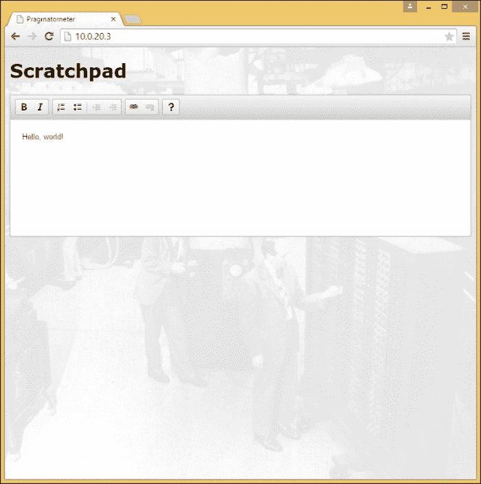

# 第十一章。用实例演示 JavaScript 中的函数式响应式编程，第四部分 - 添加一个草稿本并将所有内容整合在一起

在本章中，我们将涵盖最后三个努力，旨在将所有内容整合在一起，完成我们的示例 ReactJS 应用程序。早期的章节涉及使用 100％ReactJS 制作的基本定制组件。本章不同之处在于制作有效的组件，该组件在使用 ReactJS 的同时利用了一个重要的非 ReactJS 工具。

制作了最后一个组件后，我们将把它们整合到一个页面中，其中四个组件中的每一个都放在页面的一个部分。这与开发不同，开发中我们将正在开发的工具放在整个页面下。这将是本章的第二个主要部分。

到目前为止，页面还没有跟踪状态的方法。假设您在日历中输入了一个条目，待办事项，或在草稿本中做了一些笔记。然后，如果您导航离开并返回或重新加载页面，所有更改都将丢失。有一个记住更改的方法会很好，这正是我们接下来要做的。在本章的第三个，也是最后一个主要部分中，我们将介绍一种便宜的、自制的基于 HTML5 localStorage 的持久性解决方案，它的效果出奇的好。它不允许您从多台计算机访问您的数据，但现在让我们把它放在一边，只在同一台计算机上进行持久性工作。

整体应用程序旨在处理个人信息管理/后勤：任何信息的草稿本，待办事项列表，日历，以及一个用于替换为您自己设计的有趣内容的抱怨人工智能的残留部分。

# 添加一个所见即所得的草稿本，感谢 CKeditor

这里有多个所见即所得（WYSIWYG）编辑器，而选择 CKeditor 并不是 CKeditor 是免费和付费编辑器的无可争议的选择。我们将看看如何要求 ReactJS 不要干涉 DOM 的一部分（在这种情况下，不要破坏我们的 CKeditor 实例）。我们将涵盖以下主题：

+   为什么要使用像 CKeditor 这样的东西，它的工作方式与 ReactJS 不太相似？

+   安装一个“小即美”的 CKeditor 版本，看看哪个版本最好

+   在我们的页面中包含 CKeditor，重点是 JSX

## 将所有内容整合到一个网页中

我们几乎做完了所有的事情。我们将涵盖以下主题：

+   调整 JSX，以便现在所有我们的功能都是未注释的。这是一个非常简单的步骤。

+   CSS 样式让一切都适合。我们将组件排列在 2x2 的网格中，但这可以被几乎任何适合在页面上放置组件的样式方法所替代。

+   引入显示组件的基本数据持久性。这将包括一些基本的、非穷尽的 CSS 工作。

+   为了提供一个完整的示例应用程序，我们一直在开发的面向用户界面的应用程序将在您的计算机上包含基本的持久性，本例中谦逊地使用 HTML5 localStorage 实现。这意味着一个计算机，无需登录或其他麻烦，将能够持久地使用数据。

+   一些简单的`JSON.stringify()`调用可以为更常见的远程、基于服务器的持久性奠定基础。数据通过`JSON.stringify()`进行字符串化，这在 localStorage 中并不是特别需要，但使代码稍微更容易替换掉 localStorage 引用，并将其替换为潜在的远程服务器。

+   使 CKeditor 状态持久化。一些有经验的程序员，在被要求为组件状态创建一个 localStorage 持久性解决方案时，可能会合理地猜测我们的解决方案，除了草稿本。草稿本对 Web 2.0 工作有一些难点，因为 CKeditor 对 Web 2.0 工作有一些难点。

整个系统一起运行可以在[`demo.pragmatometer.com/`](http://demo.pragmatometer.com/)上看到。

## 这本书是关于 ReactJS 的，那为什么要使用 CKeditor？

一般来说，可以建议最好使用符合 ReactJS 声明性精神和单向数据绑定的东西。如果您可以选择一个像 CKeditor 这样的东西的良好实现，它并不特别与 ReactJS 以类似的方式工作，以及其他一些与 ReactJS 很好地融合并很好地处理所见即所得的组件，您应该选择与 ReactJS 很好地融合的组件。

这本书旨在帮助您在道路的叉口两侧。它包括使用 JSX 和不使用 JSX 的开发，传统和全新的开发，单向和双向数据绑定，以及（在这里）纯 ReactJS 组件与集成非 ReactJS JavaScript 工具。好消息是，ReactJS 擅长与其他工具友好相处。来自 JavaScript 世界各地的工具至少可能都可以为您提供帮助，而不仅仅是专门为 ReactJS 工作而开发的一小部分。也许您有幸使用纯 ReactJS 组件。也许您想要、需要或者不得不使用一些没有考虑到任何 ReactJS 集成的 JavaScript 工具。好消息是：在任何一种情况下，ReactJS 可能都已经覆盖了。在本章中，我们将使用标准的非 ReactJS 工具-著名且成熟的 CKeditor，ReactJS 让我们很好地将其集成到我们的网页中。

# CKeditor-小而美的免费提供

有几种免费和商业编辑器可用；其中一个编辑器是 CKeditor（其主页位于[`ckeditor.com/`](http://ckeditor.com/)）。CKeditor 带有四个基本选项：*Basic*，*Standard*，*Full*，以及一个*Custom*选项，允许完全自由地选择和取消选择可选功能。对于这个项目，我们将使用*Basic*选项。这不是为了让用户呈现一大堆按钮行的服务，关于包括哪些功能的正确问题是，“什么是对我们来说能够很好地工作的最低限度？”

## 在我们的页面中包含 CKeditor

**Basic**选项（以及 Standard、Full 和 Custom 选项数组）可通过下载或从 CDN 获取。在撰写本书时，可以通过以下方式从 CDN 获取 Basic 选项：

```js
<script src="img/ckeditor.js"></script>
```

这应该是我们的 HTML。我们还需要处理 JSX。用于设置草稿的代码是我们四个子组件中最简单和最短的：

```js
  var Scratchpad = React.createClass({
    render: function() {
      return (
        <div id="Scratchpad">
          <h1>Scratchpad</h1>
          <textarea name="scratchpad"
            id="scratchpad"></textarea>
        </div>
      );
    },
    shouldComponentUpdate: function() {
      return false;
    }
  });
```

`render()`方法就像它看起来的那样简单。请注意，它定义了一个`TEXTAREA`而不是 CKeditor 小部件。不同版本的 CKeditor 通过劫持特定的`TEXTAREA`而不是在代码中编写他们的小部件来工作。`shouldComponentUpdate()`方法也和它看起来的一样简单，但值得一提。这个方法旨在促进优化，以解决 ReactJS 虚拟 DOM 差异检查不如您所能做的那么快的罕见情况。例如，在 ClojureScript 下，Om 具有不可变的数据结构，因此可以仅通过引用比较来测试相等性，而无需进行深度相等性检查，这就是为什么 Om 加 ClojureScript 的速度大约是 ReactJS 加 JavaScript 的两倍。正如前几章所述，99%的时间，微观管理 ReactJS 的虚拟 DOM 根本不需要，即使您想要非常高效。

然而，在这里，我们对 shouldComponentUpdate()机制有一个单独的用例。它在这里的使用与优化和通过较少的比较获得相同结果无关。相反，它用于否认 DOM 的部分权限。对于您可能想要包括的其他一些工具，比如 CKeditor，希望 ReactJS 创建 DOM 的一部分，然后让它保持不变，而不是在以后破坏另一个工具的更改；这正是我们在这里所做的。因此，shouldComponentUpdate() - 除了构成一个在闪电般快速的虚拟 DOM 差异比较中修剪不必要比较的机制之外 - 还可以用于附加一个标签，表示“除了 ReactJS 之外的东西负责维护 DOM 的这一部分。请不要破坏它。”

在首次渲染 Web 应用程序之后，我们要求 CKeditor 替换具有 ID 为 scratchpad 的 TEXTAREA，这应该给我们一个实时小部件：

```js
  React.render(<Pragmatometer />,
    document.getElementById('main'));
  CKEDITOR.replace('scratchpad');
We temporarily comment out the other subcomponents:
  var Pragmatometer = React.createClass({
    render: function() {
      return (
        <div className="Pragmatometer">
          {/* <Calendar /> */}
          {/* <Todo /> */}
          <Scratchpad />
          {/* <YouPick /> */}
        </div>
      );
    }
  });
```

现在我们有一个交互式的便签。以下是我们的 Web 应用程序的屏幕截图，仅显示便签：



# 将所有四个子组件整合到一个页面中

已经创建了四个子组件 - 日历、便签、待办事项列表和一个带有占位符的“你选择”槽 - 现在我们将把它们整合起来。

我们首先取消注释 Pragmatometer 的 render()方法中的所有注释子组件：

```js
        <div className="Pragmatometer">
          <Calendar />
          <Todo />
          <Scratchpad />
          <YouPick />
        </div>
```

我们的下一步是添加样式，只需一点响应式设计。响应式设计中的一个主要竞争者是简单地不尝试了解和解决每个屏幕分辨率，而是根据屏幕宽度有几个响应步骤。例如，如果您有一个宽屏桌面监视器，加载[`therussianshop.com/`](http://therussianshop.com/)，然后逐渐缩小浏览器窗口。不同的适应性会启动，并且在桌面宽度、平板电脑的任何方向或智能手机上查看时，整个页面会形成一个整体。我们不会在这里尝试一个严肃的解决方案，但是有一些响应性，因为我们的样式是有条件地适应最小宽度为 513 像素。没有任何样式，四个元素将显示在彼此上方；有样式，它们将被围成一个 2x2 的网格。

样式化子组件的 CSS 基本上将足够大的窗口分成四分之一，添加一些填充，并确保每个应用程序上的任何溢出都会滚动：

```js
      @media only screen and (min-width: 513px) {
        #Calendar {
          height: 46%;
          left: 2%;
          overflow-y: auto;
          position: absolute;
          top: 2%;
          width: 46%;
        }
        #Scratchpad {
          height: 46%;
          left: 2%;
          overflow-y: auto;
          position: absolute;
          top: 52%;
          width: 46%;
        }
        #Todo {
          height: 46%;
          left: 52%;
          overflow-y: auto;
          position: absolute;
          top: 0;
          width: 46%;
        }
        #YouPick {
          height: 50%;
          left: 52%;
          overflow-y: auto;
          position: absolute;
          top: 52%;
          width: 46%;
        }
      }
```

这使我们能够显示以下是我们的 Web 应用程序所有部分的屏幕截图：


# 持久性

有些框架是通用框架，旨在做任何事情；ReactJS 不是。它甚至没有提供任何方法来进行 AJAX 调用，即使（实际上）使用 ReactJS 的任何重要项目都将具有 AJAX 要求。这完全是有意设计的。原因是 ReactJS 专门作为用于工作在用户界面或制作视图的框架，并且旨在与其他技术结合使用，以制作适合您网站的完整包。

Pragmatometer 应用程序中一个希望的功能是它记住您输入的数据。如果您在明天下午 2 点有一个约会，然后离开页面再回来，页面记住约会而不是每次加载时呈现完全空白。持久性是完整 Web 应用程序的一部分，但不是视图或用户界面的责任，ReactJS 显然也没有提供持久性的解决方案。也许也不应该。最近的一些章节介绍了如何使用 ReactJS 来做“X”；本章是关于如何做一些与 ReactJS 相辅相成的其他事情。

对于主流用途，持久性通常通过与后端的通信来处理；有几种好的技术可用。但也许试图将正确实现后端的处理塞进 ReactJS 前端开发书籍的一个章节中并不是非常有用。

作为一个仍然完全属于前端领域的练习，我们将通过一个众所周知的前端路由来处理持久性——HTML5 的 localStorage（如果 Modernizr 未能检测到 localStorage，则持久性代码不起作用）。使用的函数`save()`和`restore()`，如果找到 localStorage，则保存在 localStorage 中。它们直接调用`JSON.stringify()`和`JSON.parse()`，即使这一步并不严格需要使 JSON 可序列化的对象在 localStorage 中持久化。这旨在提供一个直接的钩子来改变代码以与远程后端通信。最简单的适应方式，就像这里的实现一样，是为应用程序单体保存和恢复整个状态，但要记住，过早优化仍然是万恶之源。以这种方式大量使用应用程序可能会导致与单个大型 PNG 文件相当的状态量。当然，该代码还可以进一步适应更精细的方法来保存或恢复更轻的差异，但这里的重点是奠定坚实的基础，而不是将优化推到极致。

我们将使用 Crockford 的 JSON [`github.com/douglascrockford/JSON-js/blob/master/json2.js`](https://github.com/douglascrockford/JSON-js/blob/master/json2.js) 和 Modernizr [`modernizr.com/`](http://modernizr.com/)。在这个应用程序中，我们只会使用 Modernizr 来测试 localStorage 的可用性，因此，如果你正在寻找一个“对于这个项目足够轻量级的最小 Modernizr 构建”，选择测试 localStorage 并排除其他所有内容。让我们在`index.html`中包含这些文件：

```js
<script src="img/json2.js"></script>
<script src="img/modernizr.js"></script>
```

在我们的`site.jsx`文件中，我们定义了`save()`和`restore()`函数。这些函数将用于使不同应用程序的整个状态持久化。另一种方法可能是进行更多和更小的保存，而不是少量的单体保存，但少量的单体保存更容易在脑海中跟踪。因此，它们比为数据的次要方面进行不同保存更容易维护和调试（如果以后需要优化，我们可以，但过早优化仍然是万恶之源）。`save()`函数如下所示：

```js
  var save = function(key, data) {
    if (Modernizr.localstorage) {
      localStorage[key] = JSON.stringify(data);
    }
  }
```

将这个与远程后端连接的最明显的方法之一，除了处理诸如帐户管理之类的细节（这在本示例中没有涉及），是将`localStorage[key]`的赋值替换为调用通知服务器与该键相关的新字符串化数据。这将使 Modernizr 检查变得不必要。但要警告：即使 IE8 支持 localStorage，不支持它的客户端可能有点过时，可能不受 ReactJS 支持，因为 ReactJS 并不宣传支持早于 IE8 的版本（此外，IE8 支持现在是基于一个 shim 而不是本地的；参见[`tinyurl.com/reactjs-ie8-shim`](http://tinyurl.com/reactjs-ie8-shim)）。

`restore()`函数除了键之外还接受一个可选参数——`default_value`。这用于支持一个初始化，如果存在保存的状态，则会拉取它，否则会回退到在初始化时将要使用的正常值。初始化代码可以被重用以适应这个`restore()`函数，如果存在保存的数据，它会拉取非空和已定义的数据，否则会使用默认值。带有`JSON.parse()`和探测 localStorage 的`if`语句是你最直接用来调用远程后端的行，或者更进一步，`restore()`函数可能会被彻底清除并替换为具有相同签名和语义的函数，但会与拥有更多工作的远程服务器进行通信，检查是否保存了任何现有数据。这可能会导致客户端在服务器没有返回任何内容时返回默认值：

```js
  var restore = function(key, default_value) {
    if (Modernizr.localstorage) {
      if (localStorage[key] === null || localStorage[key]
        === undefined) {
        return default_value;
      } else {
        return JSON.parse(localStorage[key]);
      }
    } else {
      return default_value;
    }
  }
```

现在，所有的`getInitialState()`函数都被修改为通过`restore()`函数。看看接下来会发生什么。考虑一下这段代码的`Todo`初始化器：

```js
      getInitialState: function() {
        return {
          'items': [],
          'text': ''
        };
      },
```

它只是包裹在一个`restore()`的调用中：

```js
      getInitialState: function() {
        return restore('Todo', {
          'items': [],
          'text': ''
        });
      },
```

有一些函数会改变一个组件或另一个组件的状态，我们让任何改变组件状态的函数都保存整个状态的一部分。因此，在名为`Calendar#handle_submit`的适当命名的函数中，`this.state.entry_being_added`的许多细节都被填充以匹配（Hijaxed）表单上的内容。然后填充的条目被添加到实时填充的条目列表中，并且新的条目被放在它的位置上：

```js
      this.state.entries.push(this.state.entry_being_added);
      this.state.entry_being_added = this.new_entry();
```

这两行改变了`this.state`，所以我们在它们之后保存了状态：

```js
      this.state.entries.push(this.state.entry_being_added);
      this.state.entry_being_added = this.new_entry();
      save('Calendar', this.state);
```

## 一个细节——持久化 CKeditor 状态

这一部分大部分是可以预测的。一些程序员被告知我们通过 HTML5 localStorage 添加了持久性，可能已经猜到了之前写的东西，很可能他们离答案很近。然而，有一个关于 CKeditor 的细节，不太明显，也不太理想。

CKeditor 在“非花哨”的 Web 1.0 表单使用下做了你可能天真地期望的事情。如果你有一个表单，包括一个名为`foo`的`TEXTAREA`，调用 CKeditor 进行转换，然后提交表单。表单将被提交，就好像当时在 CKeditor 实例上的 HTML 是`TEXTAREA`的内容一样。所有这些都是应该的。

然而，如果你以几乎任何“AJAXian”方式使用 CKeditor，查询文本区域的值而不进行完整的页面表单提交，你将遇到问题。CKeditor 实例的报告值既不多也不少，就是它初始化的文本。原因是`TEXTAREA`的值在整个页面表单提交时会被同步，但在中间步骤不会自动完成。这意味着，除非你采取额外的步骤，否则无法有用地查询 CKeditor 实例。

幸运的是，这个额外的步骤并不特别困难或棘手；CKeditor 提供了一个 API 来同步`TEXTAREA`，所以你可以查询`TEXTAREA`来获取 CKeditor 实例的值。在连接 CKeditor 草稿之前，我们初始化了整个显示并设置了一个间隔，以便每 100 毫秒更新一次显示（这个间隔的长度并不是必要的或神奇的；它可以更频繁或更少地更新，较长的间隔会更加不连贯，但基本上是一样的）：

```js
  var update = function() {
    React.render(<Pragmatometer />,
      document.getElementById('main'));
  };
  update();
  var update_interval = setInterval(update,
    100);
```

为了适应 CKeditor，我们稍微调整和解开一些东西。我们的代码将会有点混乱，以便按特定顺序调用事物。为了让我们的`TEXTAREA`首先存在，我们需要渲染 Pragmatometer 主组件一次（或多次，如果我们想要）。然后，在那个调用之后，我们要求 CKeditor 转换`TEXTAREA`。

接下来，我们开始一个更新函数。这既更新了显示，也同步了 CKeditor 的`TEXTAREAs`，以便可以查询它们的位置。同步`TEXTAREA`的循环并不是绝对必要的。如果我们只有一个编辑器实例，我们只需要一行代码，但我们的代码对于任意数量的具有任意 ID 的 CKeditor 实例都是通用的。最后，在循环内，我们调用编辑器内容的`save()`。一个优化是，如果`save()`和`restore()`被清空并替换为与后端服务器通信，那么就可以将当前编辑器状态保存在一个变量中，只有在编辑器的内容与先前保存的值不同时才进行`save()`。这应该减少频繁的网络通信：

```js
  React.render(<Pragmatometer />,
    document.getElementById('main'));
  CKEDITOR.replace('scratchpad');
  var update = function() {
    React.render(<Pragmatometer />,
      document.getElementById('main'));
    for(var instance in CKEDITOR.instances) {
      CKEDITOR.instances[instance].updateElement();
    }
    save('Scratchpad', 
      document.getElementById('scratchpad').value);
  };
  var update_interval = setInterval(update,
    100);
```

还有一些更改，使得所有的初始化都包裹在对`restore()`的调用中。此外，每当我们改变一个组件的状态时，我们都会调用`save()`。然后我们就完成了！

# 总结

在本章中，我们添加了第四个组件。它与其他组件不同之处在于它不是从头开始在 ReactJS 中构建的，而是集成了第三方工具。这样做可能足够好；只要小心地编写一个`shouldComponentUpdate()`方法，返回`false`，作为一种方式来表明，“不要破坏这个；让其他软件在这里完成它的工作。”

尽管我们涵盖了三个基本主题——组件、集成和持久性，但这一章比其他一些章节更容易。我们有一个实时、可工作的系统，你可以在[`demo.pragmatometer.com/`](http://demo.pragmatometer.com/)上看到它。

现在让我们退一步，来看一下结论，讨论你在本书学到了什么。
