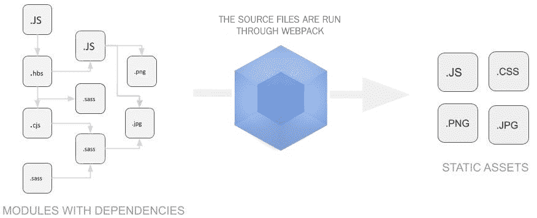

# 第一章：Webpack 5 简介

本书面向有经验的 JavaScript 开发人员，旨在通过逐步的过程带您完成一个特定示例项目的开发和生产。当您完成本指南时，您应该能够完全设置和部署一个可工作的捆绑应用程序。

本章将向您介绍 Webpack——具体来说，是 Webpack 5 版本。它将包括对 Webpack 周围的核心概念以及其用法的概述。

本章面向对 Webpack 和 Webpack 5 新手程序员。本章将涵盖初始设置，以及对该过程的概述，并将向您展示如何部署您的第一个捆绑应用程序。

本章将涵盖以下主题：

+   Webpack 5 的基础知识

+   设置 Webpack

+   创建一个示例项目

# 技术要求

您可以在本书的所有章节中找到使用的代码[`github.com/PacktPublishing/Webpack-5-Up-and-Running`](https://github.com/PacktPublishing/Webpack-5-Up-and-Running)：

+   要使用本指南，您需要对 JavaScript 有基本的了解。

+   确保您已安装了 Webpack 5 的最新版本。

+   您将需要使用命令行，如命令提示符或您选择的其他命令行实用程序。

+   您将需要 Node.js，JavaScript 运行环境。

+   确保你已经安装了最新版本的 Node.js；否则，你可能会遇到很多问题。

+   您需要在本地计算机上安装`npm`并具有管理员级别的权限。Webpack 和 Webpack 5 在 Node.js 环境中运行，这就是为什么我们需要它的包管理器 npm。

+   截至撰写本文时，最新版本是 Webpack 5。访问[`webpack.js.org`](https://webpack.js.org)找到适合您的最新版本。

# Webpack 5 的基础知识

基本上，Webpack 是一个用于 JavaScript 应用程序的模块打包工具。Webpack 接受一系列 JavaScript 文件，以及构成应用程序的图像文件等依赖项，并构建所谓的依赖图。依赖图是这些文件和依赖项在应用程序中如何排序和链接的表示，并显示文件之间的交互方式。

然后，这个依赖图形成了一个模板，捆绑器在将所有依赖项和文件压缩成更小的集合时会遵循这个模板。然后 Webpack 能够将这些文件捆绑成更大、但通常更少的文件集。这消除了未使用的代码、重复的代码以及重写的需要。在某种程度上，代码可以更简洁地格式化。

Webpack 递归地构建应用程序中的每个模块，然后将所有这些模块打包成少量的捆绑包。在大多数情况下，捆绑的应用程序将包含一个脚本，非常适合被程序（如 Web 浏览器）读取，但对程序员来说太复杂了。因此，开发人员将会拿一组源文件并对程序的这一部分进行更改，然后将这些源文件捆绑成一个输出——一个捆绑的应用程序。

捆绑最初是为了提高浏览器的阅读性能，但它还有许多其他优点。一旦 Webpack 捆绑了一组源文件，它通常会遵循一种系统化和常规的文件结构。代码中的错误可能会中断捆绑操作；本书将指导您如何克服这些问题。

现在，让我们探索 Webpack 5 周围的一般概念。

# Webpack 5 背后的一般概念

在这里，我们将开始理解 Webpack 的关键概念和目的，而不是期望您有任何先前的了解。捆绑通常在桌面上使用 Node.js 或`npm`和**命令行界面**（**CLI**）（通常是命令提示符）上进行。

Webpack 是一个构建工具，将所有资产放入一个依赖图中。这包括 JavaScript 文件、图像、字体和**层叠样式表**（**CSS**）。它将**Sassy CSS**（**SCSS**）和 TypeScript 文件分别放入 CSS 和 JavaScript 文件中。只有当代码与后者格式兼容时，Webpack 才能做到这一点。

在 JavaScript 和其他语言编程时，源代码通常会使用诸如`require()`的语句，将一个文件指向另一个文件。Webpack 将检测这个语句，并确定所需的文件作为依赖项。这将决定最终 JavaScript 捆绑包中的文件如何处理。这还包括将 URL 路径替换为**内容传送网络**（**CDN**）——这实质上是一组代理服务器网络——与本地文件。

以下图表是 Webpack 的一般目的的表示，即获取一组文件或依赖项并以优化的形式输出内容：



现在，让我们更仔细地看一些您可能不熟悉但在使用 Webpack 时可以被视为常用术语的术语。

# 术语

本节将涵盖 Webpack 5 中使用的术语。这将包括本地术语，以及一些更不寻常的缩写词。

+   **资产：**这是 Webpack 中经常使用的一个术语，用于防止概念的混淆。它指的是软件在生成捆绑应用程序时收集的图像文件，甚至是数据或脚本文件。

+   **捆绑：**这指的是 Webpack 编译应用程序后输出的应用程序。这是原始或源应用程序的优化版本——这将在后面的章节中详细讨论原因。捆绑器将这些文件合并成一个文件，这使得解包和破解变得非常困难。它还提高了浏览器的性能。它通过确保处理器保持在最佳水平，并删除任何不符合标准的编码结构来实现这一点。这也鼓励开发人员更加认真地采用惯例。如果存在任何不安全的编程，这些位置更容易被识别、隔离和纠正。

+   **SASS：**CSS 的增强版本。Webpack 处理这段代码就像处理 CSS 一样；然而，这可能是一个让你感到困惑的短语，所以了解一下是值得的。

+   **SCSS：**这只是用于给 SASS 增加额外功能的语法版本的名称。值得知道的是，Webpack 能够转译这两种语法。

+   **转译：**这是 Webpack 5 将一组输入源代码转换为更优化的输出分发代码的过程。这是通过删除未使用或重复的代码来完成的。转译用于将一组文件转换为更简单的一组文件。例如，SCSS 通常包含可以轻松存储在 CSS 文件中的脚本。您还可以将 SCSS 转译为 CSS，或将 TypeScript 转译为 JavaScript。

+   **TypeScript：**对于未经训练的人来说，TypeScript 是一种在许多方面类似于 JavaScript 的代码类型。例如，浏览器最常运行 JavaScript，因此在可能的情况下使用 JavaScript 可能更合适。当前，Webpack 5 将在前者允许时将 TypeScript 转译为 JavaScript。

+   **CDN：**CDN 是一组代理服务器网络，提供高可用性和高性能。一些例子是谷歌 API，如谷歌字体，以及其他类似的工具，所有 JavaScript 开发人员无疑都很熟悉。

+   **依赖图：**在 Webpack 5 中，依赖图是表示多个资产相互依赖的有向图。Webpack 5 将映射资产和依赖项的列表，并记录它们在应用程序中如何相互依赖。它使用这个来推导出一个适当的输出文件结构。

尽管 JavaScript 是入口点，但 Webpack 意识到您的其他资产类型（如 HTML、CSS 和 SVG）都有自己的依赖关系，这些依赖关系应该作为构建过程的一部分进行考虑。

Webpack 由**输入**和**输出**组成。输出可以由一个或多个文件组成。除了捆绑模块外，Webpack 还可以对您的文件执行许多功能。输入是指在捆绑之前，原始文件的原始结构。输出是指捆绑后的文件在其新的和优化的文件结构中的结果。因此，输入由源文件组成，输出可以由开发文件或生产文件组成。

输入和输出以及源代码和开发代码之间经常混淆。

**源代码**指的是捆绑之前的原始应用程序。**开发代码**指的是将应用程序放入 Node.js 环境并以开发模式捆绑后的应用程序。在生产模式下会产生一个更“紧凑”的捆绑版本，但这个版本很难进行工作。因此，在捆绑后可以在一定程度上修改开发代码，这非常有用，例如在您修改数据库连接配置的情况下。

在使用 Webpack 5 时，这些短语可能会出现，重要的是您不要对它们感到太困惑。

大多数其他术语将在我们遇到它时进行解释，或者如果您熟悉 JavaScript，它是如此常见，我们假设您了解这些术语。

这总结了您在使用 Webpack 时会遇到的大部分术语。现在，我们将探讨软件的工作原理。

# Webpack 的工作原理

Webpack 通过生成一组源文件中资产的依赖图来工作，然后从中转换出一组优化的分发文件。这些源和分发文件分别包含源代码和分发代码。这些分发代码形成了输出。分发只是输出或捆绑的另一个名称。

Webpack 首先在源文件中找到一个入口点，然后构建一个依赖图。在 Webpack 5 中，选择入口点是可选的，选择的方式将改变构建过程的性质，无论是速度还是输出优化。

Webpack 5 能够转换、捆绑或打包几乎任何资源或资产。

我们已经对软件的工作原理进行了良好的概述；之前使用过 Webpack 的有经验的用户可能会认为这个概述很基础，所以让我们来看看这个当前版本中有什么新东西。

# Webpack 5 中有什么新功能？

备受欢迎的 Webpack 模块捆绑器已经经历了一次大规模更新，发布了第 5 版。Webpack 5 提供了巨大的性能改进、更动态的可扩展性和基本的向后兼容性。

Webpack 5 接替了第 4 版，第 4 版并非总是与许多可用的各种加载器向后兼容，这些加载器通常更兼容第 2 版，这意味着如果不使用第 2 版，开发人员通常会在命令行中遇到弃用警告。Webpack 5 现在已经解决了这个问题。

第 5 版的另一个重要卖点是联邦模块。我们将在稍后的第六章中更详细地讨论这一点，*生产、集成和联邦模块*。然而，总结一下，联邦模块本质上是捆绑应用程序以利用和与远程存储的单独捆绑中的模块和资产进行交互的一种方式。

Webpack 5 的优点总结如下：

+   Webpack 5 提供了对 HTTP 请求的控制，这提高了速度和性能，也减轻了安全问题。

+   Webpack 5 相对于竞争对手 Browserify 和 systemjs 有一些优势，特别是速度。构建时间直接取决于配置，但比最近的竞争对手更快。

+   使用 Webpack 5 几乎不需要任何配置，但您始终可以选择配置。

+   与其他替代方案相比，使用起来可能更复杂，但这主要是由于其多功能和范围，值得克服。

+   Webpack 5 具有优化插件，可以很好地删除未使用的代码。它还具有许多相关功能，例如树摇动，我们将在本书后面更详细地讨论。

+   它比 Browserify 更灵活，允许用户选择更多的入口点并使用不同类型的资产。在捆绑大型 Web 应用程序和单页面 Web 应用程序时，它在速度和灵活性方面也更好。

Webpack 现在被认为是应用程序开发和 Web 开发中非常重要的工具，它可以改变结构并优化所有 Web 资产的加载时间，例如 HTML、JS、CSS 和图像。现在让我们实际使用 Webpack。为了做到这一点，我们将首先看一下可能对您来说是新的东西——如果您到目前为止只使用原生 JavaScript——模式。

# 模式

一旦您理解了一般概念，运行构建时需要了解的第一件事就是模式。模式对于 Webpack 的工作和编译项目至关重要，因此最好在继续之前简要但重要地介绍一下这个主题。

模式使用 CLI，这是我们稍后将更详细介绍的一个过程。如果您习惯使用原生 JavaScript，这可能对您来说是新的。但是，请放心，这不是一个难以理解的复杂主题。

Webpack 附带两个配置文件，如下所示：

+   **开发配置**：这使用`webpack-dev-server`（热重载）、启用调试等。

+   **生产配置**：这将生成一个在生产环境中使用的优化、最小化（uglify JS）、源映射的捆绑包。

自从发布第 5 版以来，Webpack 默认通过简单地向命令添加`mode`参数来处理模式功能。Webpack 不能仅使用`package.json`来查找模式以确定正确的构建路径。

现在我们已经掌握了基本原理，是时候进入实际设置了。

# 设置 Webpack

本书将逐步介绍一个示例项目的开发，我相信您会发现这是学习如何使用 Webpack 5 的简单方法。

Webpack 5 在本地机器上打包所有依赖项。理论上，这可以远程完成，但为了避免给第一次使用者带来任何困惑，我将强调使用本地机器。

对于大多数项目，建议在本地安装软件包。当引入升级或破坏性更改时，这样做会更容易。

我们将从`npm`安装开始。npm 是您将与 Webpack 5 一起使用的软件包管理器。一旦在本地机器上安装了它，您就可以使用 CLI，例如命令提示符，来使用`npm`命令。

安装了`npm`后，您可以继续下一步，即打开 CLI。有很多选择，但为了本教程的缘故，我们将使用命令提示符。

让我们一步一步地分解这个过程，这样您就可以跟上：

1.  安装`npm`软件包管理器，您将与 Wepback 5 一起使用它。

1.  打开 CLI（在本教程中，我们将使用命令提示符）并输入以下内容：

```js
mkdir webpack4 && cd webpack5
npm init -y
npm install webpack webpack-cli --save-dev
```

让我们分解一下代码块。前面的命令首先会在您的本地计算机上创建一个名为`webpack5`的新目录。然后，它将把当前目录（`cd`）标识为`webpack5`。这意味着通过 CLI 进行的任何进一步的命令都将是相对于该目录进行的。接下来的命令是初始化`npm`。这些基本命令及其含义的完整列表可以在本章末尾的*进一步阅读*部分找到。这部分内容很有趣，我相信您会学到一些新东西。然后，我们在本地安装 Webpack 并安装`webpack-cli`——这是用于在命令行上运行 Webpack 的工具。

1.  接下来，安装最新版本或特定版本的 Webpack，并运行以下命令。但是，在第二行，用您选择的版本替换`<version>`，例如`5.00`：

```js
npm install --save-dev webpack
npm install --save-dev webpack@<version>
```

1.  下一个命令是`npm install`，它将在目录中安装 Webpack 5，并将项目保存在开发环境中。重要的是要注意开发环境和生产环境（或模式）之间的区别：

```js
npm install --save-dev webpack-cli
```

以下行是`package.json`文件中的代码片段。我们需要这些输入文件来生成`webpack.config.js`文件，其中包含 Webpack 捆绑的配置信息。

1.  我们必须确保`package.json`文件的编码如下：

```js
"scripts": {
"build": "webpack --config webpack.config.js"
}
```

在使用 Webpack 5 时，您可以通过在 CLI 中运行`npx webpack`来访问其二进制版本。

我们还应该决定我们需要哪种类型的安装；任何重新安装都会覆盖先前的安装，所以如果您已经按照前面的步骤进行了操作，就不用担心了。

1.  如果适用，现在让我们进行安装。

有两种类型的安装：

+   +   **全局**：全局安装将锁定您的安装到特定版本的 Webpack。

以下`npm`安装将使 Webpack 全局可用：

```js
npm install --global webpack
```

+   +   **本地**：本地安装将允许您在项目目录中运行 Webpack。这需要通过`npm`脚本完成：

```js
npm install webpack --save-dev
```

每次在新的本地计算机上开始新项目时，您都需要执行所有前面的步骤。完成安装后，是时候把注意力转回到构建项目上了。

# 创建一个示例项目

现在，我们将创建一个实验项目，具有以下目录结构、文件及其内容。

以下代码块是指您本地计算机上的一个文件夹。它说明了 Webpack 通常使用的格式和命名约定。您应该遵循此格式，以确保您的项目与本教程保持一致，如下所示：

1.  首先设置**项目树**：

```js
webpack5-demo
 |- package.json
  |- index.html
  |- /src
  |- index.js
```

项目树向我们展示了我们将要处理的文件。

1.  现在让我们仔细看一下索引文件，因为它们将成为我们前端的关键，从`src/index.js`开始：

```js
function component() {
 let element = document.createElement('div');
// Lodash, currently included via a script, is required for this 
// line to work
 element.innerHTML = _.join(['Testing', 'webpack'], ' ');
 return element;
}
document.body.appendChild(component());
```

`index.js`包含我们的 JS。接下来的`index.html`文件是我们用户的前端。

1.  它还需要设置，所以让我们打开并编辑`index.html`：

```js
<!doctype html>
<html>
 <head>
 <title>Webpack - Test</title>
 <script src="img/lodash@4.16.6"></script>
 </head>
 <body>
 <script src="img/index.js"></script>
 </body>
</html>
```

请注意前面的`<script src="img/lodash@4.16.6">`标签。这是指使用`lodash`库。`index.js`文件（而不是`index.html`文件）需要调用此库。Webpack 将从库中获取所需的模块，并使用它们来构建捆绑包的依赖关系图。

Lodash 是一个提供函数式编程任务的 JavaScript 库。它是在 MIT 许可下发布的，基本上使处理数字、数组、字符串和对象变得更容易。

需要注意的是，如果没有明确说明您的代码依赖于外部库，应用程序将无法正常运行。例如，依赖项可能丢失或包含顺序错误。相反，如果包含了但未使用依赖项，浏览器将下载不必要的代码。

我们可以使用 Webpack 5 来管理这些脚本。

1.  你还需要调整你的`package.json`文件，将你的软件包标记为私有，并删除主入口点。这是为了防止意外发布你的代码：

```js
{
 "name": "webpack5",
 "version": "1.0.0",
 "description": "",
 "private": true,
 "main": "index.js",
 "scripts": {
 "test": "echo \"Error: no test specified\" && exit 1"
 },
 "keywords": [],
 "author": "",
 "license": "ISC",
 "devDependencies": {
 "webpack": "⁵.0.0",
 "webpack-cli": "³.1.2"
 },
 "dependencies": {}
 }
```

你可以从前面代码中的粗体文本中看到如何进行这些修改。请注意，我们的入口点将设置为`index.js`。这是 Webpack 在开始捆绑编译时将读取的第一个文件（请参阅依赖图的先前定义）。

如果你想了解更多关于`package.json`文件的信息，请访问[`docs.npmjs.com/getting-started/`](https://docs.npmjs.com/getting-started/)，这里提供了关于`npm`的信息。

我们现在已经完成了第一个演示应用程序捆绑的源代码。这构成了我们现在将通过 Webpack 运行以生成我们的第一个捆绑应用程序的输入或源文件。

# 捆绑你的第一个项目

Web 打包简单地意味着捆绑项目。这是 Webpack 的本质，从这个非常简单的介绍开始学习应用程序是一个很好的方法。

首先，我们需要通过略微改变我们的目录结构来将源代码与分发代码分开。这个源代码用于编写和编辑，分发代码是经过最小化和优化的捆绑，是我们构建过程的结果。

现在，我们将详细介绍构建我们的第一个项目的每个步骤：

1.  我们将首先构建项目和目录结构。首先注意`/src`和`/dist`这两个术语；它们分别指的是源代码和分发代码：

```js
webpack5-demo
|- package.json
  |- /dist
  |- index.html
  |- index.js
|- /src
|- index.js
```

1.  要将`lodash`依赖项与`index.js`捆绑，我们需要在本地安装该库：

```js
npm install --save lodash
```

在安装将捆绑到生产捆绑包的软件包时，应使用以下命令：

```js
npm install --save 
```

如果你正在为开发目的安装软件包（例如，一个代码检查工具、测试库等），你应该使用以下命令：

```js
npm install --save-dev
```

1.  现在，让我们使用**`src/main.js`**将`lodash`导入到我们的脚本中：

```js
import_ from 'lodash';

function component() {
let element = document.createElement('div');
 // Lodash, currently included via a script, is required for this 
// line to work
element.innerHTML = _.join(['Hello', 'Webpack'], ' ');
return element;
}
document.body.appendChild(component());
```

1.  接下来，更新你的`dist/index.html`文件。我们将删除对`lodash`库的引用。

这样做是因为我们将在本地安装库进行捆绑，不再需要远程调用库：

```js
<!doctype html>
<html>
<head>
<title>Getting Started</title>
  <script src="img/lodash@4.16.6"></script>
  //If you see the above line, please remove it.
</head>
<body>
  <script src="img/main.js"></script>
</body>
</html>
```

1.  接下来，我们将使用命令行运行`npx webpack`。`npx`命令随 Node 8.2/npm 5.0.0 或更高版本一起提供，并运行 Webpack 二进制文件（`./node_modules/.bin/webpack`）。这将把我们的脚本`src/index.js`作为入口点，并生成`dist/main.js`作为输出：

```js
npx webpack
...
Built at: 14/03/2019 11:50:07
Asset Size Chunks Chunk Names
main.js 70.4 KiB 0 [emitted] main
...
WARNING in configuration
The 'mode' option has not been set, webpack will fallback to 'production' for this value. Set 'mode' option to 'development' or 'production' to enable defaults for each environment.
You can also set it to 'none' to disable any default behavior. Learn more: https://webpack.js.org/concepts/mode/
```

如果没有错误，构建可以被视为成功。

请注意，警告不被视为错误。警告只是因为尚未设置模式而显示的。

我不会担心这个，因为 Webpack 将默认为生产模式。我们将在本指南的后面处理模式设置。

1.  当你在浏览器中打开`index.html`时，你应该看到以下文本：

```js
Testing Webpack5
```

万岁——我们已经完成了我们的第一个应用程序捆绑，我敢打赌你一定为自己感到非常自豪！这是一个开始的基本步骤；我们将在后面的章节中继续学习 Webpack 的更复杂的元素，并开始将它们应用到需要捆绑的现有项目中。

# 摘要

总之，Webpack 5 是一个非常多才多艺的捆绑工具，几乎使用了每一种可想象的方法来优化应用程序的大小并提高整体性能。了解它是非常值得的，本指南将向你展示你需要了解的一切。

现在，你应该了解 Webpack 背后的基本概念，以及基本术语。你现在也应该知道如何安装先决条件，比如 Node.js，并设置和部署——以及制作——你的第一个捆绑使用命令行。

在下一章中，我们将详细介绍模块和代码拆分，以及 Webpack 5 的一些更显著和有趣的方面，这些方面对理解 Webpack 至关重要。

# 问题

以下是与本章相关的一系列问题，您应该尝试回答以帮助您的学习。答案可以在本书的*评估*部分中找到：

1.  什么是 Webpack？

1.  Webpack 中的捆绑包是什么？

1.  根据本指南，Webpack 的最新版本是多少？

1.  Webpack 在哪个环境中工作？

1.  什么是依赖图？

1.  在捆绑时，以下命令缺少哪个入口？

`npm --save lodash`

1.  我们在 Webpack 5 中使用的包管理器的名称是什么？

1.  如何使用命令行删除`lodash`库？

1.  在使用 Webpack 5 时，源代码和分发代码之间有什么区别？

1.  在设置项目时，为什么要调整`package.json`文件？
