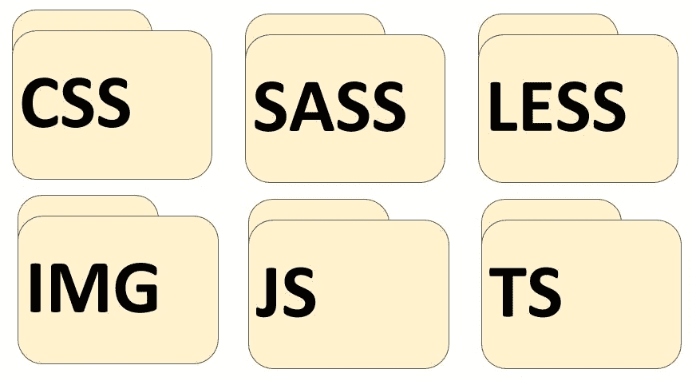

# 第二章：使用模块和代码拆分

本章将探讨 Webpack 5 中的模块和代码拆分。模块是一种按功能将代码分组的方式。代码拆分是 Webpack 用来自动构建这些模块的方法；它将项目中的代码分割成最适合完成项目的功能和结构的模块。

本章涵盖的主题如下：

+   解释模块

+   理解代码拆分

+   预取和预加载模块

+   最佳实践

# 解释模块

Webpack 使用称为模块的元素。它使用这些模块来构建依赖图。

模块是处理相关功能的代码部分；根据模块化构建项目将提高功能。例如，与未使用模块构建的项目相比，只有与相关操作相关的代码需要运行。

说到这里，下一件要理解的事情是模块的具体功能，这将在接下来的部分中讨论。

# 模块的功能

模块是一组代码片段：例如，相似语言的代码具有共同的功能——也就是说，它是应用程序中相同功能或操作的一部分。

通常，Webpack 5 中的模块根据使用的脚本语言进行分组，如下所示：



前面的图表应该有助于说明大多数人在探索 Webpack 构建内容时看到的内容。

然后将应用程序分成模块和资产。正如我们在第一章中所解释的那样，资产基本上是开发人员不认为是脚本的图像和视频。然后，目录结构通常被细分为这些模块，通常在它们自己的目录中。

将应用程序分成模块将自然使调试过程更容易。这也将有助于我们进行验证和测试。

以这种方式构建应用程序可以确保在良好编写的代码和更加可疑的代码之间建立边界。当然，这有助于目录导航，因为每个模块都有一个明确定义的目的。

许多平台使用模块，这是一个您在一般的 Web 开发中肯定会习惯的术语。然而，每个平台略有不同。

Webpack 5 根据模块的依赖关系表达方式来形成这些模块。以下是 Webpack 5 表达它们的一些示例：

+   通过**2015 ECMAScript**的`import`语句

+   通过**CommonJS **的`require()`语句

+   通过**异步模块定义 **(**ASM**)的`define`和`require`语句

+   通过样式表中的 imageURL

+   通过样式表中的`@import`语句

总之，模块化的代码使事情变得更容易，了解 Webpack 如何表达依赖关系将帮助您了解应该如何编译代码。从这里开始，自然的下一步是查看支持的模块类型以及加载器如何与它们一起工作。

# 支持的模块语言和加载器

为了确保 Webpack 5 支持这些模块，它们必须用可以理解和处理的编程语言编写。Webpack 5 通过使用称为加载器的东西来实现这一点。

加载器使 Webpack 在竞争对手捆绑器中真正脱颖而出。简单来说，加载器告诉 Webpack 如何处理不是 JavaScript 或其他 Webpack 自动理解的预定义代码（如 JSON 或 HTML）的代码。Webpack 5 将会将这些处理过的代码作为依赖项包含在您的捆绑包中。

Webpack 5 拥有一个开发者社区，称为 Webpack 社区，他们构建了这些加载器。这些加载器目前支持大量的语言和处理器；一些例子如下：

+   **TypeScript**

+   **SASS**

+   **LESS**

+   **C++ **

+   **Babel**

+   **Bootstrap**

有关可用加载器的完整列表，请参阅本章末尾的“进一步阅读”部分。

成为 Webpack 社区的一部分意味着您可以编写自己的加载器！这是值得考虑的事情，因为这可能是满足项目要求的最佳方式。

有许多更多的加载器可用于 Webpack 社区。使用加载器意味着 Webpack 5 可以被描述为一个动态平台，允许定制几乎任何技术堆栈。在本章中，我们将开始积极地使用加载器作为一些示例用例的一部分，您可以练习自己编码。

在开发过程中，您可能会遇到“封装”一词，特别是在处理模块和加载器时。

要理解封装，您首先需要了解软件有时可以独立开发，直到需要互动才会出现。为了使软件在项目中一起工作，必须在两个技术堆栈之间创建一个依赖关系。这就是“封装”一词的含义。

封装是一个简单的主题，但模块化编码的下一个领域是解析。这是一个更广泛的主题，因此已经作为自己的子部分进行了详细说明。

启用新的资产模块类型是 v5 的一个实验性功能。资产模块类型类似于`file-loader`、`url-loader`或`raw-loader`（自 alpha.19 以来的`experiments.asset`）数据 URL 和相关选项自 beta.8 以来得到支持。

# 模块解析

模块解析是通过解析器进行的。解析器帮助您通过其绝对路径找到一个模块——在整个项目中通用的模块路径。

请注意，一个模块可以作为另一个模块的依赖项，例如以下情况：

```js
import example from 'path/to/module';
```

无论依赖模块是来自另一个库（而不是解析器本身）还是应用程序本身，解析器都将帮助找到所需的模块代码以包含在捆绑包中。Webpack 5 也可以在捆绑时使用`enhance-resolve`来解析路径。

Webpack 5 的解析规则意味着，使用`enhanced-resolve`方法，Webpack 5 可以解析三种文件路径：

+   绝对路径

+   相对路径

+   模块路径

以下部分将详细说明每个文件路径的含义，并且每个部分都将有一个示例。随着我们开始构建项目捆绑包，这将变得更加重要。

# 绝对路径

对于初学者来说，绝对路径是指文件路径和项目使用的所有文件和资产的位置。这个共同的位置有时被称为`home`或`root`目录。以下是一个命令行位置的示例：

```js
import 'C:\\Users\\project\\file';
```

前一行是绝对路径的一个示例。术语“绝对”是每个 JavaScript 开发人员都应该熟悉的内容。它涉及到系统中普遍存在的对象文件或目录的位置。

如果我们已经有了绝对路径，就像前一行一样，就不需要进一步解析了。

# 相对路径

相对路径是指一个对象文件或目录到另一个位置的位置。在这种情况下，它是“上下文”目录的位置——开发进行的当前工作位置：

```js
import '../src/file';
```

在前面的示例中，资源文件的目录被认为是“上下文”目录。资源文件是指`import()`语句、`require()`语句或对外部文件的调用发生的文件。

在这种情况下，相对路径与上下文目录路径相结合，然后产生绝对路径。

# 模块路径

模块路径是并非所有 JavaScript 开发人员都习惯的东西。在 Webpack 中，它指的是相对于模块的位置。在下面的代码片段中，`module`将被用于你希望使用的任何特定模块名称的名称——例如你项目中现有模块的名称：

```js
import 'module/sub-directory/file';
```

Webpack 5 搜索所有在`resolve.module`指令中指定的模块的目录。可以使用`resolve.alias`配置为每个原始模块文件路径创建别名。使用这种方法，Webpack 5 会检查文件路径以及它指向文件还是目录。

Webpack 5 有一个名为`resolve.extension`的选项。如果路径没有文件扩展名，这个解析器将指示 Webpack 可以用于解析的扩展名。这些可能包括`.js`、`.jsx`或类似的扩展名。

如果文件路径不指向文件而只指向目录，Webpack 5 会搜索该目录中的`package.json`文件。然后 Webpack 5 使用`resove.main`字段配置中指定的字段来搜索`package.json`中包含的字段，并从中确定要使用的正确上下文文件路径。

如果目录中没有`package.json`文件，或者主字段没有返回有效路径，Webpack 5 会简单地搜索`resolve.main`配置中指定的文件名。

文件扩展名的解析方式类似，但使用`resolve.extension`选项。

到目前为止，我们已经涵盖了模块、路径解析、支持的语言和加载程序。下一个重要的理解是代码拆分——它是什么，以及 Webpack 如何利用它来形成它的模块和一般输出。

# 理解代码拆分

代码拆分允许用户将代码拆分成各种捆绑包，然后按需或并行加载。Webpack 的开发人员认为这是 Webpack 的“最引人注目的功能之一”([Webpack.js.org](http://webpack.js.org))。

代码拆分有两个关键优势——这个过程可以用来实现更小的捆绑包，并控制资源加载的优先级。这可以导致加载时间的改善。

Webpack 5 中有三种通用的代码拆分方法：

+   **入口点**：这是使用入口点配置手动拆分代码。

+   **防止重复**：这种方法使用`SplitChunksPlugin`来运行一个称为**dedupe**的过程，将代码拆分成称为**chunks**的模块组。

+   **动态导入**：这种方法使用内联函数在模块内部进行**调用**以拆分代码。

一个 chunk 指的是一组模块。这是 Webpack 使用的一个术语，在其他平台上并不经常遇到。

dedupe 是一个使用机器学习快速执行匹配、**去重**和实体解析的 Python 库。它有助于从姓名和地址的电子表格中删除重复条目。

有了这三种方法的概述，我们现在可以在接下来的章节中详细讨论每一种方法。让我们从入口点开始。

# 入口点

使用入口点可能是执行代码拆分的最简单方法。这是一个手动操作，因此不像其他方法那样自动化。

我们现在将看一下从主捆绑包中拆分一个模块的开发。为此，我们将从一些实际工作开始。然后，我们将讨论重复和动态导入的概念。

我们现在将回到我们在第一章中工作的项目，*Webpack 5 简介*。这一次，我们将利用到目前为止在本章中学到的知识。

首先，创建一个工作目录。在这种情况下，我们使用了上一章中使用的目录名称。遵循相同的约定可能是一个好主意，这样你就可以在继续阅读本书的过程中跟踪项目的发展。

在下面的例子中，我们将做以下操作：

1.  组织一个项目文件夹结构，以开始一个展示入口点如何工作的项目。您应该在练习项目目录中构建这组目录。这与在桌面上创建文件夹的方式相同。为了本示例，我们将称此文件夹为`webpack5-demo`（但您可以选择任何您喜欢的名称）：

```js
package.json
webpack.config.js
/dist
/src
 index.js
/node_modules
/node_modules/another-module.js
```

1.  如果您使用的代码缺少最后一行文本（用粗体标记），请确保添加。这可以在命令行上完成；如果您决定使用命令行，请参考第一章，*Webpack 5 简介*，以获取指导。您可能已经注意到了`another-module.js`的包含。您可能不会认为这是一个典型的构建，但是您需要包含这个示例。

最终，您可以随意命名项目，但是为了遵循此实践项目，您应该使用到目前为止使用的相同命名约定以防混淆。

为了跟踪此项目的开发，使用您的**集成开发环境**（**IDE**）或记事本，您应该创建前面提到的每个文件和文件夹。`**/**`字符表示一个文件夹。请注意`another-module.js`文件；它位于`/node_modules`目录中。

现在，我们将编辑并编译一个构建，从`another-module.js`文件开始。

1.  在您选择的 IDE 或记事本中打开`another-module.js`：

```js
import _ from 'lodash';
console.log(
  _.join(['Another', 'module', 'loaded!'], ' ')
 );

// webpack.config.js 
 const path = require('path');
 module.exports = {
   mode: 'development',
   entry: {
     index: './src/index.js',
     another: './src/another-module.js'
 },
 output: {
   filename: '[name].bundle.js',
   path: path.resolve(__dirname, 'dist')
  }
 };
```

该文件基本上导入了`lodash`，确保加载的模块记录在控制台日志中，将 Webpack 构建模式设置为开发模式，并设置 Webpack 开始映射应用程序中的资产进行捆绑的入口点，并设置输出捆绑名称和位置。

1.  现在，通过在命令行中输入上下文目录的位置（您正在开发的目录）并输入以下内容来使用`npm`运行构建：

```js
npm run build
```

这就是您需要产生捆绑输出或开发应用程序的全部内容。

1.  然后，检查是否成功编译。当在命令行中运行构建时，您应该看到以下消息：

```js
...
 Asset Size Chunks Chunk Names
 another.bundle.js 550 KiB another [emitted] another
 index.bundle.js 550 KiB index [emitted] index
 Entrypoint index = index.bundle.js
 Entrypoint another = another.bundle.js
 ...
```

成功！但是，在使用开发人员应该注意的入口点时，可能会出现一些潜在问题：

+   如果入口块之间存在重复的模块，它们将包含在两个捆绑包中。

对于我们的示例，由于`lodash`也作为`./src/index.js`文件的一部分导入到项目目录中，它将在两个捆绑包中重复。通过使用`SplitChunksPlugin`可以消除此重复。

+   它们不能用于根据应用程序的编程逻辑动态拆分代码。

现在，我们将介绍如何防止重复。

# 使用 SplitChunksPlugin 防止重复

`SplitChunksPlugin`允许将常见依赖项提取到入口块中，无论是现有的还是新的。在以下步骤中，将使用此方法来从前面示例中去重`lodash`依赖项。

以下是从前面示例的项目目录中找到的`webpack.config.js`文件中的代码片段。此示例显示了使用该插件所需的配置选项：

1.  我们将首先确保我们的配置与前面示例中的配置相同：

```js
const path = require('path');
module.exports = {
  mode: 'development',
  entry: {
    index: './src/index.js',
    another: './src/another-module.js'
 },
 output: {
   filename: '[name].bundle.js',
   path: path.resolve(__dirname, 'dist')
 },
 optimization: {
   splitChunks: {
 chunks: 'all'
   }
  }
 };
```

使用`optimization.splitChunks`配置，重复的依赖项现在应该从`index.bundle.js`和`another.bundle.js`中删除。`lodash`已被分离到一个单独的块和主捆绑包中。

1.  接下来，执行`npm run build`：

```js
...
Asset Size Chunks Chunk Names
another.bundle.js 5.95 KiB another [emitted] another
index.bundle.js 5.89 KiB index [emitted] index
vendors~another~index.bundle.js 547 KiB vendors~another~index [emitted]    vendors~another~index
Entrypoint index = vendors~another~index.bundle.js index.bundle.js
Entrypoint another = vendors~another~index.bundle.js another.bundle.js
...
```

有其他由社区开发的加载器和插件可用于拆分代码。一些更值得注意的例子如下：

+   `bundle-loader`：用于拆分代码和延迟加载生成的捆绑包

+   `promise-loader`：类似于`bundle-loader`，但使用 promises

+   `mini-css-extract-plugin`：用于从主应用程序中拆分 CSS

现在，通过对如何防止重复的理解牢固，我们将转向一个更困难的主题——动态导入。

# 动态导入

动态导入本质上是 Webpack 上的按需导入。如果您已经捆绑了大量代码，但需要对其进行补丁，动态导入方法将会派上用场。这还包括动态代码拆分，即在构建包后拆分代码并优化它。

Webpack 5 支持两种方法来做到这一点：

+   第一种方法使用了`import()`语法，符合 ECMAScript 的动态导入提案。

+   第二种是**特定于 webpack**的方法，使用`require.ensure`方法（这是一种传统方法）。

以下是第一种方法的示例；目标是演示使用动态导入的现代方法，这在最近的项目中将更常见。

`import()`调用是对承诺的内部调用。**承诺**指的是从加载程序返回的信息。

在与旧版浏览器一起使用`import()`时，使用`polyfill`函数，例如`es6-promise`或`promise-polyfill`，来**模拟承诺**。`shim-loader`是一个在 Webpack 5 环境中转换代码以使其工作的加载程序；这与使用`imports-loader`和`exports-loader`手动执行类似。

下一步是删除配置文件中的任何多余条目，其中包括`optmization.splitChunks`的引用，因为在接下来的演示中将不需要它：

1.  现在，打开`webpack.config.js`文件并进行以下条目：

```js
const path = require('path');
module.exports = {
 mode: 'development',
 entry: {
   index: './src/index.js'
   index: './src/index.js',
 },
 output: {
   filename: '[name].bundle.js',
   chunkFilename: '[name].bundle.js',
   path: path.resolve(__dirname, 'dist')
 },
 };
```

请注意`chunkFilename`的使用，它确定非入口块文件的名称。

前面的配置是为了准备您的项目使用动态导入。确保删除粗体文本，因为在处理相同代码时可能会看到这些。

回到项目中，我们需要更新它以删除未使用的文件的说明。

您可能已经设置了练习目录；但是，建议您从不包含任何实验代码的新目录集开始。

以下演示将使用动态导入来分离一个块，而不是静态导入`lodash`。

1.  打开`index.js`文件，确保进行以下条目：

```js
function getComponent() {
  return import(/* webpackChunkName: "lodash" */ 'lodash').then((
      { default: _ }) => {
 var element = document.createElement('div');

 element.innerHTML = _.join(['Hello', 'Webpack'], ' ');

 return element;

 }).catch(error => 'An error occurred while loading 
     the component');
 }

  getComponent().then(component => {
    document.body.appendChild(component);
  })
```

在导入`CommonJS`模块时，此导入将不会解析`module.exports`的值；而是将创建一个人工命名空间对象。因此，在导入时我们需要一个默认值。

在注释中使用`webpackChunkName`将导致我们的单独包被命名为`lodash.bundle.js`，而不仅仅是`[your id here].bundle.js`。有关`webpackChunkName`和其他可用选项的更多信息，请参阅`import()`文档。

如果现在运行 Webpack，`lodash`将分离成一个新的包。

1.  可以使用**命令行界面**（**CLI**）运行`npm run build`。在 CLI 实用程序中，键入以下内容：

```js
npm run build
```

运行构建时，您应该看到以下消息：

```js
...
 Asset Size Chunks Chunk Names
 index.bundle.js 7.88 KiB index [emitted] index
 vendors~lodash.bundle.js 547 KiB vendors~lodash [emitted] vendors~lodash
 Entrypoint index = index.bundle.js
 ...
```

`import()`可以与异步函数一起使用，因为它返回一个承诺。这需要使用预处理器，例如`syntax-dynamic-import` Babel 插件。

1.  使用`src/index.js`，进行以下修改以显示代码如何可以简化：

```js
async function getComponent() {
 'lodash').then(({ default: _ }) => {
const element = document.createElement('div');
const { default: _ } = await import(/* webpackChunkName: "lodash" */ 'lodash');

element.innerHTML = _.join(['Hello', 'webpack'], ' ');

return element;
}

  getComponent().then(component => {
    document.body.appendChild(component);
  });
```

前面的示例使用了我们在*动态导入*部分中使用的相同文件。我们将多行代码转换为单行代码，用异步代码替换了返回函数，加快了我们的编码实践。您会发现它现在比以前的代码简单得多——它使用了相同的文件`src/index.js`，并实现了相同的功能。

我们经常简化代码以帮助加载时间。改善浏览速度的另一个关键方法是缓存。

# 缓存

在我们完成代码拆分的这一部分之前，我们将介绍缓存。缓存与之前的过程有关，毫无疑问，在编程过程中会遇到。对于初学者来说，缓存是存储先前计算的数据以便更快地提供的方法。它还与下一节关于预取和预加载有关，这些方法控制内存的使用方式。

了解缓存将确保您知道如何更有效地拆分代码。在下一个示例中，我们将看到如何做到这一点。在 Webpack 中，缓存是通过**文件名哈希**（当计算机递归跟踪文件位置时）完成的，特别是输出包的哈希化：

```js
 module.exports = {
   entry: './src/index.js',
   plugins: [
    // new CleanWebpackPlugin(['dist/*']) for < v2 versions 
       of CleanWebpackPlugin
    new CleanWebpackPlugin(),
    new HtmlWebpackPlugin({
      title: 'Output Management',
      title: 'Caching',
   }),
 ],
 output: {
  filename: 'bundle.js',
  filename: '[name].[contenthash].js',
  path: path.resolve(__dirname, 'dist'),
  },
};
```

请注意前面的代码块中的`output`键处理程序；在括号内，您将看到`bundle.js`文件名，下面是我们称之为哈希的内联元素。您应该用您的偏好替换括号内的术语。这种方法产生了一种替代输出，只有在内容更新时才会更新，并作为我们的缓存资源。

每个文件系统访问都被缓存，以便同一文件的多个并行或串行请求更快。在`watch`模式下，只有修改的文件才会从缓存中删除。如果关闭`watch`模式，则在每次编译之前都会清除缓存。

这将引导我们进入下一节，这也与导入有关——预取和预加载。

# 预取和预加载模块

在声明导入时，Webpack 5 可以输出一个**资源提示**。它会给浏览器以下命令：

+   `preload`（可能在当前导航期间需要）

+   `prefetch`（可能在未来的导航中需要）

“当前”和“未来”这些术语可能会令人困惑，但它们基本上指的是`prefetch`在用户需要之前加载内容，以某种方式提前加载和排队内容。这是一个简单的定义——接下来会有一个完整的解释——但总的来说，您可以从内存使用和用户体验的效率方面看到优缺点。

需要注意的是，在 Webpack 5 中，预取对**Web Assembly**（**WASM**）尚不起作用。

这个简单的`prefetch`示例可以有一个`HomePage`组件，它渲染一个`LoginButton`组件，当被点击时加载一个`LoginModal`组件。

`LoginButton`文件需要被创建；按照`LoginButton.js`中的说明进行操作：

```js
import(/* webpackPrefetch: true */ 'LoginModal');
```

前面的代码将导致以下代码片段被附加到页面的头部：

```js
 <linkrel="prefetch" href="login-modal-chunk.js"> 
```

这将指示浏览器在空闲时预取`**login-modal-chunk.js**`文件。

与`prefetch`相比，`preload`指令有很多不同之处：

+   使用`preload`指令的块与其父块并行加载，而预取的块在父块加载完成后开始加载。

+   当预加载时，块必须由父块立即请求，而预取的块可以随时使用。

+   使用`preload`指令的块在调用时立即下载。在浏览器空闲时下载预取的块。

+   简单的`preload`指令可以有组件，它们总是依赖应该在单独块中的库。

使用`preload`或`prefetch`的选择在很大程度上取决于上下文；随着教程的进行，您将发现这可能如何适用于您。

根据前面的要点，您应该根据您的开发需求选择使用`prefetch`或`preload`。这在很大程度上取决于项目的复杂性，最终是开发人员做出的判断。

以下示例提出了一个想象的组件`ChartComponent`，在`ChartComponent.js`中需要一个我们称之为`ChartingLibrary`的库。它会在需要时立即导入库，并在渲染时显示`LoadingIndicator`：

```js
import(/* webpackPreload: true */ 'ChartingLibrary');
```

当请求`ChartComponent`时，也会通过`<link rel="preload">`请求`charting-library-chunk`。

假设`page-chunk`加载完成得更快，页面将显示为`LoadingIndicator`，直到`charting-library-chunk`加载完成。这将提高加载时间，因为它只需要一个循环处理而不是两个。这在高延迟环境中尤其如此（在这些环境中，数据处理网络经常发生延迟）。

使用`webpackPreload`不正确可能会损害性能，因此在使用时要注意。

版本 5 中添加的一个功能是有用的，并与获取相关，即顶级等待，这是一个使模块可以作为大型异步函数的功能。这意味着它们将被异步处理。使用顶级等待，**ECMAScript 模块**（**ESM**）可以等待资源，导致导入它们的其他模块在开始评估主体之前等待。

现在您应该了解了`prefetch`和`preload`的目的，以及如果使用不正确会如何影响性能。关于它们的使用决定将在很大程度上取决于您希望应用程序的性能如何。最好的方法是在进行正式捆绑包分析后再决定它们的使用，我们将在下一节中讨论。

# 最佳实践

与所有编程一样，有最佳实践可以确保最佳交付。这也是结束本章的一个很好的方式。如果遵循最佳实践，开发人员可以保护他们的应用程序免受安全漏洞和黑客攻击、性能不佳以及在团队协作或未来开发需要新开发人员时出现困难，从而使构建具有未来性。这后一点更适用于产品所有者或项目经理，而不是开发团队。

在 Webpack 方面，这里最重要的领域将是捆绑包分析和代码清理。

# 捆绑包分析

一旦开始拆分代码，分析输出并检查模块的最终位置将是有用的。充分利用捆绑包非常重要，因此捆绑包分析的正式程序可以被视为基本的，以及浏览器和安全性测试。建议使用官方分析工具。还有一些其他选项：

+   `webpack-bundle-analyzer`：这是一个插件和 CLI 实用程序，它将捆绑包内容表示为方便的交互式**树状图**，其中有缩放选项。

+   `webpack-bundle-optimize-helper`：这个工具将分析您的捆绑包，并提出减小捆绑包大小的建议。

+   `webpack-visualizer`：这用于可视化分析捆绑包，以查看哪些模块占用了太多空间，哪些可能是重复的。

+   `webpack-chart`：这提供了一个用于 Webpack 统计的交互式饼图。

树状图是一种用于使用嵌套图形（通常是矩形）显示分层数据的方法。

所有先前提到的工具都将有助于优化，这是 Webpack 的主要目的。

# 代码清理

另一种改进应用程序的方法是通过删除不需要的代码。当自动化时，这通常被称为树摇，我们将在后面的章节中讨论。当手动进行时，它被称为代码清理。由于这是一个在编程中不经常遇到的短语，可能需要给出一个定义。

代码清理是删除不需要或多余代码的过程，就像从一件西装上除去绒毛一样。这可能包括未使用的编码工件、错误的代码或其他任何不需要的东西。Webpack 在与**Gulp**等任务运行器集成时使用自动化过程来执行此操作。这将在下一章第六章中讨论，*生产、集成和联合模块*。

如果您遵循这些步骤，那么毫无疑问，您的应用程序将发挥出最佳性能。代码拆分和模块化编程对于 Webpack 来说至关重要，需要牢固的理解，以防止在捆绑项目的复杂性不断提高时迷失方向。

# 总结

本章已经介绍了各种代码拆分实践，包括代码块和动态导入。现在，您将拥有扎实的知识基础，可以进行代码拆分和使用模块。这些是 Webpack 的基本特性，因此需要扎实的基础知识。

代码拆分和模块是 Webpack 应用程序结构上的必要性。对于需要大量编程的专业任务来说，代码块和动态导入将更加重要。

我们已经介绍了预取模块和捆绑分析——这些是需要清楚理解下一章内容的重要步骤，我们将在下一章中探讨配置的世界，了解其限制和能力，以及选项在其中发挥作用。

随着配置在 Webpack 开发中的中心地位和日常编程的重要性，这些概念变得更加重要。当涉及到生产环境并且需要项目正常运行时，选项变得更加重要。

为了测试您的技能，请尝试以下测验，看看您对本章涵盖的主题的理解是否达到标准。

# 问题

我们将以一组问题来结束本章，以测试您的知识。这些问题的答案可以在本书的后面，*评估* 部分找到。

1.  代码拆分和模块化编程有何不同？

1.  什么是代码块？

1.  动态导入与入口点有何不同？

1.  `preload` 指令与 `prefetch` 指令有何优势？

1.  代码清理是什么意思？

1.  术语“promise”是什么意思？

1.  `SplitChunksPlugin` 如何防止重复？

1.  `webpack-bundle-optimize-helper` 工具提供了什么？

1.  `webpack-chart` 插件的作用是什么？

1.  什么是树状映射？

# 进一步阅读

要查看完整的加载器列表，请转到 [`github.com/webpack-contrib/awesome-webpack`](https://github.com/webpack-contrib/awesome-webpack)。
